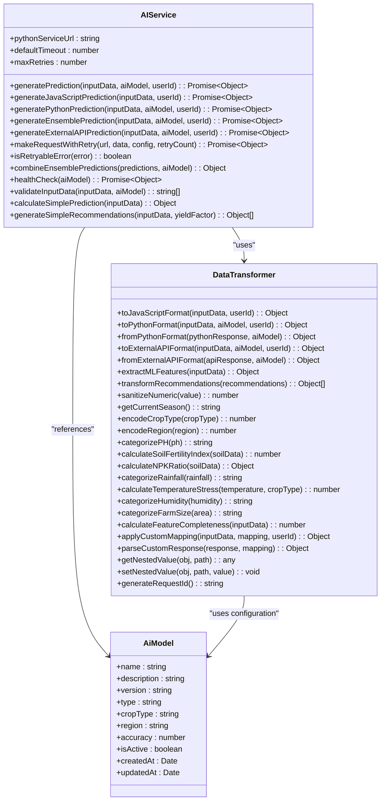
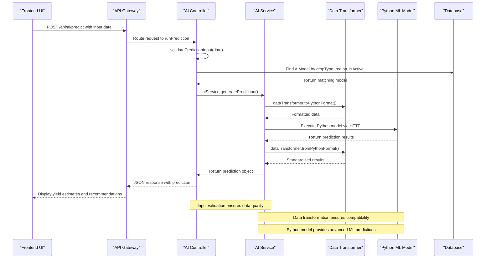
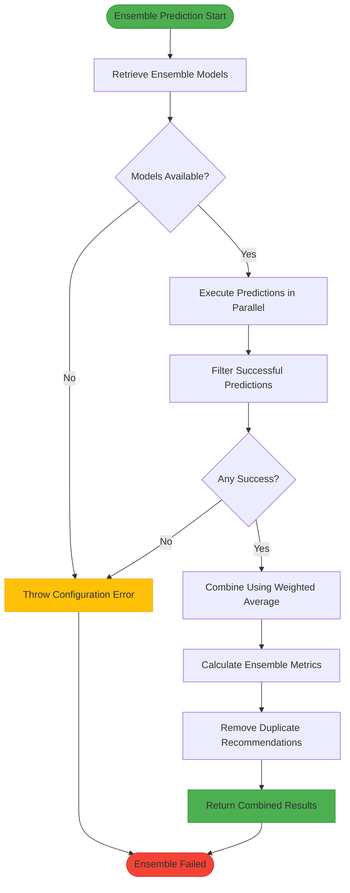
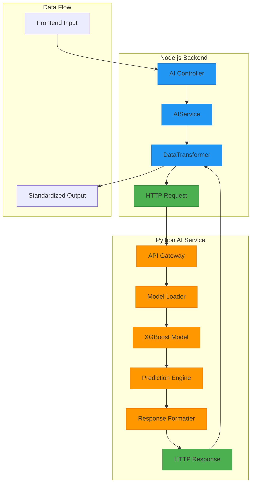
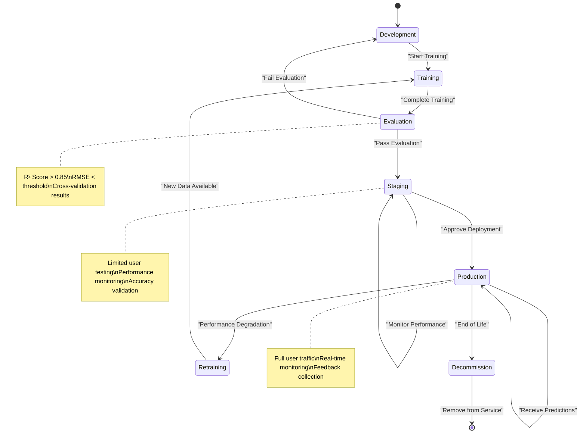
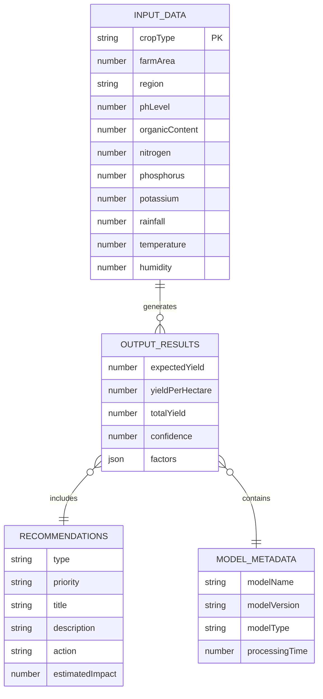
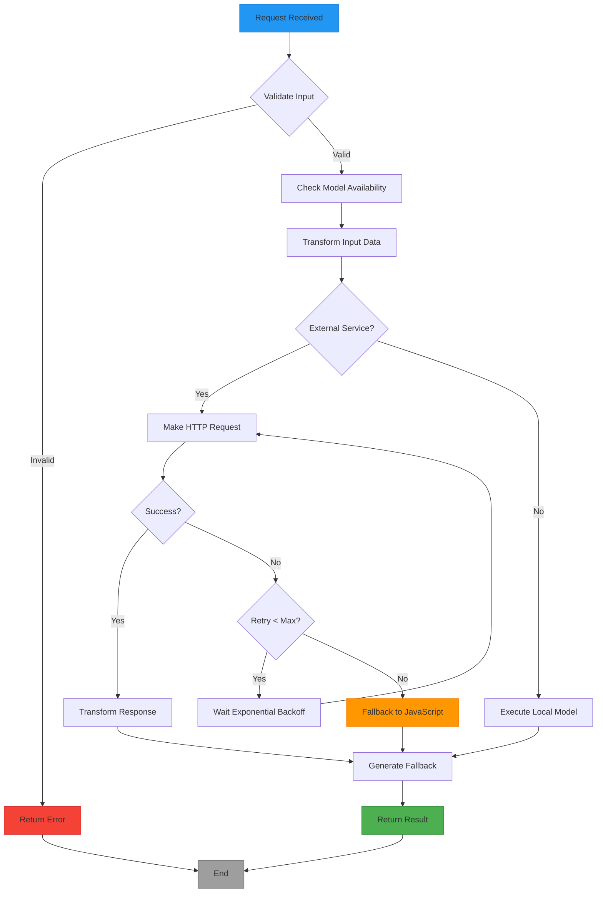

# AI Prediction System

<cite>
**Referenced Files in This Document**   
- [aiController.js](file://HarvestIQ/backend/controllers/aiController.js)
- [aiService.js](file://HarvestIQ/backend/services/aiService.js)
- [dataTransformer.js](file://HarvestIQ/backend/services/dataTransformer.js)
- [harvest.py](file://HarvestIQ/Py model/harvest.py)
- [AiModel.js](file://HarvestIQ/backend/models/AiModel.js)
- [Prediction.js](file://HarvestIQ/backend/models/Prediction.js)
- [ai.js](file://HarvestIQ/backend/routes/ai.js)
- [validation.js](file://HarvestIQ/backend/utils/validation.js)
</cite>

## Table of Contents
1. [Introduction](#introduction)
2. [Dual-Model Architecture](#dual-model-architecture)
3. [Data Flow Process](#data-flow-process)
4. [Ensemble Model Strategy](#ensemble-model-strategy)
5. [Node.js-Python Integration](#nodejs-python-integration)
6. [Model Lifecycle Management](#model-lifecycle-management)
7. [Input Parameters and Output Structure](#input-parameters-and-output-structure)
8. [Performance Considerations and Caching](#performance-considerations-and-caching)
9. [Conclusion](#conclusion)

## Introduction
The AI Prediction System forms the core intelligence of HarvestIQ, providing advanced crop yield predictions through a sophisticated dual-model approach. This system combines the reliability of JavaScript-based prediction engines with the advanced capabilities of Python machine learning models to deliver accurate agricultural insights. The architecture is designed to handle complex data transformations, model selection, and prediction generation while maintaining high availability and performance. By leveraging ensemble methods and intelligent fallback mechanisms, the system ensures robust predictions even under varying conditions and model availability.

## Dual-Model Architecture
The AI Prediction System employs a dual-model architecture that integrates JavaScript-based prediction engines with Python machine learning models. This hybrid approach provides both reliability and advanced analytical capabilities. The JavaScript engine serves as a fast, dependable fallback option that can generate predictions without external dependencies, while the Python ML models offer higher accuracy through sophisticated algorithms like XGBoost. The system dynamically routes prediction requests based on model type configuration, with the AIService class acting as the central orchestrator that determines which model type to use based on the specific requirements and availability.

**Diagram sources**
- [aiService.js](file://HarvestIQ/backend/services/aiService.js#L0-L482)
- [dataTransformer.js](file://HarvestIQ/backend/services/dataTransformer.js#L0-L473)
- [AiModel.js](file://HarvestIQ/backend/models/AiModel.js#L0-L53)

**Section sources**
- [aiService.js](file://HarvestIQ/backend/services/aiService.js#L0-L482)
- [AiModel.js](file://HarvestIQ/backend/models/AiModel.js#L0-L53)

## Data Flow Process
The data flow process in HarvestIQ's AI Prediction System follows a well-defined path from frontend form submission through backend processing to AI model execution and result return. When a user submits prediction parameters through the frontend interface, the request travels to the backend API endpoint `/api/ai/predict`, which is handled by the `runPrediction` method in the aiController. The system first validates the input data using Joi validation schemas, ensuring all required parameters are present and within acceptable ranges. After validation, the system queries the database to find an appropriate AI model based on crop type, region, and model status. Once the model is selected, the data transformer converts the input into the appropriate format for the specific model type before execution.

**Diagram sources**
- [aiController.js](file://HarvestIQ/backend/controllers/aiController.js#L0-L186)
- [aiService.js](file://HarvestIQ/backend/services/aiService.js#L0-L482)
- [dataTransformer.js](file://HarvestIQ/backend/services/dataTransformer.js#L0-L473)
- [AiModel.js](file://HarvestIQ/backend/models/AiModel.js#L0-L53)

**Section sources**
- [aiController.js](file://HarvestIQ/backend/controllers/aiController.js#L0-L186)
- [validation.js](file://HarvestIQ/backend/utils/validation.js#L0-L21)
- [ai.js](file://HarvestIQ/backend/routes/ai.js#L0-L12)

## Ensemble Model Strategy
The ensemble model strategy in HarvestIQ's AI Prediction System combines predictions from multiple AI models to produce more accurate and reliable results than any single model could achieve alone. When an ensemble model is selected, the system retrieves all configured models from the ensembleModels array in the model configuration and executes predictions in parallel using Promise.allSettled. This approach ensures that the failure of one model does not prevent the ensemble from generating a result. The system then filters successful predictions and combines them using a weighted average algorithm, where weights can be explicitly configured or default to equal distribution. This ensemble method not only improves prediction accuracy but also provides a measure of confidence based on the consistency of results across different models.

**Diagram sources**
- [aiService.js](file://HarvestIQ/backend/services/aiService.js#L144-L181)
- [AiModel.js](file://HarvestIQ/backend/models/AiModel.js#L0-L53)

**Section sources**
- [aiService.js](file://HarvestIQ/backend/services/aiService.js#L144-L181)

## Node.js-Python Integration
The integration between Node.js and Python in HarvestIQ's AI Prediction System is achieved through a robust HTTP-based communication layer rather than direct child process execution. The system uses Axios to make POST requests to a Python AI service endpoint, allowing for better scalability, error handling, and resource management compared to spawning child processes. The AIService class manages this integration, handling request configuration, authentication headers, timeout settings, and retry logic with exponential backoff. When a Python model is selected for prediction, the data transformer converts the input data into the appropriate format expected by the Python service, including model metadata, user context, and agricultural parameters. The response from the Python service is then transformed back into the standard HarvestIQ prediction format for consistency across different model types.

**Diagram sources**
- [aiService.js](file://HarvestIQ/backend/services/aiService.js#L109-L147)
- [harvest.py](file://HarvestIQ/Py model/harvest.py#L0-L129)

**Section sources**
- [aiService.js](file://HarvestIQ/backend/services/aiService.js#L109-L147)
- [harvest.py](file://HarvestIQ/Py model/harvest.py#L0-L129)

## Model Lifecycle Management
Model lifecycle management in HarvestIQ's AI Prediction System encompasses the complete process of training, evaluation, and deployment of AI models. The system stores model metadata in the AiModel collection, including version information, accuracy metrics, and activation status, allowing for controlled rollouts and easy rollback if needed. The Python ML model training process is implemented in the harvest.py script, which uses XGBoost with hyperparameter optimization for crop yield prediction. Model evaluation occurs both during training (using R² and RMSE metrics) and in production (through user feedback and actual yield comparisons). The system supports multiple model versions simultaneously, enabling A/B testing and gradual deployment strategies. Model performance is continuously monitored, with metrics updated after each prediction to track accuracy, success rate, and processing time over time.

**Diagram sources**
- [AiModel.js](file://HarvestIQ/backend/models/AiModel.js#L0-L53)
- [harvest.py](file://HarvestIQ/Py model/harvest.py#L0-L129)
- [Prediction.js](file://HarvestIQ/backend/models/Prediction.js#L0-L387)

**Section sources**
- [AiModel.js](file://HarvestIQ/backend/models/AiModel.js#L0-L53)
- [harvest.py](file://HarvestIQ/Py model/harvest.py#L0-L129)

## Input Parameters and Output Structure
The AI Prediction System requires comprehensive input parameters covering soil data, weather conditions, and crop characteristics to generate accurate yield estimates. Input parameters include crop type, farm area, region, soil pH, organic content, nitrogen, phosphorus, and potassium levels, along with weather data such as rainfall, temperature, and humidity. These inputs are validated using Joi schemas to ensure data quality before processing. The output structure provides detailed yield estimates including expected yield, yield per hectare, and total yield, accompanied by confidence scores and actionable recommendations. The system also returns metadata about the model used, processing time, and factors influencing the prediction, enabling users to understand the basis of the results and make informed decisions.

**Diagram sources**
- [validation.js](file://HarvestIQ/backend/utils/validation.js#L0-L21)
- [Prediction.js](file://HarvestIQ/backend/models/Prediction.js#L0-L387)
- [dataTransformer.js](file://HarvestIQ/backend/services/dataTransformer.js#L0-L473)

**Section sources**
- [validation.js](file://HarvestIQ/backend/utils/validation.js#L0-L21)
- [Prediction.js](file://HarvestIQ/backend/models/Prediction.js#L0-L387)

## Performance Considerations and Caching
The AI Prediction System incorporates several performance optimizations to ensure responsive predictions while maintaining accuracy. The system implements retry logic with exponential backoff for external service calls, configurable timeouts, and circuit breaker patterns to handle transient failures gracefully. For performance-critical operations, the system uses efficient data transformation methods and minimizes database queries through strategic indexing on commonly accessed fields. While the current implementation does not include explicit caching mechanisms, the architecture supports integration with caching layers through the data transformer and service classes. The system also includes comprehensive error handling with fallback to JavaScript prediction engines when Python models are unavailable, ensuring service continuity. Processing time is monitored for each prediction, allowing administrators to identify performance bottlenecks and optimize accordingly.

**Diagram sources**
- [aiService.js](file://HarvestIQ/backend/services/aiService.js#L0-L482)
- [aiController.js](file://HarvestIQ/backend/controllers/aiController.js#L0-L186)

**Section sources**
- [aiService.js](file://HarvestIQ/backend/services/aiService.js#L0-L482)

## Conclusion
The AI Prediction System in HarvestIQ represents a sophisticated integration of multiple technologies to deliver accurate crop yield predictions for agricultural planning. By combining JavaScript-based prediction engines with Python machine learning models through a well-designed architecture, the system achieves both reliability and advanced analytical capabilities. The ensemble model strategy enhances prediction accuracy by leveraging multiple algorithms, while the robust Node.js-Python integration ensures seamless communication between different technology stacks. Comprehensive input validation, data transformation, and error handling mechanisms contribute to a resilient system that can adapt to varying conditions and maintain service availability. The model lifecycle management framework supports continuous improvement through monitoring, evaluation, and deployment of new models, ensuring the system evolves with changing agricultural conditions and data availability.