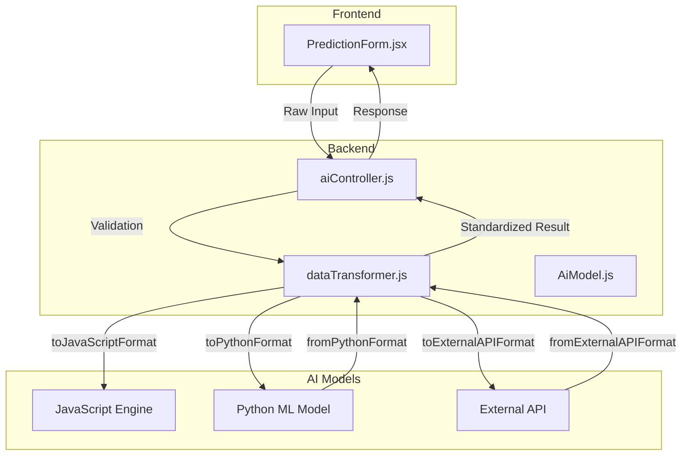
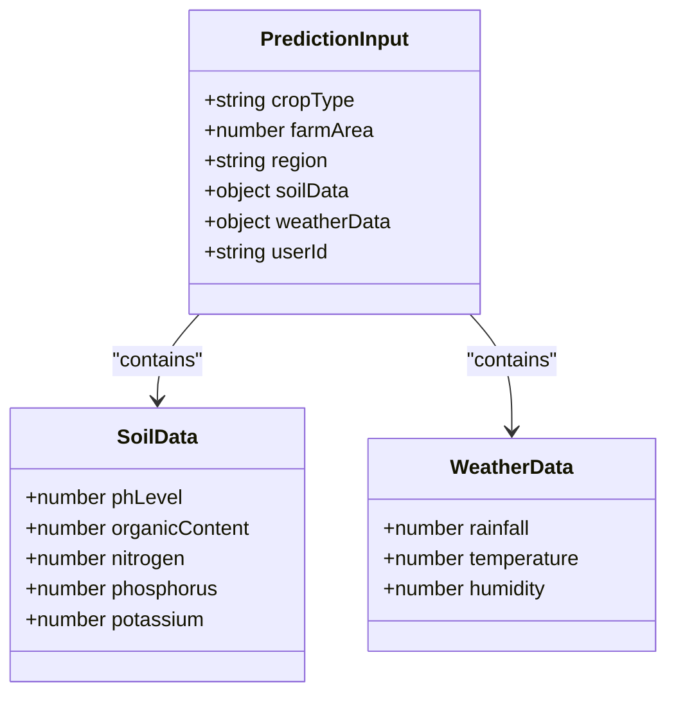
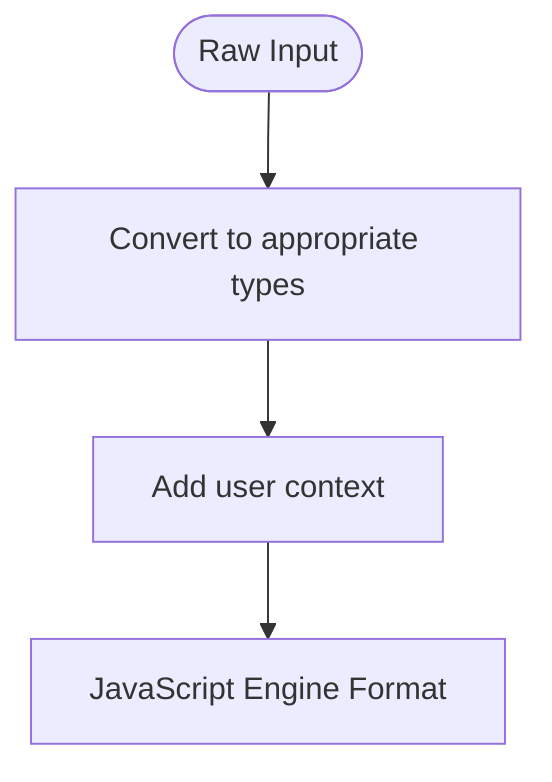
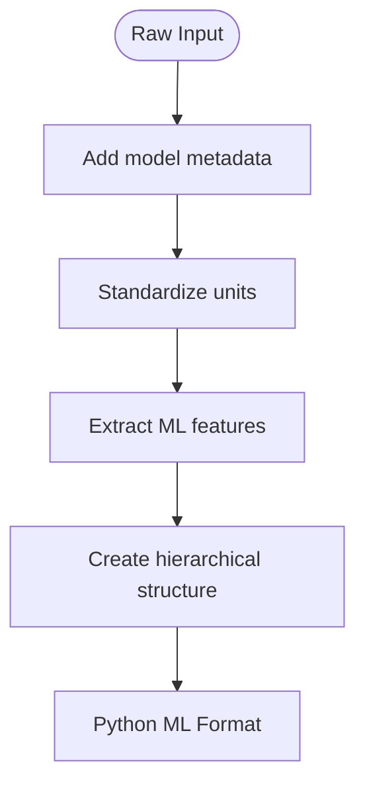
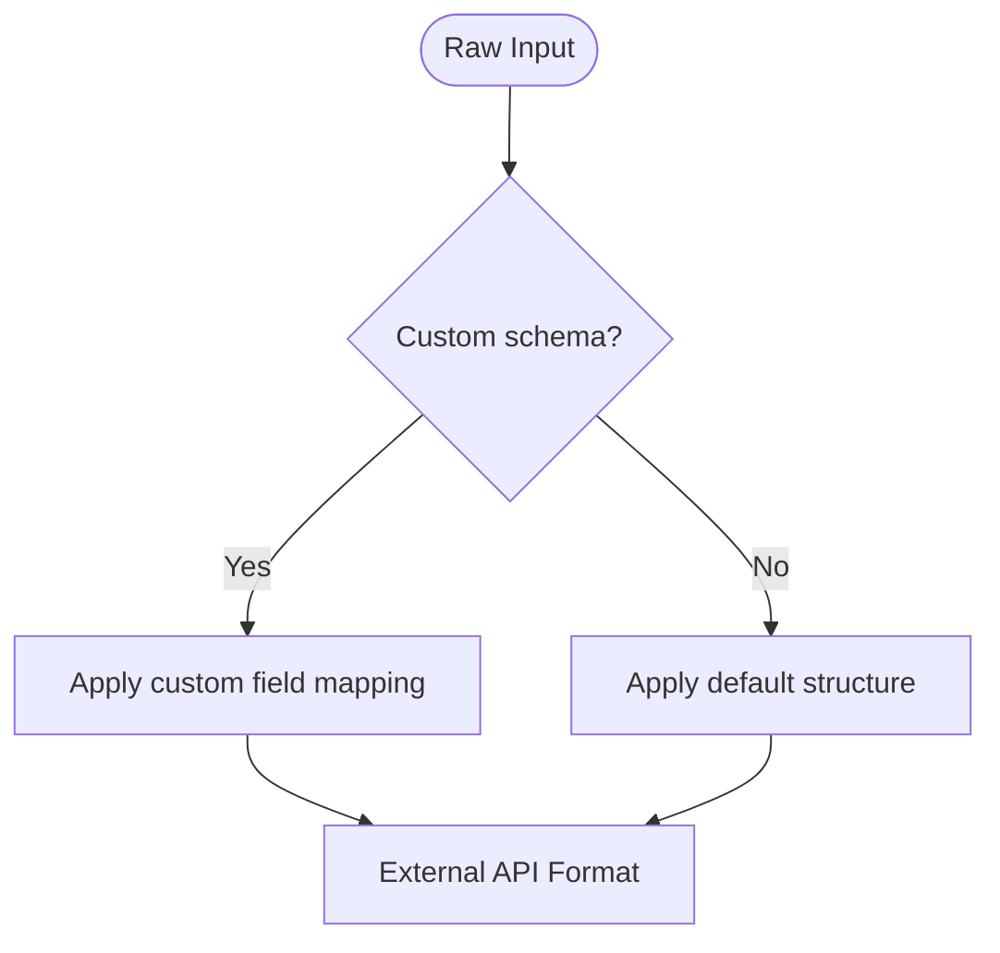
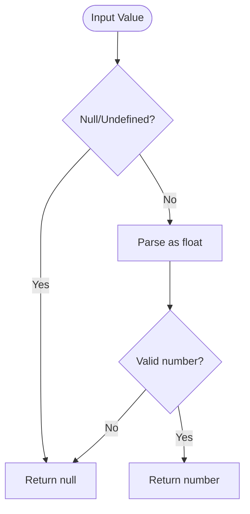

# Data Transformation

<cite>
**Referenced Files in This Document**   
- [dataTransformer.js](file://HarvestIQ/backend/services/dataTransformer.js)
- [aiController.js](file://HarvestIQ/backend/controllers/aiController.js)
- [PredictionForm.jsx](file://HarvestIQ/src/components/PredictionForm.jsx)
- [predictionEngine.js](file://HarvestIQ/src/services/predictionEngine.js)
- [AiModel.js](file://HarvestIQ/backend/models/AiModel.js)
- [validation.js](file://HarvestIQ/backend/utils/validation.js)
- [harvest.py](file://HarvestIQ/Py model/harvest.py)
</cite>

## Table of Contents
1. [Introduction](#introduction)
2. [Data Transformation Architecture](#data-transformation-architecture)
3. [Input Data Structure](#input-data-structure)
4. [Format Conversion Methods](#format-conversion-methods)
5. [Transformation Logic by Target System](#transformation-logic-by-target-system)
6. [Reverse Transformations](#reverse-transformations)
7. [Data Validation and Error Handling](#data-validation-and-error-handling)
8. [Performance Considerations](#performance-considerations)
9. [Conclusion](#conclusion)

## Introduction

The data transformation system in HarvestIQ serves as the critical interoperability layer between frontend components, backend services, and various AI prediction models. This system ensures seamless data flow across different components of the AI prediction pipeline by converting data into formats compatible with each target system. The transformation process handles input from user-facing forms, adapts it for consumption by JavaScript engines, Python machine learning models, and external APIs, and normalizes prediction results for frontend display. This document details the implementation of the transformation methods, their reverse operations, validation rules, and performance characteristics.

**Section sources**
- [dataTransformer.js](file://HarvestIQ/backend/services/dataTransformer.js#L1-L40)

## Data Transformation Architecture

The data transformation system follows a centralized service pattern with the `DataTransformer` class serving as the primary interface for all format conversions. This architecture enables consistent transformation logic across the application while maintaining separation of concerns. The system operates as an intermediary between the frontend user interface, backend controllers, and AI models, ensuring data compatibility across different technology stacks.

**Diagram sources**
- [dataTransformer.js](file://HarvestIQ/backend/services/dataTransformer.js#L1-L40)
- [aiController.js](file://HarvestIQ/backend/controllers/aiController.js#L1-L20)

**Section sources**
- [dataTransformer.js](file://HarvestIQ/backend/services/dataTransformer.js#L1-L40)
- [aiController.js](file://HarvestIQ/backend/controllers/aiController.js#L1-L20)

## Input Data Structure

The input data originates from the frontend prediction form, which collects comprehensive agricultural information from farmers. The form is structured in a multi-step process that captures crop details, soil health metrics, and weather conditions. This structured approach ensures data completeness while providing a user-friendly interface.

The raw input data structure includes:
- **Crop Information**: Crop type, farm area in hectares, and region
- **Soil Data**: pH level, organic content percentage, and nutrient levels (nitrogen, phosphorus, potassium)
- **Weather Data**: Annual rainfall in millimeters, average temperature in Celsius, and humidity percentage
- **User Context**: Farmer ID and additional parameters

**Diagram sources**
- [PredictionForm.jsx](file://HarvestIQ/src/components/PredictionForm.jsx#L150-L250)
- [dataTransformer.js](file://HarvestIQ/backend/services/dataTransformer.js#L15-L40)

**Section sources**
- [PredictionForm.jsx](file://HarvestIQ/src/components/PredictionForm.jsx#L150-L250)
- [dataTransformer.js](file://HarvestIQ/backend/services/dataTransformer.js#L15-L40)

## Format Conversion Methods

The data transformation system implements three primary format conversion methods: `toJavaScriptFormat`, `toPythonFormat`, and `toExternalAPIFormat`. Each method adapts the raw input data for consumption by different AI prediction systems, handling field mapping, unit conversion, and data enrichment according to the specific requirements of the target system.

### toJavaScriptFormat

The `toJavaScriptFormat` method transforms frontend input data into a format compatible with the JavaScript prediction engine. This method maintains a flat structure with minimal transformation, primarily ensuring proper data typing through `parseFloat` operations. The transformation preserves the original field names while adding user context.

**Section sources**
- [dataTransformer.js](file://HarvestIQ/backend/services/dataTransformer.js#L15-L30)

### toPythonFormat

The `toPythonFormat` method creates a hierarchical structure optimized for Python machine learning models. This transformation includes significant data enrichment through feature engineering, such as crop and region encoding, soil fertility index calculation, and NPK ratio analysis. The method also standardizes units and applies consistent naming conventions.

**Section sources**
- [dataTransformer.js](file://HarvestIQ/backend/services/dataTransformer.js#L35-L70)

### toExternalAPIFormat

The `toExternalAPIFormat` method prepares data for external API consumption, supporting both default and custom mapping configurations. When a custom schema is specified in the AI model configuration, the method applies field mapping based on the provided schema. Otherwise, it uses a default hierarchical structure with agricultural and environmental data categories.

**Section sources**
- [dataTransformer.js](file://HarvestIQ/backend/services/dataTransformer.js#L106-L135)

## Transformation Logic by Target System

Each target system has specific requirements that influence the transformation logic. The data transformation system adapts the input data accordingly, ensuring optimal performance and accuracy for each prediction model.

### JavaScript Engine Transformation

For the JavaScript prediction engine, the transformation focuses on simplicity and speed. The method preserves the original structure of the input data while ensuring proper data types. This approach minimizes processing overhead and enables rapid prediction generation.

**Diagram sources**
- [dataTransformer.js](file://HarvestIQ/backend/services/dataTransformer.js#L15-L30)

**Section sources**
- [dataTransformer.js](file://HarvestIQ/backend/services/dataTransformer.js#L15-L30)

### Python ML Model Transformation

The transformation for Python ML models is more complex, involving extensive feature engineering and data standardization. The method creates a hierarchical structure with model metadata, agricultural data, soil parameters, weather data, and extracted ML features. This enriched feature set enables more sophisticated predictions from machine learning models.

**Diagram sources**
- [dataTransformer.js](file://HarvestIQ/backend/services/dataTransformer.js#L35-L70)

**Section sources**
- [dataTransformer.js](file://HarvestIQ/backend/services/dataTransformer.js#L35-L70)

### External API Transformation

The external API transformation supports flexible schema mapping, allowing integration with various third-party services. The method can apply custom field mappings based on the AI model's configuration or use a default structure with agricultural and environmental data categories.

**Diagram sources**
- [dataTransformer.js](file://HarvestIQ/backend/services/dataTransformer.js#L106-L135)

**Section sources**
- [dataTransformer.js](file://HarvestIQ/backend/services/dataTransformer.js#L106-L135)

## Reverse Transformations

The data transformation system also handles reverse transformations, converting prediction results from various AI models into a standardized format for frontend consumption. These methods ensure consistency in the response structure regardless of the underlying prediction model.

### fromPythonFormat

The `fromPythonFormat` method transforms responses from Python AI models into the standard prediction format. This method extracts expected yield, confidence scores, and recommendation data while normalizing units and handling potential null values through the `sanitizeNumeric` utility.

**Section sources**
- [dataTransformer.js](file://HarvestIQ/backend/services/dataTransformer.js#L73-L105)

### fromExternalAPIFormat

The `fromExternalAPIFormat` method processes responses from external APIs, supporting both default parsing and custom response mapping. When a custom output schema is defined, the method applies the specified field mappings to extract relevant data.

**Section sources**
- [dataTransformer.js](file://HarvestIQ/backend/services/dataTransformer.js#L178-L200)

## Data Validation and Error Handling

The data transformation system incorporates comprehensive validation and error handling to ensure data integrity throughout the prediction pipeline. Validation occurs at multiple levels, from frontend input validation to backend schema validation.

### Frontend Validation

The frontend implements real-time validation using the `FormValidators.prediction` method, which checks for required fields, valid data ranges, and proper data types. This immediate feedback helps users correct errors before submission.

**Section sources**
- [PredictionForm.jsx](file://HarvestIQ/src/components/PredictionForm.jsx#L300-L350)
- [validation.js](file://HarvestIQ/src/utils/validation.js#L350-L400)

### Backend Validation

The backend employs Joi validation through the `validatePredictionInput` function, which enforces strict data requirements including minimum and maximum values for numerical inputs. This server-side validation provides an additional security layer against malformed data.

**Section sources**
- [aiController.js](file://HarvestIQ/backend/controllers/aiController.js#L50-L60)
- [validation.js](file://HarvestIQ/backend/utils/validation.js#L5-L20)

### Error Handling in Transformations

The transformation methods include robust error handling through the `sanitizeNumeric` utility, which safely converts string values to numbers while handling null, undefined, and invalid inputs. This prevents runtime errors during the transformation process.

**Diagram sources**
- [dataTransformer.js](file://HarvestIQ/backend/services/dataTransformer.js#L410-L420)

**Section sources**
- [dataTransformer.js](file://HarvestIQ/backend/services/dataTransformer.js#L410-L420)

## Performance Considerations

The data transformation system is designed with performance optimization in mind, particularly for the computationally intensive feature engineering operations required for machine learning models.

### Caching Strategies

While the current implementation does not include explicit caching, the transformation operations are stateless and idempotent, making them suitable for caching at the service level. Future enhancements could implement caching of frequently used transformation results, particularly for common crop-region combinations.

### Optimization Opportunities

The feature engineering methods, such as `calculateSoilFertilityIndex` and `calculateTemperatureStress`, represent potential performance bottlenecks due to their computational complexity. These methods could be optimized through memoization or by pre-calculating common values.

**Section sources**
- [dataTransformer.js](file://HarvestIQ/backend/services/dataTransformer.js#L410-L472)

## Conclusion

The data transformation system in HarvestIQ effectively enables interoperability between different components of the AI prediction pipeline. By implementing specialized format conversion methods for JavaScript engines, Python ML models, and external APIs, the system ensures that data is properly structured and enriched for each target system. The reverse transformation methods normalize prediction results for consistent frontend consumption. Comprehensive validation and error handling maintain data integrity throughout the process. While the current implementation prioritizes functionality and accuracy, future enhancements could focus on performance optimization through caching and computational efficiency improvements.