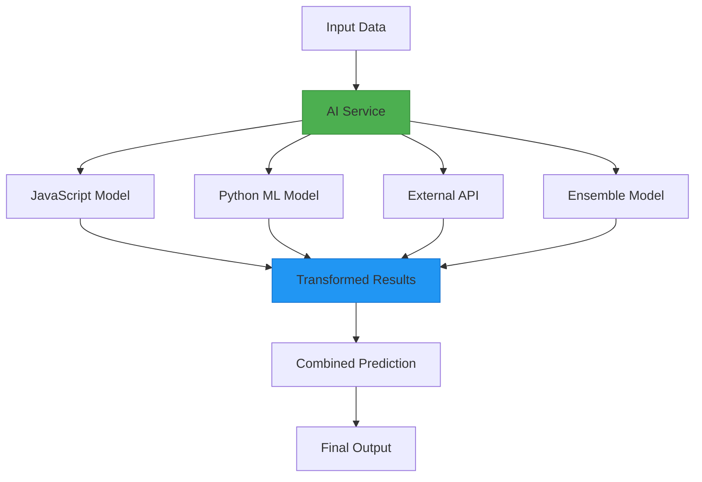
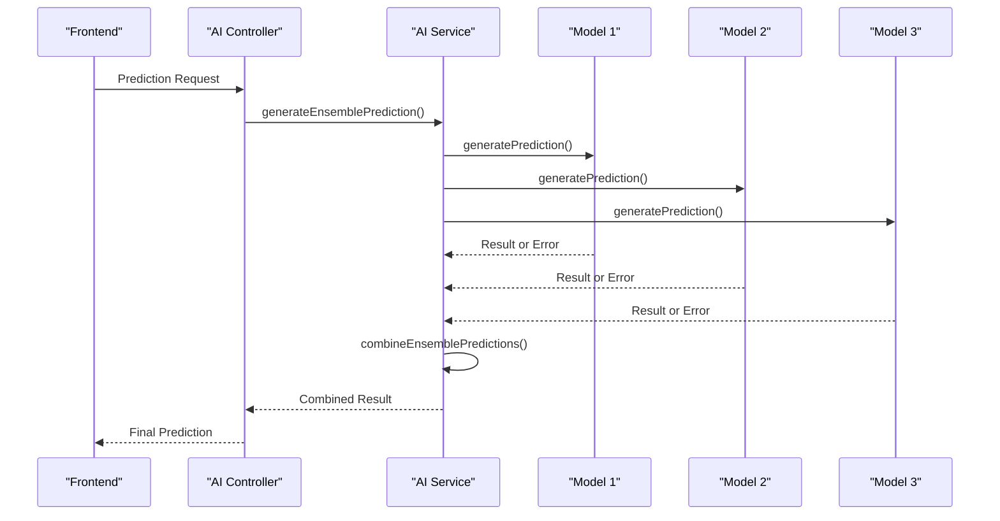
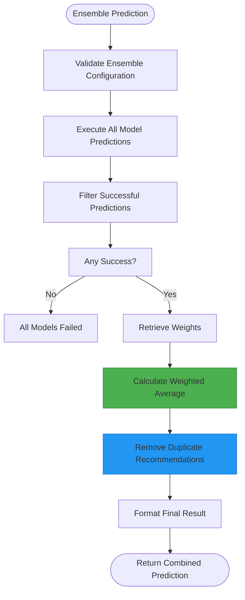
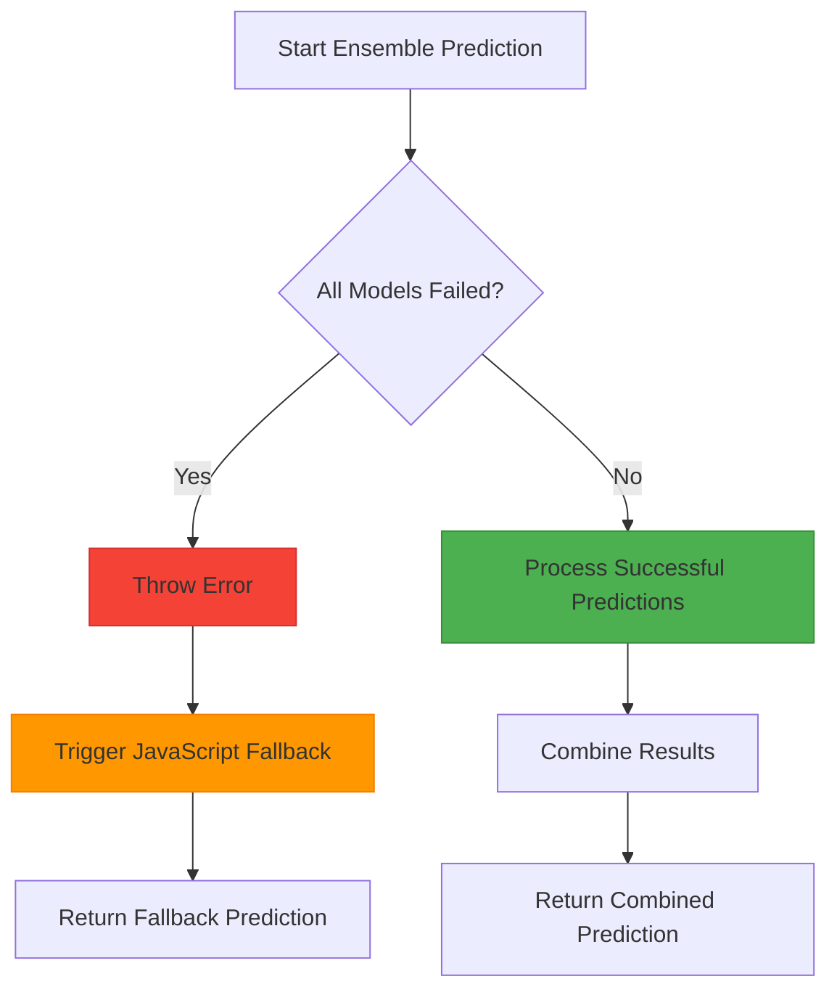

# Ensemble Models

<cite>
**Referenced Files in This Document**   
- [aiService.js](file://HarvestIQ/backend/services/aiService.js)
- [AiModel.js](file://HarvestIQ/backend/models/AiModel.js)
- [dataTransformer.js](file://HarvestIQ/backend/services/dataTransformer.js)
- [aiController.js](file://HarvestIQ/backend/controllers/aiController.js)
</cite>

## Table of Contents
1. [Introduction](#introduction)
2. [Ensemble Model Architecture](#ensemble-model-architecture)
3. [Core Components](#core-components)
4. [Prediction Orchestration](#prediction-orchestration)
5. [Weighted Averaging Algorithm](#weighted-averaging-algorithm)
6. [Model Configuration and Validation](#model-configuration-and-validation)
7. [Error Handling and Fallback Strategy](#error-handling-and-fallback-strategy)
8. [Confidence Scoring and Recommendation Processing](#confidence-scoring-and-recommendation-processing)
9. [Performance and Reliability Benefits](#performance-and-reliability-benefits)
10. [Use Cases and Weighting Strategies](#use-cases-and-weighting-strategies)

## Introduction

The ensemble model system in HarvestIQ represents a sophisticated approach to agricultural prediction that combines the strengths of multiple AI models to produce more accurate and reliable results than any single model could achieve independently. This system orchestrates predictions across diverse model types including JavaScript-based models, Python machine learning models, and external API-based services, leveraging a weighted averaging algorithm to synthesize their outputs. The ensemble approach enhances prediction robustness by mitigating the limitations and biases inherent in individual models, providing farmers with more trustworthy guidance for crop management decisions.

**Section sources**
- [aiService.js](file://HarvestIQ/backend/services/aiService.js#L144-L223)
- [AiModel.js](file://HarvestIQ/backend/models/AiModel.js#L4-L25)

## Ensemble Model Architecture

The ensemble model system follows a modular architecture where the AIService class serves as the central orchestrator, coordinating predictions across different model types. The system is designed to handle JavaScript models, Python ML/DL models, external APIs, and ensemble models that combine multiple approaches. Each model type is encapsulated within its own prediction method, allowing for specialized handling of data transformation, communication protocols, and response processing. The architecture supports both synchronous and asynchronous model execution, with the ensemble system specifically leveraging Promise.allSettled to allow independent execution of constituent models.

**Diagram sources**
- [aiService.js](file://HarvestIQ/backend/services/aiService.js#L50-L223)
- [dataTransformer.js](file://HarvestIQ/backend/services/dataTransformer.js#L10-L50)

**Section sources**
- [aiService.js](file://HarvestIQ/backend/services/aiService.js#L1-L50)
- [dataTransformer.js](file://HarvestIQ/backend/services/dataTransformer.js#L1-L50)

## Core Components

The ensemble model system comprises several core components that work together to deliver reliable predictions. The AIService class contains the primary logic for model orchestration, including the generateEnsemblePrediction method that coordinates the execution of multiple models. The AiModel schema defines the structure for storing model configurations, including type, version, crop specificity, and ensemble parameters. The dataTransformer service handles the conversion of data between different formats required by various model types, ensuring compatibility across the system. These components work in concert to provide a seamless prediction experience that abstracts away the complexity of interacting with diverse AI systems.

**Section sources**
- [aiService.js](file://HarvestIQ/backend/services/aiService.js#L1-L50)
- [AiModel.js](file://HarvestIQ/backend/models/AiModel.js#L1-L50)
- [dataTransformer.js](file://HarvestIQ/backend/services/dataTransformer.js#L1-L50)

## Prediction Orchestration

The generateEnsemblePrediction method serves as the central orchestrator for ensemble predictions, coordinating the execution of multiple AI models to produce a unified result. When invoked, the method first retrieves the configuration for the ensemble model, which specifies the individual models to include in the ensemble through their unique identifiers. The system then initiates predictions from all specified models concurrently using Promise.allSettled, allowing each model to execute independently without blocking others. This parallel execution approach maximizes efficiency and reduces overall prediction latency, as the system doesn't wait for slower models to complete before processing results from faster ones.

**Diagram sources**
- [aiService.js](file://HarvestIQ/backend/services/aiService.js#L144-L181)
- [aiController.js](file://HarvestIQ/backend/controllers/aiController.js#L130-L186)

**Section sources**
- [aiService.js](file://HarvestIQ/backend/services/aiService.js#L144-L181)
- [aiController.js](file://HarvestIQ/backend/controllers/aiController.js#L130-L186)

## Weighted Averaging Algorithm

The ensemble system employs a weighted averaging algorithm to combine predictions from multiple models, with weights determined by the ensembleWeights configuration parameter. When weights are not explicitly specified, the system defaults to equal weighting, assigning each model an equal influence on the final result. The algorithm calculates a weighted average for key prediction metrics such as expected yield and confidence scores, with the final result being the sum of each model's prediction multiplied by its corresponding weight, divided by the total weight. This approach allows more accurate or reliable models to have greater influence on the final prediction, improving overall accuracy.

**Diagram sources**
- [aiService.js](file://HarvestIQ/backend/services/aiService.js#L294-L335)
- [aiService.js](file://HarvestIQ/backend/services/aiService.js#L255-L296)

**Section sources**
- [aiService.js](file://HarvestIQ/backend/services/aiService.js#L255-L335)

## Model Configuration and Validation

Ensemble models are configured through the AiModel schema, which includes specific fields for defining the composition and behavior of the ensemble. The configuration object contains an ensembleModels array that lists the IDs of individual models to include in the ensemble, ensuring flexibility in model selection and combination. Additionally, the ensembleWeights array allows for custom weighting of each model's contribution to the final prediction, enabling optimization based on historical performance metrics. Before executing predictions, the system validates that all specified models exist and are active, preventing errors from referencing invalid or disabled models.

**Section sources**
- [AiModel.js](file://HarvestIQ/backend/models/AiModel.js#L4-L25)
- [aiService.js](file://HarvestIQ/backend/services/aiService.js#L144-L155)

## Error Handling and Fallback Strategy

The ensemble system implements a robust error handling strategy that ensures prediction availability even when individual models fail. By using Promise.allSettled instead of Promise.all, the system can distinguish between fulfilled and rejected promises, allowing it to process successful predictions while gracefully handling failures. The system filters out failed predictions and proceeds with combining only the successful results, maintaining functionality even when some models are unavailable. In the event that all ensemble models fail, the system throws an error that triggers a fallback to the JavaScript prediction engine, ensuring that users always receive some form of prediction rather than encountering a complete failure.

**Diagram sources**
- [aiService.js](file://HarvestIQ/backend/services/aiService.js#L155-L175)
- [aiService.js](file://HarvestIQ/backend/services/aiService.js#L70-L100)

**Section sources**
- [aiService.js](file://HarvestIQ/backend/services/aiService.js#L155-L175)

## Confidence Scoring and Recommendation Processing

The ensemble system calculates a combined confidence score by applying the same weighting algorithm used for yield predictions, resulting in a confidence metric that reflects the collective reliability of the constituent models. Recommendations from multiple models are processed to eliminate duplicates by comparing recommendation titles, ensuring that users receive a concise and non-redundant set of actionable insights. The system limits the final recommendation list to the top 10 items, prioritizing quality over quantity. Government data is sourced from the first successful prediction, providing consistent contextual information regardless of which models succeeded.

**Section sources**
- [aiService.js](file://HarvestIQ/backend/services/aiService.js#L294-L335)
- [dataTransformer.js](file://HarvestIQ/backend/services/dataTransformer.js#L250-L300)

## Performance and Reliability Benefits

Ensemble predictions in HarvestIQ offer significant improvements in both accuracy and reliability compared to single-model approaches. By combining predictions from diverse model types, the system mitigates the specific biases and limitations of individual models, resulting in more balanced and comprehensive recommendations. The JavaScript models provide fast, rule-based predictions that serve as a reliable baseline, while Python ML models offer sophisticated pattern recognition capabilities based on extensive training data. External APIs contribute specialized knowledge from domain experts. The weighted averaging algorithm ensures that models with proven historical accuracy have greater influence on the final result, continuously optimizing prediction quality.

**Section sources**
- [aiService.js](file://HarvestIQ/backend/services/aiService.js#L255-L335)
- [dataTransformer.js](file://HarvestIQ/backend/services/dataTransformer.js#L1-L50)

## Use Cases and Weighting Strategies

The ensemble model system supports various weighting strategies tailored to different agricultural scenarios and confidence requirements. For crops with extensive historical data, models can be weighted based on their validated accuracy metrics, giving greater influence to models that have demonstrated superior performance. In regions with limited data, equal weighting may be preferred to avoid over-reliance on any single model's assumptions. During critical decision periods such as planting season, higher weights can be assigned to models that specialize in early-season predictions. The system's flexibility allows agronomists to configure ensembles that balance between innovation (newer models) and reliability (proven models), optimizing for both accuracy and risk management.