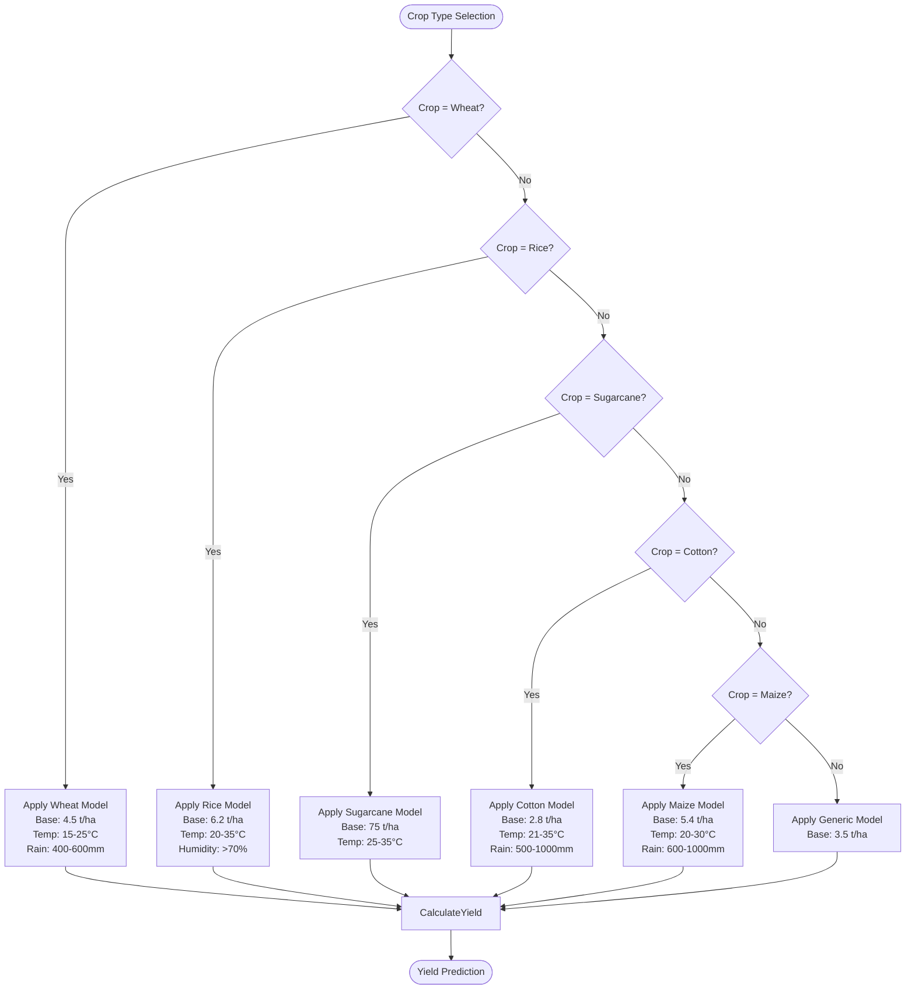
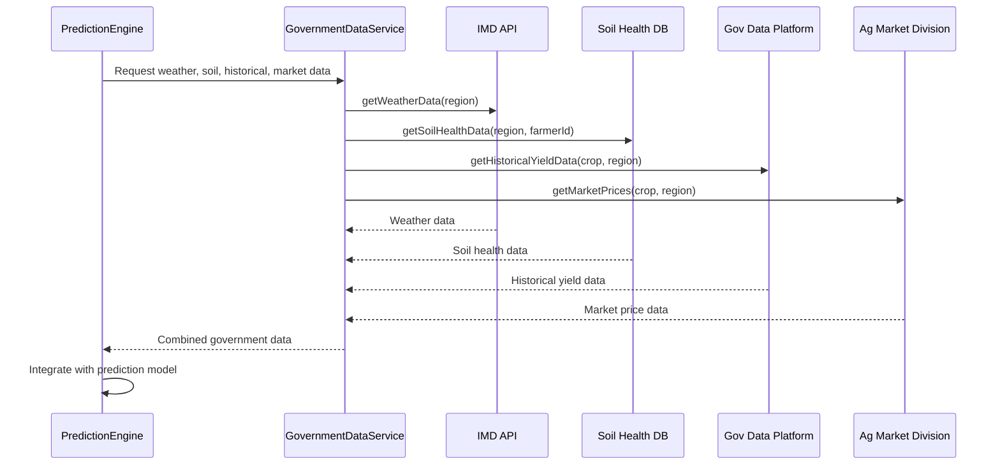
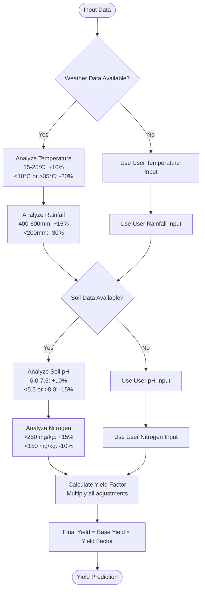
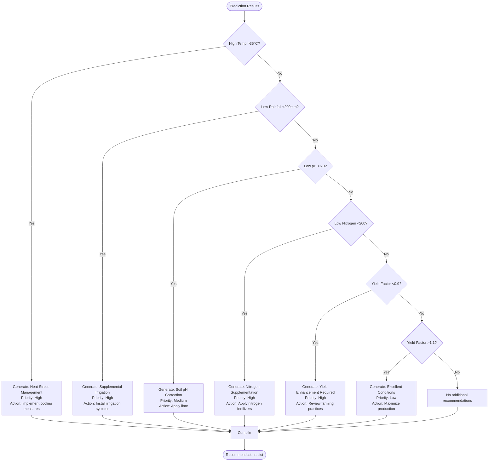

# JavaScript Prediction Engine

<cite>
**Referenced Files in This Document**   
- [predictionEngine.js](file://HarvestIQ/src/services/predictionEngine.js)
- [governmentDataService.js](file://HarvestIQ/src/services/governmentDataService.js)
- [aiService.js](file://HarvestIQ/backend/services/aiService.js)
- [Prediction.js](file://HarvestIQ/backend/models/Prediction.js)
- [PredictionForm.jsx](file://HarvestIQ/src/components/PredictionForm.jsx)
</cite>

## Table of Contents
1. [Introduction](#introduction)
2. [Core Components](#core-components)
3. [Crop-Specific Models](#crop-specific-models)
4. [Generic Yield Model](#generic-yield-model)
5. [Government Data Integration](#government-data-integration)
6. [Prediction Calculation Logic](#prediction-calculation-logic)
7. [Recommendation Generation System](#recommendation-generation-system)
8. [Confidence Scoring Mechanism](#confidence-scoring-mechanism)
9. [Data Processing and Transformation](#data-processing-and-transformation)
10. [Error Handling and Performance](#error-handling-and-performance)
11. [Use Cases and Model Selection](#use-cases-and-model-selection)

## Introduction
The JavaScript Prediction Engine serves as the fallback and primary prediction system for HarvestIQ, providing reliable crop yield predictions when Python-based models are unavailable. This engine implements crop-specific models for wheat, rice, sugarcane, cotton, and maize, along with a generic yield model for other crops. The system integrates with government data services to enhance prediction accuracy and provides actionable farming recommendations based on comprehensive analysis of environmental and soil conditions. Designed for resilience and immediate availability, this JavaScript engine ensures continuous service even when external AI services fail.

## Core Components

The JavaScript Prediction Engine consists of several interconnected components that work together to generate accurate crop yield predictions. The core architecture includes the PredictionEngine class, government data integration services, data transformers, and recommendation generators. These components are orchestrated through a well-defined workflow that begins with data collection and ends with comprehensive prediction results and actionable insights.

```mermaid
classDiagram
class PredictionEngine {
+models : Object
+generatePrediction(inputData) : Promise~Object~
+wheatYieldModel(data) : Object
+riceYieldModel(data) : Object
+sugarcaneYieldModel(data) : Object
+cottonYieldModel(data) : Object
+maizeYieldModel(data) : Object
+genericYieldModel(data) : Object
+generateRecommendations(inputData, weatherData, soilData, prediction) : Array
+calculateConfidence(inputData, weatherData, soilData) : Number
}
class GovernmentDataService {
+baseUrls : Object
+getWeatherData(region, coordinates) : Promise~Object~
+getSoilHealthData(region, farmerId) : Promise~Object~
+getHistoricalYieldData(cropType, region, years) : Promise~Array~
+getMarketPrices(cropType, region) : Promise~Object~
+getGovernmentSchemes(region, cropType) : Promise~Array~
}
PredictionEngine --> GovernmentDataService : "uses"
PredictionEngine --> "dataTransformer" : "imports"
```

**Diagram sources**
- [predictionEngine.js](file://HarvestIQ/src/services/predictionEngine.js#L1-L375)
- [governmentDataService.js](file://HarvestIQ/src/services/governmentDataService.js#L1-L244)

**Section sources**
- [predictionEngine.js](file://HarvestIQ/src/services/predictionEngine.js#L1-L375)
- [governmentDataService.js](file://HarvestIQ/src/services/governmentDataService.js#L1-L244)

## Crop-Specific Models

The JavaScript Prediction Engine implements specialized models for five major crops: wheat, rice, sugarcane, cotton, and maize. Each model incorporates crop-specific parameters and optimal growing conditions to provide accurate yield predictions. These models consider multiple factors including temperature, rainfall, soil pH, and nutrient levels, with different weightings based on the specific requirements of each crop.

### Wheat Yield Model
The wheat yield model uses a base yield of 4.5 tons per hectare and adjusts this value based on environmental conditions. Optimal temperature range is 15-25°C, with optimal rainfall between 400-600mm. Soil pH between 6.0-7.5 is preferred, and nitrogen levels above 250 mg/kg enhance yield potential.

### Rice Yield Model
The rice yield model starts with a base yield of 6.2 tons per hectare. Rice cultivation requires warm temperatures (20-35°C) and high humidity (above 70%). Unlike other crops, rice benefits from higher rainfall (above 1000mm), reflecting its preference for flooded conditions during certain growth stages.

### Sugarcane Yield Model
With a base yield of 75 tons per hectare, the sugarcane model emphasizes warm temperatures (25-35°C) as the primary factor influencing yield. This high-yielding crop is particularly sensitive to temperature variations, with optimal conditions significantly boosting production potential.

### Cotton Yield Model
The cotton yield model uses a base yield of 2.8 tons per hectare. Cotton thrives in warm temperatures (21-35°C) with moderate rainfall (500-1000mm). The model accounts for cotton's sensitivity to excessive moisture, which can negatively impact fiber quality.

### Maize Yield Model
The maize yield model starts with a base yield of 5.4 tons per hectare. Optimal growing conditions include temperatures between 20-30°C and moderate rainfall (600-1000mm). The model emphasizes maize's need for consistent moisture during critical growth stages.



**Diagram sources**
- [predictionEngine.js](file://HarvestIQ/src/services/predictionEngine.js#L1-L375)

**Section sources**
- [predictionEngine.js](file://HarvestIQ/src/services/predictionEngine.js#L1-L375)

## Generic Yield Model

The generic yield model serves as a fallback for crops not specifically supported by dedicated models. With a base yield of 3.5 tons per hectare, this model applies general agricultural principles to estimate yield potential. The model incorporates temperature, rainfall, and soil pH factors with optimal ranges that represent average requirements across various crops.

Temperature is evaluated on a scale where 15-35°C is considered optimal, with significant penalties for temperatures below 5°C or above 45°C. Rainfall requirements are set between 300-1200mm, reflecting the needs of most field crops. Soil pH between 6.0-7.5 is preferred, with adjustments for acidic or alkaline conditions.

To account for natural variability, the model includes a random variation factor (0.95-1.05) that simulates unpredictable environmental influences. This stochastic element prevents overconfidence in predictions and reflects the inherent uncertainty in agricultural forecasting.

The generic model is designed to provide reasonable estimates when crop-specific data is unavailable, ensuring that the system can generate predictions for any crop type while maintaining scientific plausibility.

**Section sources**
- [predictionEngine.js](file://HarvestIQ/src/services/predictionEngine.js#L1-L375)

## Government Data Integration

The JavaScript Prediction Engine integrates with multiple government data services to enhance prediction accuracy and provide comprehensive agricultural insights. These integrations access real-time and historical data from authoritative sources, including meteorological departments, soil health databases, agricultural statistics, and market information systems.

### Data Service Endpoints
The system connects to four primary government APIs:
- **India Meteorological Department (IMD)**: Provides current weather conditions and forecasts
- **Soil Health Card Database**: Delivers detailed soil composition and health metrics
- **Government Open Data Platform**: Supplies historical crop yield statistics
- **Agricultural Marketing Division**: Offers current market prices and trends

### Data Retrieval Process
The engine retrieves data through parallel asynchronous requests to minimize latency. Weather, soil, historical yield, and market price data are fetched simultaneously, reducing the overall prediction generation time. Each service includes fallback mechanisms and error handling to ensure reliability even when government APIs experience issues.

### Data Transformation
Government data is transformed and normalized before integration into the prediction models. This process ensures consistency between different data sources and aligns the information with the requirements of the crop-specific algorithms. The transformation includes unit conversions, date formatting, and data validation to maintain data integrity.



**Diagram sources**
- [governmentDataService.js](file://HarvestIQ/src/services/governmentDataService.js#L1-L244)
- [predictionEngine.js](file://HarvestIQ/src/services/predictionEngine.js#L1-L375)

**Section sources**
- [governmentDataService.js](file://HarvestIQ/src/services/governmentDataService.js#L1-L244)

## Prediction Calculation Logic

The prediction calculation logic combines multiple environmental and soil factors to generate accurate yield estimates. The system evaluates temperature, rainfall, soil pH, and nutrient levels, applying crop-specific weightings to calculate a yield factor that modifies the base yield for each crop.

### Temperature Impact
Temperature is a critical factor in crop development, with each crop having specific optimal ranges. The engine evaluates both government-provided and user-input temperature data, applying multipliers based on how closely conditions match ideal ranges. Temperatures outside tolerance thresholds result in significant yield reductions.

### Rainfall Assessment
Rainfall patterns directly affect crop growth and yield potential. The system analyzes both total rainfall and distribution patterns, recognizing that consistent moisture is often more beneficial than total volume alone. For crops like rice that require flooded conditions, higher rainfall values increase yield potential, while for drought-resistant crops, moderate rainfall is optimal.

### Soil pH Analysis
Soil pH affects nutrient availability and microbial activity. The engine evaluates pH levels and applies adjustments based on how closely they match the optimal range for the specific crop. Acidic or alkaline soils trigger recommendations for corrective actions like lime or sulfur application.

### Nutrient Level Evaluation
The system assesses key nutrients including nitrogen, phosphorus, and potassium. Nitrogen is particularly important for leafy growth and protein content, while phosphorus supports root development and energy transfer. Potassium contributes to overall plant health and stress resistance. Deficiencies in any of these nutrients result in corresponding yield reductions.



**Diagram sources**
- [predictionEngine.js](file://HarvestIQ/src/services/predictionEngine.js#L1-L375)

**Section sources**
- [predictionEngine.js](file://HarvestIQ/src/services/predictionEngine.js#L1-L375)

## Recommendation Generation System

The recommendation generation system produces actionable farming advice based on prediction results and environmental conditions. These recommendations are categorized by type and priority, providing farmers with clear guidance on improving crop outcomes.

### Weather-Based Recommendations
When weather conditions are suboptimal, the system generates specific mitigation strategies. For high temperatures (>35°C), recommendations include implementing shade nets, mulching, and adjusting irrigation schedules. For low rainfall (<200mm), the system suggests installing drip or sprinkler irrigation systems and water conservation practices.

### Soil-Based Recommendations
Soil health issues trigger targeted recommendations. Low pH (<6.0) prompts suggestions for lime application to reduce acidity, while high pH (>7.5) may recommend sulfur application. Nutrient deficiencies result in specific fertilizer recommendations, such as applying urea for nitrogen deficiency or phosphate fertilizers for phosphorus deficiency.

### Yield Optimization Recommendations
The system provides strategic advice based on predicted yield factors. When conditions are optimal (yield factor >1.1), recommendations focus on maximizing production potential through precision farming techniques and premium variety selection. When conditions are poor (yield factor <0.9), the system emphasizes corrective measures and risk mitigation strategies.

### Priority Classification
Recommendations are classified by priority level:
- **High**: Immediate actions required to prevent significant yield loss
- **Medium**: Important improvements that should be implemented
- **Low**: Optimization opportunities for enhanced performance



**Diagram sources**
- [predictionEngine.js](file://HarvestIQ/src/services/predictionEngine.js#L1-L375)

**Section sources**
- [predictionEngine.js](file://HarvestIQ/src/services/predictionEngine.js#L1-L375)

## Confidence Scoring Mechanism

The confidence scoring mechanism evaluates data completeness and quality to provide a reliability assessment for each prediction. The system starts with a base confidence of 85% and adjusts this value based on several factors.

### Data Source Quality
The presence of government-sourced data increases confidence by 5% for weather data and 5% for soil data. Government data is considered more reliable than user-input data due to standardized collection methods and quality control processes.

### Data Completeness
The system evaluates the completeness of input data, adding up to 5% to confidence based on the proportion of required fields provided. Required fields include crop type, farm area, and region, with complete information leading to higher confidence scores.

### Confidence Boundaries
The final confidence score is constrained between 75% and 95% to prevent overconfidence in predictions. This range reflects the inherent uncertainty in agricultural forecasting while acknowledging the value of comprehensive data inputs.

The confidence score is displayed with predictions to help users understand the reliability of the results and make informed decisions based on the available information.

**Section sources**
- [predictionEngine.js](file://HarvestIQ/src/services/predictionEngine.js#L1-L375)

## Data Processing and Transformation

The data processing pipeline transforms raw input into meaningful predictions through a series of well-defined steps. The system handles both user-provided data and government-sourced information, integrating these inputs into a cohesive analysis framework.

### Input Validation
All input data undergoes validation to ensure accuracy and completeness. Required fields are verified, and numerical values are checked against realistic ranges (e.g., temperature between -50°C and 60°C, pH between 0 and 14).

### Data Integration
The system combines user inputs with government data, prioritizing authoritative sources when available. When government data is unavailable, the system relies on user inputs, adjusting confidence scores accordingly.

### Prediction Workflow
The processing workflow follows these steps:
1. Validate and clean input data
2. Retrieve government data in parallel
3. Select appropriate crop-specific model
4. Calculate yield prediction with environmental factors
5. Generate actionable recommendations
6. Calculate confidence score
7. Format and return comprehensive results


**Diagram sources**
- [predictionEngine.js](file://HarvestIQ/src/services/predictionEngine.js#L1-L375)
- [aiService.js](file://HarvestIQ/backend/services/aiService.js#L1-L481)

**Section sources**
- [predictionEngine.js](file://HarvestIQ/src/services/predictionEngine.js#L1-L375)
- [aiService.js](file://HarvestIQ/backend/services/aiService.js#L1-L481)

## Error Handling and Performance

The JavaScript Prediction Engine incorporates robust error handling and performance optimization features to ensure reliability and responsiveness.

### Error Handling
The system uses try-catch blocks to handle exceptions during prediction generation. Errors are logged for debugging purposes, and user-friendly error messages are returned to maintain a positive user experience. When government data services are unavailable, the system continues with user-provided data and adjusts confidence scores accordingly.

### Performance Optimization
The engine optimizes performance through parallel data retrieval, minimizing wait times for external API responses. The use of efficient algorithms and minimal computational overhead ensures quick prediction generation, typically within seconds.

### Fallback Mechanisms
When the primary Python-based AI models are unavailable, the JavaScript engine serves as a reliable fallback, ensuring continuous service. This redundancy is critical for maintaining system availability and user trust.

**Section sources**
- [predictionEngine.js](file://HarvestIQ/src/services/predictionEngine.js#L1-L375)
- [aiService.js](file://HarvestIQ/backend/services/aiService.js#L1-L481)

## Use Cases and Model Selection

The JavaScript Prediction Engine is preferred over Python models in several scenarios:

### Immediate Availability
When instant predictions are required, the JavaScript engine provides results without the latency associated with external API calls to Python services.

### Service Reliability
During outages or performance issues with the Python AI service, the JavaScript engine ensures uninterrupted service, maintaining application functionality.

### Development and Testing
During development and testing phases, the JavaScript engine allows for rapid iteration without dependencies on external machine learning services.

### Resource Constraints
In environments with limited network connectivity or computational resources, the lightweight JavaScript engine provides a practical alternative to resource-intensive Python models.

The system automatically selects the JavaScript engine as a fallback when Python models fail, ensuring seamless user experience regardless of backend service availability.

**Section sources**
- [aiService.js](file://HarvestIQ/backend/services/aiService.js#L1-L481)
- [Prediction.js](file://HarvestIQ/backend/models/Prediction.js#L1-L387)