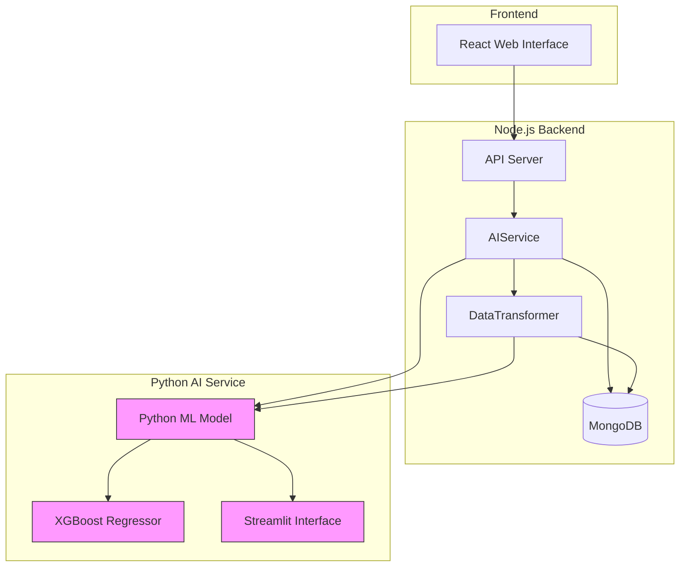
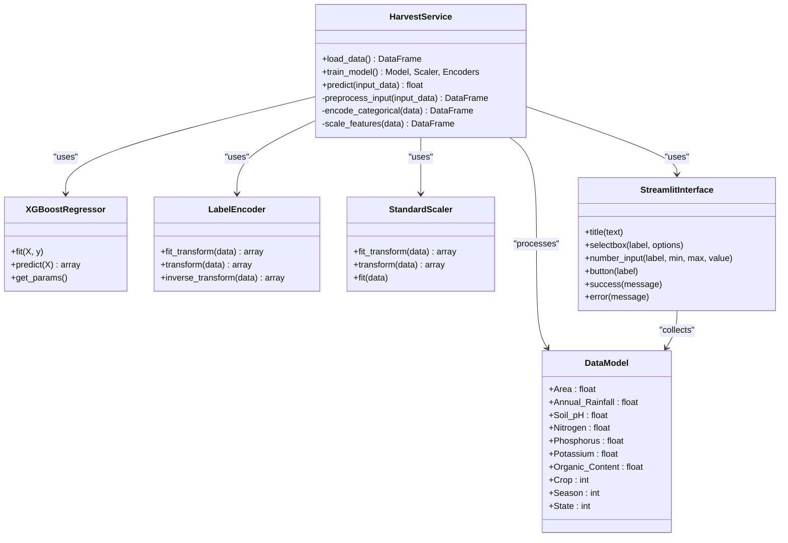
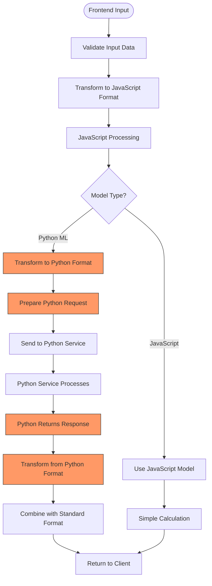
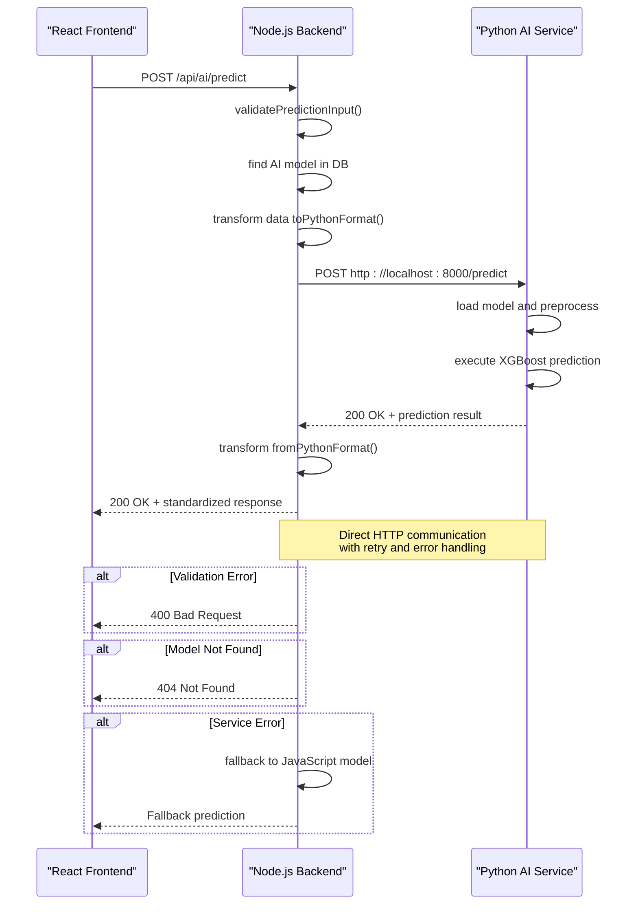
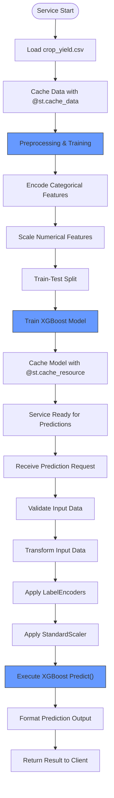
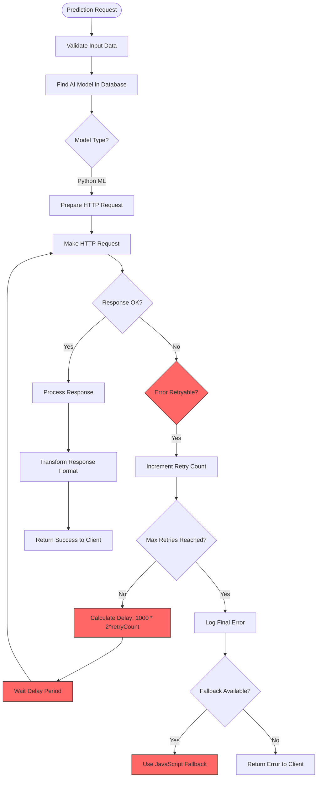
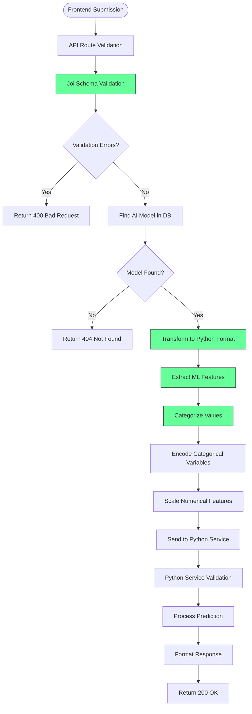
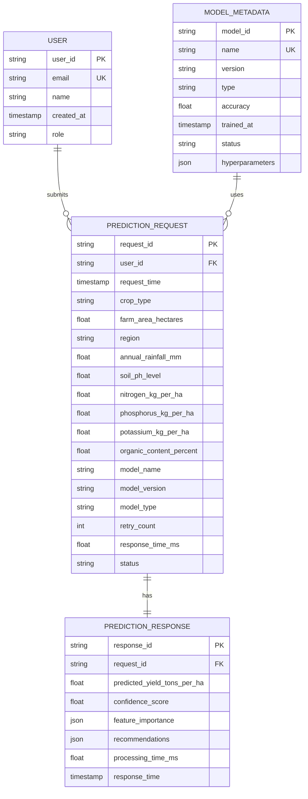
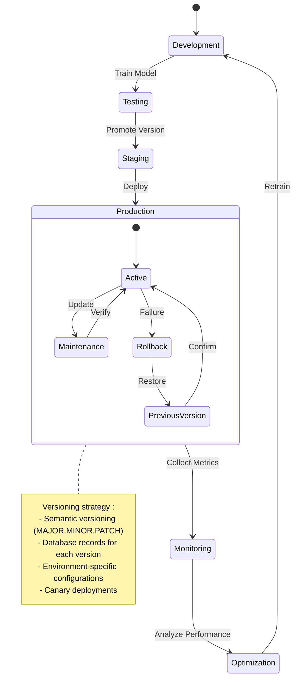

# Python ML Model Integration

<cite>
**Referenced Files in This Document**   
- [harvest.py](file://HarvestIQ/Py model/harvest.py)
- [aiService.js](file://HarvestIQ/backend/services/aiService.js)
- [dataTransformer.js](file://HarvestIQ/backend/services/dataTransformer.js)
- [aiController.js](file://HarvestIQ/backend/controllers/aiController.js)
- [ai.js](file://HarvestIQ/backend/routes/ai.js)
- [AiModel.js](file://HarvestIQ/backend/models/AiModel.js)
- [validation.js](file://HarvestIQ/backend/utils/validation.js)
- [database.js](file://HarvestIQ/backend/config/database.js)
- [server.js](file://HarvestIQ/backend/server.js)
</cite>

## Table of Contents
1. [Introduction](#introduction)
2. [Architecture Overview](#architecture-overview)
3. [Python AI Service Architecture](#python-ai-service-architecture)
4. [Data Transformation Process](#data-transformation-process)
5. [HTTP Communication Between Services](#http-communication-between-services)
6. [Model Loading and Prediction Workflow](#model-loading-and-prediction-workflow)
7. [Error Handling and Retry Mechanisms](#error-handling-and-retry-mechanisms)
8. [Input Validation and Schema Transformation](#input-validation-and-schema-transformation)
9. [Performance Considerations](#performance-considerations)
10. [Model Versioning and Deployment](#model-versioning-and-deployment)
11. [Data Transmission Examples](#data-transmission-examples)
12. [Conclusion](#conclusion)

## Introduction

The HarvestIQ system integrates a Node.js backend with Python machine learning models to provide crop yield predictions for agricultural planning. This document details the integration architecture between the JavaScript frontend and backend with the Python-based AI service that implements XGBoost for crop yield prediction. The system uses a microservices approach where the primary Node.js application communicates with a dedicated Python service for machine learning inference.

The integration enables farmers to input crop, soil, and weather data through a web interface, which is then processed by the Python ML model to generate yield predictions. The architecture is designed to be resilient, with fallback mechanisms, retry logic, and comprehensive error handling to ensure reliable predictions even when the Python service experiences temporary issues.

**Section sources**
- [harvest.py](file://HarvestIQ/Py model/harvest.py#L1-L128)
- [aiService.js](file://HarvestIQ/backend/services/aiService.js#L1-L482)

## Architecture Overview

The HarvestIQ system follows a service-oriented architecture where the Node.js backend acts as the primary API server, coordinating between the frontend client and specialized AI services. The Python ML model runs as a separate service that can be invoked via HTTP requests, allowing for independent scaling and deployment of the machine learning component.



**Diagram sources**
- [server.js](file://HarvestIQ/backend/server.js#L1-L152)
- [aiService.js](file://HarvestIQ/backend/services/aiService.js#L1-L482)
- [harvest.py](file://HarvestIQ/Py model/harvest.py#L1-L128)

The architecture enables separation of concerns, where the Node.js application handles user authentication, data persistence, and API routing, while the Python service focuses exclusively on machine learning inference. This separation allows data scientists to update and improve the ML models without affecting the core application functionality.

**Section sources**
- [server.js](file://HarvestIQ/backend/server.js#L1-L152)
- [aiService.js](file://HarvestIQ/backend/services/aiService.js#L1-L482)
- [harvest.py](file://HarvestIQ/Py model/harvest.py#L1-L128)

## Python AI Service Architecture

The Python AI service, implemented in `harvest.py`, uses XGBoost for crop yield prediction with a Streamlit interface for direct interaction. The service architecture follows a modular design with distinct components for data loading, preprocessing, model training, and prediction.



**Diagram sources**
- [harvest.py](file://HarvestIQ/Py model/harvest.py#L1-L128)

The service implements caching mechanisms using Streamlit's `@st.cache_data` and `@st.cache_resource` decorators to optimize performance by avoiding redundant data loading and model retraining. The XGBoost model is configured with specific hyperparameters including 650 estimators, a learning rate of 0.2, and regularization parameters to prevent overfitting.

The preprocessing pipeline includes categorical feature encoding using `LabelEncoder` for crop type, season, and state variables, followed by feature scaling with `StandardScaler` to normalize numerical inputs. This preprocessing ensures that the input data is in the appropriate format for the XGBoost algorithm, which performs better with normalized features.

**Section sources**
- [harvest.py](file://HarvestIQ/Py model/harvest.py#L1-L128)

## Data Transformation Process

The data transformation process in HarvestIQ is managed by the `dataTransformer` service, which handles the conversion of data between JavaScript and Python formats. This service ensures that data is properly structured and typed for consumption by the respective systems.



**Diagram sources**
- [dataTransformer.js](file://HarvestIQ/backend/services/dataTransformer.js#L1-L472)

The transformation process begins with raw input data from the frontend, which includes crop type, farm area, region, soil parameters (pH, organic content, nitrogen, phosphorus, potassium), and weather data (rainfall, temperature, humidity). The `dataTransformer.toPythonFormat` method converts this data into a structure optimized for the Python ML model, including proper field naming, data typing, and additional metadata.

Key transformations include:
- Converting camelCase JavaScript properties to snake_case Python conventions
- Adding model metadata (name, version, type) to the request
- Including user context (user_id, timestamp)
- Structuring agricultural, soil, and weather data into nested objects
- Extracting machine learning features for enhanced prediction accuracy

The reverse transformation process, handled by `dataTransformer.fromPythonFormat`, converts the Python service's response back into the standard format expected by the frontend, ensuring consistency across different model types.

**Section sources**
- [dataTransformer.js](file://HarvestIQ/backend/services/dataTransformer.js#L1-L472)

## HTTP Communication Between Services

The communication between the Node.js backend and Python AI service occurs through HTTP requests, with the `AIService` class managing the interaction. The service uses axios for HTTP client functionality, with configurable endpoints and timeout settings.



**Diagram sources**
- [aiService.js](file://HarvestIQ/backend/services/aiService.js#L1-L482)
- [aiController.js](file://HarvestIQ/backend/controllers/aiController.js#L1-L186)
- [ai.js](file://HarvestIQ/backend/routes/ai.js#L1-L12)

The HTTP communication follows a RESTful pattern with the Node.js backend acting as a client to the Python service. The endpoint structure uses `/predict` for prediction requests and includes proper error handling for various failure scenarios. Environment variables control the service URL and timeout settings, allowing for flexible configuration across different deployment environments.

**Section sources**
- [aiService.js](file://HarvestIQ/backend/services/aiService.js#L1-L482)
- [aiController.js](file://HarvestIQ/backend/controllers/aiController.js#L1-L186)
- [ai.js](file://HarvestIQ/backend/routes/ai.js#L1-L12)

## Model Loading and Prediction Workflow

The model loading and prediction workflow in the Python service follows a structured process that ensures efficient inference while maintaining model accuracy. The workflow begins with data loading and preprocessing, followed by model training (if not already cached), and concludes with prediction generation.



**Diagram sources**
- [harvest.py](file://HarvestIQ/Py model/harvest.py#L1-L128)

The XGBoost model is configured with specific hyperparameters optimized for crop yield prediction:
- `n_estimators=650`: Number of boosting rounds
- `learning_rate=0.2`: Step size shrinkage to prevent overfitting
- `max_depth=3`: Maximum depth of a tree
- `subsample=0.9`: Subsample ratio of the training instances
- `colsample_bytree=0.6`: Subsample ratio of columns when constructing each tree
- Regularization parameters (`gamma=1.3`, `reg_alpha=6.2`, `reg_lambda=3.6`) to control model complexity

The preprocessing pipeline applies `LabelEncoder` to convert categorical variables (crop type, season, state) into numerical representations that the model can process. The `StandardScaler` normalizes numerical features to have zero mean and unit variance, which improves the convergence of the XGBoost algorithm.

**Section sources**
- [harvest.py](file://HarvestIQ/Py model/harvest.py#L1-L128)

## Error Handling and Retry Mechanisms

The HarvestIQ system implements comprehensive error handling and retry mechanisms to ensure reliable service operation even under adverse conditions. The `AIService` class includes sophisticated retry logic with exponential backoff to handle transient failures in the Python AI service.



**Diagram sources**
- [aiService.js](file://HarvestIQ/backend/services/aiService.js#L1-L482)

The retry mechanism is implemented in the `makeRequestWithRetry` method, which attempts to resend failed requests up to three times (`maxRetries = 3`) with exponentially increasing delays. The delay follows the formula `Math.min(1000 * Math.pow(2, retryCount), 10000)`, starting at 1 second for the first retry and doubling each time, with a maximum of 10 seconds.

Retryable errors include:
- `ECONNABORTED`: Request timeout
- `ECONNRESET`: Connection reset by peer
- `ENOTFOUND`: DNS lookup failed
- Server errors (5xx status codes)

When all retry attempts are exhausted, the system falls back to the JavaScript prediction engine, ensuring that users always receive a prediction even if the primary Python service is unavailable. This fallback mechanism maintains system availability and provides a graceful degradation of service quality rather than complete failure.

**Section sources**
- [aiService.js](file://HarvestIQ/backend/services/aiService.js#L1-L482)

## Input Validation and Schema Transformation

Input validation and schema transformation are critical components of the HarvestIQ integration, ensuring data integrity and compatibility between systems. The validation process occurs at multiple levels, from initial input validation to model-specific schema checking.



**Diagram sources**
- [validation.js](file://HarvestIQ/backend/utils/validation.js#L1-L20)
- [dataTransformer.js](file://HarvestIQ/backend/services/dataTransformer.js#L1-L472)
- [aiController.js](file://HarvestIQ/backend/controllers/aiController.js#L1-L186)

The initial validation uses Joi to enforce strict data types and value ranges for all input fields:
- Farm area: 0.1 to 1000 hectares
- Rainfall: 100 to 5000 mm
- Soil pH: 3.0 to 10.0
- Nitrogen: 0 to 300 kg/ha
- Phosphorus: 0 to 150 kg/ha
- Potassium: 0 to 200 kg/ha
- Organic content: 0 to 10%

The `dataTransformer` service performs additional schema transformation, converting the validated input into the specific format expected by the Python service. This includes field name conversion from camelCase to snake_case, data type enforcement, and the addition of metadata fields that provide context for the prediction.

**Section sources**
- [validation.js](file://HarvestIQ/backend/utils/validation.js#L1-L20)
- [dataTransformer.js](file://HarvestIQ/backend/services/dataTransformer.js#L1-L472)

## Performance Considerations

The integration between Node.js and Python ML models in HarvestIQ involves several performance considerations related to inter-process communication, data serialization, and computational efficiency. The architecture is designed to minimize latency while maintaining prediction accuracy.

The HTTP communication between services introduces network overhead, which is mitigated through several optimization strategies:
- Connection pooling and reuse
- Efficient data serialization (JSON)
- Caching of trained models and preprocessing objects
- Asynchronous processing to avoid blocking the main thread

For inter-process communication, the system uses direct HTTP requests rather than more complex message queues, which reduces infrastructure complexity but requires careful management of connection timeouts and error handling. The default timeout of 30 seconds (configurable via `AI_SERVICE_TIMEOUT` environment variable) balances the need for thorough model inference with acceptable response times for users.

Model loading performance is optimized through Streamlit's caching decorators, which store the trained model and preprocessing objects in memory after the first request. This eliminates the need to reload and retrain the model for each prediction, significantly reducing response times for subsequent requests.



**Diagram sources**
- [aiService.js](file://HarvestIQ/backend/services/aiService.js#L1-L482)
- [harvest.py](file://HarvestIQ/Py model/harvest.py#L1-L128)

The system also implements performance monitoring through the `healthCheck` method, which can assess the availability and response time of the Python AI service. This allows the application to make informed decisions about routing requests and provides early warning of potential performance degradation.

**Section sources**
- [aiService.js](file://HarvestIQ/backend/services/aiService.js#L1-L482)
- [harvest.py](file://HarvestIQ/Py model/harvest.py#L1-L128)

## Model Versioning and Deployment

Model versioning and deployment in HarvestIQ are managed through a combination of database storage, environment configuration, and service discovery. The `AiModel` collection in MongoDB stores metadata about available models, including version information that enables controlled deployment and rollback.



**Diagram sources**
- [AiModel.js](file://HarvestIQ/backend/models/AiModel.js#L1-L52)

Each AI model is stored in the database with version information, allowing the system to maintain multiple versions simultaneously and route requests based on configuration. The versioning strategy follows semantic versioning principles, with major versions for significant algorithm changes, minor versions for improvements, and patch versions for bug fixes.

Deployment is controlled through environment variables and database records, enabling different deployment strategies:
- Blue-green deployments by switching the active model reference
- Canary releases by routing a percentage of traffic to new models
- A/B testing by comparing performance metrics between model versions

The system supports multiple model types, including JavaScript, Python ML, Python DL, and ensemble models, each with their own versioning and deployment considerations. This flexibility allows data science teams to experiment with different approaches while maintaining production stability.

**Section sources**
- [AiModel.js](file://HarvestIQ/backend/models/AiModel.js#L1-L52)

## Data Transmission Examples

The data transmission process between JavaScript and Python environments in HarvestIQ follows a standardized pattern that ensures consistency and reliability. The following examples illustrate how crop, soil, and weather data is transformed and transmitted between systems.

### Example 1: Wheat Yield Prediction

**Original JavaScript Input:**
```json
{
  "cropType": "Wheat",
  "farmArea": 2.5,
  "region": "Punjab",
  "soilData": {
    "phLevel": 6.8,
    "organicContent": 1.8,
    "nitrogen": 120,
    "phosphorus": 45,
    "potassium": 60
  },
  "weatherData": {
    "rainfall": 850,
    "temperature": 22,
    "humidity": 65
  }
}
```

**Transformed Python Request:**
```json
{
  "model_info": {
    "name": "XGBoost Crop Yield Model",
    "version": "2.1.0",
    "type": "python-ml"
  },
  "user_id": "usr_12345",
  "timestamp": "2024-01-15T10:30:00Z",
  "crop_data": {
    "crop_type": "wheat",
    "farm_area_hectares": 2.5,
    "region": "Punjab",
    "planting_season": "rabi"
  },
  "soil_data": {
    "ph_level": 6.8,
    "organic_content_percent": 1.8,
    "nitrogen_kg_per_ha": 120,
    "phosphorus_kg_per_ha": 45,
    "potassium_kg_per_ha": 60
  },
  "weather_data": {
    "annual_rainfall_mm": 850,
    "average_temperature_celsius": 22,
    "humidity_percent": 65
  },
  "features": {
    "crop_encoding": 0,
    "region_encoding": 0,
    "soil_ph_category": "neutral",
    "soil_fertility_index": 0.85,
    "npk_ratio": {
      "n": 0.53,
      "p": 0.2,
      "k": 0.27
    },
    "rainfall_category": "high",
    "temperature_stress_index": 0,
    "humidity_index": "moderate",
    "farm_size_category": "medium",
    "growing_season": "rabi",
    "feature_completeness": 1.0
  }
}
```

**Python Response:**
```json
{
  "prediction": {
    "expected_yield_tons_per_ha": 4.8,
    "yield_per_hectare": 4.8,
    "total_yield_tons": 12.0,
    "confidence_score": 0.92,
    "feature_importance": {
      "nitrogen_kg_per_ha": 0.25,
      "annual_rainfall_mm": 0.22,
      "farm_area_hectares": 0.18,
      "ph_level": 0.15,
      "temperature_celsius": 0.12
    },
    "data_quality_score": 1.0
  },
  "metadata": {
    "model_version": "2.1.0",
    "processing_time_ms": 156,
    "accuracy_metrics": {
      "r2_score": 0.94,
      "rmse": 0.35
    }
  },
  "recommendations": [
    {
      "type": "fertilization",
      "priority": "medium",
      "title": "Optimize Nitrogen Application",
      "description": "Current nitrogen levels are optimal but could be fine-tuned for maximum yield.",
      "action": "Consider split application of nitrogen fertilizer"
    }
  ],
  "government_data": {}
}
```

**Transformed JavaScript Response:**
```json
{
  "results": {
    "expectedYield": 4.8,
    "yieldPerHectare": 4.8,
    "totalYield": 12.0,
    "confidence": 92,
    "factors": {
      "model_version": "2.1.0",
      "feature_importance": {
        "nitrogen_kg_per_ha": 0.25,
        "annual_rainfall_mm": 0.22,
        "farm_area_hectares": 0.18,
        "ph_level": 0.15,
        "temperature_celsius": 0.12
      },
      "processing_time_ms": 156,
      "data_quality_score": 1.0
    }
  },
  "recommendations": [
    {
      "type": "fertilization",
      "priority": "medium",
      "title": "Optimize Nitrogen Application",
      "description": "Current nitrogen levels are optimal but could be fine-tuned for maximum yield.",
      "action": "Consider split application of nitrogen fertilizer",
      "estimatedImpact": 0
    }
  ],
  "governmentData": {},
  "modelMetadata": {
    "accuracy_metrics": {
      "r2_score": 0.94,
      "rmse": 0.35
    },
    "model_performance": {},
    "prediction_uncertainty": {}
  }
}
```

The data transformation process ensures that all necessary information is preserved while adapting to the conventions and requirements of each system. The addition of derived features in the transformation process enhances the predictive power of the model by providing additional context that may not be immediately apparent from the raw input data.

**Section sources**
- [dataTransformer.js](file://HarvestIQ/backend/services/dataTransformer.js#L1-L472)
- [harvest.py](file://HarvestIQ/Py model/harvest.py#L1-L128)

## Conclusion

The integration between the Node.js backend and Python machine learning models in HarvestIQ demonstrates a robust and scalable architecture for agricultural prediction services. By separating the machine learning component into a dedicated service, the system achieves several key benefits:

1. **Technology Specialization**: Data scientists can use Python and specialized ML libraries like XGBoost without constraining the main application stack to Python.

2. **Independent Scaling**: The Python AI service can be scaled independently based on prediction demand, while the Node.js backend handles user management and data persistence.

3. **Resilience**: The retry mechanisms and fallback to JavaScript models ensure service availability even when the primary ML service experiences issues.

4. **Maintainability**: Clear separation of concerns makes the system easier to maintain and update, with model improvements deployable without affecting core application functionality.

5. **Flexibility**: Support for multiple model types (JavaScript, Python ML, ensemble) allows for experimentation and optimization of prediction accuracy.

The data transformation layer plays a crucial role in this integration, handling the complexities of data format conversion, validation, and feature engineering. This abstraction allows both systems to operate with their native data structures while ensuring compatibility at the integration points.

Future enhancements could include containerization of the Python service for easier deployment, implementation of model monitoring and retraining pipelines, and expansion of the ensemble approach to combine predictions from multiple specialized models. The current architecture provides a solid foundation for these improvements while delivering reliable crop yield predictions to farmers.