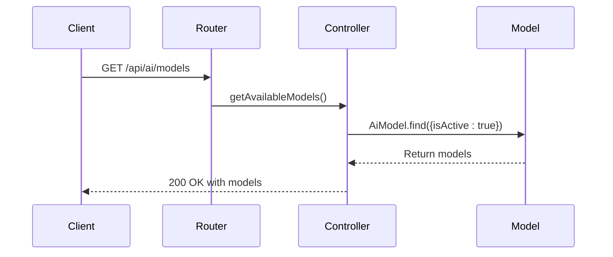
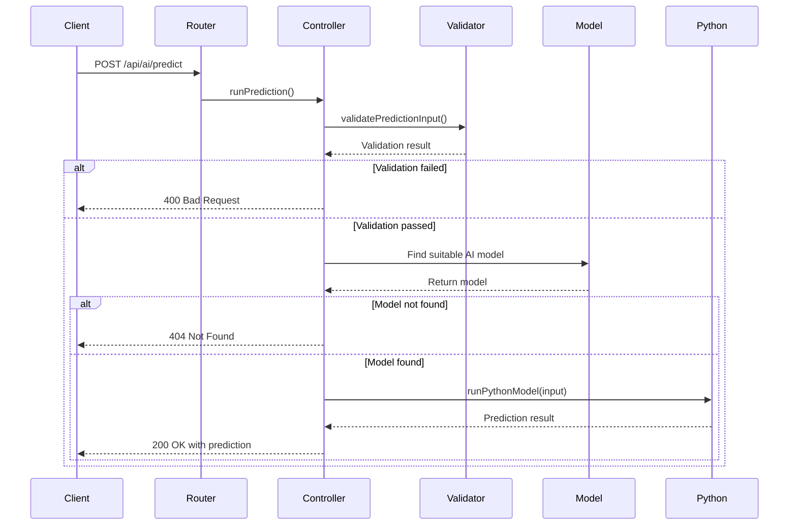
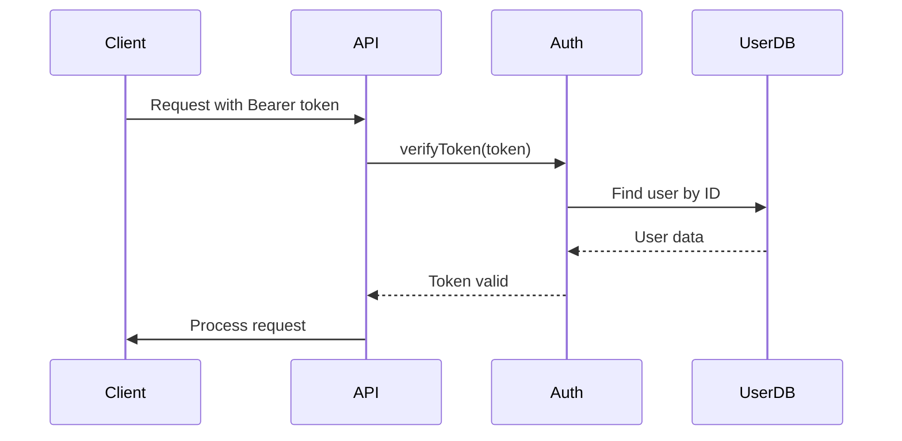
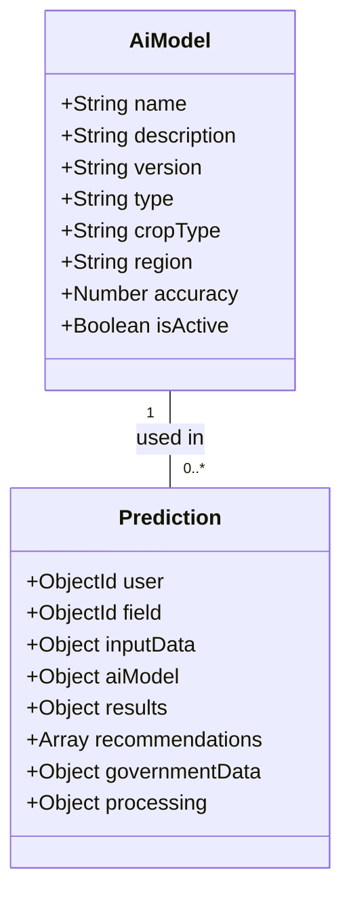
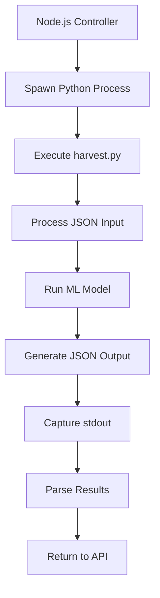
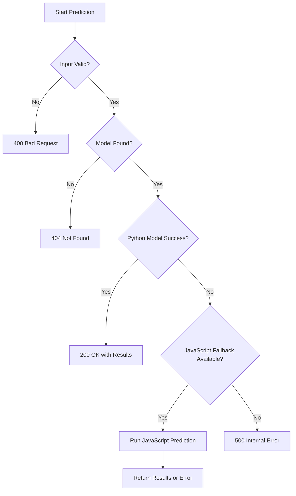
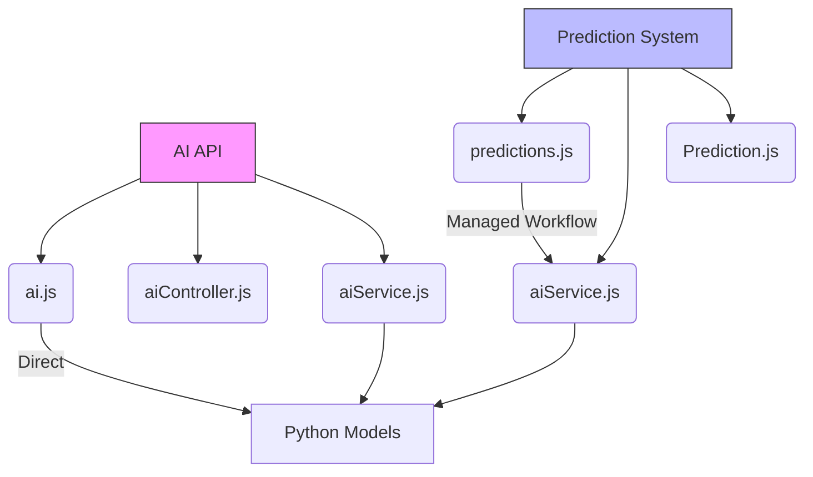

# AI API

<cite>
**Referenced Files in This Document**   
- [ai.js](file://HarvestIQ/backend/routes/ai.js)
- [aiController.js](file://HarvestIQ/backend/controllers/aiController.js)
- [aiService.js](file://HarvestIQ/backend/services/aiService.js)
- [AiModel.js](file://HarvestIQ/backend/models/AiModel.js)
- [Prediction.js](file://HarvestIQ/backend/models/Prediction.js)
- [validation.js](file://HarvestIQ/backend/utils/validation.js)
- [auth.js](file://HarvestIQ/backend/middleware/auth.js)
</cite>

## Table of Contents
1. [Introduction](#introduction)
2. [API Endpoints](#api-endpoints)
3. [Request/Response Schemas](#requestresponse-schemas)
4. [Authentication and Security](#authentication-and-security)
5. [AI Model Integration](#ai-model-integration)
6. [Error Handling](#error-handling)
7. [Timeout and Performance](#timeout-and-performance)
8. [Relationship with Prediction System](#relationship-with-prediction-system)
9. [Conclusion](#conclusion)

## Introduction

The AI API provides direct access to machine learning models for crop yield prediction and analysis. This API enables clients to retrieve available AI models and execute predictions using input data. The system integrates with Python-based machine learning models through child process execution and provides a fallback mechanism for JavaScript-based predictions. The API is designed to support multiple model types including JavaScript, Python ML/DL, ensemble models, and external API integrations.

**Section sources**
- [ai.js](file://HarvestIQ/backend/routes/ai.js#L1-L12)
- [aiController.js](file://HarvestIQ/backend/controllers/aiController.js#L1-L186)

## API Endpoints

### GET /api/ai/models

Retrieves a list of available AI models that can be used for predictions. This endpoint returns all active models in the system.



**Diagram sources**
- [ai.js](file://HarvestIQ/backend/routes/ai.js#L6-L8)
- [aiController.js](file://HarvestIQ/backend/controllers/aiController.js#L50-L61)

### POST /api/ai/predict

Executes an AI prediction using the provided input data. The system automatically selects the appropriate model based on crop type and region, then runs the prediction and returns results with recommendations.



**Diagram sources**
- [ai.js](file://HarvestIQ/backend/routes/ai.js#L11-L13)
- [aiController.js](file://HarvestIQ/backend/controllers/aiController.js#L126-L186)

**Section sources**
- [ai.js](file://HarvestIQ/backend/routes/ai.js#L1-L12)
- [aiController.js](file://HarvestIQ/backend/controllers/aiController.js#L126-L186)

## Request/Response Schemas

### Input Data Format

The AI system expects input data in the following format:

```json
{
  "area": 5.5,
  "rainfall": 1200,
  "ph": 6.8,
  "nitrogen": 150,
  "phosphorus": 80,
  "potassium": 120,
  "organic": 3.5,
  "crop": "Rice",
  "season": "Kharif",
  "state": "Punjab"
}
```

### Prediction Response Structure

The response contains prediction results, model information, and recommendations:

```json
{
  "success": true,
  "data": {
    "prediction": {
      "expectedYield": 7.2,
      "yieldPerHectare": 7.2,
      "totalYield": 39.6,
      "confidence": 95,
      "factors": {
        "baseYield": 6.2,
        "yieldFactor": "1.161"
      }
    },
    "model": "64a1b2c3d4e5f6a1b2c3d4e5",
    "modelName": "Rice-Yield-Predictor-v2",
    "modelVersion": "2.1.0",
    "modelType": "python-ml",
    "confidence": 0.95
  }
}
```

**Section sources**
- [aiController.js](file://HarvestIQ/backend/controllers/aiController.js#L126-L186)
- [validation.js](file://HarvestIQ/backend/utils/validation.js#L1-L20)

## Authentication and Security

All AI API endpoints are protected by JWT-based authentication. The `protect` middleware validates the Bearer token in the Authorization header and attaches the authenticated user to the request object.



**Diagram sources**
- [auth.js](file://HarvestIQ/backend/middleware/auth.js#L16-L63)
- [ai.js](file://HarvestIQ/backend/routes/ai.js#L1-L12)

**Section sources**
- [auth.js](file://HarvestIQ/backend/middleware/auth.js#L16-L63)
- [ai.js](file://HarvestIQ/backend/routes/ai.js#L1-L12)

## AI Model Integration

The AI system supports multiple model types through the AiModel schema, which defines model characteristics including type, crop specificity, and region.



**Diagram sources**
- [AiModel.js](file://HarvestIQ/backend/models/AiModel.js#L4-L52)
- [Prediction.js](file://HarvestIQ/backend/models/Prediction.js#L4-L387)

The system integrates with Python models by spawning child processes that execute the harvest.py script with JSON input parameters. The controller captures stdout and stderr output and parses the results.



**Diagram sources**
- [aiController.js](file://HarvestIQ/backend/controllers/aiController.js#L11-L42)
- [aiController.js](file://HarvestIQ/backend/controllers/aiController.js#L126-L186)

**Section sources**
- [aiController.js](file://HarvestIQ/backend/controllers/aiController.js#L11-L42)
- [AiModel.js](file://HarvestIQ/backend/models/AiModel.js#L4-L52)

## Error Handling

The AI API implements comprehensive error handling for various failure scenarios:

- **Validation errors**: 400 Bad Request with specific validation messages
- **Model not found**: 404 Not Found when no suitable model exists
- **AI processing failures**: 500 Internal Server Error with error details
- **Authentication failures**: 401 Unauthorized for invalid or missing tokens

The system uses a fallback mechanism where JavaScript-based predictions are used if Python model execution fails, ensuring service availability.



**Diagram sources**
- [aiController.js](file://HarvestIQ/backend/controllers/aiController.js#L126-L186)
- [aiController.js](file://HarvestIQ/backend/controllers/aiController.js#L50-L61)

**Section sources**
- [aiController.js](file://HarvestIQ/backend/controllers/aiController.js#L126-L186)
- [validation.js](file://HarvestIQ/backend/utils/validation.js#L1-L20)

## Timeout and Performance

The AI prediction system is designed with performance considerations for long-running model executions:

- Python model execution uses child processes with proper error handling
- The system captures both stdout and stderr streams to monitor execution
- Process exit codes are checked to determine success or failure
- JSON parsing of results includes error handling for malformed output
- The controller implements proper cleanup of child processes

For production deployment, it is recommended to:
- Monitor process resource usage
- Implement request timeouts at the reverse proxy level
- Consider using a message queue for long-running predictions
- Implement rate limiting to prevent abuse

**Section sources**
- [aiController.js](file://HarvestIQ/backend/controllers/aiController.js#L11-L42)
- [aiController.js](file://HarvestIQ/backend/controllers/aiController.js#L126-L186)

## Relationship with Prediction System

The AI API provides direct access to AI models, while the comprehensive prediction system in predictions.js offers a more complete workflow with additional features.



**Diagram sources**
- [ai.js](file://HarvestIQ/backend/routes/ai.js#L1-L12)
- [predictions.js](file://HarvestIQ/backend/routes/predictions.js#L1-L468)

The key differences are:

| Feature | AI API | Prediction System |
|-------|------|------------------|
| **Purpose** | Direct AI model access | Complete prediction workflow |
| **Data Storage** | No persistence | Stores predictions in database |
| **User Context** | Minimal | Full user context and history |
| **Feedback Loop** | None | User feedback and model rating |
| **Error Recovery** | Immediate failure | Retry mechanisms |
| **Statistics** | None | Comprehensive analytics |
| **Access Control** | Basic authentication | Full ownership verification |

The prediction system uses the aiService singleton for AI model execution, providing a consistent interface across both systems.

**Section sources**
- [ai.js](file://HarvestIQ/backend/routes/ai.js#L1-L12)
- [predictions.js](file://HarvestIQ/backend/routes/predictions.js#L1-L468)
- [aiService.js](file://HarvestIQ/backend/services/aiService.js#L1-L481)

## Conclusion

The AI API provides a direct interface to machine learning models for crop yield prediction. It offers simple endpoints for retrieving available models and executing predictions with comprehensive error handling. The system integrates with Python-based models through child process execution and includes fallback mechanisms for reliability. While the AI API provides direct access to models, the comprehensive prediction system offers additional features like data persistence, user feedback, and analytics. Both systems share the same underlying AI service, ensuring consistency in model execution and results.