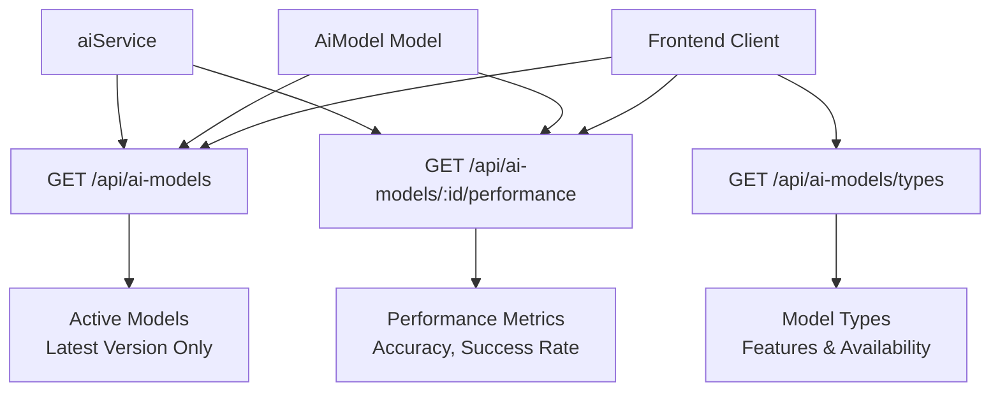
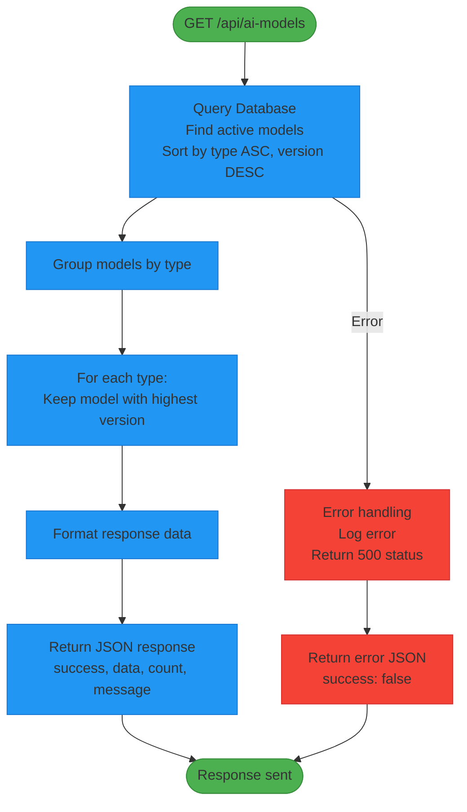
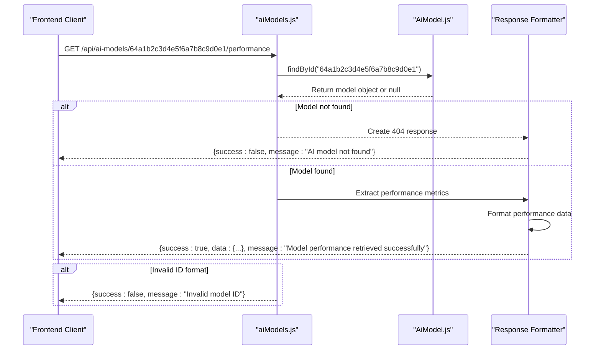
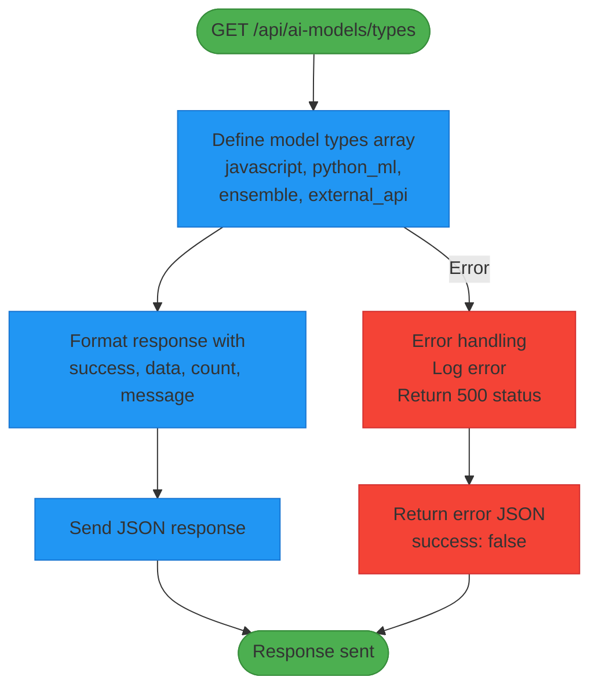
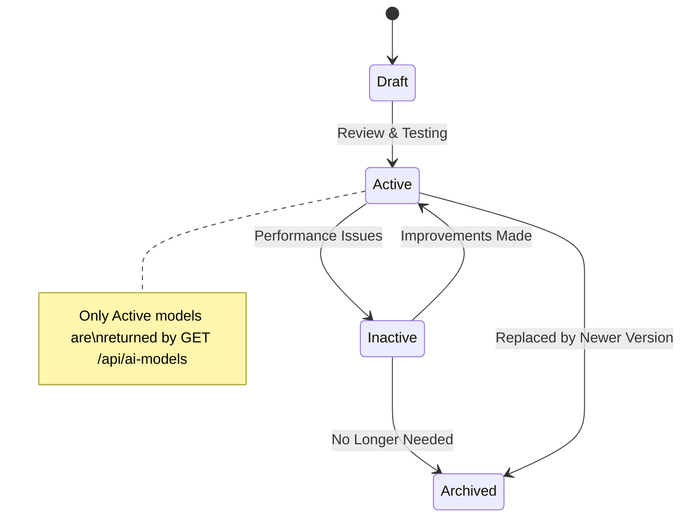
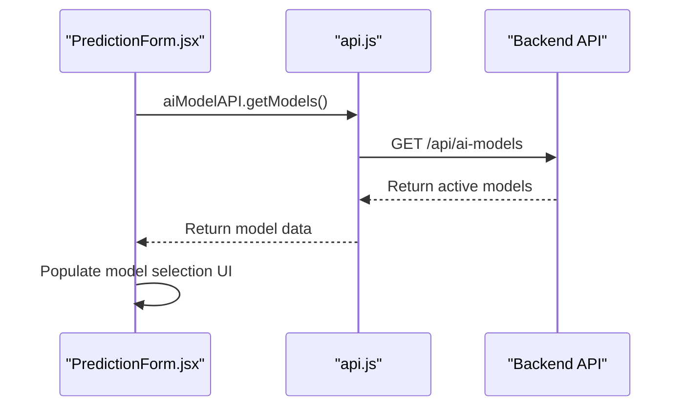
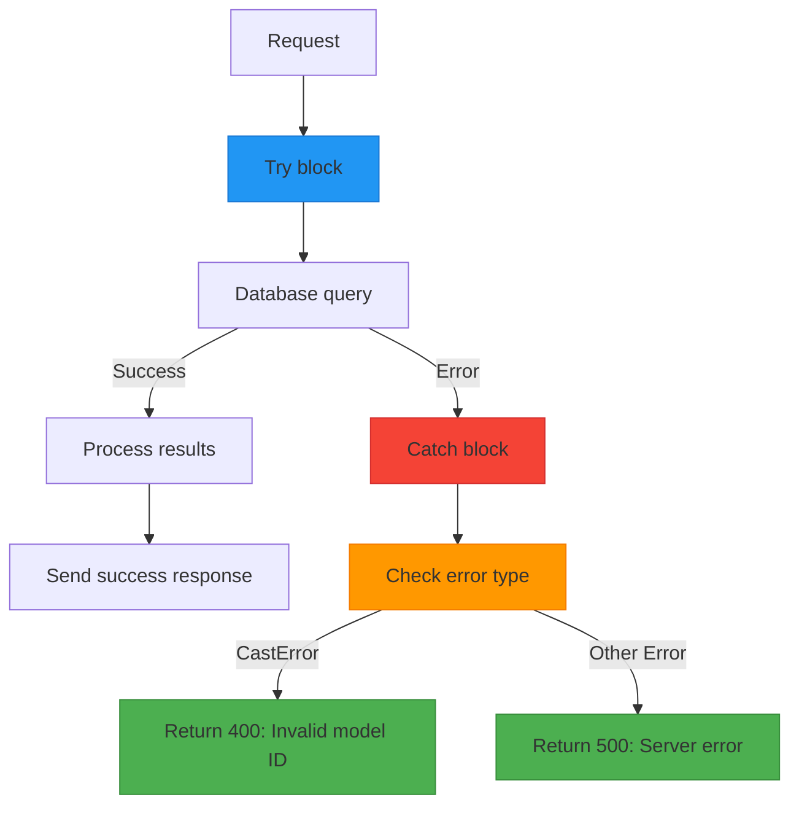
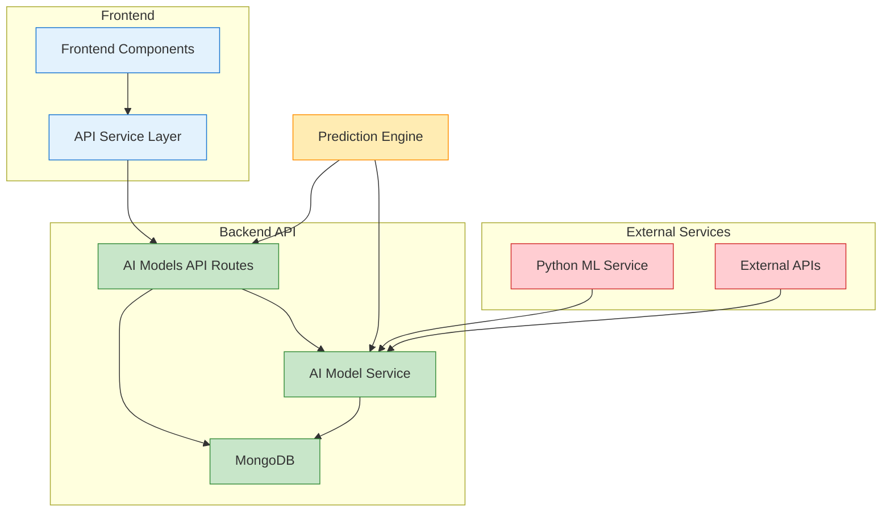

# AI Models API

<cite>
**Referenced Files in This Document**  
- [aiModels.js](file://HarvestIQ/backend/routes/aiModels.js)
- [AiModel.js](file://HarvestIQ/backend/models/AiModel.js)
- [aiService.js](file://HarvestIQ/backend/services/aiService.js)
- [api.js](file://HarvestIQ/src/services/api.js)
- [PredictionForm.jsx](file://HarvestIQ/src/components/PredictionForm.jsx)
</cite>

## Table of Contents
1. [Introduction](#introduction)
2. [API Endpoints Overview](#api-endpoints-overview)
3. [GET /api/ai-models](#get-apiai-models)
4. [GET /api/ai-models/:id/performance](#get-apiai-modelsidperformance)
5. [GET /api/ai-models/types](#get-apiai-modelstypes)
6. [Response Schemas](#response-schemas)
7. [Model Lifecycle and Versioning](#model-lifecycle-and-versioning)
8. [Frontend Integration](#frontend-integration)
9. [Error Handling](#error-handling)
10. [Architecture Overview](#architecture-overview)

## Introduction

The AI Models API provides a comprehensive interface for managing and retrieving information about AI models used in the HarvestIQ platform. This API enables the system to dynamically select appropriate models for crop yield predictions based on various agricultural parameters. The API supports model discovery, performance monitoring, and type classification to ensure optimal prediction accuracy and reliability.

The API is designed to support multiple AI model types including JavaScript-based models, Python machine learning models, ensemble models, and external API integrations. Each model is managed with version control and lifecycle status to ensure only active, high-performing models are used for predictions.

**Section sources**
- [aiModels.js](file://HarvestIQ/backend/routes/aiModels.js#L1-L154)

## API Endpoints Overview

The AI Models API consists of three primary endpoints that provide different levels of information about available AI models:

1. **GET /api/ai-models**: Retrieves all active AI models with version-based filtering to return only the latest version of each model type
2. **GET /api/ai-models/:id/performance**: Accesses detailed performance metrics for a specific AI model
3. **GET /api/ai-models/types**: Lists all available model types with their descriptions, availability, and features

These endpoints work together to provide a complete picture of the AI model ecosystem within HarvestIQ, enabling both frontend components and backend services to make informed decisions about model selection and usage.



**Diagram sources**
- [aiModels.js](file://HarvestIQ/backend/routes/aiModels.js#L1-L154)
- [AiModel.js](file://HarvestIQ/backend/models/AiModel.js#L1-L53)

**Section sources**
- [aiModels.js](file://HarvestIQ/backend/routes/aiModels.js#L1-L154)

## GET /api/ai-models

The `GET /api/ai-models` endpoint retrieves all active AI models from the database, applying version-based filtering to return only the latest version of each model type. This ensures that clients always receive the most up-to-date models for prediction tasks.

The endpoint first queries the database for all models with an "active" status, sorting them by type (ascending) and version (descending). It then processes the results to group models by their type and retain only the one with the highest version number for each type.



**Diagram sources**
- [aiModels.js](file://HarvestIQ/backend/routes/aiModels.js#L15-L44)

**Section sources**
- [aiModels.js](file://HarvestIQ/backend/routes/aiModels.js#L15-L44)
- [AiModel.js](file://HarvestIQ/backend/models/AiModel.js#L1-L53)

### Request Details

- **Method**: GET
- **Endpoint**: `/api/ai-models`
- **Authentication**: Required (Private route with protect middleware)
- **Parameters**: None

### Response Structure

The response follows a standardized format with success status, data payload, count of returned models, and a descriptive message.

| Field | Type | Description |
|-------|------|-------------|
| success | boolean | Indicates whether the request was successful |
| data | array | Array of AI model objects (latest version of each type) |
| count | number | Number of models returned |
| message | string | Descriptive message about the operation result |

### Example Response

```json
{
  "success": true,
  "data": [
    {
      "_id": "64a1b2c3d4e5f6a7b8c9d0e1",
      "name": "JavaScript Prediction Engine",
      "description": "Built-in JavaScript-based prediction model",
      "version": "1.2.0",
      "type": "javascript",
      "cropType": "Wheat",
      "region": "all",
      "accuracy": 85.5,
      "isActive": true,
      "createdAt": "2023-07-01T10:30:00.000Z",
      "updatedAt": "2023-07-15T14:20:00.000Z"
    },
    {
      "_id": "64a1b2c3d4e5f6a7b8c9d0e2",
      "name": "Python Machine Learning Model",
      "description": "Advanced ML model using Python scikit-learn",
      "version": "2.1.0",
      "type": "python-ml",
      "cropType": "Rice",
      "region": "all",
      "accuracy": 92.3,
      "isActive": true,
      "createdAt": "2023-06-15T09:15:00.000Z",
      "updatedAt": "2023-07-20T11:45:00.000Z"
    }
  ],
  "count": 2,
  "message": "AI models retrieved successfully"
}
```

## GET /api/ai-models/:id/performance

The `GET /api/ai-models/:id/performance` endpoint provides detailed performance metrics for a specific AI model identified by its ID. This endpoint is crucial for monitoring model effectiveness and making data-driven decisions about model usage and improvements.

The endpoint first attempts to find the model by its ID. If the model is not found, it returns a 404 error. If found, it extracts and formats the performance metrics into a standardized response structure that includes accuracy, success rate, average confidence, total predictions, and historical metrics.



**Diagram sources**
- [aiModels.js](file://HarvestIQ/backend/routes/aiModels.js#L45-L95)

**Section sources**
- [aiModels.js](file://HarvestIQ/backend/routes/aiModels.js#L45-L95)
- [AiModel.js](file://HarvestIQ/backend/models/AiModel.js#L1-L53)

### Request Details

- **Method**: GET
- **Endpoint**: `/api/ai-models/:id/performance`
- **Authentication**: Required (Private route with protect middleware)
- **Parameters**:
  - `id` (path parameter): The MongoDB ObjectId of the AI model

### Response Structure

The response includes comprehensive performance metrics that help assess the model's effectiveness and reliability.

| Field | Type | Description |
|-------|------|-------------|
| success | boolean | Indicates whether the request was successful |
| data | object | Performance metrics object |
| message | string | Descriptive message about the operation result |

### Performance Data Schema

The `data` field contains the following performance metrics:

| Field | Type | Description |
|-------|------|-------------|
| modelId | string | The model's MongoDB ObjectId |
| type | string | Model type (javascript, python-ml, etc.) |
| version | string | Model version number |
| accuracy | number | Model accuracy percentage (0-100) |
| totalPredictions | number | Total number of predictions made |
| successRate | number | Percentage of successful predictions |
| averageConfidence | number | Average confidence score of predictions |
| lastUpdated | string | Timestamp of last performance update |
| metrics | array | Historical performance metrics |
| status | string | Current model status (active, inactive) |
| description | string | Model description |

### Example Response

```json
{
  "success": true,
  "data": {
    "modelId": "64a1b2c3d4e5f6a7b8c9d0e1",
    "type": "javascript",
    "version": "1.2.0",
    "accuracy": 85.5,
    "totalPredictions": 1523,
    "successRate": 98.7,
    "averageConfidence": 89.2,
    "lastUpdated": "2023-07-25T08:30:00.000Z",
    "metrics": [
      {
        "date": "2023-07-01",
        "accuracy": 84.2,
        "successRate": 97.5,
        "confidence": 87.8
      },
      {
        "date": "2023-07-15",
        "accuracy": 85.5,
        "successRate": 98.7,
        "confidence": 89.2
      }
    ],
    "status": "active",
    "description": "Built-in JavaScript-based prediction model"
  },
  "message": "Model performance retrieved successfully"
}
```

## GET /api/ai-models/types

The `GET /api/ai-models/types` endpoint returns a comprehensive list of all available AI model types in the system, including their descriptions, availability characteristics, and feature sets. This endpoint provides clients with the information needed to understand the capabilities and limitations of different model types.

Unlike the other endpoints, this one does not query the database but returns a predefined array of model type configurations. This approach ensures consistent and controlled information about model types across the system.



**Diagram sources**
- [aiModels.js](file://HarvestIQ/backend/routes/aiModels.js#L96-L154)

**Section sources**
- [aiModels.js](file://HarvestIQ/backend/routes/aiModels.js#L96-L154)

### Request Details

- **Method**: GET
- **Endpoint**: `/api/ai-models/types`
- **Authentication**: Required (Private route with protect middleware)
- **Parameters**: None

### Response Structure

The response includes information about all available model types in the system.

| Field | Type | Description |
|-------|------|-------------|
| success | boolean | Indicates whether the request was successful |
| data | array | Array of model type objects |
| count | number | Number of model types |
| message | string | Descriptive message about the operation result |

### Model Type Schema

Each model type object contains the following fields:

| Field | Type | Description |
|-------|------|-------------|
| type | string | Technical identifier for the model type |
| name | string | Human-readable name of the model type |
| description | string | Detailed description of the model type |
| availability | string | Availability characteristic |
| features | array | Array of feature descriptions |

### Availability Characteristics

The availability field indicates the conditions under which the model type is available:

- **always**: Always available (e.g., JavaScript models)
- **service_dependent**: Depends on external service availability
- **conditional**: Available under specific conditions
- **api_dependent**: Depends on third-party API availability

### Example Response

```json
{
  "success": true,
  "data": [
    {
      "type": "javascript",
      "name": "JavaScript Prediction Engine",
      "description": "Built-in JavaScript-based prediction model",
      "availability": "always",
      "features": [
        "Fast processing",
        "No external dependencies",
        "Reliable fallback"
      ]
    },
    {
      "type": "python_ml",
      "name": "Python Machine Learning Model",
      "description": "Advanced ML model using Python scikit-learn",
      "availability": "service_dependent",
      "features": [
        "High accuracy",
        "Advanced algorithms",
        "Continuous learning"
      ]
    },
    {
      "type": "ensemble",
      "name": "Ensemble Prediction",
      "description": "Combines multiple models for best results",
      "availability": "conditional",
      "features": [
        "Best accuracy",
        "Multiple algorithms",
        "Confidence scoring"
      ]
    },
    {
      "type": "external_api",
      "name": "External API Integration",
      "description": "Third-party AI service integration",
      "availability": "api_dependent",
      "features": [
        "Cloud-based",
        "Latest models",
        "Scalable processing"
      ]
    }
  ],
  "count": 4,
  "message": "AI model types retrieved successfully"
}
```

## Response Schemas

This section details the standardized response schemas used across all AI Models API endpoints. The consistent response structure enables frontend components to handle API responses uniformly, regardless of the specific endpoint.

### Standard Response Schema

All endpoints follow the same basic response structure:

```json
{
  "success": true,
  "data": {},
  "message": "Operation completed successfully"
}
```

For error responses:

```json
{
  "success": false,
  "message": "Error description"
}
```

### Model Metadata Schema

The model metadata schema defines the structure of AI model objects returned by the `/api/ai-models` endpoint:

| Field | Type | Constraints | Description |
|-------|------|-------------|-------------|
| _id | string | MongoDB ObjectId | Unique identifier |
| name | string | Required, unique | Model name |
| description | string | Max 500 characters | Model description |
| version | string | Required | Semantic version |
| type | string | Required, enum | Model type |
| cropType | string | Required, enum | Supported crop type |
| region | string | Default: "all" | Supported region |
| accuracy | number | 0-100 | Model accuracy |
| isActive | boolean | Default: true | Active status |
| createdAt | string | ISO date | Creation timestamp |
| updatedAt | string | ISO date | Last update timestamp |

### Performance Data Schema

The performance data schema defines the structure of performance metrics returned by the `/api/ai-models/:id/performance` endpoint:

| Field | Type | Description |
|-------|------|-------------|
| modelId | string | Model ObjectId |
| type | string | Model type |
| version | string | Model version |
| accuracy | number | Current accuracy percentage |
| totalPredictions | number | Total prediction count |
| successRate | number | Percentage of successful predictions |
| averageConfidence | number | Average confidence score |
| lastUpdated | string | ISO timestamp |
| metrics | array | Historical performance data |
| status | string | Current status |
| description | string | Model description |

**Section sources**
- [aiModels.js](file://HarvestIQ/backend/routes/aiModels.js#L15-L154)
- [AiModel.js](file://HarvestIQ/backend/models/AiModel.js#L1-L53)

## Model Lifecycle and Versioning

The AI Models API implements a robust model lifecycle management system that ensures only high-quality, up-to-date models are used for predictions. This system combines status-based filtering with semantic versioning to maintain model quality and reliability.

### Model Status Lifecycle

Models have an `isActive` boolean field that determines their availability for predictions. This creates a simple but effective lifecycle:



**Diagram sources**
- [AiModel.js](file://HarvestIQ/backend/models/AiModel.js#L1-L53)

The `GET /api/ai-models` endpoint specifically filters for models where `status: 'active'`, ensuring that only models approved for production use are available to clients.

### Versioning Strategy

The API implements a version-based filtering strategy that returns only the latest version of each model type. This approach ensures that clients always use the most current models without needing to manage version selection themselves.

When retrieving models, the system:
1. Queries all active models sorted by type (ascending) and version (descending)
2. Groups models by their type
3. Selects the model with the highest version number for each type

This strategy supports semantic versioning (major.minor.patch) and ensures backward compatibility while promoting the use of improved models.

### Version Comparison Logic

The version comparison logic in the API uses a simple numeric comparison:

```javascript
if (!modelsByType[model.type] || 
    modelsByType[model.type].version < model.version) {
  modelsByType[model.type] = model;
}
```

This approach works effectively with semantic versioning strings when they are compared as version numbers rather than strings.

**Section sources**
- [aiModels.js](file://HarvestIQ/backend/routes/aiModels.js#L15-L44)
- [AiModel.js](file://HarvestIQ/backend/models/AiModel.js#L1-L53)

## Frontend Integration

The AI Models API is integrated into the HarvestIQ frontend to dynamically populate model selection options in the prediction form and provide model performance insights.

### Prediction Form Integration

The `PredictionForm.jsx` component uses the AI Models API to retrieve available models and populate selection options. This ensures that users can only select from active, up-to-date models.



**Diagram sources**
- [PredictionForm.jsx](file://HarvestIQ/src/components/PredictionForm.jsx#L1-L678)
- [api.js](file://HarvestIQ/src/services/api.js#L1-L519)

### API Service Integration

The frontend uses a dedicated API service layer that abstracts the HTTP calls to the backend. The `aiModelAPI` service provides clean, promise-based methods for accessing the AI Models API:

```javascript
// Get available AI models
const result = await aiModelAPI.getModels();

// Get model performance metrics
const performance = await aiModelAPI.getModelPerformance(modelId);
```

This service layer handles error handling, authentication token management, and response normalization, providing a clean interface for components to use.

### Usage Example

In the prediction workflow, the frontend first retrieves available models to display options to the user. After a prediction is made, it can optionally fetch performance metrics for the used model to display confidence and reliability information.

**Section sources**
- [PredictionForm.jsx](file://HarvestIQ/src/components/PredictionForm.jsx#L1-L678)
- [api.js](file://HarvestIQ/src/services/api.js#L1-L519)

## Error Handling

The AI Models API implements comprehensive error handling to provide meaningful feedback for various error conditions and ensure system reliability.

### Error Types and Responses

The API handles several types of errors with appropriate HTTP status codes and response formats:

| Error Type | HTTP Status | Response Structure |
|----------|-----------|-------------------|
| Model Not Found | 404 | `{ success: false, message: "AI model not found" }` |
| Invalid Model ID | 400 | `{ success: false, message: "Invalid model ID" }` |
| Server Error | 500 | `{ success: false, message: "Failed to retrieve..." }` |

### Error Handling Implementation

The error handling is implemented with specific checks for different error conditions:



**Diagram sources**
- [aiModels.js](file://HarvestIQ/backend/routes/aiModels.js#L45-L95)

For the `GET /api/ai-models/:id/performance` endpoint, the API specifically checks for `CastError` which occurs when an invalid MongoDB ObjectId is provided, returning a 400 status with a clear error message.

All error handlers include console logging for debugging purposes while returning user-friendly error messages to the client.

**Section sources**
- [aiModels.js](file://HarvestIQ/backend/routes/aiModels.js#L45-L95)
- [aiModels.js](file://HarvestIQ/backend/routes/aiModels.js#L15-L44)

## Architecture Overview

The AI Models API is part of a larger architecture that integrates AI model management with prediction services and frontend components. This section provides an overview of how the different components work together.



**Diagram sources**
- [aiModels.js](file://HarvestIQ/backend/routes/aiModels.js#L1-L154)
- [aiService.js](file://HarvestIQ/backend/services/aiService.js#L1-L482)
- [AiModel.js](file://HarvestIQ/backend/models/AiModel.js#L1-L53)

The architecture follows a clean separation of concerns:
- **Frontend Components**: React components that use the API
- **API Service Layer**: Axios-based service that handles HTTP requests
- **API Routes**: Express routes that handle incoming requests
- **AI Model Service**: Business logic for AI model operations
- **MongoDB**: Data storage for model configurations and performance data

This architecture enables flexible model management while maintaining clean interfaces between components.

**Section sources**
- [aiModels.js](file://HarvestIQ/backend/routes/aiModels.js#L1-L154)
- [aiService.js](file://HarvestIQ/backend/services/aiService.js#L1-L482)
- [AiModel.js](file://HarvestIQ/backend/models/AiModel.js#L1-L53)