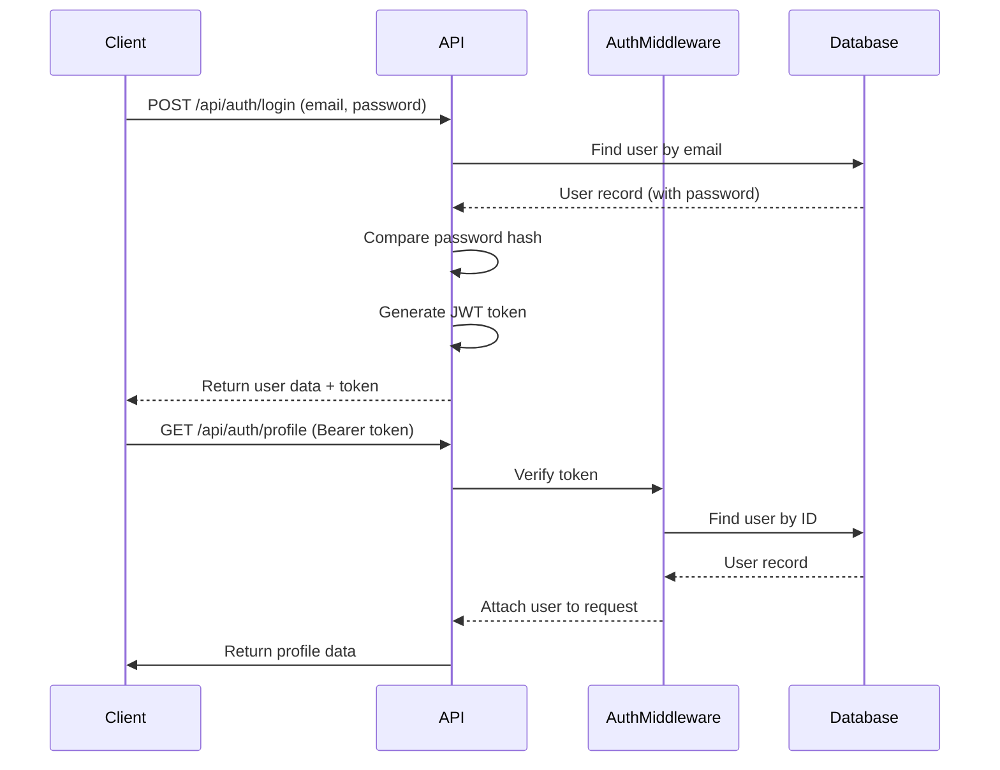

# Authentication API

<cite>
**Referenced Files in This Document**   
- [auth.js](file://HarvestIQ/backend/routes/auth.js)
- [auth.js](file://HarvestIQ/backend/middleware/auth.js)
- [User.js](file://HarvestIQ/backend/models/User.js)
- [api.js](file://HarvestIQ/src/services/api.js)
- [validation.js](file://HarvestIQ/src/utils/validation.js)
</cite>

## Table of Contents
1. [Introduction](#introduction)
2. [Authentication Endpoints](#authentication-endpoints)
   - [POST /api/auth/register](#post-apiauthregister)
   - [POST /api/auth/login](#post-apiauthlogin)
   - [GET /api/auth/profile](#get-apiauthprofile)
   - [PUT /api/auth/profile](#put-apiauthprofile)
   - [PUT /api/auth/change-password](#put-apiauthchange-password)
3. [Error Responses](#error-responses)
4. [Client-Side Usage](#client-side-usage)
5. [Security Considerations](#security-considerations)

## Introduction
The Authentication API provides secure user management functionality for the HarvestIQ application. It handles user registration, login, profile management, and password changes using JWT-based authentication. All private endpoints are protected by middleware that validates JSON Web Tokens to ensure secure access to user data.

**Section sources**
- [auth.js](file://HarvestIQ/backend/routes/auth.js#L1-L303)
- [auth.js](file://HarvestIQ/backend/middleware/auth.js#L1-L93)

## Authentication Endpoints

### POST /api/auth/register
Registers a new user with full name, email, and password. This endpoint performs comprehensive validation and returns a JWT token upon successful registration.

**Request Schema**
```json
{
  "fullName": "string (2-100 characters)",
  "email": "string (valid email format)",
  "password": "string (min 6 characters with uppercase, lowercase, and number)"
}
```

**Validation Rules**
- `fullName`: Must be 2-100 characters long
- `email`: Must be a valid email address format
- `password`: Minimum 6 characters, must contain at least one uppercase letter, one lowercase letter, and one number

**Success Response (201)**
```json
{
  "success": true,
  "message": "User registered successfully",
  "data": {
    "user": {
      "id": "string",
      "fullName": "string",
      "email": "string",
      "role": "string",
      "avatar": "string",
      "preferences": "object",
      "profile": "object",
      "createdAt": "datetime",
      "updatedAt": "datetime",
      "lastLogin": "datetime"
    },
    "token": "string (JWT)"
  }
}
```

**Section sources**
- [auth.js](file://HarvestIQ/backend/routes/auth.js#L38-L94)
- [User.js](file://HarvestIQ/backend/models/User.js#L5-L25)

### POST /api/auth/login
Authenticates a user with email and password, returning a JWT token for subsequent authenticated requests.

**Request Schema**
```json
{
  "email": "string (valid email)",
  "password": "string (required)"
}
```

**Success Response (200)**
```json
{
  "success": true,
  "message": "Login successful",
  "data": {
    "user": "object (public profile)",
    "token": "string (JWT)"
  }
}
```

**Section sources**
- [auth.js](file://HarvestIQ/backend/routes/auth.js#L96-L148)
- [User.js](file://HarvestIQ/backend/models/User.js#L27-L35)

### GET /api/auth/profile
Retrieves the authenticated user's profile information. Requires a valid JWT token in the Authorization header.

**Request Headers**
```
Authorization: Bearer <token>
```

**Success Response (200)**
```json
{
  "success": true,
  "data": {
    "user": "object (public profile)"
  }
}
```

**Section sources**
- [auth.js](file://HarvestIQ/backend/routes/auth.js#L150-L168)
- [middleware/auth.js](file://HarvestIQ/backend/middleware/auth.js#L20-L60)

### PUT /api/auth/profile
Updates the authenticated user's profile information. Only specific fields can be updated.

**Allowed Update Fields**
- `fullName`: User's full name
- `preferences`: User preferences object
- `profile`: User profile information

**Request Schema**
```json
{
  "fullName": "string",
  "preferences": "object",
  "profile": "object"
}
```

**Success Response (200)**
```json
{
  "success": true,
  "message": "Profile updated successfully",
  "data": {
    "user": "object (updated public profile)"
  }
}
```

**Section sources**
- [auth.js](file://HarvestIQ/backend/routes/auth.js#L170-L198)
- [User.js](file://HarvestIQ/backend/models/User.js#L37-L135)

### PUT /api/auth/change-password
Changes the authenticated user's password after verifying the current password.

**Request Schema**
```json
{
  "currentPassword": "string (required)",
  "newPassword": "string (min 6 characters)"
}
```

**Validation Rules**
- `currentPassword`: Required, must match the user's current password
- `newPassword`: Required, minimum 6 characters

**Success Response (200)**
```json
{
  "success": true,
  "message": "Password changed successfully"
}
```

**Section sources**
- [auth.js](file://HarvestIQ/backend/routes/auth.js#L200-L248)
- [User.js](file://HarvestIQ/backend/models/User.js#L140-L155)

## Error Responses
The authentication API returns standardized error responses for various failure scenarios.

**Validation Failure (400)**
```json
{
  "success": false,
  "message": "Validation failed",
  "errors": [
    {
      "msg": "Full name must be between 2 and 100 characters",
      "param": "fullName",
      "location": "body"
    }
  ]
}
```

**Duplicate Email (400)**
```json
{
  "success": false,
  "message": "User with this email already exists"
}
```

**Invalid Credentials (401)**
```json
{
  "success": false,
  "message": "Invalid email or password"
}
```

**Unauthorized Access (401)**
```json
{
  "success": false,
  "message": "Access denied. No token provided."
}
```

**Server Error (500)**
```json
{
  "success": false,
  "message": "Server error during registration"
}
```

**Section sources**
- [auth.js](file://HarvestIQ/backend/routes/auth.js#L45-L94)
- [auth.js](file://HarvestIQ/backend/routes/auth.js#L103-L148)

## Client-Side Usage
The API service provides wrapper functions for easy integration with the frontend application.

```javascript
import { authAPI } from './services/api';

// Register a new user
const registerUser = async () => {
  const result = await authAPI.register({
    fullName: 'John Doe',
    email: 'john@example.com',
    password: 'Password123'
  });
  
  if (result.success) {
    console.log('Registration successful:', result.data);
  } else {
    console.error('Registration failed:', result.error);
  }
};

// Login user
const loginUser = async () => {
  const result = await authAPI.login({
    email: 'john@example.com',
    password: 'Password123'
  });
  
  if (result.success) {
    console.log('Login successful:', result.data);
    // Token is automatically stored in localStorage
  }
};

// Get user profile
const fetchProfile = async () => {
  const result = await authAPI.getProfile();
  
  if (result.success) {
    console.log('Profile:', result.data);
  }
};

// Update profile
const updateProfile = async () => {
  const result = await authAPI.updateProfile({
    fullName: 'John Smith',
    preferences: {
      theme: 'dark',
      language: 'en'
    }
  });
  
  if (result.success) {
    console.log('Profile updated');
  }
};

// Change password
const changePassword = async () => {
  const result = await authAPI.changePassword({
    currentPassword: 'Password123',
    newPassword: 'NewPassword456'
  });
  
  if (result.success) {
    console.log('Password changed successfully');
  }
};
```

**Section sources**
- [api.js](file://HarvestIQ/src/services/api.js#L1-L100)

## Security Considerations
The authentication system implements several security measures to protect user data and prevent common vulnerabilities.

**JWT Authentication Flow**


**Diagram sources**
- [auth.js](file://HarvestIQ/backend/middleware/auth.js#L20-L60)
- [auth.js](file://HarvestIQ/backend/routes/auth.js#L150-L168)

**Security Features**
- Passwords are hashed using bcrypt with salt rounds of 12
- JWT tokens are signed with a secret key and expire after 7 days by default
- Password fields are excluded from default queries (select: false)
- Email addresses are normalized and stored in lowercase
- Comprehensive input validation on all endpoints
- Automatic token removal on client-side logout

**Section sources**
- [User.js](file://HarvestIQ/backend/models/User.js#L30-L35)
- [middleware/auth.js](file://HarvestIQ/backend/middleware/auth.js#L1-L20)
- [User.js](file://HarvestIQ/backend/models/User.js#L137-L155)