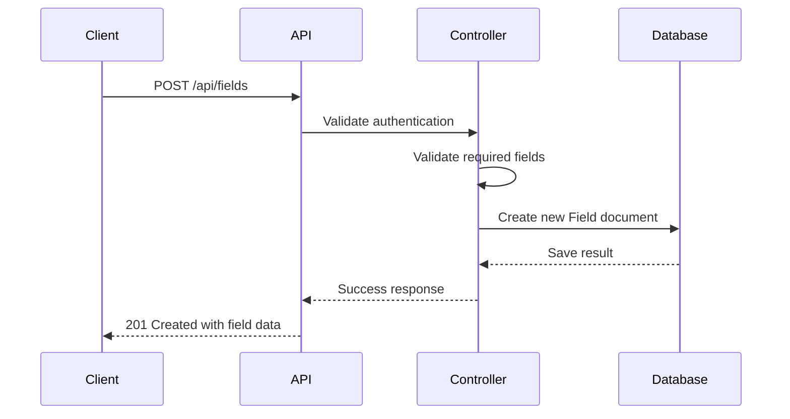
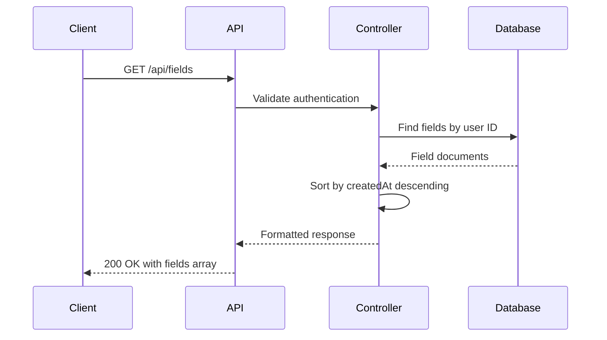
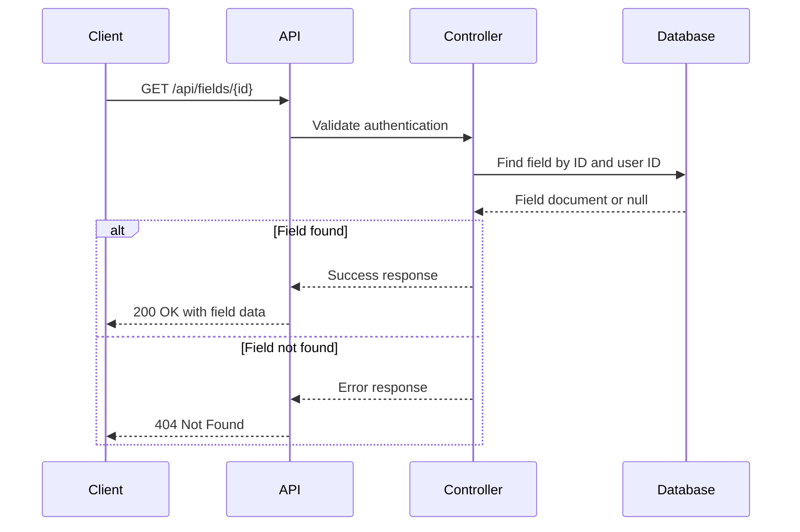
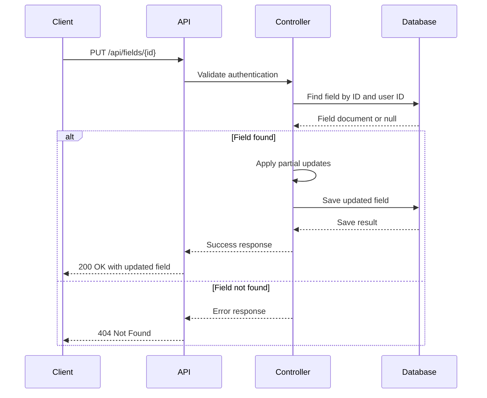
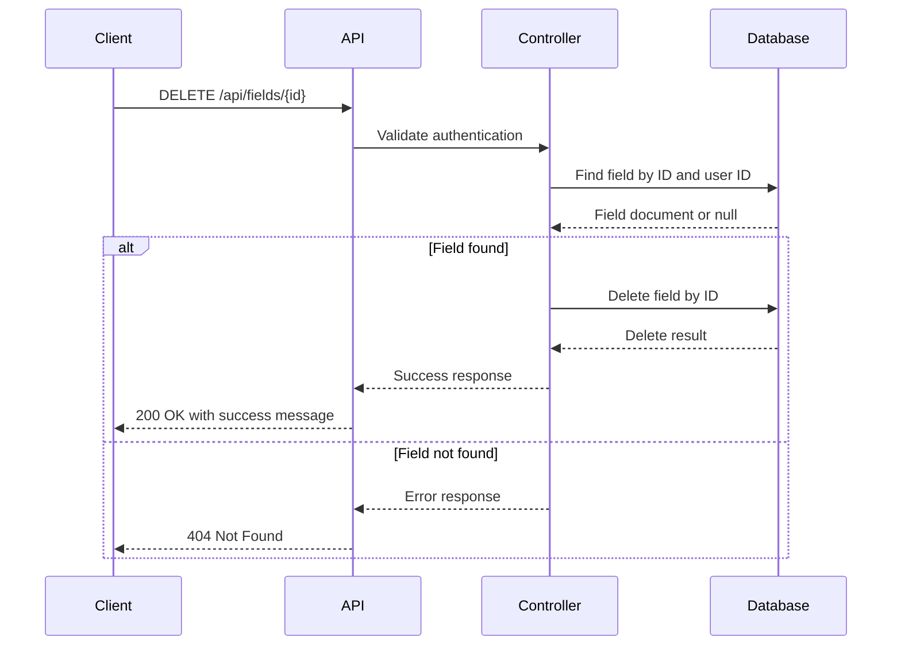
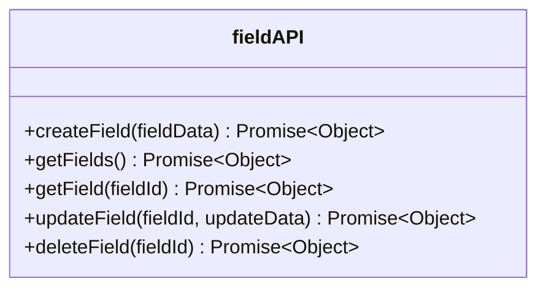

# Fields API

<cite>
**Referenced Files in This Document**   
- [fields.js](file://HarvestIQ/backend/routes/fields.js)
- [api.js](file://HarvestIQ/src/services/api.js)
- [Field.js](file://HarvestIQ/backend/models/Field.js)
- [validation.js](file://HarvestIQ/src/utils/validation.js)
- [dataTransformer.js](file://HarvestIQ/backend/services/dataTransformer.js)
- [Fields.jsx](file://HarvestIQ/src/components/Fields.jsx)
</cite>

## Table of Contents
1. [Introduction](#introduction)
2. [Core Endpoints](#core-endpoints)
3. [Request/Response Schemas](#requestresponse-schemas)
4. [Error Handling](#error-handling)
5. [Coordinate and Soil Data Formats](#coordinate-and-soil-data-formats)
6. [Axios Service Integration](#axios-service-integration)
7. [Validation Rules](#validation-rules)
8. [Ownership and Security](#ownership-and-security)

## Introduction

The Fields API provides comprehensive CRUD operations for managing agricultural fields within the HarvestIQ application. This API enables farmers to create, retrieve, update, and delete field records with detailed agricultural metadata. The system is designed to support precision farming by capturing essential field characteristics including geographic coordinates, soil properties, crop history, and environmental factors.

The API follows RESTful principles with resource-based endpoints and standard HTTP methods. All endpoints require authentication through JWT tokens, ensuring that users can only access their own field data. The system implements robust validation, error handling, and ownership verification to maintain data integrity and security.

**Section sources**
- [fields.js](file://HarvestIQ/backend/routes/fields.js#L1-L250)

## Core Endpoints

### POST /api/fields - Create Field

Creates a new field record with the provided agricultural data. The endpoint validates required fields and associates the field with the authenticated user.



**Diagram sources**
- [fields.js](file://HarvestIQ/backend/routes/fields.js#L15-L65)

### GET /api/fields - Retrieve All Fields

Fetches all field records for the authenticated user, sorted by creation date in descending order (newest first).



**Diagram sources**
- [fields.js](file://HarvestIQ/backend/routes/fields.js#L70-L95)

### GET /api/fields/:id - Retrieve Specific Field

Fetches a single field record by ID with ownership validation to ensure the requesting user owns the field.



**Diagram sources**
- [fields.js](file://HarvestIQ/backend/routes/fields.js#L100-L135)

### PUT /api/fields/:id - Update Field

Updates an existing field record with partial updates, allowing clients to modify specific fields without sending the complete resource.



**Diagram sources**
- [fields.js](file://HarvestIQ/backend/routes/fields.js#L140-L205)

### DELETE /api/fields/:id - Delete Field

Removes a field record after verifying ownership, providing a soft delete mechanism through status management.



**Diagram sources**
- [fields.js](file://HarvestIQ/backend/routes/fields.js#L210-L250)

## Request/Response Schemas

### Field Creation Request (POST)

The request body for creating a new field requires specific agricultural metadata:

```json
{
  "name": "string",
  "coordinates": {
    "latitude": "number",
    "longitude": "number"
  },
  "size": "number",
  "soilType": "string",
  "soilData": {
    "pH": "number",
    "organicCarbon": "number",
    "nutrients": {
      "nitrogen": "number",
      "phosphorus": "number",
      "potassium": "number"
    }
  },
  "description": "string",
  "currentCrop": "string"
}
```

**Section sources**
- [Field.js](file://HarvestIQ/backend/models/Field.js#L10-L250)
- [fields.js](file://HarvestIQ/backend/routes/fields.js#L15-L65)

### Field Response Schema

The API returns field data in a standardized response format with success status and message:

```json
{
  "success": true,
  "data": {
    "_id": "string",
    "userId": "string",
    "name": "string",
    "coordinates": {
      "latitude": "number",
      "longitude": "number"
    },
    "size": "number",
    "soilType": "string",
    "soilData": {
      "pH": "number",
      "organicCarbon": "number",
      "nutrients": {
        "nitrogen": "number",
        "phosphorus": "number",
        "potassium": "number"
      }
    },
    "description": "string",
    "currentCrop": "string",
    "createdAt": "string",
    "updatedAt": "string"
  },
  "message": "string"
}
```

**Section sources**
- [fields.js](file://HarvestIQ/backend/routes/fields.js#L55-L65)
- [Field.js](file://HarvestIQ/backend/models/Field.js#L10-L250)

### Multiple Fields Response (GET /api/fields)

When retrieving all fields, the response includes a count of returned records:

```json
{
  "success": true,
  "data": [
    {
      "_id": "string",
      "name": "string",
      "coordinates": {
        "latitude": "number",
        "longitude": "number"
      },
      "size": "number",
      "soilType": "string",
      "description": "string",
      "currentCrop": "string"
    }
  ],
  "count": "number",
  "message": "string"
}
```

**Section sources**
- [fields.js](file://HarvestIQ/backend/routes/fields.js#L85-L95)

## Error Handling

The Fields API implements comprehensive error handling with appropriate HTTP status codes and descriptive error messages.

### Validation Errors (400 Bad Request)

Returned when required fields are missing or data fails validation:

```json
{
  "success": false,
  "message": "Validation error",
  "errors": [
    "Name, coordinates, and size are required"
  ]
}
```

```json
{
  "success": false,
  "message": "Validation error",
  "errors": [
    "Field name is required",
    "Latitude must be between -90 and 90 degrees",
    "Longitude must be between -180 and 180 degrees"
  ]
}
```

**Section sources**
- [fields.js](file://HarvestIQ/backend/routes/fields.js#L30-L45)
- [validation.js](file://HarvestIQ/src/utils/validation.js#L230-L268)

### Not Found Errors (404 Not Found)

Returned when attempting to access a non-existent field:

```json
{
  "success": false,
  "message": "Field not found"
}
```

**Section sources**
- [fields.js](file://HarvestIQ/backend/routes/fields.js#L115-L125)

### Server Errors (500 Internal Server Error)

Returned when unexpected server-side errors occur:

```json
{
  "success": false,
  "message": "Failed to create field"
}
```

**Section sources**
- [fields.js](file://HarvestIQ/backend/routes/fields.js#L60-L65)

### Invalid ID Errors (400 Bad Request)

Returned when an invalid MongoDB ObjectId format is provided:

```json
{
  "success": false,
  "message": "Invalid field ID"
}
```

**Section sources**
- [fields.js](file://HarvestIQ/backend/routes/fields.js#L130-L135)

## Coordinate and Soil Data Formats

### Coordinate Format

The API expects geographic coordinates in decimal degrees format with proper validation:

```json
{
  "coordinates": {
    "latitude": 28.6139,
    "longitude": 77.2090
  }
}
```

**Validation Rules:**
- Latitude: Must be between -90 and 90 degrees
- Longitude: Must be between -180 and 180 degrees
- Both values must be valid numbers

**Section sources**
- [Field.js](file://HarvestIQ/backend/models/Field.js#L110-L125)
- [validation.js](file://HarvestIQ/src/utils/validation.js#L132-L184)

### Soil Data Structure

The soil data structure captures comprehensive soil health information:

```json
{
  "soilData": {
    "pH": 6.5,
    "organicCarbon": 1.8,
    "electricalConductivity": 0.45,
    "nutrients": {
      "nitrogen": 220,
      "phosphorus": 35,
      "potassium": 180,
      "sulfur": 25
    },
    "micronutrients": {
      "zinc": 5.2,
      "iron": 8.7,
      "manganese": 3.1,
      "copper": 1.8,
      "boron": 0.6
    },
    "lastTested": "2024-01-15T00:00:00.000Z",
    "testingLab": "State Agricultural Lab",
    "soilType": "Loamy",
    "texture": "Sandy Loam"
  }
}
```

**Section sources**
- [Field.js](file://HarvestIQ/backend/models/Field.js#L109-L185)
- [dataTransformer.js](file://HarvestIQ/backend/services/dataTransformer.js#L280-L328)

## Axios Service Integration

The frontend provides a dedicated service for interacting with the Fields API using Axios with proper error handling and response formatting.

### Service Methods



**Diagram sources**
- [api.js](file://HarvestIQ/src/services/api.js#L329-L415)

### Usage Examples

**Creating a Field:**
```javascript
const result = await fieldAPI.createField({
  name: 'North Field',
  coordinates: {
    latitude: 28.6139,
    longitude: 77.2090
  },
  size: 2.5,
  soilType: 'loamy',
  description: 'Main wheat field',
  currentCrop: 'Wheat'
});

if (result.success) {
  console.log('Field created:', result.data);
} else {
  console.error('Error:', result.error, result.errors);
}
```

**Retrieving All Fields:**
```javascript
const result = await fieldAPI.getFields();

if (result.success) {
  console.log('Fields:', result.data);
} else {
  console.error('Error:', result.error);
}
```

**Updating a Field:**
```javascript
const result = await fieldAPI.updateField('field-id-123', {
  size: 3.0,
  currentCrop: 'Rice'
});

if (result.success) {
  console.log('Field updated:', result.data);
}
```

**Deleting a Field:**
```javascript
const result = await fieldAPI.deleteField('field-id-123');

if (result.success) {
  console.log('Field deleted successfully');
} else {
  console.error('Error:', result.error);
}
```

**Section sources**
- [api.js](file://HarvestIQ/src/services/api.js#L329-L415)
- [Fields.jsx](file://HarvestIQ/src/components/Fields.jsx#L150-L250)

## Validation Rules

The system implements comprehensive validation at both frontend and backend levels to ensure data quality.

### Required Fields

The following fields are required for field creation:
- `name`: Field name (string, 1-100 characters)
- `coordinates`: Object containing latitude and longitude
- `size`: Field area in hectares (positive number)

**Section sources**
- [fields.js](file://HarvestIQ/backend/routes/fields.js#L25-L35)
- [validation.js](file://HarvestIQ/src/utils/validation.js#L230-L268)

### Coordinate Validation

Coordinates must meet geographic standards:
- Latitude: -90 to 90 degrees
- Longitude: -180 to 180 degrees
- Both must be valid numbers

**Section sources**
- [validation.js](file://HarvestIQ/src/utils/validation.js#L132-L184)
- [Field.js](file://HarvestIQ/backend/models/Field.js#L110-L125)

### Size Validation

Field size must be a positive number:
- Must be greater than 0
- No upper limit enforced
- Automatically converted to float

**Section sources**
- [validation.js](file://HarvestIQ/src/utils/validation.js#L100-L115)
- [Field.js](file://HarvestIQ/backend/models/Field.js#L140-L150)

### Soil Type Validation

Soil type must be one of the predefined options:
- loamy
- clay
- sandy
- silt
- peaty
- chalky

**Section sources**
- [validation.js](file://HarvestIQ/src/utils/validation.js#L230-L268)
- [Fields.jsx](file://HarvestIQ/src/components/Fields.jsx#L50-L60)

## Ownership and Security

The API implements strict ownership verification to ensure data privacy and security.

### Authentication

All endpoints require JWT authentication through the `protect` middleware, which verifies the user's token and attaches the user object to the request.

**Section sources**
- [fields.js](file://HarvestIQ/backend/routes/fields.js#L10)
- [auth.js](file://HarvestIQ/backend/middleware/auth.js)

### Ownership Verification

Every field operation includes ownership verification by checking that the field's `userId` matches the authenticated user's ID:

```javascript
const field = await Field.findOne({
  _id: req.params.id,
  userId: req.user.id
});
```

This pattern prevents users from accessing or modifying fields they don't own.

**Section sources**
- [fields.js](file://HarvestIQ/backend/routes/fields.js#L110-L115)
- [fields.js](file://HarvestIQ/backend/routes/fields.js#L150-L155)