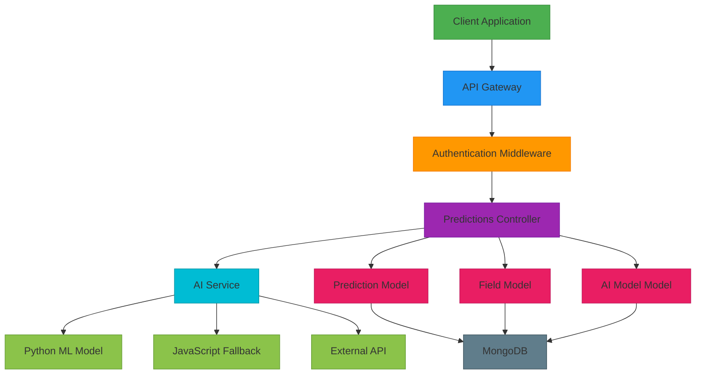
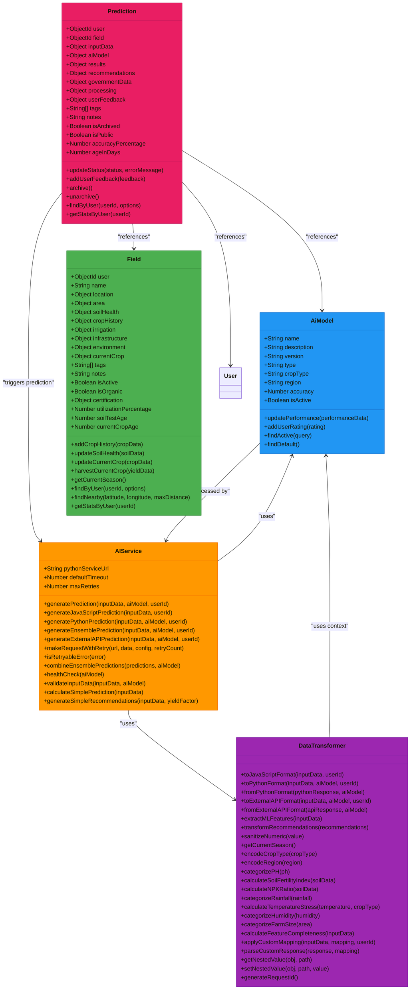

# Predictions API

<cite>
**Referenced Files in This Document**   
- [predictions.js](file://HarvestIQ/backend/routes/predictions.js)
- [Prediction.js](file://HarvestIQ/backend/models/Prediction.js)
- [AiModel.js](file://HarvestIQ/backend/models/AiModel.js)
- [Field.js](file://HarvestIQ/backend/models/Field.js)
- [aiService.js](file://HarvestIQ/backend/services/aiService.js)
- [dataTransformer.js](file://HarvestIQ/backend/services/dataTransformer.js)
</cite>

## Table of Contents
1. [Introduction](#introduction)
2. [Core Endpoints](#core-endpoints)
3. [Request/Response Examples](#requestresponse-examples)
4. [Error Handling](#error-handling)
5. [Architecture Overview](#architecture-overview)
6. [Component Relationships](#component-relationships)

## Introduction
The Predictions API provides a comprehensive interface for managing crop yield predictions within the HarvestIQ platform. This API enables users to create, retrieve, update, and archive predictions while leveraging various AI models for accurate agricultural forecasting. The system integrates user inputs, field data, and AI model capabilities to generate detailed predictions with recommendations.

The API follows RESTful principles with JSON-based requests and responses, ensuring consistency and ease of integration. All endpoints require authentication via JWT tokens, ensuring secure access to user-specific prediction data.

## Core Endpoints

### POST /api/predictions - Create Prediction
Creates a new crop yield prediction using user-provided input data and AI model processing.

**Request Parameters**
```json
{
  "inputData": {
    "cropType": "Wheat",
    "farmArea": 5.5,
    "region": "Punjab",
    "soilData": {
      "phLevel": 6.8,
      "organicContent": 2.3,
      "nitrogen": 180,
      "phosphorus": 25,
      "potassium": 190
    },
    "weatherData": {
      "rainfall": 750,
      "temperature": 24.5,
      "humidity": 65
    },
    "additionalParams": {}
  },
  "aiModel": {
    "modelId": "64a1b2c3d4e5f6a7b8c9d0e1"
  },
  "field": "64a1b2c3d4e5f6a7b8c9d0e2"
}
```

**Validation Rules**
- `cropType` must be one of: Wheat, Rice, Sugarcane, Cotton, Maize, Barley, Mustard, Potato, Onion, Tomato
- `farmArea` must be at least 0.01 hectares
- `region` is required
- Soil pH level must be between 0 and 14
- Rainfall must be a positive number

**Processing Flow**
1. Validate input data against defined schema
2. Verify field ownership if field ID is provided
3. Determine appropriate AI model (specified or default)
4. Create prediction record with initial processing status
5. Generate prediction using AI service
6. Update prediction with results and processing metadata

**Section sources**
- [predictions.js](file://HarvestIQ/backend/routes/predictions.js#L51-L177)
- [Prediction.js](file://HarvestIQ/backend/models/Prediction.js#L4-L9)
- [aiService.js](file://HarvestIQ/backend/services/aiService.js#L15-L482)

### GET /api/predictions - List Predictions
Retrieves a paginated list of user predictions with filtering and sorting capabilities.

**Query Parameters**
| Parameter | Type | Required | Default | Description |
|---------|------|----------|---------|-------------|
| page | integer | No | 1 | Page number for pagination |
| limit | integer | No | 10 | Number of items per page |
| cropType | string | No | - | Filter by crop type |
| region | string | No | - | Filter by region |
| modelType | string | No | - | Filter by AI model type |
| status | string | No | - | Filter by processing status |
| sortBy | string | No | createdAt | Field to sort by |
| sortOrder | string | No | desc | Sort order (asc/desc) |

**Response Structure**
```json
{
  "success": true,
  "data": {
    "predictions": [
      {
        "_id": "64a1b2c3d4e5f6a7b8c9d0e3",
        "user": "64a1b2c3d4e5f6a7b8c9d0e4",
        "field": {
          "name": "North Field",
          "location": {
            "address": "Punjab, India"
          }
        },
        "inputData": {
          "cropType": "Wheat",
          "farmArea": 5.5,
          "region": "Punjab"
        },
        "aiModel": {
          "modelName": "YieldPro",
          "modelVersion": "2.1.0",
          "modelType": "python-ml"
        },
        "results": {
          "expectedYield": 24.75,
          "yieldPerHectare": 4.5,
          "totalYield": 24.75,
          "confidence": 92
        },
        "processing": {
          "status": "completed",
          "processingTime": 1250
        },
        "createdAt": "2023-07-01T10:00:00.000Z",
        "updatedAt": "2023-07-01T10:00:02.000Z"
      }
    ],
    "pagination": {
      "currentPage": 1,
      "totalPages": 3,
      "totalCount": 25,
      "hasNextPage": true,
      "hasPrevPage": false
    }
  }
}
```

**Section sources**
- [predictions.js](file://HarvestIQ/backend/routes/predictions.js#L182-L258)
- [Prediction.js](file://HarvestIQ/backend/models/Prediction.js#L200-L250)

### GET /api/predictions/:id - Get Single Prediction
Retrieves detailed information about a specific prediction, including populated field and AI model data.

**Response Includes**
- Complete prediction data with input parameters
- Populated field information (name, location)
- AI model details (name, version, type, description)
- Prediction results and confidence score
- Recommendations and government data integration
- Processing metadata and user feedback

**Section sources**
- [predictions.js](file://HarvestIQ/backend/routes/predictions.js#L263-L291)
- [Prediction.js](file://HarvestIQ/backend/models/Prediction.js#L300-L350)

### PUT /api/predictions/:id - Update Prediction
Updates metadata for an existing prediction, including notes, tags, and user feedback.

**Request Body**
```json
{
  "notes": "Updated analysis based on recent soil test results",
  "tags": ["wheat", "high-yield", "irrigation-needed"],
  "userFeedback": {
    "rating": 4,
    "accuracy": "high",
    "comments": "Prediction was accurate within 5%",
    "actualYield": 23.5
  }
}
```

**Update Logic**
- Modifies only allowed fields (notes, tags, userFeedback)
- Merges user feedback with existing data
- Updates AI model rating when user provides rating
- Persists changes to database with updated timestamps

**Section sources**
- [predictions.js](file://HarvestIQ/backend/routes/predictions.js#L296-L342)
- [Prediction.js](file://HarvestIQ/backend/models/Prediction.js#L350-L400)

### DELETE /api/predictions/:id - Archive Prediction
Archives a prediction instead of permanent deletion, maintaining data integrity while removing it from active views.

**Behavior**
- Sets `isArchived` flag to true
- Removes prediction from standard queries
- Preserves data for historical analysis
- Returns success confirmation

**Section sources**
- [predictions.js](file://HarvestIQ/backend/routes/predictions.js#L347-L375)
- [Prediction.js](file://HarvestIQ/backend/models/Prediction.js#L400-L450)

### GET /api/predictions/stats - Prediction Statistics
Provides statistical overview of user's prediction history.

**Response Data**
```json
{
  "success": true,
  "data": {
    "summary": {
      "totalPredictions": 45,
      "averageConfidence": 87.6,
      "averageYield": 18.4,
      "cropTypes": ["Wheat", "Rice", "Sugarcane"],
      "latestPrediction": "2023-07-15T08:30:00.000Z"
    },
    "distributions": {
      "cropTypeDistribution": ["Wheat", "Wheat", "Rice"],
      "regionDistribution": ["Punjab", "Haryana", "Punjab"],
      "modelTypeDistribution": ["python-ml", "python-ml", "javascript"],
      "monthlyPredictions": [
        {"month": 6, "year": 2023},
        {"month": 7, "year": 2023}
      ]
    }
  }
}
```

**Section sources**
- [predictions.js](file://HarvestIQ/backend/routes/predictions.js#L380-L434)
- [Prediction.js](file://HarvestIQ/backend/models/Prediction.js#L250-L300)

### GET /api/predictions/models - Available AI Models
Retrieves list of active AI models available for predictions.

**Query Parameters**
- `crop`: Filter models by crop type
- `region`: Filter models by region

**Response Structure**
```json
{
  "success": true,
  "data": {
    "models": [
      {
        "_id": "64a1b2c3d4e5f6a7b8c9d0e1",
        "name": "YieldPro",
        "description": "Advanced ML model for crop yield prediction",
        "version": "2.1.0",
        "type": "python-ml",
        "cropType": "Wheat",
        "region": "Punjab",
        "accuracy": 94.5,
        "isActive": true,
        "createdAt": "2023-01-15T09:00:00.000Z",
        "updatedAt": "2023-06-01T14:30:00.000Z"
      }
    ]
  }
}
```

**Section sources**
- [predictions.js](file://HarvestIQ/backend/routes/predictions.js#L439-L457)
- [AiModel.js](file://HarvestIQ/backend/models/AiModel.js#L1-L53)

## Request/Response Examples

### Create Prediction - Success Response
```json
{
  "success": true,
  "message": "Prediction created successfully",
  "data": {
    "prediction": {
      "_id": "64a1b2c3d4e5f6a7b8c9d0e3",
      "user": "64a1b2c3d4e5f6a7b8c9d0e4",
      "field": {
        "name": "North Field",
        "location": {
          "address": "Punjab, India"
        }
      },
      "inputData": {
        "cropType": "Wheat",
        "farmArea": 5.5,
        "region": "Punjab",
        "soilData": {
          "phLevel": 6.8,
          "organicContent": 2.3,
          "nitrogen": 180,
          "phosphorus": 25,
          "potassium": 190
        },
        "weatherData": {
          "rainfall": 750,
          "temperature": 24.5,
          "humidity": 65
        }
      },
      "aiModel": {
        "modelId": "64a1b2c3d4e5f6a7b8c9d0e1",
        "modelName": "YieldPro",
        "modelVersion": "2.1.0",
        "modelType": "python-ml"
      },
      "results": {
        "expectedYield": 24.75,
        "yieldPerHectare": 4.5,
        "totalYield": 24.75,
        "confidence": 92,
        "factors": {
          "weather": "user-input",
          "soil": "user-input",
          "yieldFactor": 1.1
        }
      },
      "recommendations": [
        {
          "type": "irrigation",
          "priority": "high",
          "title": "Optimize Irrigation Schedule",
          "description": "Current irrigation pattern can be improved for better water efficiency",
          "action": "Implement drip irrigation system",
          "estimatedImpact": 15
        }
      ],
      "governmentData": {
        "weather": {
          "historicalAvg": 720,
          "currentYear": 750
        },
        "market": {
          "currentPrice": 2100,
          "trend": "increasing"
        }
      },
      "processing": {
        "status": "completed",
        "processingTime": 1250
      },
      "createdAt": "2023-07-01T10:00:00.000Z",
      "updatedAt": "2023-07-01T10:00:02.000Z"
    }
  }
}
```

### List Predictions - Paginated Response
```json
{
  "success": true,
  "data": {
    "predictions": [
      {
        "_id": "64a1b2c3d4e5f6a7b8c9d0e3",
        "inputData": {
          "cropType": "Wheat",
          "farmArea": 5.5,
          "region": "Punjab"
        },
        "aiModel": {
          "modelName": "YieldPro",
          "modelVersion": "2.1.0",
          "modelType": "python-ml"
        },
        "results": {
          "expectedYield": 24.75,
          "confidence": 92
        },
        "processing": {
          "status": "completed"
        },
        "createdAt": "2023-07-01T10:00:00.000Z"
      },
      {
        "_id": "64a1b2c3d4e5f6a7b8c9d0e5",
        "inputData": {
          "cropType": "Rice",
          "farmArea": 3.2,
          "region": "Haryana"
        },
        "aiModel": {
          "modelName": "RiceYieldAI",
          "modelVersion": "1.5.0",
          "modelType": "ensemble"
        },
        "results": {
          "expectedYield": 18.24,
          "confidence": 88
        },
        "processing": {
          "status": "completed"
        },
        "createdAt": "2023-06-28T14:30:00.000Z"
      }
    ],
    "pagination": {
      "currentPage": 1,
      "totalPages": 3,
      "totalCount": 25,
      "hasNextPage": true,
      "hasPrevPage": false
    }
  }
}
```

### Update Prediction - Success Response
```json
{
  "success": true,
  "message": "Prediction updated successfully",
  "data": {
    "prediction": {
      "_id": "64a1b2c3d4e5f6a7b8c9d0e3",
      "notes": "Updated analysis based on recent soil test results",
      "tags": ["wheat", "high-yield", "irrigation-needed"],
      "userFeedback": {
        "rating": 4,
        "accuracy": "high",
        "comments": "Prediction was accurate within 5%",
        "actualYield": 23.5
      },
      "updatedAt": "2023-07-02T16:45:00.000Z"
    }
  }
}
```

## Error Handling

### Validation Errors (400)
```json
{
  "success": false,
  "message": "Validation failed",
  "errors": [
    {
      "type": "field",
      "msg": "Invalid crop type",
      "path": "inputData.cropType",
      "location": "body"
    },
    {
      "type": "field",
      "msg": "Farm area must be at least 0.01 hectares",
      "path": "inputData.farmArea",
      "location": "body"
    }
  ]
}
```

### Not Found Errors (404)
```json
{
  "success": false,
  "message": "Prediction not found"
}
```

### Authentication Errors (401)
```json
{
  "success": false,
  "message": "Access denied. No token provided."
}
```

### Authorization Errors (403)
```json
{
  "success": false,
  "message": "Field not found or access denied"
}
```

### Server Errors (500)
```json
{
  "success": false,
  "message": "Failed to generate prediction",
  "error": "Internal server error"
}
```

**Section sources**
- [predictions.js](file://HarvestIQ/backend/routes/predictions.js#L51-L457)
- [Prediction.js](file://HarvestIQ/backend/models/Prediction.js#L1-L388)

## Architecture Overview



**Diagram sources**
- [predictions.js](file://HarvestIQ/backend/routes/predictions.js#L1-L468)
- [aiService.js](file://HarvestIQ/backend/services/aiService.js#L1-L482)
- [Prediction.js](file://HarvestIQ/backend/models/Prediction.js#L1-L388)

## Component Relationships



**Diagram sources**
- [Prediction.js](file://HarvestIQ/backend/models/Prediction.js#L1-L388)
- [AiModel.js](file://HarvestIQ/backend/models/AiModel.js#L1-L53)
- [Field.js](file://HarvestIQ/backend/models/Field.js#L1-L543)
- [aiService.js](file://HarvestIQ/backend/services/aiService.js#L1-L482)
- [dataTransformer.js](file://HarvestIQ/backend/services/dataTransformer.js#L1-L473)