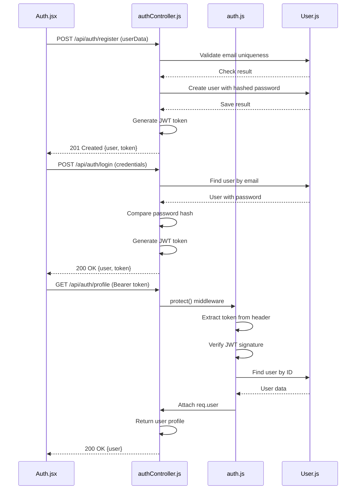
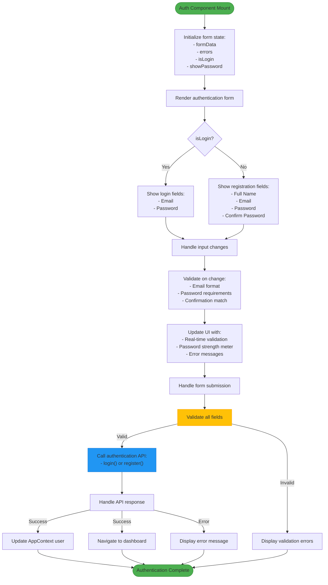
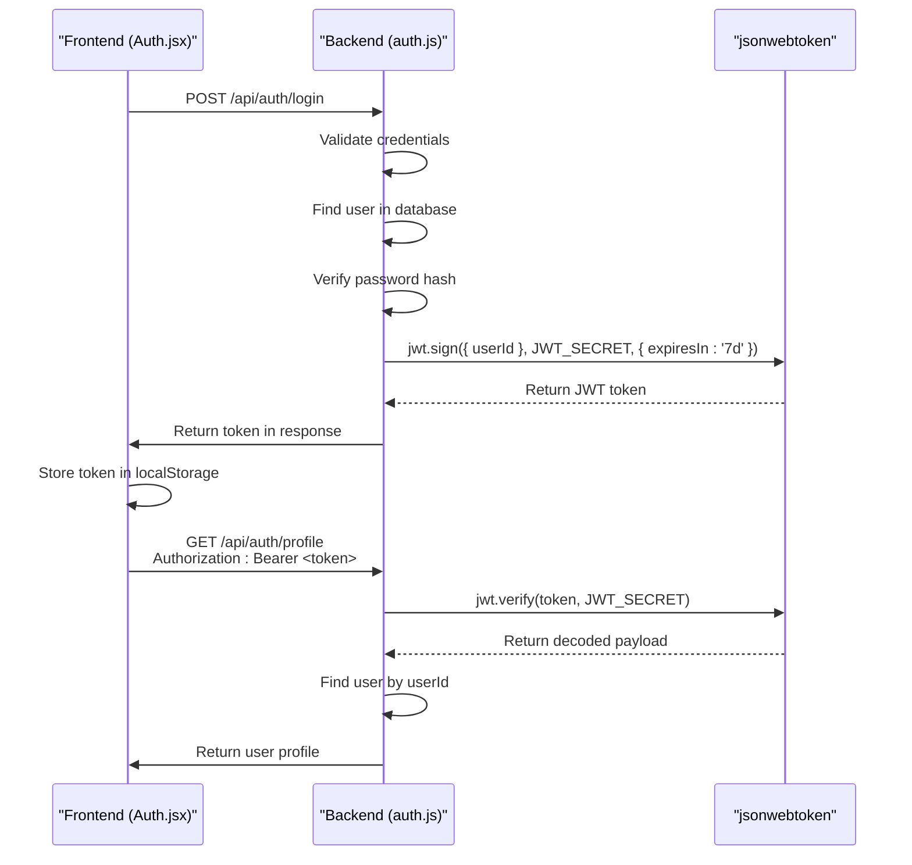

# Authentication System

<cite>
**Referenced Files in This Document**  
- [auth.js](file://HarvestIQ/backend/middleware/auth.js)
- [auth.js](file://HarvestIQ/backend/routes/auth.js)
- [User.js](file://HarvestIQ/backend/models/User.js)
- [Auth.jsx](file://HarvestIQ/src/components/Auth.jsx)
- [AppContext.jsx](file://HarvestIQ/src/context/AppContext.jsx)
- [AUTHENTICATION_SETUP.md](file://HarvestIQ/AUTHENTICATION_SETUP.md)
</cite>

## Table of Contents
1. [Introduction](#introduction)
2. [Authentication Flow](#authentication-flow)
3. [Backend Implementation](#backend-implementation)
4. [Frontend Implementation](#frontend-implementation)
5. [Security Features](#security-features)
6. [Token Management](#token-management)
7. [Password Handling](#password-handling)
8. [Environment Configuration](#environment-configuration)
9. [Error Handling](#error-handling)
10. [Best Practices](#best-practices)

## Introduction

The HarvestIQ authentication system implements a secure JWT-based authentication mechanism that protects user data and ensures only authorized access to application resources. The system follows modern security practices with password hashing, token-based sessions, and comprehensive validation at both frontend and backend levels.

The authentication architecture spans both client and server components, with React frontend components handling user interface interactions and a Node.js/Express backend managing authentication logic, user data persistence, and security enforcement. User data is stored in MongoDB Atlas with proper indexing and security measures.

**Section sources**
- [AUTHENTICATION_SETUP.md](file://HarvestIQ/AUTHENTICATION_SETUP.md#L1-L105)

## Authentication Flow

The authentication system in HarvestIQ follows a standard JWT-based flow from user registration through login to protected resource access. The process is designed to be secure, user-friendly, and resilient against common attack vectors.

The complete authentication workflow consists of three main phases: registration, login, and protected resource access. During registration, users provide their full name, email, and password, which undergoes comprehensive validation before being securely stored. The login process verifies user credentials and issues a JWT token upon successful authentication. For protected routes, the system validates the JWT token and attaches user data to the request object for downstream processing.



**Diagram sources**
- [auth.js](file://HarvestIQ/backend/middleware/auth.js#L1-L92)
- [auth.js](file://HarvestIQ/backend/routes/auth.js#L40-L178)
- [User.js](file://HarvestIQ/backend/models/User.js#L1-L165)

**Section sources**
- [auth.js](file://HarvestIQ/backend/middleware/auth.js#L1-L92)
- [auth.js](file://HarvestIQ/backend/routes/auth.js#L1-L302)
- [User.js](file://HarvestIQ/backend/models/User.js#L1-L165)

## Backend Implementation

The backend authentication implementation is structured across multiple files following the MVC pattern, with clear separation of concerns between routes, controllers, middleware, and models. The system uses Express.js for routing, JWT for token generation and verification, and Mongoose for MongoDB interactions.

The authentication routes are defined in `auth.js` within the routes directory, exposing endpoints for user registration, login, profile retrieval, profile updates, password changes, and logout. Each route is protected by appropriate validation middleware that ensures data integrity before processing. The route handlers delegate business logic to controller functions while leveraging middleware for authentication enforcement.

```mermaid
classDiagram
class AuthController {
+register(req, res)
+login(req, res)
+getProfile(req, res)
+updateProfile(req, res)
+changePassword(req, res)
+logout(req, res)
}
class AuthMiddleware {
+protect(req, res, next)
+restrictTo(...roles)
+checkOwnership(resourceField)
+generateToken(userId)
+verifyToken(token)
}
class UserModel {
+fullName : String
+email : String
+password : String
+role : String
+isActive : Boolean
+lastLogin : Date
+preferences : Object
+profile : Object
+comparePassword(candidatePassword)
+getPublicProfile()
+updateLastLogin()
+findByEmail(email)
+findByEmailWithPassword(email)
}
class AuthRoutes {
+POST /register
+POST /login
+GET /profile
+PUT /profile
+PUT /change-password
+POST /logout
}
AuthRoutes --> AuthController : "delegates to"
AuthController --> UserModel : "uses"
AuthMiddleware --> UserModel : "finds user"
AuthMiddleware --> "jsonwebtoken" : "signs/verifies"
UserModel --> "bcryptjs" : "hashes passwords"
```

**Diagram sources**
- [auth.js](file://HarvestIQ/backend/routes/auth.js#L1-L302)
- [auth.js](file://HarvestIQ/backend/middleware/auth.js#L1-L92)
- [User.js](file://HarvestIQ/backend/models/User.js#L1-L165)

**Section sources**
- [auth.js](file://HarvestIQ/backend/routes/auth.js#L1-L302)
- [auth.js](file://HarvestIQ/backend/middleware/auth.js#L1-L92)
- [User.js](file://HarvestIQ/backend/models/User.js#L1-L165)

## Frontend Implementation

The frontend authentication implementation centers around the `Auth.jsx` component, which provides a unified interface for both registration and login operations. The component leverages React's state management to handle form data, validation errors, and submission states, while integrating with the application context for authentication operations.

The `Auth.jsx` component implements comprehensive client-side validation with real-time feedback, including password strength assessment that checks for minimum length, uppercase and lowercase letters, numbers, and special characters. The UI provides visual indicators for password requirements and strength, enhancing user experience while maintaining security standards. Form state is managed through React's useState hook, with individual input handlers that update the form data object and clear associated errors.



**Diagram sources**
- [Auth.jsx](file://HarvestIQ/src/components/Auth.jsx#L1-L440)
- [AppContext.jsx](file://HarvestIQ/src/context/AppContext.jsx#L90-L133)

**Section sources**
- [Auth.jsx](file://HarvestIQ/src/components/Auth.jsx#L1-L440)
- [AppContext.jsx](file://HarvestIQ/src/context/AppContext.jsx#L90-L133)

## Security Features

The HarvestIQ authentication system implements multiple layers of security to protect against common vulnerabilities and ensure the integrity of user data. These security measures span both client and server sides, creating a comprehensive defense-in-depth strategy.

On the server side, the system employs bcrypt with 12 salt rounds for password hashing, ensuring that even if the database is compromised, passwords remain protected. Input validation is performed using express-validator middleware, which sanitizes and validates all incoming data to prevent injection attacks. Rate limiting is implemented to protect against brute force attacks, with a limit of 100 requests per 15 minutes per IP address.

```mermaid
graph TD
A[Security Features] --> B[Password Security]
A --> C[Token Security]
A --> D[Input Validation]
A --> E[Rate Limiting]
A --> F[Data Protection]
B --> B1[bcrypt hashing]
B --> B2[12 salt rounds]
B --> B3[Minimum 6 characters]
B --> B4[Must contain uppercase]
B --> B5[Must contain lowercase]
B --> B6[Must contain number]
C --> C1[JWT tokens]
C --> C2[7-day expiration]
C --> C3[Secure signature]
C --> C4[Bearer authentication]
C --> C5[Token verification]
D --> D1[Email format validation]
D --> D2[Input sanitization]
D --> D3[Schema validation]
D --> D4[Error masking]
D --> D5[Content security policies]
E --> E1[100 requests/15 min]
E --> E2[IP-based tracking]
E --> E3[Brute force protection]
E --> E4[Account lockout]
F --> F1[HTTPS enforcement]
F --> F2[MongoDB injection protection]
F --> F3[Data encryption at rest]
F --> F4[Secure headers]
F --> F5[Session management]
style A fill:#FF9800,stroke:#F57C00
style B fill:#4CAF50,stroke:#388E3C
style C fill:#4CAF50,stroke:#388E3C
style D fill:#4CAF50,stroke:#388E3C
style E fill:#4CAF50,stroke:#388E3C
style F fill:#4CAF50,stroke:#388E3C
```



**Diagram sources**
- [AUTHENTICATION_SETUP.md](file://HarvestIQ/AUTHENTICATION_SETUP.md#L50-L100)
- [auth.js](file://HarvestIQ/backend/middleware/auth.js#L1-L92)
- [User.js](file://HarvestIQ/backend/models/User.js#L1-L165)

**Section sources**
- [AUTHENTICATION_SETUP.md](file://HarvestIQ/AUTHENTICATION_SETUP.md#L50-L100)
- [auth.js](file://HarvestIQ/backend/middleware/auth.js#L1-L92)
- [User.js](file://HarvestIQ/backend/models/User.js#L1-L165)

## Token Management

The token management system in HarvestIQ utilizes JSON Web Tokens (JWT) for stateless authentication, allowing the server to verify user identity without maintaining session state. The JWT implementation follows industry best practices with appropriate expiration times, secure signing, and proper error handling.

Tokens are generated using the `generateToken` function in the authentication middleware, which creates a signed JWT containing the user ID as the payload. The token is signed using a secret key stored in environment variables, with a default expiration of 7 days. This expiration can be configured through the `JWT_EXPIRE` environment variable, allowing for flexible token lifetime management based on security requirements.



**Diagram sources**
- [auth.js](file://HarvestIQ/backend/middleware/auth.js#L1-L92)
- [auth.js](file://HarvestIQ/backend/routes/auth.js#L1-L302)

**Section sources**
- [auth.js](file://HarvestIQ/backend/middleware/auth.js#L1-L92)
- [auth.js](file://HarvestIQ/backend/routes/auth.js#L1-L302)

## Password Handling

The password handling system in HarvestIQ implements robust security measures to protect user credentials throughout their lifecycle. Passwords are never stored in plain text, and multiple validation rules ensure that users create strong, secure passwords.

When a user registers or changes their password, the system applies comprehensive validation rules requiring a minimum of 6 characters with at least one uppercase letter, one lowercase letter, and one number. These requirements are enforced both on the client side through real-time validation in the `Auth.jsx` component and on the server side through route validation middleware.

```mermaid
flowchart TD
A[Password Handling] --> B[Client-Side Validation]
A --> C[Server-Side Validation]
A --> D[Password Hashing]
A --> E[Storage]
B --> B1[Minimum 6 characters]
B --> B2[Contains uppercase]
B --> B3[Contains lowercase]
B --> B4[Contains number]
B --> B5[Real-time feedback]
B --> B6[Strength meter]
C --> C1[express-validator]
C --> C2[Length check]
C --> C3[Pattern matching]
C --> C4[Sanitization]
C --> C5[Error responses]
D --> D1[bcryptjs library]
D --> D2[12 salt rounds]
D --> D3[Pre-save hook]
D --> D4[Hash comparison]
E --> E1[MongoDB Atlas]
E --> E2[password field select: false]
E --> E3[No password in queries]
E --> E4[Secure connection]
style A fill:#9C27B0,stroke:#7B1FA2
style B fill:#2196F3,stroke:#1976D2
style C fill:#2196F3,stroke:#1976D2
style D fill:#2196F3,stroke:#1976D2
style E fill:#2196F3,stroke:#1976D2
```



**Diagram sources**
- [User.js](file://HarvestIQ/backend/models/User.js#L1-L165)
- [Auth.jsx](file://HarvestIQ/src/components/Auth.jsx#L1-L440)
- [auth.js](file://HarvestIQ/backend/routes/auth.js#L1-L302)

**Section sources**
- [User.js](file://HarvestIQ/backend/models/User.js#L1-L165)
- [Auth.jsx](file://HarvestIQ/src/components/Auth.jsx#L1-L440)

## Environment Configuration

The authentication system relies on environment variables for secure configuration of sensitive parameters such as the JWT secret key. These environment variables are accessed through `process.env` and provide a secure way to manage configuration without hardcoding sensitive information in the source code.

The primary environment variable used by the authentication system is `JWT_SECRET`, which serves as the cryptographic key for signing and verifying JWT tokens. This secret should be a long, random string that is kept confidential and not shared or committed to version control. The system also uses `JWT_EXPIRE` to configure token expiration time, defaulting to '7d' (7 days) if not specified.

**Section sources**
- [auth.js](file://HarvestIQ/backend/middleware/auth.js#L1-L92)
- [AUTHENTICATION_SETUP.md](file://HarvestIQ/AUTHENTICATION_SETUP.md#L1-L105)

## Error Handling

The authentication system implements comprehensive error handling at both frontend and backend levels to provide meaningful feedback to users while maintaining security. Error messages are carefully crafted to avoid revealing sensitive information that could be exploited by attackers.

On the backend, authentication endpoints return structured JSON responses with success flags, descriptive messages, and error details when appropriate. Validation errors include specific information about which fields failed validation, while authentication errors provide generic messages to prevent account enumeration attacks. Server errors are masked in production to avoid exposing system details.

```mermaid
flowchart TD
A[Error Handling] --> B[Client-Side Errors]
A --> C[Server-Side Errors]
A --> D[Validation Errors]
A --> E[Security Errors]
B --> B1[Form validation]
B --> B2[Network errors]
B --> B3[Loading states]
B --> B4[User feedback]
C --> C1[Structured JSON responses]
C --> C2[Success flag]
C --> C3[Descriptive messages]
C --> C4[Error masking]
D --> D1[Field-specific errors]
D --> D2[Real-time validation]
D --> D3[Password requirements]
D --> D4[Email format]
E --> E1[Generic auth errors]
E --> E2[No account enumeration]
E --> E3[Rate limiting]
E --> E4[Brute force protection]
style A fill:#F44336,stroke:#D32F2F
style B fill:#4CAF50,stroke:#388E3C
style C fill:#4CAF50,stroke:#388E3C
style D fill:#4CAF50,stroke:#388E3C
style E fill:#4CAF50,stroke:#388E3C
```



**Diagram sources**
- [auth.js](file://HarvestIQ/backend/middleware/auth.js#L1-L92)
- [auth.js](file://HarvestIQ/backend/routes/auth.js#L1-L302)
- [Auth.jsx](file://HarvestIQ/src/components/Auth.jsx#L1-L440)

**Section sources**
- [auth.js](file://HarvestIQ/backend/middleware/auth.js#L1-L92)
- [auth.js](file://HarvestIQ/backend/routes/auth.js#L1-L302)
- [Auth.jsx](file://HarvestIQ/src/components/Auth.jsx#L1-L440)

## Best Practices

The HarvestIQ authentication system follows industry best practices for secure authentication implementation. These practices ensure that the system is resilient against common attack vectors while providing a good user experience.

Key security practices implemented include using bcrypt with 12 salt rounds for password hashing, implementing JWT with appropriate expiration times, validating all inputs on both client and server sides, and protecting against brute force attacks through rate limiting. The system also follows the principle of least privilege by only including necessary user data in tokens and API responses.

Additional best practices include using environment variables for sensitive configuration, implementing proper error handling that doesn't leak system information, and using secure connections to the database. The frontend implementation provides real-time feedback on password strength while maintaining security requirements, striking a balance between usability and security.

**Section sources**
- [AUTHENTICATION_SETUP.md](file://HarvestIQ/AUTHENTICATION_SETUP.md#L1-L105)
- [auth.js](file://HarvestIQ/backend/middleware/auth.js#L1-L92)
- [User.js](file://HarvestIQ/backend/models/User.js#L1-L165)