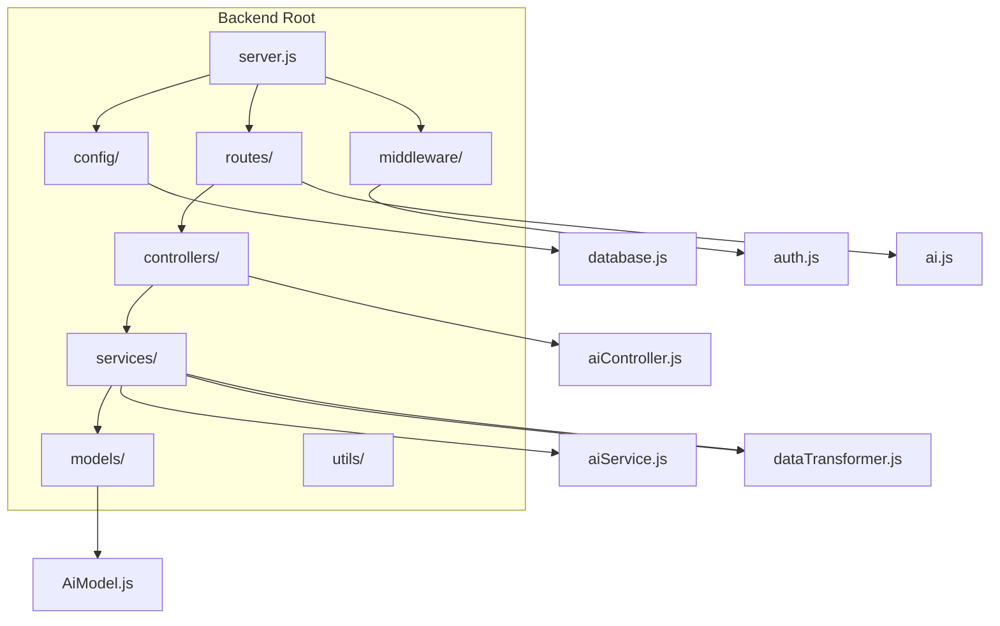
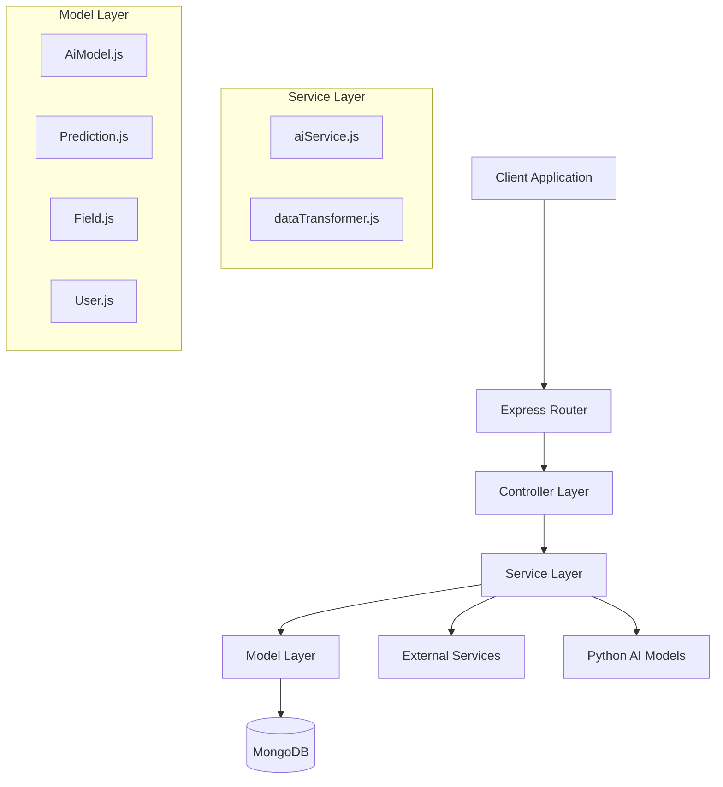
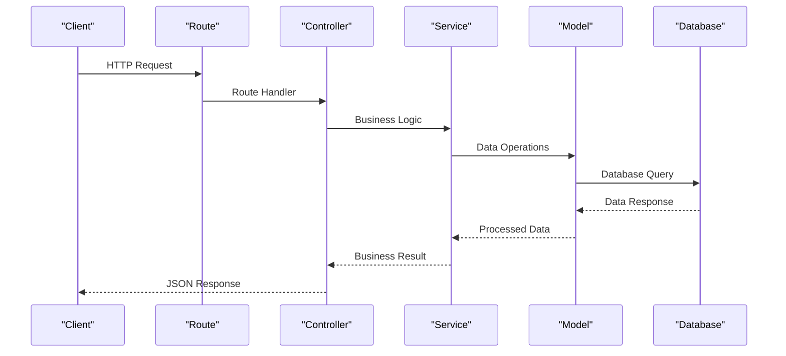
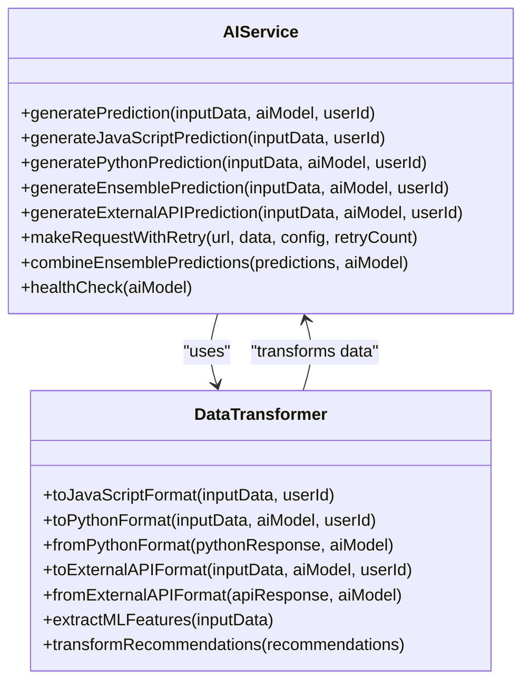
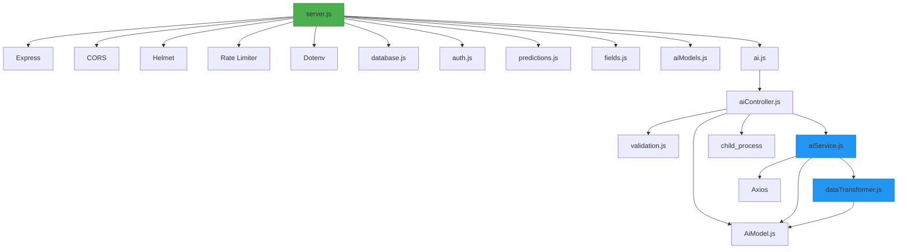

# Backend Architecture

<cite>
**Referenced Files in This Document**   
- [server.js](file://HarvestIQ/backend/server.js)
- [database.js](file://HarvestIQ/backend/config/database.js)
- [auth.js](file://HarvestIQ/backend/middleware/auth.js)
- [ai.js](file://HarvestIQ/backend/routes/ai.js)
- [aiController.js](file://HarvestIQ/backend/controllers/aiController.js)
- [aiService.js](file://HarvestIQ/backend/services/aiService.js)
- [dataTransformer.js](file://HarvestIQ/backend/services/dataTransformer.js)
- [AiModel.js](file://HarvestIQ/backend/models/AiModel.js)
</cite>

## Table of Contents
1. [Introduction](#introduction)
2. [Project Structure](#project-structure)
3. [Core Components](#core-components)
4. [Architecture Overview](#architecture-overview)
5. [Detailed Component Analysis](#detailed-component-analysis)
6. [Dependency Analysis](#dependency-analysis)
7. [Performance Considerations](#performance-considerations)
8. [Troubleshooting Guide](#troubleshooting-guide)
9. [Conclusion](#conclusion)

## Introduction
The HarvestIQ backend is a Node.js application built with Express.js, following a structured MVC-like architecture. It provides a RESTful API for agricultural prediction services, integrating AI models for crop yield forecasting. The system separates concerns through distinct layers: routes, controllers, services, and models, enabling maintainability and scalability. The backend connects to MongoDB via Mongoose ODM and orchestrates communication between JavaScript and Python-based AI models.

## Project Structure

**Diagram sources**
- [server.js](file://HarvestIQ/backend/server.js#L1-L152)
- [database.js](file://HarvestIQ/backend/config/database.js#L1-L52)

**Section sources**
- [server.js](file://HarvestIQ/backend/server.js#L1-L152)
- [database.js](file://HarvestIQ/backend/config/database.js#L1-L52)

## Core Components

The HarvestIQ backend implements a clean separation of concerns through its layered architecture. The **routes** define API endpoints, **controllers** handle request processing, **services** encapsulate business logic, and **models** manage data persistence. This structure enables independent development and testing of components while maintaining a clear request flow from HTTP interface to database interaction.

**Section sources**
- [server.js](file://HarvestIQ/backend/server.js#L1-L152)
- [aiController.js](file://HarvestIQ/backend/controllers/aiController.js#L1-L186)
- [aiService.js](file://HarvestIQ/backend/services/aiService.js#L1-L481)

## Architecture Overview

**Diagram sources**
- [server.js](file://HarvestIQ/backend/server.js#L1-L152)
- [aiController.js](file://HarvestIQ/backend/controllers/aiController.js#L1-L186)
- [aiService.js](file://HarvestIQ/backend/services/aiService.js#L1-L481)
- [AiModel.js](file://HarvestIQ/backend/models/AiModel.js#L1-L52)

## Detailed Component Analysis

### Request Flow Analysis

The request flow in HarvestIQ follows a standardized path from route to database:

**Diagram sources**
- [ai.js](file://HarvestIQ/backend/routes/ai.js#L1-L12)
- [aiController.js](file://HarvestIQ/backend/controllers/aiController.js#L1-L186)
- [aiService.js](file://HarvestIQ/backend/services/aiService.js#L1-L481)

**Section sources**
- [ai.js](file://HarvestIQ/backend/routes/ai.js#L1-L12)
- [aiController.js](file://HarvestIQ/backend/controllers/aiController.js#L1-L186)

### Service Layer Pattern

The service layer encapsulates complex business logic, particularly for AI prediction workflows:

**Diagram sources**
- [aiService.js](file://HarvestIQ/backend/services/aiService.js#L1-L481)
- [dataTransformer.js](file://HarvestIQ/backend/services/dataTransformer.js#L1-L472)

**Section sources**
- [aiService.js](file://HarvestIQ/backend/services/aiService.js#L1-L481)
- [dataTransformer.js](file://HarvestIQ/backend/services/dataTransformer.js#L1-L472)

## Dependency Analysis

**Diagram sources**
- [server.js](file://HarvestIQ/backend/server.js#L1-L152)
- [aiController.js](file://HarvestIQ/backend/controllers/aiController.js#L1-L186)
- [aiService.js](file://HarvestIQ/backend/services/aiService.js#L1-L481)
- [dataTransformer.js](file://HarvestIQ/backend/services/dataTransformer.js#L1-L472)

**Section sources**
- [server.js](file://HarvestIQ/backend/server.js#L1-L152)
- [package.json](file://HarvestIQ/backend/package.json)

## Performance Considerations

The HarvestIQ backend incorporates several performance and reliability features. The AI service implements retry logic with exponential backoff for external service calls, ensuring resilience against transient failures. Rate limiting protects against abuse, while connection pooling is implicitly handled by Mongoose. The data transformer optimizes data format conversion between different AI model requirements, reducing processing overhead. For Python model integration, child processes are spawned efficiently, with proper error handling and resource management.

## Troubleshooting Guide

The system includes comprehensive error handling at multiple levels. The global error handler in server.js catches unhandled exceptions and provides appropriate HTTP status codes based on error types (validation, cast, duplicate key, JWT errors). The AI service includes detailed logging and fallback mechanisms, automatically switching to JavaScript prediction if Python models fail. Database connection events are monitored, and graceful shutdown procedures ensure clean termination. Health check endpoints allow monitoring of both the main server and AI service availability.

**Section sources**
- [server.js](file://HarvestIQ/backend/server.js#L1-L152)
- [database.js](file://HarvestIQ/backend/config/database.js#L1-L52)
- [aiService.js](file://HarvestIQ/backend/services/aiService.js#L1-L481)

## Conclusion

The HarvestIQ backend demonstrates a well-structured Express.js application with clear separation of concerns. Its MVC-like architecture facilitates maintainability and scalability, while the service layer pattern effectively encapsulates complex AI integration logic. The system robustly handles both JavaScript and Python-based AI models, with sophisticated data transformation and error recovery mechanisms. Security is addressed through Helmet, CORS, and JWT-based authentication, while performance is optimized through rate limiting and efficient request processing. This architecture provides a solid foundation for an agricultural intelligence platform with room for future expansion.