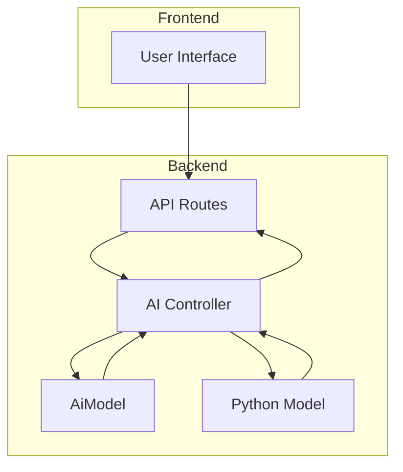
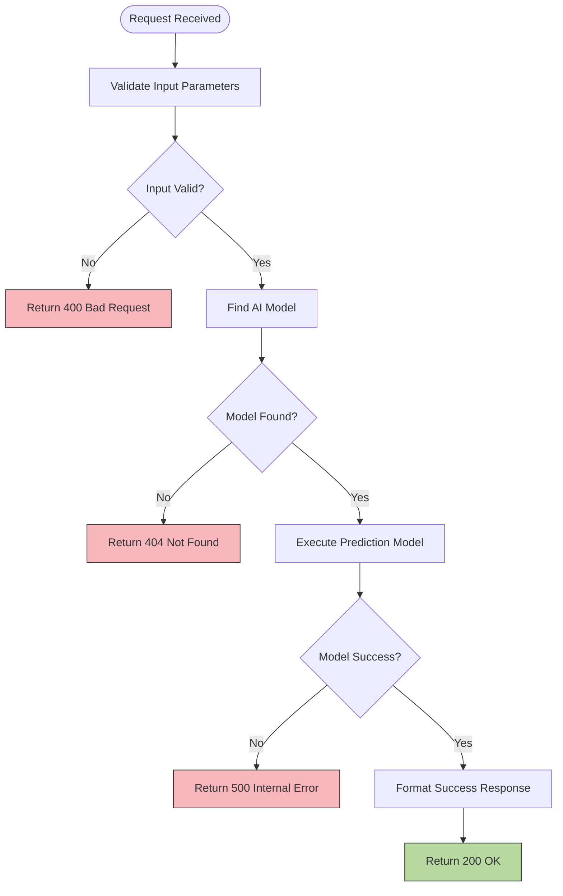
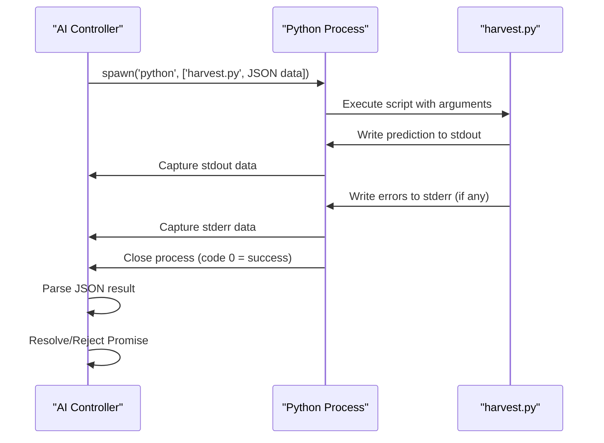
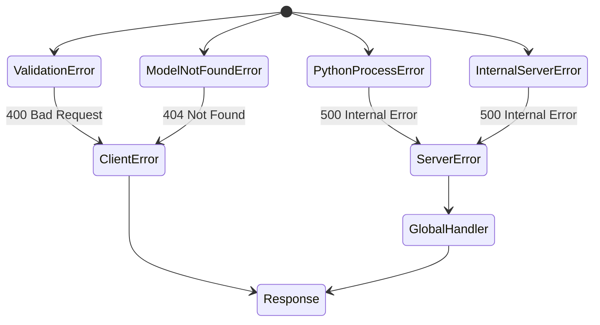
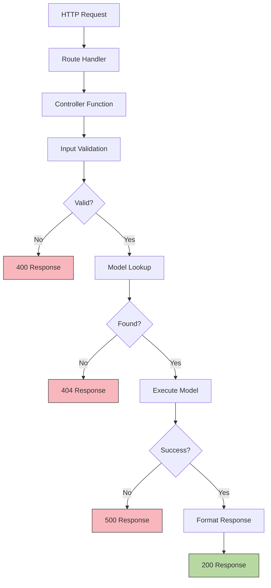

# Controller Logic

<cite>
**Referenced Files in This Document**   
- [aiController.js](file://HarvestIQ/backend/controllers/aiController.js)
- [validation.js](file://HarvestIQ/backend/utils/validation.js)
- [AiModel.js](file://HarvestIQ/backend/models/AiModel.js)
- [harvest.py](file://HarvestIQ/Py model/harvest.py)
- [ai.js](file://HarvestIQ/backend/routes/ai.js)
</cite>

## Table of Contents
1. [Introduction](#introduction)
2. [Controller Layer Architecture](#controller-layer-architecture)
3. [Core Controller Functions](#core-controller-functions)
4. [Input Validation Process](#input-validation-process)
5. [AI Model Selection Logic](#ai-model-selection-logic)
6. [Python Model Integration](#python-model-integration)
7. [Error Handling Patterns](#error-handling-patterns)
8. [Request Flow Analysis](#request-flow-analysis)
9. [Conclusion](#conclusion)

## Introduction

The controller layer in HarvestIQ's backend serves as the critical intermediary between HTTP routes and business logic services. This document provides a comprehensive analysis of the `aiController.js` file, which handles AI-powered agricultural predictions. The controller implements three primary functions: retrieving available AI models, executing legacy yield predictions, and processing the main prediction workflow. It demonstrates robust patterns for input validation, external process integration, and error propagation within an Express.js application.

## Controller Layer Architecture

The controller layer follows a clean separation of concerns, acting as the orchestrator between incoming HTTP requests and underlying data processing logic. In HarvestIQ's architecture, controllers are responsible for request parsing, input validation, service coordination, and response formatting. The `aiController.js` file specifically manages AI-related operations, interfacing with both the database (via Mongoose models) and external Python machine learning models.

**Diagram sources**  
- [aiController.js](file://HarvestIQ/backend/controllers/aiController.js#L1-L186)
- [ai.js](file://HarvestIQ/backend/routes/ai.js#L1-L13)

**Section sources**
- [aiController.js](file://HarvestIQ/backend/controllers/aiController.js#L1-L186)
- [ai.js](file://HarvestIQ/backend/routes/ai.js#L1-L13)

## Core Controller Functions

The `aiController.js` file exports three main functions that handle different aspects of AI-powered agricultural predictions.

### getAvailableModels Function

The `getAvailableModels` function retrieves all active AI models from the database. This endpoint is used by the frontend to populate model selection interfaces and inform users about available prediction capabilities.

**Section sources**
- [aiController.js](file://HarvestIQ/backend/controllers/aiController.js#L44-L54)

### predictYield Function

The `predictYield` function implements a legacy yield prediction workflow with stricter model filtering criteria. It specifically looks for Python-based machine learning models (`python-ml`) and returns predictions with a default confidence score.

**Section sources**
- [aiController.js](file://HarvestIQ/backend/controllers/aiController.js#L56-L104)

### runPrediction Function

The `runPrediction` function serves as the primary prediction handler, supporting multiple model types. It validates input, finds appropriate models, executes predictions through either Python or JavaScript engines, and formats the response with comprehensive model metadata.

**Section sources**
- [aiController.js](file://HarvestIQ/backend/controllers/aiController.js#L106-L186)

## Input Validation Process

The controller implements a robust input validation system using Joi schema validation through the `validatePredictionInput` utility function.

### Validation Schema

The validation schema defined in `validation.js` enforces strict constraints on agricultural parameters including farm area, rainfall, soil pH, nutrient levels, and crop characteristics. Each field has specific minimum and maximum values that reflect realistic agricultural conditions.

**Diagram sources**  
- [aiController.js](file://HarvestIQ/backend/controllers/aiController.js#L70-L75)
- [validation.js](file://HarvestIQ/backend/utils/validation.js#L3-L20)

**Section sources**
- [validation.js](file://HarvestIQ/backend/utils/validation.js#L3-L20)
- [aiController.js](file://HarvestIQ/backend/controllers/aiController.js#L70-L75)

## AI Model Selection Logic

The controller implements intelligent model selection based on crop type, region, and activation status. The `AiModel` schema defines key attributes that enable this filtering capability.

### Model Schema Attributes

| Attribute | Type | Required | Description |
|---------|------|----------|-------------|
| name | String | Yes | Unique model identifier |
| version | String | Yes | Semantic versioning |
| type | String | Yes | Model implementation type |
| cropType | String | Yes | Supported crop category |
| region | String | No | Geographic region |
| isActive | Boolean | No | Model availability status |

**Section sources**
- [AiModel.js](file://HarvestIQ/backend/models/AiModel.js#L1-L53)

### Model Selection Workflow

The controller follows a two-step model selection process:
1. Query the database for active models matching the specified crop and region
2. Verify model availability before proceeding with prediction execution

This ensures that only valid, active models are used for predictions, maintaining system reliability and accuracy.

**Section sources**
- [aiController.js](file://HarvestIQ/backend/controllers/aiController.js#L82-L89)
- [aiController.js](file://HarvestIQ/backend/controllers/aiController.js#L120-L127)

## Python Model Integration

The controller integrates with external Python machine learning models through Node.js child processes, enabling the use of specialized ML libraries like XGBoost and scikit-learn.

### runPythonModel Function

The `runPythonModel` function creates a promise-based interface for executing Python scripts. It spawns a child process running `harvest.py`, passes input data as a JSON string argument, and captures both stdout and stderr output streams.

**Diagram sources**  
- [aiController.js](file://HarvestIQ/backend/controllers/aiController.js#L11-L42)
- [harvest.py](file://HarvestIQ/Py model/harvest.py#L1-L129)

**Section sources**
- [aiController.js](file://HarvestIQ/backend/controllers/aiController.js#L11-L42)

### Data Flow Between Systems

The integration follows a secure data exchange pattern:
1. JavaScript controller stringifies input data
2. Node.js passes data as command-line argument to Python
3. Python script parses JSON input and executes prediction
4. Python writes JSON-formatted results to stdout
5. Node.js captures output and parses it back to JavaScript objects

This approach avoids complex inter-process communication libraries while maintaining data integrity.

**Section sources**
- [aiController.js](file://HarvestIQ/backend/controllers/aiController.js#L14-L16)
- [harvest.py](file://HarvestIQ/Py model/harvest.py#L1-L129)

## Error Handling Patterns

The controller implements a comprehensive error handling strategy that distinguishes between client errors, server errors, and external process failures.

### Error Classification

**Diagram sources**  
- [aiController.js](file://HarvestIQ/backend/controllers/aiController.js#L76-L79)
- [aiController.js](file://HarvestIQ/backend/controllers/aiController.js#L90-L93)
- [aiController.js](file://HarvestIQ/backend/controllers/aiController.js#L134-L137)

### Error Propagation

The controller uses Express's `next()` function to propagate unhandled exceptions to the global error handler middleware. This ensures consistent error formatting and logging across the application. Validation errors are handled locally with specific 400 responses, while model lookup failures return 404 status codes.

**Section sources**
- [aiController.js](file://HarvestIQ/backend/controllers/aiController.js#L53-L54)
- [aiController.js](file://HarvestIQ/backend/controllers/aiController.js#L103-L104)
- [aiController.js](file://HarvestIQ/backend/controllers/aiController.js#L185-L186)

## Request Flow Analysis

The complete request flow for AI predictions follows a structured path from route to response.

### Request Processing Pipeline

**Diagram sources**  
- [ai.js](file://HarvestIQ/backend/routes/ai.js#L1-L13)
- [aiController.js](file://HarvestIQ/backend/controllers/aiController.js#L106-L186)

### Function Call Sequence

The typical execution sequence for a prediction request:
1. Route handler in `ai.js` receives POST request
2. `runPrediction` controller function is invoked
3. `validatePredictionInput` validates request body
4. `AiModel.findOne` queries database for appropriate model
5. `runPythonModel` executes external Python script
6. Controller formats and sends JSON response

**Section sources**
- [ai.js](file://HarvestIQ/backend/routes/ai.js#L7-L8)
- [aiController.js](file://HarvestIQ/backend/controllers/aiController.js#L106-L186)

## Conclusion

The `aiController.js` file exemplifies well-structured controller design in a Node.js/Express application. It effectively manages the complexity of AI-powered agricultural predictions by implementing clear separation of concerns, robust input validation, intelligent model selection, and reliable external process integration. The controller's error handling strategy ensures that both client and server errors are properly categorized and reported. By leveraging both JavaScript and Python ecosystems, it provides a flexible foundation for agricultural data science applications while maintaining the performance and scalability benefits of Node.js for web serving.