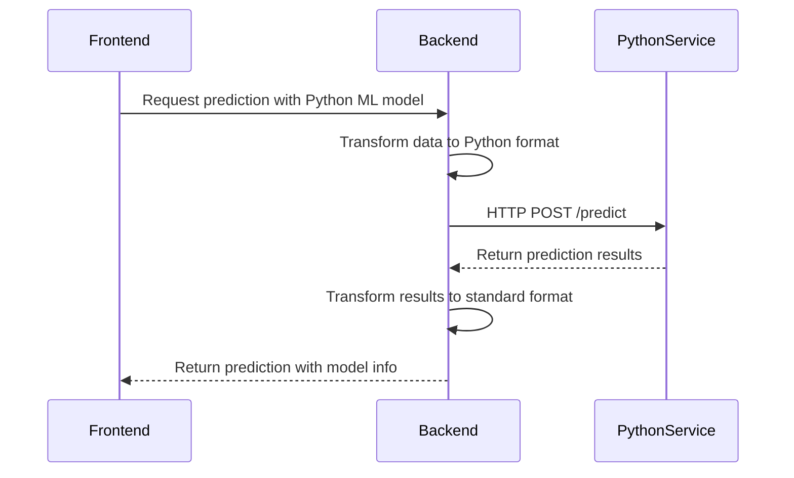
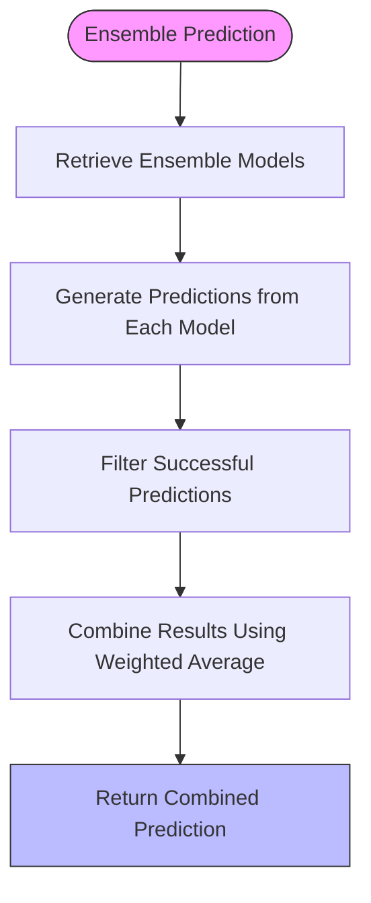
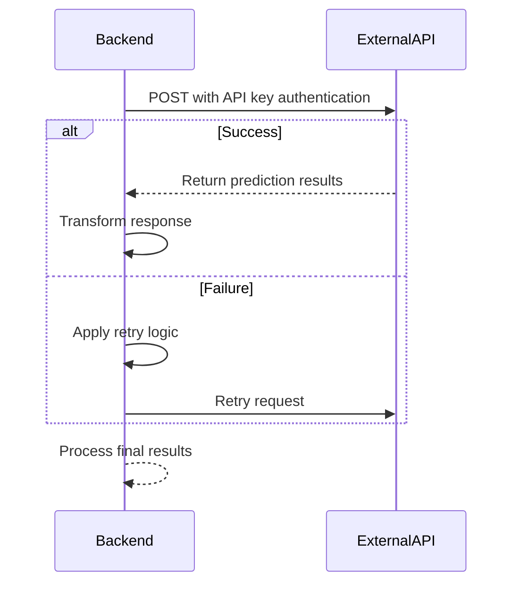
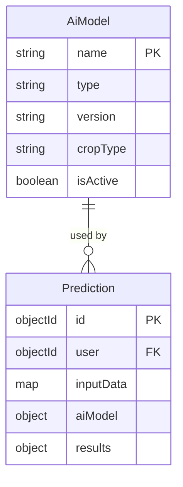
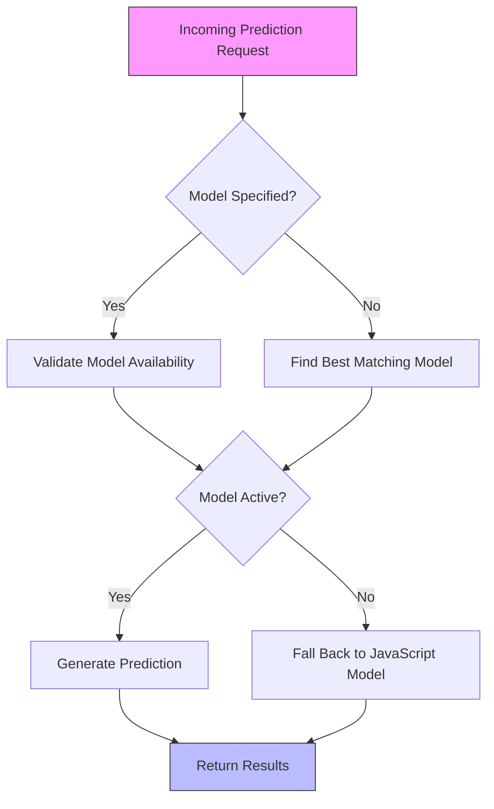

# AI Model

<cite>
**Referenced Files in This Document**   
- [AiModel.js](file://HarvestIQ/backend/models/AiModel.js)
- [Prediction.js](file://HarvestIQ/backend/models/Prediction.js)
- [aiService.js](file://HarvestIQ/backend/services/aiService.js)
- [aiController.js](file://HarvestIQ/backend/controllers/aiController.js)
</cite>

## Table of Contents
1. [Introduction](#introduction)
2. [Core Schema Fields](#core-schema-fields)
3. [Validation Rules](#validation-rules)
4. [Model Type Handling](#model-type-handling)
5. [Relationship with Prediction](#relationship-with-prediction)
6. [Default Values](#default-values)
7. [Sample Configurations](#sample-configurations)
8. [Dynamic AI Orchestration](#dynamic-ai-orchestration)
9. [Extensibility and Future Support](#extensibility-and-future-support)

## Introduction
The AiModel model in HarvestIQ's backend serves as the central configuration entity for managing various AI models used in crop yield prediction. It enables flexible AI strategy management by supporting multiple model types including Python ML models, ensemble models, and external APIs. The model is designed to support dynamic orchestration of prediction capabilities, allowing the system to adapt to different crops, regions, and performance requirements.

**Section sources**
- [AiModel.js](file://HarvestIQ/backend/models/AiModel.js#L1-L53)

## Core Schema Fields
The AiModel schema defines several key fields that determine how AI models are configured and utilized:

- **name**: String field representing the unique name of the model, required and indexed for efficient lookup
- **type**: String field specifying the model type with allowed values 'javascript', 'python-ml', 'python-dl', and 'ensemble'
- **description**: Optional string field with a maximum length of 500 characters
- **version**: String field indicating the model version, required with a default value of '1.0.0'
- **cropType**: Required string field specifying the crop type the model is designed for, with predefined enum values
- **region**: String field indicating the geographical region the model applies to, with a default value of 'all'
- **accuracy**: Numeric field representing model accuracy as a percentage between 0 and 100
- **isActive**: Boolean field indicating whether the model is currently active

**Section sources**
- [AiModel.js](file://HarvestIQ/backend/models/AiModel.js#L1-L53)

## Validation Rules
The AiModel schema implements strict validation rules to ensure data integrity:

- **Required fields**: name, version, type, and cropType are all required fields with appropriate error messages
- **Type validation**: The type field is restricted to specific values through an enum constraint: 'javascript', 'python-ml', 'python-dl', and 'ensemble'
- **Crop type validation**: The cropType field is restricted to specific agricultural crops including Wheat, Rice, Sugarcane, Cotton, Maize, Barley, Mustard, Potato, Onion, and Tomato
- **Accuracy constraints**: The accuracy field is constrained to values between 0 and 100 inclusive
- **Uniqueness**: Model names must be unique across the system
- **String length**: The description field cannot exceed 500 characters

**Section sources**
- [AiModel.js](file://HarvestIQ/backend/models/AiModel.js#L1-L53)

## Model Type Handling
The system handles different model types through specialized processing logic in the AIService class:

### Python ML Models
Python ML models are executed through external Python processes. The system spawns a Python subprocess that runs the harvest.py script with input data. The aiService routes requests to Python models through the generatePythonPrediction method, which transforms input data and communicates with the Python AI service.



**Diagram sources**
- [aiService.js](file://HarvestIQ/backend/services/aiService.js#L100-L150)
- [aiController.js](file://HarvestIQ/backend/controllers/aiController.js#L1-L100)

### Ensemble Models
Ensemble models combine predictions from multiple individual models using weighted averaging. The generateEnsemblePrediction method in AIService retrieves all models in the ensemble, generates predictions from each, and combines them according to specified weighting strategies. The configuration supports custom weights or defaults to equal weighting.



**Diagram sources**
- [aiService.js](file://HarvestIQ/backend/services/aiService.js#L150-L200)

### External APIs
External API models are integrated through HTTP requests to third-party services. The generateExternalAPIPrediction method handles authentication, request formatting, and response transformation. The system supports API key authentication and custom headers, with retry logic for handling transient failures.



**Diagram sources**
- [aiService.js](file://HarvestIQ/backend/services/aiService.js#L200-L250)

**Section sources**
- [aiService.js](file://HarvestIQ/backend/services/aiService.js#L50-L300)

## Relationship with Prediction
The AiModel has a critical relationship with the Prediction model, which tracks which model was used for each prediction:

- **Model Reference**: The Prediction model contains an aiModel object that stores the modelId, modelName, modelVersion, and modelType used for that specific prediction
- **Historical Tracking**: This relationship enables tracking of model performance over time and comparison of results across different models
- **Flexible Strategy Management**: Users can select specific models for predictions, or the system can automatically select the most appropriate model based on crop type and region
- **Performance Analysis**: The system can analyze prediction accuracy and other metrics by model, enabling data-driven decisions about model effectiveness



**Diagram sources**
- [AiModel.js](file://HarvestIQ/backend/models/AiModel.js#L1-L53)
- [Prediction.js](file://HarvestIQ/backend/models/Prediction.js#L1-L100)

**Section sources**
- [Prediction.js](file://HarvestIQ/backend/models/Prediction.js#L1-L100)
- [aiService.js](file://HarvestIQ/backend/services/aiService.js#L50-L100)

## Default Values
The AiModel schema includes several default values to simplify configuration:

- **isActive**: Defaults to true, meaning new models are active upon creation
- **version**: Defaults to '1.0.0' if not specified
- **type**: Defaults to 'javascript' if not specified
- **region**: Defaults to 'all' if not specified
- **description**: Defaults to an empty string

These defaults ensure that models can be created with minimal configuration while still maintaining system stability and predictable behavior.

**Section sources**
- [AiModel.js](file://HarvestIQ/backend/models/AiModel.js#L1-L53)

## Sample Configurations
### Python ML Model
```json
{
  "name": "WheatYieldPredictor",
  "type": "python-ml",
  "version": "2.1.0",
  "cropType": "Wheat",
  "region": "Punjab",
  "isActive": true,
  "configuration": {
    "serviceUrl": "http://localhost:8000",
    "requirements": {
      "timeout": 30000
    }
  }
}
```

### Ensemble Model
```json
{
  "name": "AdvancedCottonPredictor",
  "type": "ensemble",
  "version": "1.5.0",
  "cropType": "Cotton",
  "region": "all",
  "isActive": true,
  "configuration": {
    "ensembleModels": [
      "model-abc123",
      "model-def456",
      "model-ghi789"
    ],
    "ensembleWeights": [0.4, 0.3, 0.3]
  }
}
```

### External API Model
```json
{
  "name": "WeatherIntegratedPredictor",
  "type": "external-api",
  "version": "1.2.0",
  "cropType": "Rice",
  "region": "all",
  "isActive": true,
  "configuration": {
    "serviceUrl": "https://api.weatherai.com/predict",
    "apiKey": "env:WEATHER_API_KEY",
    "headers": {
      "X-Client-ID": "harvestiq-prod"
    }
  }
}
```

**Section sources**
- [AiModel.js](file://HarvestIQ/backend/models/AiModel.js#L1-L53)
- [aiService.js](file://HarvestIQ/backend/services/aiService.js#L50-L300)

## Dynamic AI Orchestration
The AiModel system enables dynamic AI orchestration through several key mechanisms:

- **Runtime Model Selection**: The AIService can dynamically select the most appropriate model based on input parameters such as crop type and region
- **Fallback Mechanisms**: If a primary model fails, the system can automatically fall back to alternative models, ensuring prediction availability
- **Performance-Based Routing**: The system can route requests to models based on historical performance metrics
- **A/B Testing Support**: Multiple models can be configured for the same crop type, enabling comparison of different AI strategies
- **Load Balancing**: Ensemble models can distribute prediction load across multiple models

This orchestration capability allows HarvestIQ to maintain high prediction availability and accuracy while continuously improving its AI capabilities.



**Diagram sources**
- [aiService.js](file://HarvestIQ/backend/services/aiService.js#L1-L100)

**Section sources**
- [aiService.js](file://HarvestIQ/backend/services/aiService.js#L1-L100)

## Extensibility and Future Support
The AiModel architecture is designed for extensibility to support future prediction capabilities:

- **Plugin Architecture**: The type field and corresponding handling in AIService make it easy to add new model types
- **Configuration Flexibility**: The configuration object can accommodate type-specific parameters without schema changes
- **Backward Compatibility**: Default values and fallback mechanisms ensure new models don't disrupt existing functionality
- **Monitoring and Health Checks**: The healthCheck method provides a standard interface for monitoring model availability
- **Performance Tracking**: The system can collect and analyze performance metrics across different model types

This extensible design allows HarvestIQ to incorporate new AI technologies as they become available, ensuring the platform remains at the forefront of agricultural prediction technology.

**Section sources**
- [aiService.js](file://HarvestIQ/backend/services/aiService.js#L300-L482)
- [AiModel.js](file://HarvestIQ/backend/models/AiModel.js#L1-L53)