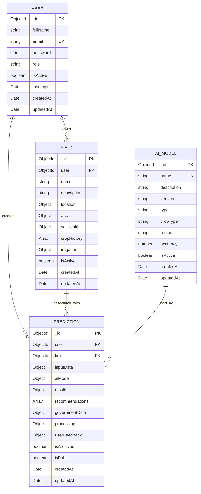
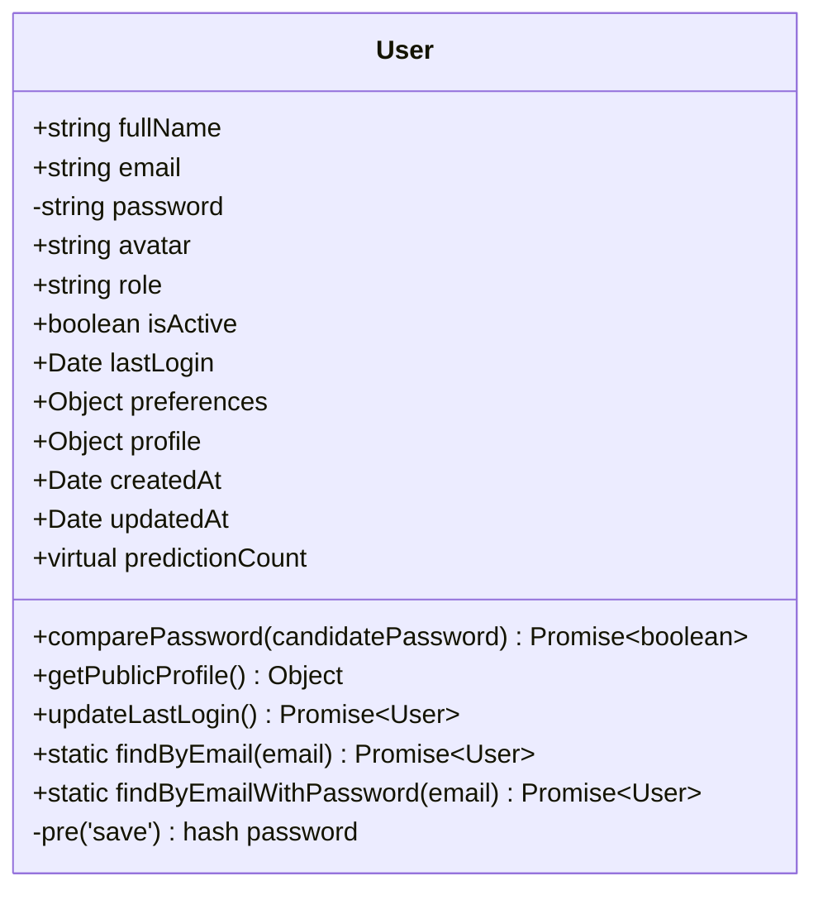
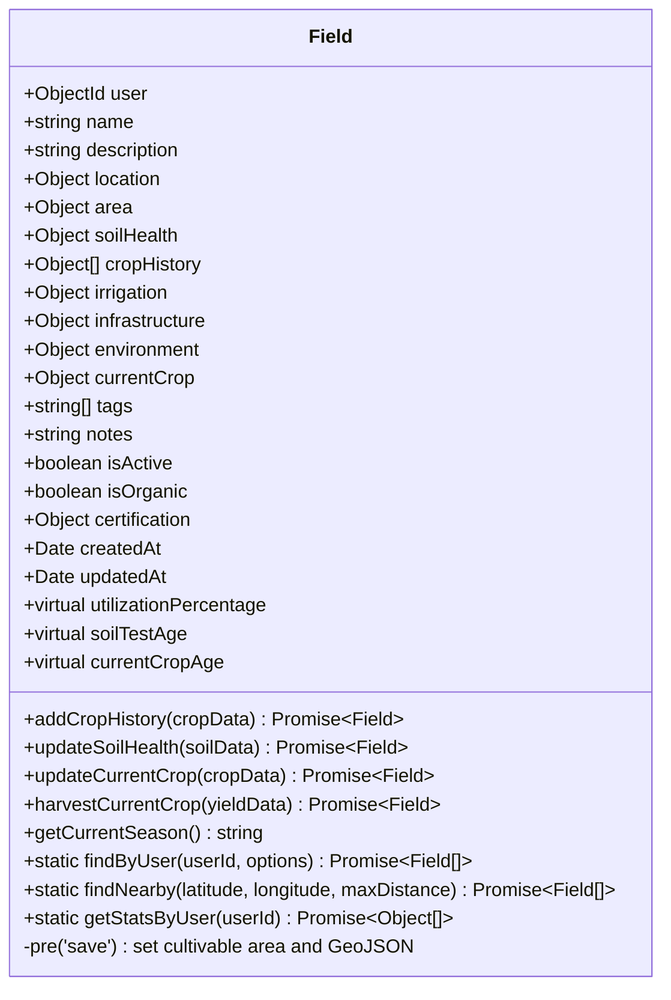
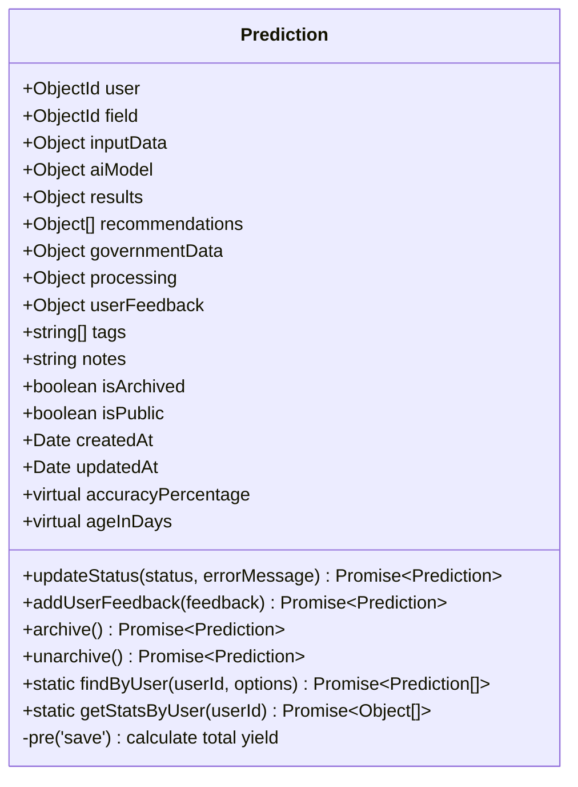
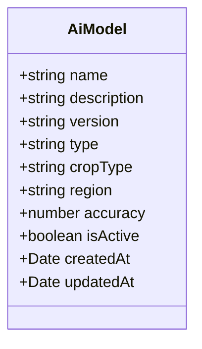
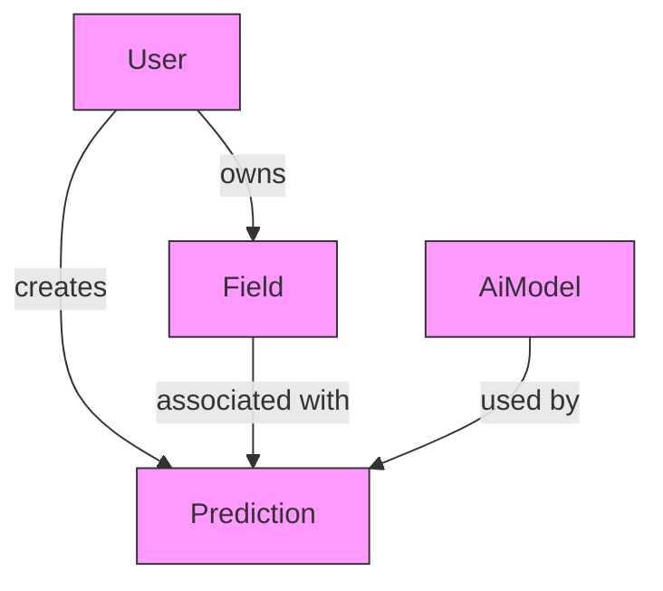
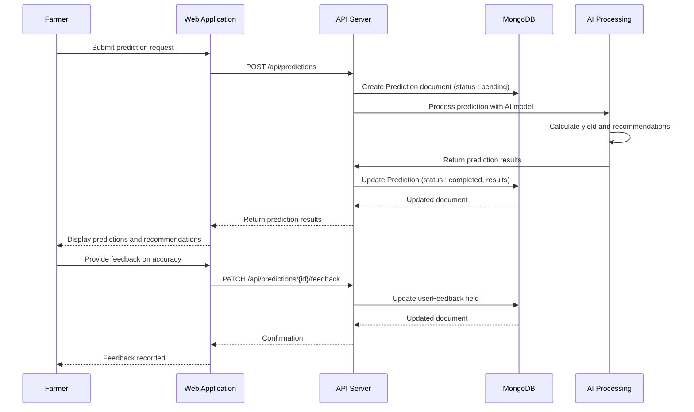

# Data Models

<cite>
**Referenced Files in This Document**   
- [User.js](file://HarvestIQ/backend/models/User.js)
- [Field.js](file://HarvestIQ/backend/models/Field.js)
- [Prediction.js](file://HarvestIQ/backend/models/Prediction.js)
- [AiModel.js](file://HarvestIQ/backend/models/AiModel.js)
- [database.js](file://HarvestIQ/backend/config/database.js)
</cite>

## Table of Contents
1. [Introduction](#introduction)
2. [Core Data Models](#core-data-models)
3. [User Model](#user-model)
4. [Field Model](#field-model)
5. [Prediction Model](#prediction-model)
6. [AI Model Configuration](#ai-model-configuration)
7. [Schema Relationships](#schema-relationships)
8. [Data Validation and Integrity](#data-validation-and-integrity)
9. [Schema Options and Indexing](#schema-options-and-indexing)
10. [Data Flow and Processing](#data-flow-and-processing)
11. [Sample Documents](#sample-documents)
12. [Conclusion](#conclusion)

## Introduction

The HarvestIQ backend implements a comprehensive data model using Mongoose schemas to structure agricultural data for intelligent farming insights. This documentation details the four core models—User, Field, Prediction, and AiModel—that form the foundation of the application's data architecture. Each model is designed with specific business requirements in mind, incorporating validation rules, relationships, and custom methods to ensure data integrity and support the application's functionality. The models are stored in MongoDB collections and are interconnected through reference fields that establish ownership and usage relationships. This document provides a detailed analysis of each model's structure, validation rules, business logic, and interrelationships, offering a complete understanding of how data is organized and managed within the HarvestIQ system.

**Section sources**
- [User.js](file://HarvestIQ/backend/models/User.js)
- [Field.js](file://HarvestIQ/backend/models/Field.js)
- [Prediction.js](file://HarvestIQ/backend/models/Prediction.js)
- [AiModel.js](file://HarvestIQ/backend/models/AiModel.js)

## Core Data Models

The HarvestIQ application is built around four primary data models that represent key entities in the agricultural intelligence domain. The User model manages farmer and expert accounts with authentication capabilities. The Field model captures detailed information about agricultural land, including geographic coordinates, soil characteristics, and crop history. The Prediction model stores AI-generated forecasts for crop yields and recommendations, incorporating input parameters and results. The AiModel model defines the configuration for different AI algorithms used in the system, supporting various types such as JavaScript-based models, Python machine learning models, and ensemble approaches. These models work together to provide a comprehensive platform for agricultural decision support, with relationships established through reference fields that maintain data integrity and enable efficient querying.



**Diagram sources**
- [User.js](file://HarvestIQ/backend/models/User.js)
- [Field.js](file://HarvestIQ/backend/models/Field.js)
- [Prediction.js](file://HarvestIQ/backend/models/Prediction.js)
- [AiModel.js](file://HarvestIQ/backend/models/AiModel.js)

**Section sources**
- [User.js](file://HarvestIQ/backend/models/User.js)
- [Field.js](file://HarvestIQ/backend/models/Field.js)
- [Prediction.js](file://HarvestIQ/backend/models/Prediction.js)
- [AiModel.js](file://HarvestIQ/backend/models/AiModel.js)

## User Model

The User model serves as the foundation for authentication and user management in the HarvestIQ application. It contains essential fields for user identification, including fullName, email, and password, with comprehensive validation rules to ensure data quality. The email field is required, unique, and indexed for efficient lookups, while the password is protected with bcrypt hashing through pre-save middleware. The model includes role-based access control with three user types: farmer, admin, and expert. User preferences are stored in a nested preferences object that includes language settings, theme selection, and notification preferences. The profile field contains agricultural-specific information such as farming experience, farm size, primary crops, and farming type. The model implements several custom methods, including comparePassword for authentication, getPublicProfile to retrieve user data without sensitive information, and updateLastLogin to track user activity. Timestamps are automatically maintained through the timestamps option, and the model includes virtual fields like predictionCount to provide aggregated data without additional queries.



**Diagram sources**
- [User.js](file://HarvestIQ/backend/models/User.js#L3-L163)

**Section sources**
- [User.js](file://HarvestIQ/backend/models/User.js#L3-L163)

## Field Model

The Field model represents agricultural land parcels with comprehensive data about their physical characteristics, soil health, and management practices. It establishes a relationship with the User model through the user field, which references the owner of the field. The model captures detailed location information, including geographic coordinates (latitude and longitude) with validation ranges, administrative details (village, district, state), and GeoJSON data for advanced mapping capabilities. Physical characteristics include area measurements with cultivable and total area fields that are validated to ensure cultivable area does not exceed total area. Soil health data is extensively documented with pH levels, organic carbon content, electrical conductivity, and nutrient levels for both macronutrients and micronutrients. The model includes crop history tracking with a nested array that records past crops, seasons, yields, and notes. Irrigation methods, infrastructure, environmental factors, and current crop status are also captured. The model implements several instance methods for managing crop history, soil health updates, and current crop information, as well as static methods for finding fields by user, nearby locations, and generating user statistics.



**Diagram sources**
- [Field.js](file://HarvestIQ/backend/models/Field.js#L2-L540)

**Section sources**
- [Field.js](file://HarvestIQ/backend/models/Field.js#L2-L540)

## Prediction Model

The Prediction model stores AI-generated forecasts and recommendations for agricultural planning and optimization. It establishes relationships with the User, Field, and AiModel models through reference fields, enabling traceability of predictions to their creators, associated fields, and the AI models used. The model is structured into several logical sections: inputData captures user-provided parameters such as crop type, farm area, region, soil data, and weather conditions; aiModel contains metadata about the AI algorithm used, including model ID, name, version, type, and crop specificity; results stores the prediction output with expected yield, yield per hectare, confidence level, and factor analysis; recommendations contain actionable insights generated by the AI with priority levels and estimated impact; and governmentData integrates external data sources for weather, soil, historical trends, and market information. The model includes processing metadata to track prediction status and user feedback to capture actual outcomes for model validation. Custom methods enable status updates, feedback collection, and archiving of predictions. The model implements pre-save middleware to automatically calculate total yield based on yield per hectare and farm area.



**Diagram sources**
- [Prediction.js](file://HarvestIQ/backend/models/Prediction.js#L2-L385)

**Section sources**
- [Prediction.js](file://HarvestIQ/backend/models/Prediction.js#L2-L385)

## AI Model Configuration

The AiModel model defines the configuration and metadata for different AI algorithms used in the HarvestIQ system. It supports multiple AI types, including JavaScript-based models, Python machine learning models, Python deep learning models, and ensemble approaches, allowing the system to leverage different technologies for various agricultural prediction tasks. Each AI model is identified by a unique name and version, with metadata including description, crop type specialization, regional applicability, and accuracy metrics. The model includes a type field that specifies the implementation technology, enabling the system to route prediction requests to appropriate processing engines. Crop type and region fields allow for specialization of models to specific agricultural contexts, improving prediction accuracy. The model maintains an isActive flag to enable or disable models without deletion, supporting model versioning and A/B testing. Timestamps are automatically maintained to track model creation and updates. This model serves as a registry for available AI capabilities, allowing the system to dynamically select appropriate models based on user requirements and crop types.



**Diagram sources**
- [AiModel.js](file://HarvestIQ/backend/models/AiModel.js#L2-L49)

**Section sources**
- [AiModel.js](file://HarvestIQ/backend/models/AiModel.js#L2-L49)

## Schema Relationships

The HarvestIQ data models are interconnected through a well-defined relationship structure that reflects the real-world agricultural domain. The User model serves as the central entity, with one-to-many relationships to both Field and Prediction models, representing ownership and creation. Each Field belongs to a single User, while a User can own multiple fields. Similarly, each Prediction is created by a User, establishing accountability and access control. The Prediction model also has an optional relationship with the Field model, allowing predictions to be associated with specific agricultural parcels when relevant. The Prediction model references the AiModel model to track which AI algorithm was used to generate each forecast, enabling model performance analysis and version management. These relationships are implemented using MongoDB ObjectId references with appropriate indexing for query performance. The relationship structure supports key application features such as user-specific data filtering, field-based predictions, and AI model performance tracking across different users and regions.



**Diagram sources**
- [User.js](file://HarvestIQ/backend/models/User.js)
- [Field.js](file://HarvestIQ/backend/models/Field.js)
- [Prediction.js](file://HarvestIQ/backend/models/Prediction.js)
- [AiModel.js](file://HarvestIQ/backend/models/AiModel.js)

**Section sources**
- [User.js](file://HarvestIQ/backend/models/User.js)
- [Field.js](file://HarvestIQ/backend/models/Field.js)
- [Prediction.js](file://HarvestIQ/backend/models/Prediction.js)
- [AiModel.js](file://HarvestIQ/backend/models/AiModel.js)

## Data Validation and Integrity

The HarvestIQ data models implement comprehensive validation rules at the schema level to ensure data quality and integrity. Field-level validation includes required fields, data type enforcement, range constraints, and format validation. For example, the User model validates email format using a regular expression and enforces password length requirements, while the Field model validates geographic coordinates within acceptable ranges for latitude and longitude. The models use Mongoose's built-in validators such as required, min, max, enum, and match, as well as custom validators for complex business rules. The Field model includes a custom validator to ensure cultivable area does not exceed total area, while the Prediction model validates farm area to be at least 0.1 hectares. Unique constraints are implemented where appropriate, such as the unique email constraint in the User model and unique model name in the AiModel model. Default values are specified for optional fields to ensure consistent data representation. The models also implement data sanitization through options like trim for string fields and lowercase for email addresses. These validation rules operate at the database level, providing a robust defense against invalid data entry and ensuring the reliability of agricultural insights generated by the system.

**Section sources**
- [User.js](file://HarvestIQ/backend/models/User.js)
- [Field.js](file://HarvestIQ/backend/models/Field.js)
- [Prediction.js](file://HarvestIQ/backend/models/Prediction.js)
- [AiModel.js](file://HarvestIQ/backend/models/AiModel.js)

## Schema Options and Indexing

The HarvestIQ data models utilize Mongoose schema options and strategic indexing to optimize performance and functionality. All models enable the timestamps option, which automatically manages createdAt and updatedAt fields for audit trails and temporal queries. The toJSON and toObject options with virtuals enabled allow virtual fields to be included when documents are serialized, supporting computed properties without storing them in the database. The User model sets select: false on the password field to exclude it from queries by default, enhancing security. Indexing strategies are carefully designed to support common query patterns: the User model indexes email and isActive fields for authentication queries; the Field model indexes user, location coordinates, and current crop type for efficient filtering; the Prediction model indexes user, crop type, region, and processing status for analytics; and the AiModel model indexes name for quick lookups. The Field model also implements a geospatial index on the GeoJSON field to enable location-based queries for finding nearby fields. These indexing strategies balance query performance with write efficiency, ensuring responsive application behavior while minimizing the overhead of index maintenance.

```mermaid
flowchart TD
A[Schema Definition] --> B[Define Fields]
B --> C[Add Validation Rules]
C --> D[Configure Schema Options]
D --> E[timestamps: true]
D --> F[toJSON: {virtuals: true}]
D --> G[toObject: {virtuals: true}]
D --> H[Field-specific Options]
E --> I[Automatic createdAt/updatedAt]
F --> J[Include Virtuals in JSON]
G --> K[Include Virtuals in Objects]
H --> L[select: false for sensitive fields]
I --> M[Data Integrity]
J --> N[Computed Properties]
K --> N
L --> O[Security]
M --> P[Schema Ready]
N --> P
O --> P
style A fill:#4CAF50,stroke:#388E3C
style P fill:#2196F3,stroke:#1976D2
```

**Diagram sources**
- [User.js](file://HarvestIQ/backend/models/User.js)
- [Field.js](file://HarvestIQ/backend/models/Field.js)
- [Prediction.js](file://HarvestIQ/backend/models/Prediction.js)
- [AiModel.js](file://HarvestIQ/backend/models/AiModel.js)

**Section sources**
- [User.js](file://HarvestIQ/backend/models/User.js)
- [Field.js](file://HarvestIQ/backend/models/Field.js)
- [Prediction.js](file://HarvestIQ/backend/models/Prediction.js)
- [AiModel.js](file://HarvestIQ/backend/models/AiModel.js)

## Data Flow and Processing

The HarvestIQ data models support a comprehensive data flow from user input through AI processing to actionable insights. When a user creates a prediction, the system collects input data including crop type, farm area, region, soil characteristics, and weather conditions. This data is stored in the Prediction model's inputData field and associated with the user and optionally a specific field. The system selects an appropriate AI model based on crop type and other factors, recording the model details in the aiModel field. The AI processing engine generates yield predictions and recommendations, which are stored in the results and recommendations fields. The processing metadata tracks the status of the prediction generation, including processing time and any errors. Once completed, users can provide feedback on prediction accuracy, creating a feedback loop for model improvement. The system leverages virtual fields and aggregation pipelines to generate insights such as prediction accuracy over time and field utilization statistics. This data flow enables farmers to make informed decisions based on AI-powered insights while providing the system with valuable feedback for continuous model refinement.



**Diagram sources**
- [Prediction.js](file://HarvestIQ/backend/models/Prediction.js)
- [AiModel.js](file://HarvestIQ/backend/models/AiModel.js)

**Section sources**
- [Prediction.js](file://HarvestIQ/backend/models/Prediction.js)
- [AiModel.js](file://HarvestIQ/backend/models/AiModel.js)

## Sample Documents

The following examples illustrate the structure of documents in each MongoDB collection, demonstrating how the Mongoose schemas translate to actual data storage. These samples show typical field values and the nesting structure of complex objects and arrays. The User document includes authentication data, profile information, and preferences. The Field document demonstrates comprehensive agricultural data including location, soil health, crop history, and current status. The Prediction document shows the integration of input data, AI model metadata, results, and recommendations. The AiModel document illustrates the configuration of an AI algorithm for crop prediction. These examples provide concrete representations of how data is organized in the database, helping developers and stakeholders understand the data model in practical terms.

```json
// Sample User Document
{
  "_id": "64a1b2c3d4e5f6a7b8c9d0e1",
  "fullName": "Rajesh Kumar",
  "email": "rajesh.farmer@example.com",
  "role": "farmer",
  "isActive": true,
  "lastLogin": "2023-07-15T10:30:00.000Z",
  "preferences": {
    "language": "hi",
    "theme": "light",
    "notifications": {
      "email": true,
      "weather": true,
      "market": true
    }
  },
  "profile": {
    "location": {
      "state": "Punjab",
      "district": "Ludhiana",
      "coordinates": {
        "latitude": 30.9009,
        "longitude": 75.8573
      }
    },
    "farmingExperience": 15,
    "farmSize": 5.5,
    "primaryCrops": ["Wheat", "Rice"],
    "farmingType": "conventional"
  },
  "createdAt": "2023-07-01T08:00:00.000Z",
  "updatedAt": "2023-07-15T10:30:00.000Z"
}
```

```json
// Sample Field Document
{
  "_id": "64a1b2c3d4e5f6a7b8c9d0e2",
  "user": "64a1b2c3d4e5f6a7b8c9d0e1",
  "name": "Main Wheat Field",
  "description": "Primary field for wheat cultivation",
  "location": {
    "coordinates": {
      "latitude": 30.9123,
      "longitude": 75.8645
    },
    "address": {
      "village": "Sarhala",
      "district": "Ludhiana",
      "state": "Punjab",
      "country": "India"
    },
    "geoJson": {
      "type": "Point",
      "coordinates": [75.8645, 30.9123]
    }
  },
  "area": {
    "total": 3.2,
    "cultivable": 3.2,
    "unit": "hectares"
  },
  "soilHealth": {
    "pH": 7.2,
    "organicCarbon": 1.8,
    "electricalConductivity": 0.45,
    "nutrients": {
      "nitrogen": 220,
      "phosphorus": 45,
      "potassium": 180,
      "sulfur": 25
    },
    "micronutrients": {
      "zinc": 6.2,
      "iron": 8.1,
      "manganese": 4.3,
      "copper": 2.1,
      "boron": 0.8
    },
    "lastTested": "2023-04-15T00:00:00.000Z",
    "testingLab": "Punjab Agriculture University",
    "soilType": "Alluvial",
    "texture": "Loamy"
  },
  "cropHistory": [
    {
      "year": 2023,
      "season": "Rabi",
      "cropType": "Wheat",
      "variety": "HD-2967",
      "yield": 4.8,
      "yieldUnit": "tons/ha",
      "notes": "Good yield despite late sowing"
    }
  ],
  "irrigation": {
    "source": "Tube well",
    "type": "Sprinkler",
    "waterQuality": "Good",
    "efficiency": 75
  },
  "currentCrop": {
    "cropType": "Wheat",
    "variety": "HD-2967",
    "plantingDate": "2023-11-10T00:00:00.000Z",
    "expectedHarvest": "2024-04-15T00:00:00.000Z",
    "stage": "Growing"
  },
  "isActive": true,
  "isOrganic": false,
  "createdAt": "2023-07-02T09:15:00.000Z",
  "updatedAt": "2023-11-10T14:30:00.000Z"
}
```

```json
// Sample Prediction Document
{
  "_id": "64a1b2c3d4e5f6a7b8c9d0e3",
  "user": "64a1b2c3d4e5f6a7b8c9d0e1",
  "field": "64a1b2c3d4e5f6a7b8c9d0e2",
  "inputData": {
    "cropType": "Wheat",
    "farmArea": 3.2,
    "region": "Punjab",
    "soilData": {
      "phLevel": 7.2,
      "organicContent": 1.8,
      "nitrogen": 220,
      "phosphorus": 45,
      "potassium": 180
    },
    "weatherData": {
      "rainfall": 550,
      "temperature": 22.5,
      "humidity": 65
    }
  },
  "aiModel": {
    "modelId": "64a1b2c3d4e5f6a7b8c9d0e4",
    "modelName": "WheatYieldPredictor",
    "modelVersion": "2.1.0",
    "modelType": "python-ml",
    "cropType": "Wheat",
    "region": "Punjab"
  },
  "results": {
    "expectedYield": 15.36,
    "yieldPerHectare": 4.8,
    "totalYield": 15.36,
    "confidence": 92,
    "factors": {
      "weather": "government-data",
      "soil": "user-input",
      "yieldFactor": 1.15,
      "additionalFactors": {}
    }
  },
  "recommendations": [
    {
      "type": "nutrition",
      "priority": "high",
      "title": "Optimize Nitrogen Application",
      "description": "Soil test indicates nitrogen levels are slightly below optimal for maximum wheat yield.",
      "action": "Apply 20kg/ha additional nitrogen during tillering stage",
      "estimatedImpact": 12
    },
    {
      "type": "irrigation",
      "priority": "medium",
      "title": "Adjust Irrigation Schedule",
      "description": "Current weather patterns suggest reduced rainfall in coming weeks.",
      "action": "Increase irrigation frequency by 15% during grain filling stage",
      "estimatedImpact": 8
    }
  ],
  "governmentData": {
    "weather": {
      "forecast": "Above average rainfall expected in February-March"
    },
    "soil": {
      "regionalAverage": "pH: 7.5, Organic Carbon: 1.6%"
    },
    "historical": {
      "averageYield": 4.2,
      "trend": "Increasing"
    },
    "market": {
      "currentPrice": 2100,
      "trend": "Stable"
    }
  },
  "processing": {
    "status": "completed",
    "processingTime": 142,
    "retryCount": 0
  },
  "userFeedback": {
    "rating": 5,
    "accuracy": "very-high",
    "actualYield": 15.1
  },
  "isArchived": false,
  "isPublic": false,
  "createdAt": "2023-11-15T11:20:00.000Z",
  "updatedAt": "2023-11-15T11:20:00.000Z"
}
```

```json
// Sample AiModel Document
{
  "_id": "64a1b2c3d4e5f6a7b8c9d0e4",
  "name": "WheatYieldPredictor",
  "description": "Machine learning model for predicting wheat yield in North India",
  "version": "2.1.0",
  "type": "python-ml",
  "cropType": "Wheat",
  "region": "Punjab,Haryana,Uttar Pradesh",
  "accuracy": 94.2,
  "isActive": true,
  "createdAt": "2023-06-10T14:30:00.000Z",
  "updatedAt": "2023-06-10T14:30:00.000Z"
}
```

**Section sources**
- [User.js](file://HarvestIQ/backend/models/User.js)
- [Field.js](file://HarvestIQ/backend/models/Field.js)
- [Prediction.js](file://HarvestIQ/backend/models/Prediction.js)
- [AiModel.js](file://HarvestIQ/backend/models/AiModel.js)

## Conclusion

The HarvestIQ data models provide a robust foundation for an agricultural intelligence platform, combining comprehensive data collection with AI-powered insights. The four core models—User, Field, Prediction, and AiModel—are thoughtfully designed to capture the complexity of farming operations while maintaining data integrity through extensive validation rules and relationships. The models leverage Mongoose features such as timestamps, virtual fields, and pre-save middleware to enhance functionality and maintain data quality. Strategic indexing supports efficient querying for both user-facing features and analytical capabilities. The relationship structure reflects real-world agricultural workflows, with users owning fields, creating predictions, and leveraging specialized AI models. The system incorporates feedback loops through user feedback on prediction accuracy, enabling continuous improvement of AI models. This well-structured data architecture supports the application's mission of providing actionable insights to farmers while maintaining the flexibility to incorporate new AI technologies and agricultural data sources. The models serve as a scalable foundation for expanding the platform's capabilities in precision agriculture and sustainable farming practices.