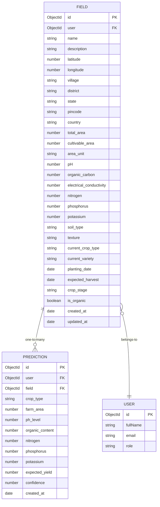
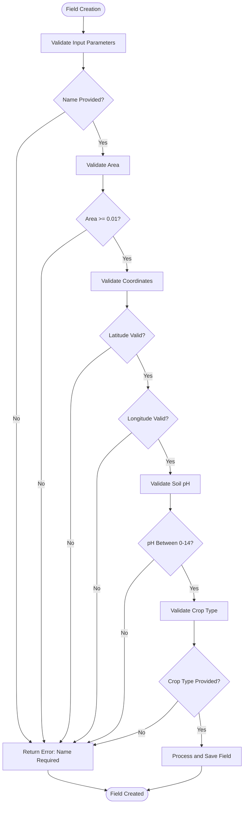
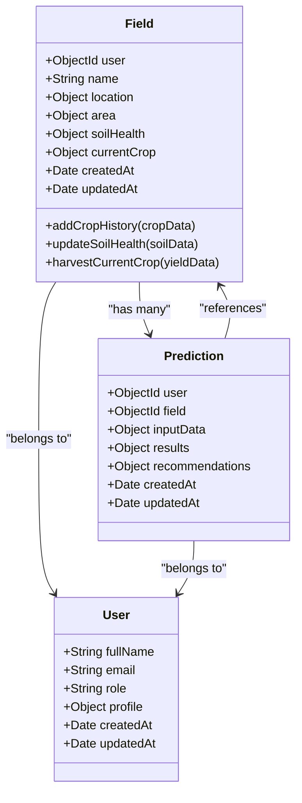
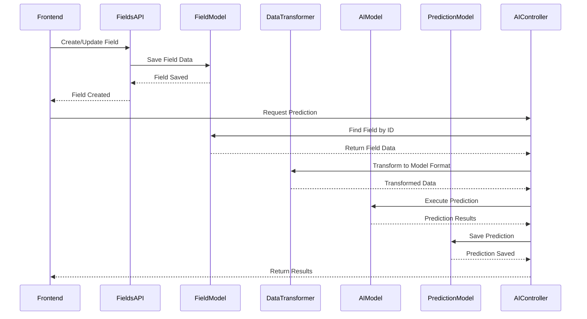

# Field Model

<cite>
**Referenced Files in This Document**   
- [Field.js](file://HarvestIQ/backend/models/Field.js)
- [Prediction.js](file://HarvestIQ/backend/models/Prediction.js)
- [User.js](file://HarvestIQ/backend/models/User.js)
- [fields.js](file://HarvestIQ/backend/routes/fields.js)
- [aiController.js](file://HarvestIQ/backend/controllers/aiController.js)
- [dataTransformer.js](file://HarvestIQ/backend/services/dataTransformer.js)
- [validation.js](file://HarvestIQ/backend/utils/validation.js)
</cite>

## Table of Contents
1. [Introduction](#introduction)
2. [Core Schema Fields](#core-schema-fields)
3. [Validation Rules](#validation-rules)
4. [Geospatial Indexing Strategy](#geospatial-indexing-strategy)
5. [Relationships and Population](#relationships-and-population)
6. [Data Flow and AI Integration](#data-flow-and-ai-integration)
7. [Default Values and Timestamps](#default-values-and-timestamps)
8. [Sample Document](#sample-document)
9. [Core Functionality Support](#core-functionality-support)
10. [Conclusion](#conclusion)

## Introduction

The Field model in HarvestIQ's backend serves as the central data structure for managing agricultural land information. It captures comprehensive details about farm fields, including physical characteristics, soil health, crop history, and infrastructure. This model enables personalized agricultural recommendations by providing detailed land-specific data to AI prediction models. The Field model is designed to support precision farming practices by maintaining accurate records of field conditions and enabling location-based queries through geospatial indexing.

**Section sources**
- [Field.js](file://HarvestIQ/backend/models/Field.js#L1-L50)

## Core Schema Fields

The Field model contains a comprehensive set of fields organized into logical categories for effective field management.

### Basic Information
The model captures fundamental field identification data including name, description, and user ownership. The user field establishes a reference to the User model, ensuring each field is associated with a specific farmer or agricultural expert.

### Location Information
Location data is captured through multiple layers:
- **Geographic coordinates**: Latitude and longitude values with validation constraints
- **Administrative location**: Village, district, state, pincode, and country
- **GeoJSON representation**: For advanced mapping capabilities with Point or Polygon types

### Physical Characteristics
The model tracks field dimensions through total and cultivable area measurements, with unit flexibility supporting hectares, acres, bigha, and kanal. Validation ensures cultivable area does not exceed total area.

### Soil Health Data
Comprehensive soil metrics are recorded, including:
- pH level (0-14 scale)
- Organic carbon content
- Electrical conductivity
- Macronutrients (nitrogen, phosphorus, potassium, sulfur)
- Micronutrients (zinc, iron, manganese, copper, boron)
- Soil type classification (Alluvial, Black, Red, etc.)
- Soil texture (Sandy, Clay, Loamy, etc.)

### Crop History and Rotation
A historical record of crops grown on the field is maintained, capturing year, season (Kharif, Rabi, Zaid, Perennial), crop type, variety, yield, and notes. This enables analysis of crop rotation patterns and productivity trends.

### Current Crop Status
The model tracks the current agricultural status with fields for crop type, variety, planting date, expected harvest date, and growth stage (Fallow, Prepared, Sown, Growing, etc.).



**Diagram sources**
- [Field.js](file://HarvestIQ/backend/models/Field.js#L15-L390)
- [User.js](file://HarvestIQ/backend/models/User.js#L15-L40)
- [Prediction.js](file://HarvestIQ/backend/models/Prediction.js#L15-L70)

**Section sources**
- [Field.js](file://HarvestIQ/backend/models/Field.js#L15-L390)

## Validation Rules

The Field model implements comprehensive validation rules to ensure data integrity and accuracy.

### Coordinate Format Validation
Geographic coordinates are strictly validated:
- Latitude must be between -90 and 90 degrees
- Longitude must be between -180 and 180 degrees
- Coordinates are automatically converted to GeoJSON Point format when provided

### Required Field Constraints
Critical fields are marked as required with appropriate error messages:
- User reference is mandatory
- Field name is required
- Total area must be specified
- Minimum area is 0.01 hectares

### pH Level Constraints
The pH field has specific validation:
- Values must be between 0 and 14 (standard pH scale)
- No default value, requiring explicit input
- Field-level validation prevents out-of-range values

### Area Validation
Area measurements include:
- Total area minimum of 0.01 hectares
- Cultivable area cannot exceed total area
- Automatic population of cultivable area when not specified



**Diagram sources**
- [Field.js](file://HarvestIQ/backend/models/Field.js#L25-L30)
- [Field.js](file://HarvestIQ/backend/models/Field.js#L70-L90)
- [Field.js](file://HarvestIQ/backend/models/Field.js#L150-L160)

**Section sources**
- [Field.js](file://HarvestIQ/backend/models/Field.js#L25-L200)

## Geospatial Indexing Strategy

The Field model implements an advanced geospatial indexing strategy to enable efficient location-based queries.

### 2dsphere Index Implementation
A 2dsphere index is created on the GeoJSON location field, allowing for sophisticated geospatial queries:
- Distance-based searches within specified radii
- Location proximity analysis
- Regional field clustering

### Index Configuration
The model defines multiple indexes to optimize query performance:
- User and active status index for user-specific field retrieval
- Coordinate indexes for latitude and longitude queries
- Address component indexes for state and district filtering
- Crop type index for agricultural analysis
- Creation timestamp index for chronological sorting

### Query Capabilities
The geospatial indexing enables several key query patterns:
- Finding fields within a specified distance of a location
- Identifying nearby farms for community analysis
- Regional agricultural pattern analysis
- Location-based recommendation targeting

```mermaid
graph TD
A[Field Document] --> B[location.geoJson]
B --> C[GeoJSON Point]
C --> D[coordinates: [longitude, latitude]]
D --> E[2dsphere Index]
E --> F[Efficient Geospatial Queries]
F --> G[Find Nearby Fields]
F --> H[Distance-Based Filtering]
F --> I[Spatial Analysis]
F --> J[Regional Aggregation]
K[Query Example] --> L[findNearby(latitude, longitude, maxDistance)]
L --> M[Uses 2dsphere Index]
M --> N[Returns Fields Within Radius]
```

**Diagram sources**
- [Field.js](file://HarvestIQ/backend/models/Field.js#L398-L398)
- [Field.js](file://HarvestIQ/backend/models/Field.js#L390-L400)

**Section sources**
- [Field.js](file://HarvestIQ/backend/models/Field.js#L390-L400)

## Relationships and Population

The Field model establishes critical relationships with other entities in the system.

### User Relationship
Each field is associated with a user through a reference field:
- The user field contains an ObjectId reference to the User model
- This enables user-specific field filtering and access control
- Population occurs in related operations to display user information

### Prediction Relationship
The model supports a one-to-many relationship with predictions:
- Multiple predictions can be associated with a single field
- Predictions use the field's characteristics as input parameters
- Field data provides context for AI model recommendations

### Data Population Strategy
Related data is populated in various operations:
- Field retrieval operations include user information
- Prediction creation uses field data as input
- Analytics endpoints aggregate field data with user context
- Reporting functions combine field metrics with user profiles



**Diagram sources**
- [Field.js](file://HarvestIQ/backend/models/Field.js#L15-L20)
- [User.js](file://HarvestIQ/backend/models/User.js#L15-L20)
- [Prediction.js](file://HarvestIQ/backend/models/Prediction.js#L15-L20)

**Section sources**
- [Field.js](file://HarvestIQ/backend/models/Field.js#L15-L20)
- [Prediction.js](file://HarvestIQ/backend/models/Prediction.js#L15-L20)

## Data Flow and AI Integration

The Field model plays a crucial role in the AI prediction pipeline, serving as a primary data source for agricultural recommendations.

### Input for AI Predictions
Field data is transformed and used as input for AI models:
- Soil health metrics inform crop suitability analysis
- Location data enables region-specific recommendations
- Crop history guides rotation suggestions
- Current crop status affects timing recommendations

### Data Transformation Process
When creating predictions, field data flows through a transformation pipeline:
1. Field data is retrieved and validated
2. Data is transformed into the format required by AI models
3. Additional environmental data may be integrated
4. Transformed data is sent to the appropriate AI model

### Prediction Workflow


**Diagram sources**
- [Field.js](file://HarvestIQ/backend/models/Field.js#L1-L50)
- [aiController.js](file://HarvestIQ/backend/controllers/aiController.js#L1-L50)
- [dataTransformer.js](file://HarvestIQ/backend/services/dataTransformer.js#L1-L50)
- [Prediction.js](file://HarvestIQ/backend/models/Prediction.js#L1-L50)

**Section sources**
- [Field.js](file://HarvestIQ/backend/models/Field.js#L1-L50)
- [aiController.js](file://HarvestIQ/backend/controllers/aiController.js#L1-L50)

## Default Values and Timestamps

The Field model incorporates sensible default values and automatic timestamp management.

### Default Values
Optional fields have appropriate defaults:
- Description: empty string
- Country: "India"
- Area unit: "hectares"
- Soil type and texture: null
- Irrigation source: "Rain-fed"
- Infrastructure: false for all items
- Slope: "Flat"
- Drainage: "Good"
- Erosion risk: "Low"
- Current crop stage: "Fallow"
- Active status: true
- Organic status: false

### Timestamp Management
The model automatically manages temporal data:
- createdAt timestamp is set on document creation
- updatedAt timestamp is updated on modifications
- Soil test date defaults to null
- Certification validity defaults to null

### Virtual Fields
Computed properties enhance data accessibility:
- utilizationPercentage: Calculates cultivable area percentage
- soilTestAge: Returns days since last soil test
- currentCropAge: Returns days since current crop planting

**Section sources**
- [Field.js](file://HarvestIQ/backend/models/Field.js#L100-L200)
- [Field.js](file://HarvestIQ/backend/models/Field.js#L450-L480)

## Sample Document

The following example illustrates a typical field document in the HarvestIQ system:

```json
{
  "_id": "64a1b2c3d4e5f6a7b8c9d0e1",
  "user": "64a1b2c3d4e5f6a7b8c9d0e0",
  "name": "Northwest Field",
  "description": "Primary wheat cultivation area",
  "location": {
    "coordinates": {
      "latitude": 30.7333,
      "longitude": 76.7794
    },
    "address": {
      "village": "Sector 45",
      "district": "Chandigarh",
      "state": "Punjab",
      "pincode": "160045",
      "country": "India"
    },
    "geoJson": {
      "type": "Point",
      "coordinates": [76.7794, 30.7333]
    }
  },
  "area": {
    "total": 2.5,
    "cultivable": 2.4,
    "unit": "hectares"
  },
  "soilHealth": {
    "pH": 7.2,
    "organicCarbon": 1.8,
    "electricalConductivity": 0.45,
    "nutrients": {
      "nitrogen": 210,
      "phosphorus": 28,
      "potassium": 195,
      "sulfur": 15
    },
    "micronutrients": {
      "zinc": 6.2,
      "iron": 8.1,
      "manganese": 4.3,
      "copper": 2.1,
      "boron": 0.8
    },
    "lastTested": "2023-05-15T00:00:00.000Z",
    "testingLab": "AgriLab Punjab",
    "soilType": "Alluvial",
    "texture": "Loamy"
  },
  "cropHistory": [
    {
      "year": 2023,
      "season": "Rabi",
      "cropType": "Wheat",
      "variety": "HD-2967",
      "yield": 4.8,
      "yieldUnit": "tons/ha",
      "notes": "Good yield despite late sowing"
    },
    {
      "year": 2022,
      "season": "Kharif",
      "cropType": "Maize",
      "variety": "Pioneer 30B12",
      "yield": 6.2,
      "yieldUnit": "tons/ha",
      "notes": "Irrigated with tube well"
    }
  ],
  "irrigation": {
    "source": "Tube well",
    "type": "Sprinkler",
    "waterQuality": "Good",
    "efficiency": 75
  },
  "currentCrop": {
    "cropType": "Wheat",
    "variety": "HD-2967",
    "plantingDate": "2023-11-10T00:00:00.000Z",
    "expectedHarvest": "2024-04-15T00:00:00.000Z",
    "stage": "Growing"
  },
  "tags": ["irrigated", "high-yield"],
  "notes": "Regular monitoring required for aphid control",
  "isActive": true,
  "isOrganic": false,
  "createdAt": "2023-01-15T10:30:00.000Z",
  "updatedAt": "2023-11-10T09:15:00.000Z",
  "utilizationPercentage": 96,
  "soilTestAge": 120,
  "currentCropAge": 30
}
```

**Section sources**
- [Field.js](file://HarvestIQ/backend/models/Field.js#L1-L540)

## Core Functionality Support

The Field model enables HarvestIQ's core functionality through comprehensive field management and data provision for AI recommendations.

### Field Management Capabilities
The model supports complete field lifecycle management:
- Creation and deletion of field records
- Updating field characteristics and crop status
- Maintaining historical crop data
- Tracking soil health over time
- Managing field infrastructure and equipment

### Personalized Recommendations
Field-specific data enables tailored agricultural advice:
- Soil-specific fertilizer recommendations
- Location-appropriate crop selection
- Climate-responsive planting schedules
- Water management optimization
- Pest and disease prevention strategies

### Analytical Features
The structured data supports advanced analytics:
- Field productivity tracking over time
- Crop rotation pattern analysis
- Soil health trend monitoring
- Resource utilization optimization
- Yield prediction accuracy improvement

### Integration Points
The model integrates with multiple system components:
- User authentication and authorization
- AI prediction engine
- Government data services
- Mobile and web interfaces
- Data export and reporting tools

**Section sources**
- [Field.js](file://HarvestIQ/backend/models/Field.js#L1-L540)
- [fields.js](file://HarvestIQ/backend/routes/fields.js#L1-L250)

## Conclusion

The Field model in HarvestIQ's backend provides a robust foundation for precision agriculture by capturing comprehensive field data and enabling data-driven decision making. Through its well-structured schema, rigorous validation, geospatial capabilities, and integration with AI systems, the model supports personalized agricultural recommendations that optimize crop yields and resource utilization. The relationship with the Prediction model allows field-specific characteristics to inform AI-driven insights, while the user relationship ensures proper data ownership and access control. With automatic timestamp management, sensible defaults, and virtual computed fields, the model balances data completeness with usability. This comprehensive approach to field data management empowers farmers with actionable insights tailored to their specific land conditions, ultimately contributing to more sustainable and productive agricultural practices.