# Prediction Model

<cite>
**Referenced Files in This Document**  
- [Prediction.js](file://HarvestIQ/backend/models/Prediction.js)
- [AiModel.js](file://HarvestIQ/backend/models/AiModel.js)
- [Field.js](file://HarvestIQ/backend/models/Field.js)
- [User.js](file://HarvestIQ/backend/models/User.js)
- [aiService.js](file://HarvestIQ/backend/services/aiService.js)
- [predictions.js](file://HarvestIQ/backend/routes/predictions.js)
- [validation.js](file://HarvestIQ/backend/utils/validation.js)
- [database.js](file://HarvestIQ/backend/config/database.js)
</cite>

## Table of Contents
1. [Introduction](#introduction)
2. [Core Data Model](#core-data-model)
3. [Schema Fields](#schema-fields)
4. [Validation Rules](#validation-rules)
5. [Relationships](#relationships)
6. [Processing Lifecycle](#processing-lifecycle)
7. [Indexing Strategy](#indexing-strategy)
8. [Sample Document](#sample-document)
9. [Architecture Overview](#architecture-overview)
10. [Conclusion](#conclusion)

## Introduction

The Prediction model serves as the central component of HarvestIQ's AI-driven agricultural intelligence system. It captures the complete lifecycle of crop yield predictions, from input collection through AI processing to actionable recommendations. This document provides comprehensive documentation of the Prediction model, detailing its schema, validation rules, relationships, and operational characteristics.

The model acts as the primary output mechanism for delivering AI-powered insights to farmers, transforming raw agricultural data into structured predictions with confidence scores and farming recommendations. It integrates multiple data sources including user inputs, field characteristics, AI model outputs, and government datasets to provide comprehensive yield forecasts.

**Section sources**
- [Prediction.js](file://HarvestIQ/backend/models/Prediction.js#L1-L387)

## Core Data Model

The Prediction model is implemented as a Mongoose schema in MongoDB, designed to capture comprehensive agricultural prediction data with rich metadata and relationships. The model follows a nested document structure that organizes related data into logical groups while maintaining query performance through strategic indexing.

```mermaid
erDiagram
Prediction {
string _id PK
string user FK
string field FK
string aiModel.modelId FK
object inputData
object results
array recommendations
object processing
string status
datetime createdAt
datetime updatedAt
}
User {
string _id PK
string email UK
string fullName
string role
}
Field {
string _id PK
string user FK
string name
object location
object area
}
AiModel {
string _id PK
string name UK
string type
string cropType
string version
boolean isActive
}
Prediction ||--|{ User : "belongs to"
Prediction ||--o{ Field : "optional field"
Prediction }|--|| AiModel : "uses"
```

**Diagram sources**
- [Prediction.js](file://HarvestIQ/backend/models/Prediction.js#L1-L387)
- [User.js](file://HarvestIQ/backend/models/User.js#L1-L165)
- [Field.js](file://HarvestIQ/backend/models/Field.js#L1-L542)
- [AiModel.js](file://HarvestIQ/backend/models/AiModel.js#L1-L52)

**Section sources**
- [Prediction.js](file://HarvestIQ/backend/models/Prediction.js#L1-L387)

## Schema Fields

The Prediction model schema is organized into several logical sections that capture different aspects of the prediction process.

### Input Parameters

The `inputData` section captures all user-provided parameters necessary for yield prediction:

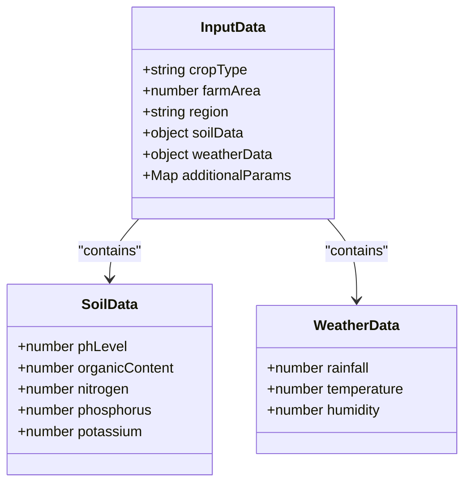

**Diagram sources**
- [Prediction.js](file://HarvestIQ/backend/models/Prediction.js#L15-L85)

### Prediction Results

The `results` section contains the core output of the AI prediction process:

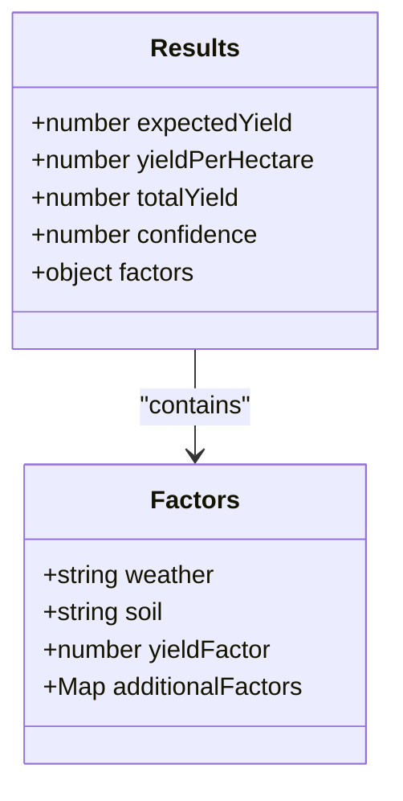

**Diagram sources**
- [Prediction.js](file://HarvestIQ/backend/models/Prediction.js#L130-L160)

### Recommendations

The `recommendations` array provides actionable farming advice based on the prediction analysis:

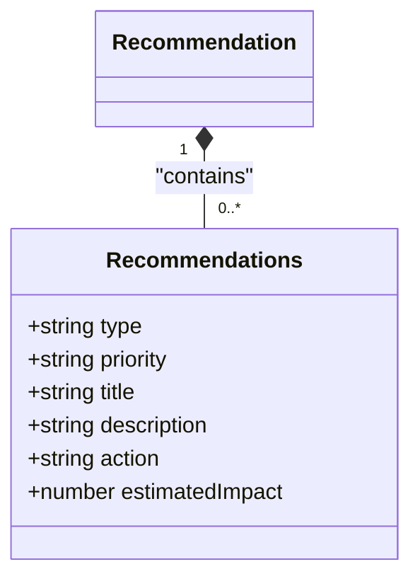

**Diagram sources**
- [Prediction.js](file://HarvestIQ/backend/models/Prediction.js#L165-L205)

### Processing Metadata

The `processing` section tracks the status and performance of the prediction generation:

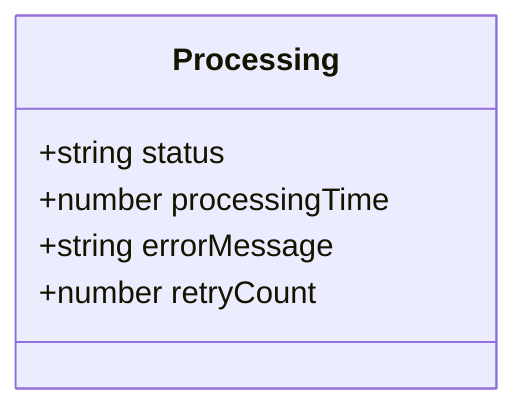

**Diagram sources**
- [Prediction.js](file://HarvestIQ/backend/models/Prediction.js#L245-L265)

## Validation Rules

The Prediction model implements comprehensive validation rules to ensure data integrity and quality.

### Required Input Validation

All critical input parameters are required and validated:

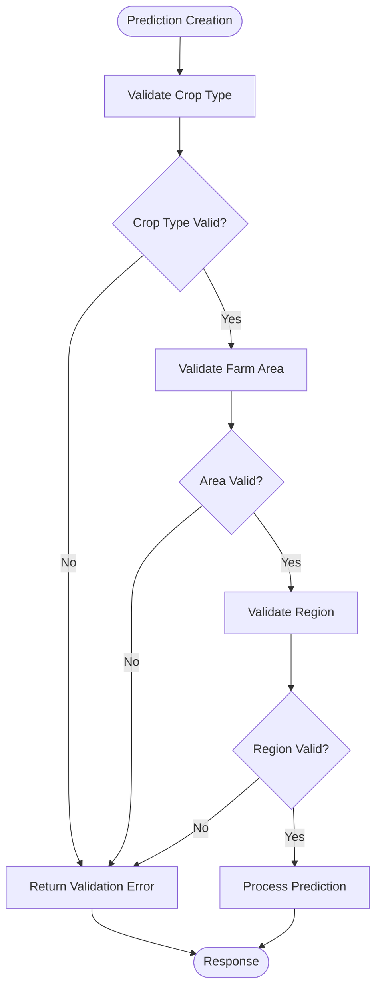

**Diagram sources**
- [Prediction.js](file://HarvestIQ/backend/models/Prediction.js#L20-L40)
- [validation.js](file://HarvestIQ/backend/utils/validation.js#L5-L20)

### Numerical Range Constraints

Environmental factors have strict numerical ranges to ensure realistic values:

| Field | Minimum | Maximum | Unit |
|-------|---------|---------|------|
| **Soil pH** | 0 | 14 | pH units |
| **Organic Content** | 0 | 100 | % |
| **Nitrogen** | 0 | ∞ | kg/ha |
| **Phosphorus** | 0 | ∞ | kg/ha |
| **Potassium** | 0 | ∞ | kg/ha |
| **Rainfall** | 0 | ∞ | mm |
| **Temperature** | -∞ | ∞ | °C |
| **Humidity** | 0 | 100 | % |
| **Confidence Score** | 0 | 100 | % |

**Section sources**
- [Prediction.js](file://HarvestIQ/backend/models/Prediction.js#L50-L85)

## Relationships

The Prediction model establishes relationships with several other core models in the system.

### User Relationship

Each prediction belongs to a specific user:

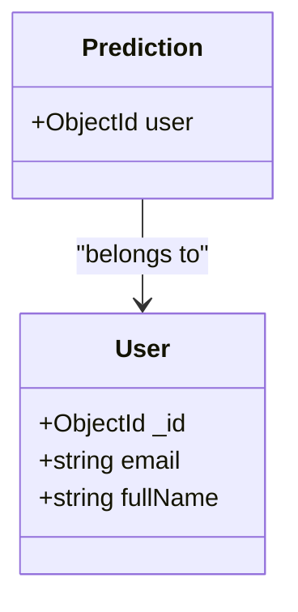

**Diagram sources**
- [Prediction.js](file://HarvestIQ/backend/models/Prediction.js#L10-L15)
- [User.js](file://HarvestIQ/backend/models/User.js#L1-L165)

### Field Relationship

Predictions can be associated with a specific field (optional):

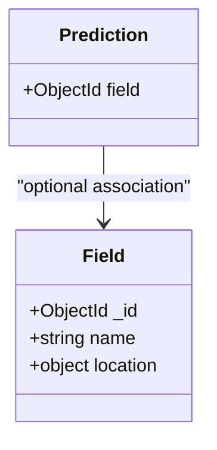

**Diagram sources**
- [Prediction.js](file://HarvestIQ/backend/models/Prediction.js#L20-L25)
- [Field.js](file://HarvestIQ/backend/models/Field.js#L1-L542)

### AI Model Relationship

Each prediction uses a specific AI model for processing:

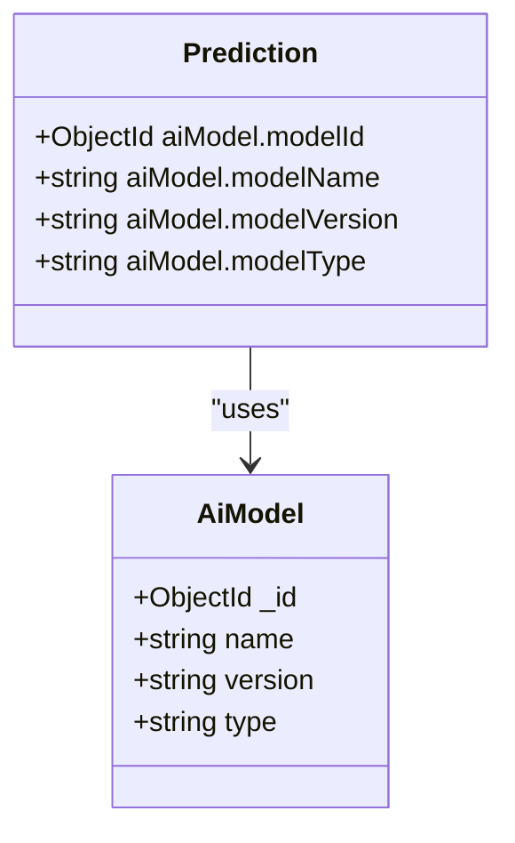

**Diagram sources**
- [Prediction.js](file://HarvestIQ/backend/models/Prediction.js#L100-L125)
- [AiModel.js](file://HarvestIQ/backend/models/AiModel.js#L1-L52)

## Processing Lifecycle

The prediction model implements a complete processing lifecycle with status tracking.

### Status Transitions

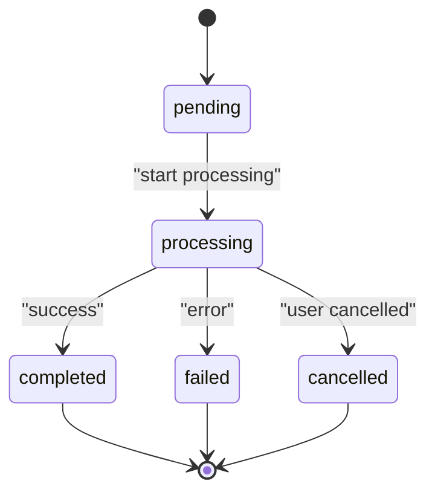

**Diagram sources**
- [Prediction.js](file://HarvestIQ/backend/models/Prediction.js#L250-L255)

### Processing Flow

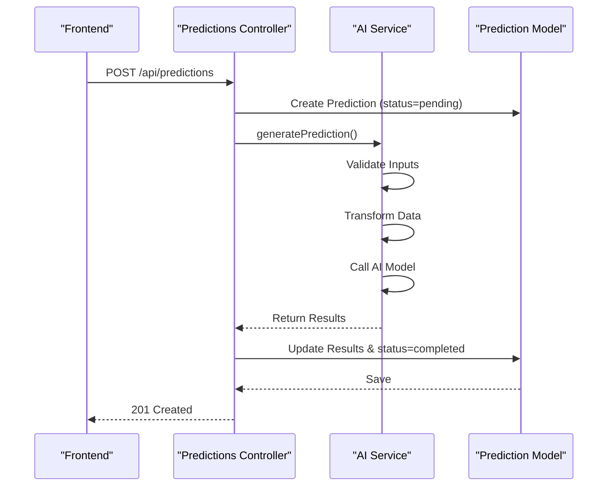

**Diagram sources**
- [predictions.js](file://HarvestIQ/backend/routes/predictions.js#L51-L177)
- [aiService.js](file://HarvestIQ/backend/services/aiService.js#L15-L50)

## Indexing Strategy

The Prediction model implements strategic indexing to optimize query performance.

```mermaid
erDiagram
Prediction {
string _id PK
string user FK
string field FK
string "aiModel.modelId" FK
string "processing.status"
datetime createdAt
}
Prediction ||--|{ User : "indexed"
Prediction }o--|| Field : "indexed"
Prediction }|--|| AiModel : "indexed"
class Prediction {
index user_createdAt (user, createdAt DESC)
index crop_region ("inputData.cropType", "inputData.region")
index status ("processing.status")
index model_type ("aiModel.modelType")
index archived (isArchived)
index created (createdAt DESC)
}
```

**Diagram sources**
- [Prediction.js](file://HarvestIQ/backend/models/Prediction.js#L300-L310)

## Sample Document

The following example shows a completed prediction for a wheat crop:

```json
{
  "_id": "64a1b2c3d4e5f6a7b8c9d0e1",
  "user": "64a1b2c3d4e5f6a7b8c9d0e0",
  "field": "64a1b2c3d4e5f6a7b8c9d0e2",
  "inputData": {
    "cropType": "Wheat",
    "farmArea": 2.5,
    "region": "Punjab",
    "soilData": {
      "phLevel": 6.8,
      "organicContent": 2.3,
      "nitrogen": 180,
      "phosphorus": 45,
      "potassium": 120
    },
    "weatherData": {
      "rainfall": 650,
      "temperature": 22.5,
      "humidity": 65
    }
  },
  "aiModel": {
    "modelId": "64a1b2c3d4e5f6a7b8c9d0e3",
    "modelName": "WheatYieldPredictor",
    "modelVersion": "2.1.0",
    "modelType": "python-ml"
  },
  "results": {
    "expectedYield": 12.8,
    "yieldPerHectare": 5.12,
    "totalYield": 12.8,
    "confidence": 92,
    "factors": {
      "weather": "user-input",
      "soil": "user-input",
      "yieldFactor": 1.15
    }
  },
  "recommendations": [
    {
      "type": "irrigation",
      "priority": "high",
      "title": "Optimize Irrigation Schedule",
      "description": "Current rainfall is optimal, but supplemental irrigation during flowering stage will improve yield.",
      "action": "Install drip irrigation system",
      "estimatedImpact": 15
    },
    {
      "type": "nutrition",
      "priority": "medium",
      "title": "Nitrogen Application",
      "description": "Soil nitrogen levels are adequate but could be improved for maximum yield.",
      "action": "Apply 30kg/ha nitrogen during tillering",
      "estimatedImpact": 8
    }
  ],
  "processing": {
    "status": "completed",
    "processingTime": 2450,
    "errorMessage": null,
    "retryCount": 0
  },
  "userFeedback": {
    "rating": null,
    "accuracy": null,
    "comments": "",
    "actualYield": null
  },
  "isArchived": false,
  "isPublic": false,
  "tags": ["wheat", "high-yield"],
  "notes": "First prediction for this field",
  "createdAt": "2023-07-01T10:30:00.000Z",
  "updatedAt": "2023-07-01T10:30:02.450Z"
}
```

**Section sources**
- [Prediction.js](file://HarvestIQ/backend/models/Prediction.js#L1-L387)

## Architecture Overview

The Prediction model integrates with multiple system components to deliver AI-powered insights.

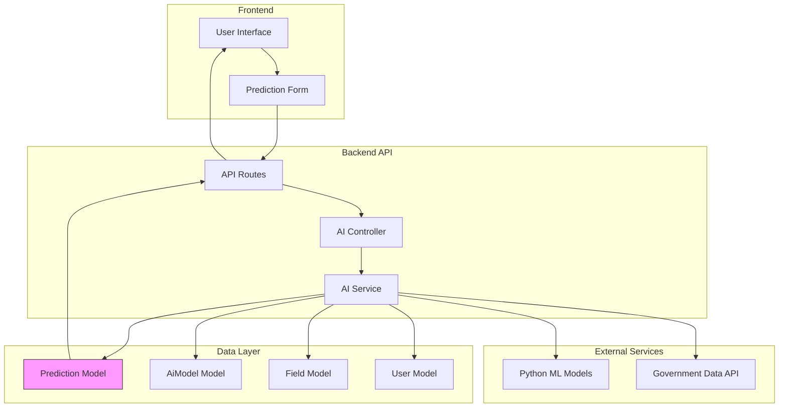

**Diagram sources**
- [predictions.js](file://HarvestIQ/backend/routes/predictions.js#L1-L468)
- [aiService.js](file://HarvestIQ/backend/services/aiService.js#L1-L481)
- [Prediction.js](file://HarvestIQ/backend/models/Prediction.js#L1-L387)

## Conclusion

The Prediction model serves as the cornerstone of HarvestIQ's AI functionality, capturing the complete lifecycle of agricultural yield predictions. It provides a robust framework for collecting input data, processing through AI models, and delivering actionable insights to farmers.

Key features of the model include comprehensive validation rules, strategic indexing for performance, rich relationships with users, fields, and AI models, and a complete processing lifecycle with status tracking. The model's nested structure organizes related data logically while maintaining flexibility for future enhancements.

As the primary output mechanism for AI insights, the Prediction model enables farmers to make data-driven decisions about crop management, ultimately improving yields and sustainability. Its design supports multiple AI model types and integration with external data sources, making it a versatile component of the HarvestIQ ecosystem.