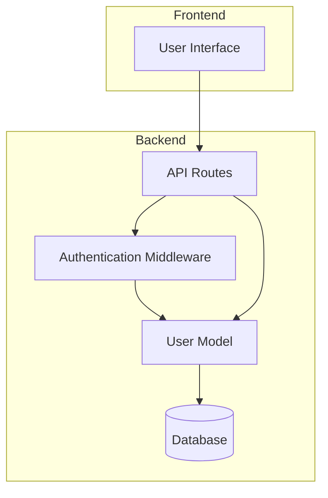
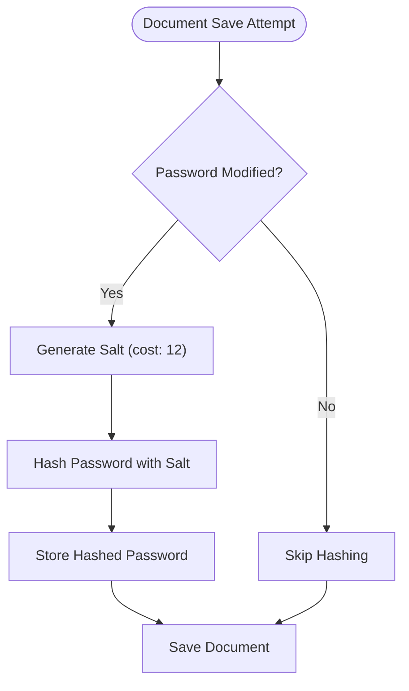
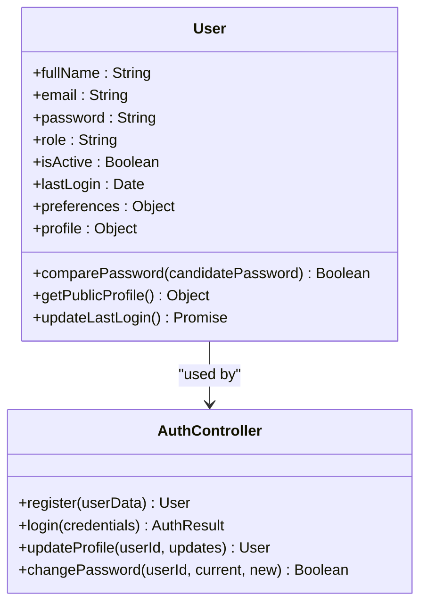
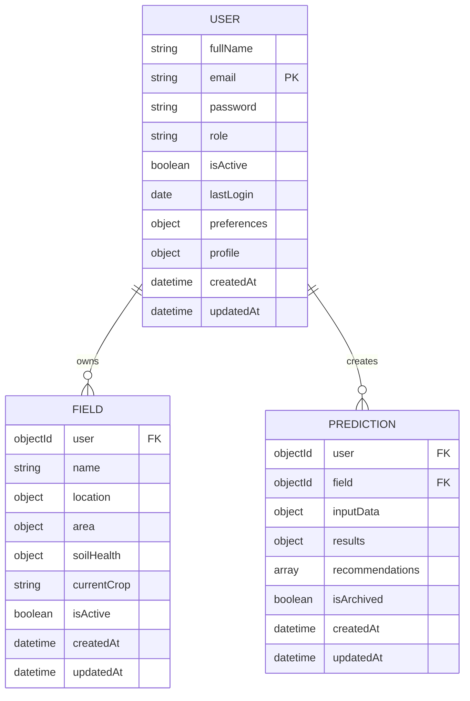
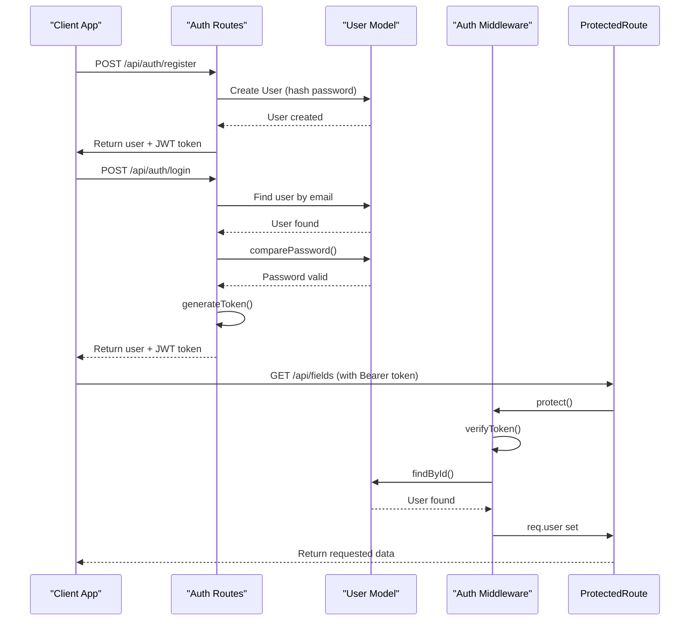
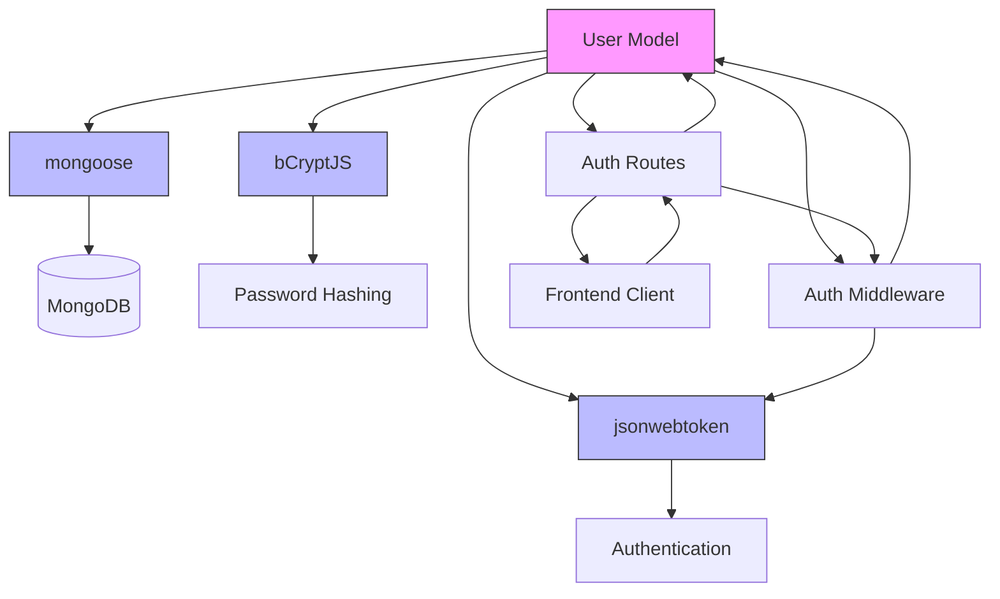

# User Model

<cite>
**Referenced Files in This Document**   
- [User.js](file://HarvestIQ/backend/models/User.js)
- [auth.js](file://HarvestIQ/backend/middleware/auth.js)
- [auth.js](file://HarvestIQ/backend/routes/auth.js)
</cite>

## Table of Contents
1. [Introduction](#introduction)
2. [Core Components](#core-components)
3. [Architecture Overview](#architecture-overview)
4. [Detailed Component Analysis](#detailed-component-analysis)
5. [Dependency Analysis](#dependency-analysis)
6. [Performance Considerations](#performance-considerations)
7. [Troubleshooting Guide](#troubleshooting-guide)
8. [Conclusion](#conclusion)

## Introduction
This document provides comprehensive documentation for the User model in HarvestIQ's backend system. The User model serves as the foundation for user management, authentication, and authorization within the application. It defines the structure, validation rules, security mechanisms, and relationships with other models in the system. The model is implemented using Mongoose and includes robust security features such as password hashing, role-based access control, and JWT-based authentication.

## Core Components
The User model is a Mongoose schema that defines the structure and behavior of user data in the HarvestIQ application. It includes essential fields such as email, password, name, role, preferences, and timestamps, with comprehensive validation and security measures. The model implements pre-save hooks for password hashing and provides instance methods for password comparison and profile management. It also establishes relationships with other models in the system, particularly Field and Prediction models, through reference fields.

**Section sources**
- [User.js](file://HarvestIQ/backend/models/User.js#L1-L165)

## Architecture Overview
The User model architecture is designed to support secure user management and authentication in the HarvestIQ application. It follows a layered approach with the Mongoose schema defining the data structure, middleware functions handling authentication logic, and route handlers implementing user-facing operations. The architecture integrates JWT-based authentication for stateless session management and implements role-based access control to enforce security policies across the application.

**Diagram sources**
- [User.js](file://HarvestIQ/backend/models/User.js#L1-L165)
- [auth.js](file://HarvestIQ/backend/middleware/auth.js#L1-L92)
- [auth.js](file://HarvestIQ/backend/routes/auth.js#L1-L302)

## Detailed Component Analysis

### User Schema Analysis
The User schema defines the complete structure of user data in the HarvestIQ application, including personal information, authentication credentials, preferences, and metadata.

#### Schema Fields
The User model contains the following fields with their respective validation rules and default values:

**User Schema Fields**
| Field | Type | Required | Unique | Default | Validation/Constraints |
|-------|------|----------|--------|---------|------------------------|
| fullName | String | Yes | No | None | Min length: 2, Max length: 100 |
| email | String | Yes | Yes | None | Valid email format, lowercase |
| password | String | Yes | No | None | Min length: 6, not selectable by default |
| avatar | String | No | No | null | None |
| role | String | No | No | "farmer" | Enum: ["farmer", "admin", "expert"] |
| isActive | Boolean | No | No | true | None |
| lastLogin | Date | No | No | null | None |
| preferences.language | String | No | No | "en" | Enum: supported languages |
| preferences.theme | String | No | No | "light" | Enum: ["light", "dark"] |
| preferences.notifications | Object | No | No | {email: true, weather: true, market: true} | None |
| profile.location | Object | No | No | None | State, district, coordinates |
| profile.farmingExperience | Number | No | No | None | Min: 0 |
| profile.farmSize | Number | No | No | None | Min: 0 |
| profile.primaryCrops | Array | No | No | [] | Array of strings |
| profile.farmingType | String | No | No | "conventional" | Enum: ["organic", "conventional", "mixed"] |

**Section sources**
- [User.js](file://HarvestIQ/backend/models/User.js#L1-L165)

#### Validation Rules
The User model implements comprehensive validation rules to ensure data integrity and security:

- **Email validation**: Enforces valid email format using regex pattern `/^[^\s@]+@[^\s@]+\.[^\s@]+$/` and automatically converts to lowercase
- **Password strength**: Requires minimum 6 characters and is validated at the route level to include uppercase, lowercase, and numeric characters
- **Name validation**: Requires 2-100 characters with trimming of whitespace
- **Role validation**: Restricted to predefined enum values: "farmer", "admin", or "expert"
- **Preference validation**: Language restricted to supported locales, theme restricted to "light" or "dark"

The validation is implemented at both the schema level and through route-level middleware to provide comprehensive data validation.

**Section sources**
- [User.js](file://HarvestIQ/backend/models/User.js#L1-L165)
- [auth.js](file://HarvestIQ/backend/routes/auth.js#L1-L302)

#### Pre-Save Hook
The User model implements a pre-save middleware hook that automatically hashes passwords before storage in the database:

**Diagram sources**
- [User.js](file://HarvestIQ/backend/models/User.js#L114-L125)

The pre-save hook only executes when the password field is modified or when creating a new user, preventing unnecessary re-hashing of existing passwords. It uses bcrypt with a salt cost of 12 to ensure strong password security.

**Section sources**
- [User.js](file://HarvestIQ/backend/models/User.js#L114-L125)

#### Instance Methods
The User model provides several instance methods for common operations:

- **comparePassword**: Compares a candidate password with the stored hashed password using bcrypt
- **getPublicProfile**: Returns user data without sensitive information (password)
- **updateLastLogin**: Updates the lastLogin timestamp and saves the document

**Diagram sources**
- [User.js](file://HarvestIQ/backend/models/User.js#L127-L155)

**Section sources**
- [User.js](file://HarvestIQ/backend/models/User.js#L127-L155)

### Relationship Analysis
The User model establishes relationships with other models in the system through reference fields and virtual properties.

#### One-to-Many Relationships
The User model has one-to-many relationships with both the Field and Prediction models:

- **User → Field**: One user can have multiple fields
- **User → Prediction**: One user can have multiple predictions

These relationships are implemented using Mongoose ObjectId references in the Field and Prediction models, with the User model containing a virtual field for prediction count.

**Diagram sources**
- [User.js](file://HarvestIQ/backend/models/User.js#L1-L165)
- [Field.js](file://HarvestIQ/backend/models/Field.js#L1-L542)
- [Prediction.js](file://HarvestIQ/backend/models/Prediction.js#L1-L387)

**Section sources**
- [User.js](file://HarvestIQ/backend/models/User.js#L1-L165)
- [Field.js](file://HarvestIQ/backend/models/Field.js#L1-L542)
- [Prediction.js](file://HarvestIQ/backend/models/Prediction.js#L1-L387)

### Authentication Flow
The authentication system in HarvestIQ uses JWT tokens to manage user sessions and provide secure access to protected routes.

**Diagram sources**
- [User.js](file://HarvestIQ/backend/models/User.js#L1-L165)
- [auth.js](file://HarvestIQ/backend/middleware/auth.js#L1-L92)
- [auth.js](file://HarvestIQ/backend/routes/auth.js#L1-L302)

**Section sources**
- [User.js](file://HarvestIQ/backend/models/User.js#L1-L165)
- [auth.js](file://HarvestIQ/backend/middleware/auth.js#L1-L92)
- [auth.js](file://HarvestIQ/backend/routes/auth.js#L1-L302)

## Dependency Analysis
The User model has dependencies on several external packages and internal modules that enable its functionality.

**Diagram sources**
- [User.js](file://HarvestIQ/backend/models/User.js#L1-L165)
- [auth.js](file://HarvestIQ/backend/middleware/auth.js#L1-L92)
- [package-lock.json](file://HarvestIQ/backend/package-lock.json#L846-L886)

**Section sources**
- [User.js](file://HarvestIQ/backend/models/User.js#L1-L165)
- [auth.js](file://HarvestIQ/backend/middleware/auth.js#L1-L92)

## Performance Considerations
The User model implementation includes several performance optimizations:

- **Indexing**: The email field is indexed for fast lookups during authentication
- **Selective field retrieval**: Password field is excluded by default from queries to reduce data transfer
- **Caching**: JWT tokens reduce database queries for authenticated requests
- **Efficient validation**: Validation is performed at both schema and route levels to catch errors early

The model also implements virtual fields for derived data (like prediction count) that can be computed on demand rather than stored in the database, reducing storage requirements while maintaining query flexibility.

## Troubleshooting Guide
Common issues and solutions for the User model:

- **Duplicate email errors**: Ensure email uniqueness constraint is properly enforced and check for existing users before registration
- **Authentication failures**: Verify JWT secret is correctly configured in environment variables
- **Password hashing issues**: Check bcrypt installation and ensure pre-save hooks are properly registered
- **Role-based access issues**: Verify role values match expected enum values and checkOwnership middleware configuration

When debugging authentication issues, check the server logs for error messages from the auth middleware and verify that the JWT token is being properly included in request headers.

**Section sources**
- [User.js](file://HarvestIQ/backend/models/User.js#L1-L165)
- [auth.js](file://HarvestIQ/backend/middleware/auth.js#L1-L92)

## Conclusion
The User model in HarvestIQ's backend provides a robust foundation for user management and authentication. It implements industry-standard security practices including bcrypt password hashing, JWT-based authentication, and role-based access control. The model is well-structured with comprehensive validation, efficient indexing, and clear relationships with other models in the system. Its design supports the application's requirements for secure user management while providing flexibility for future enhancements.