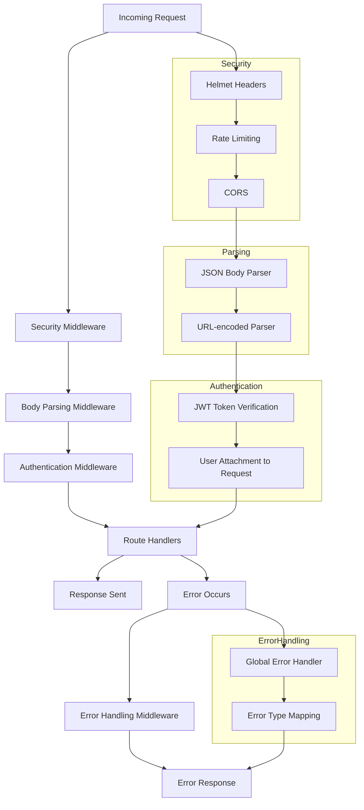
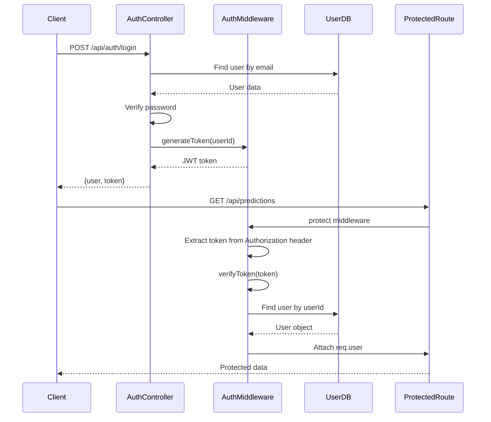
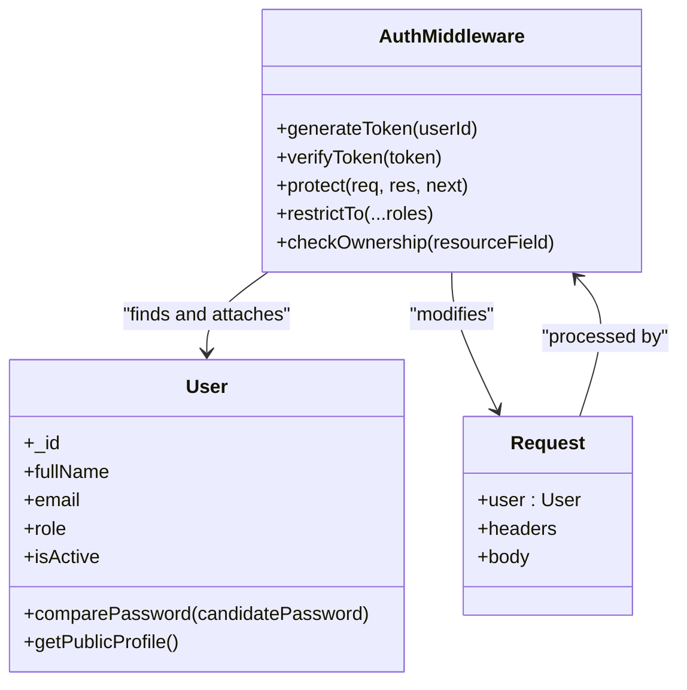
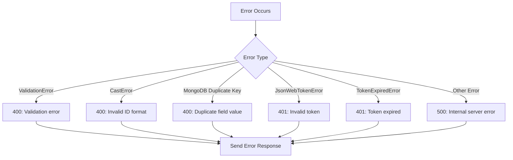

# Middleware

<cite>
**Referenced Files in This Document**   
- [auth.js](file://HarvestIQ/backend/middleware/auth.js)
- [server.js](file://HarvestIQ/backend/server.js)
- [predictions.js](file://HarvestIQ/backend/routes/predictions.js)
- [fields.js](file://HarvestIQ/backend/routes/fields.js)
- [auth.js](file://HarvestIQ/backend/routes/auth.js)
- [User.js](file://HarvestIQ/backend/models/User.js)
</cite>

## Table of Contents
1. [Introduction](#introduction)
2. [Middleware in Express.js Request Lifecycle](#middleware-in-expressjs-request-lifecycle)
3. [Authentication Middleware Implementation](#authentication-middleware-implementation)
4. [Error Handling Middleware](#error-handling-middleware)
5. [Middleware Registration and Execution Order](#middleware-registration-and-execution-order)
6. [Integration with Authentication Flow](#integration-with-authentication-flow)
7. [Conclusion](#conclusion)

## Introduction

This document provides comprehensive documentation for the middleware components in HarvestIQ's backend, with a primary focus on the authentication middleware. The middleware architecture plays a critical role in implementing cross-cutting concerns such as authentication, authorization, error handling, and security across the Express.js application. The authentication system is built around JWT (JSON Web Tokens) for stateless user authentication, with middleware functions that verify tokens, extract user information, and attach it to the request object for downstream handlers.

**Section sources**
- [auth.js](file://HarvestIQ/backend/middleware/auth.js#L1-L92)
- [server.js](file://HarvestIQ/backend/server.js#L1-L152)

## Middleware in Express.js Request Lifecycle

In Express.js, middleware functions are functions that have access to the request object (req), the response object (res), and the next middleware function in the application's request-response cycle. These functions can execute any code, make changes to the request and response objects, end the request-response cycle, or call the next middleware function in the stack.

The request lifecycle in HarvestIQ's backend follows a specific middleware execution order that ensures proper handling of requests from initial processing to final response. The middleware stack begins with security middleware (helmet, rate limiting, CORS), followed by body parsing middleware, then application-specific middleware (authentication), route handlers, and finally error handling middleware.



**Diagram sources **
- [server.js](file://HarvestIQ/backend/server.js#L20-L65)

**Section sources**
- [server.js](file://HarvestIQ/backend/server.js#L20-L65)

## Authentication Middleware Implementation

The authentication middleware in HarvestIQ implements JWT-based authentication for protecting routes and managing user sessions. The core implementation is contained in the `auth.js` file within the middleware directory, which exports several key functions: `protect`, `restrictTo`, `checkOwnership`, `generateToken`, and `verifyToken`.

### JWT Token Generation and Verification

The authentication system uses JSON Web Tokens for stateless authentication. The `generateToken` function creates a JWT containing the user ID, signed with a secret key from environment variables and set to expire after a configurable period (defaulting to 7 days). The `verifyToken` function validates incoming tokens using the same secret key.



**Diagram sources **
- [auth.js](file://HarvestIQ/backend/middleware/auth.js#L4-L13)
- [auth.js](file://HarvestIQ/backend/middleware/auth.js#L16-L63)
- [User.js](file://HarvestIQ/backend/models/User.js#L1-L165)

### Token Extraction and Validation Process

The `protect` middleware function implements the core authentication logic by extracting the JWT token from the Authorization header, verifying its validity, and attaching the authenticated user to the request object. The process follows these steps:

1. Extract token from Authorization header (Bearer token format)
2. Validate that a token exists
3. Verify the token signature and decode the payload
4. Find the user in the database by the userId in the token
5. Verify the user exists and is active
6. Attach the user object to req.user for downstream handlers
7. Call next() to proceed to the next middleware or route handler

The middleware handles various error conditions including missing tokens, invalid tokens, expired tokens, and database errors, returning appropriate HTTP status codes and error messages.

**Section sources**
- [auth.js](file://HarvestIQ/backend/middleware/auth.js#L16-L63)
- [User.js](file://HarvestIQ/backend/models/User.js#L1-L165)

### Authorization and Ownership Checking

In addition to basic authentication, the middleware provides authorization functions to restrict access based on user roles and resource ownership. The `restrictTo` middleware allows protecting routes to specific user roles (farmer, admin, expert), while the `checkOwnership` middleware ensures users can only access resources they own.



**Diagram sources **
- [auth.js](file://HarvestIQ/backend/middleware/auth.js#L1-L92)
- [User.js](file://HarvestIQ/backend/models/User.js#L1-L165)

## Error Handling Middleware

The global error handling middleware in HarvestIQ's backend translates various error types into appropriate HTTP responses with meaningful error messages. This middleware is defined in the `server.js` file and handles different error scenarios including validation errors, database errors, and JWT-related errors.

### Error Type Mapping

The error handler maps specific error types to appropriate HTTP status codes and user-friendly messages:

| Error Type | HTTP Status | Message |
|-----------|-----------|---------|
| ValidationError | 400 | Validation error |
| CastError | 400 | Invalid ID format |
| MongoDB Duplicate Key | 400 | Duplicate field value |
| JsonWebTokenError | 401 | Invalid token |
| TokenExpiredError | 401 | Token expired |
| Default | 500 | Internal server error |



**Diagram sources **
- [server.js](file://HarvestIQ/backend/server.js#L120-L145)

**Section sources**
- [server.js](file://HarvestIQ/backend/server.js#L120-L145)

## Middleware Registration and Execution Order

Middleware in Express.js is executed in the order it is registered, making the sequence of middleware registration critical to the application's behavior. In HarvestIQ's backend, middleware is registered in a specific order to ensure proper processing of requests.

### Application-Level Middleware

The main `server.js` file registers middleware at the application level, establishing the global middleware stack:

1. Security middleware (helmet, rate limiting, CORS)
2. Body parsing middleware (JSON and URL-encoded)
3. Route-specific middleware (authentication)
4. Route handlers
5. Error handling middleware

### Route-Level Middleware

Route files import and apply middleware to specific routes or groups of routes. For example, the predictions routes apply the `protect` middleware to all routes, ensuring authentication is required for all prediction-related operations.

```mermaid
graph TB
subgraph ServerJS
A[app.use(helmet)]
B[app.use(limiter)]
C[app.use(cors)]
D[app.use(express.json)]
E[app.use('/api/predictions', predictionRoutes)]
F[Global Error Handler]
end
subgraph PredictionsJS
G[router.use(protect)]
H[POST /api/predictions]
I[GET /api/predictions]
J[GET /api/predictions/:id]
end
A --> B --> C --> D --> E --> F
G --> H
G --> I
G --> J
```

**Diagram sources **
- [server.js](file://HarvestIQ/backend/server.js#L20-L152)
- [predictions.js](file://HarvestIQ/backend/routes/predictions.js#L1-L468)

**Section sources**
- [server.js](file://HarvestIQ/backend/server.js#L20-L152)
- [predictions.js](file://HarvestIQ/backend/routes/predictions.js#L1-L468)
- [fields.js](file://HarvestIQ/backend/routes/fields.js#L1-L249)
- [auth.js](file://HarvestIQ/backend/routes/auth.js#L1-L302)

## Integration with Authentication Flow

The authentication middleware is tightly integrated with the overall authentication flow in HarvestIQ, working in conjunction with the authentication routes and user model to provide a complete authentication system.

### Token Generation in Authentication Routes

When a user successfully logs in or registers, the authentication controller calls the `generateToken` function from the middleware to create a JWT that is returned to the client. This token is then used in subsequent requests to authenticate the user.

### Protected Route Examples

Multiple routes in the application use the authentication middleware to protect access to sensitive data and operations:

- **Predictions Routes**: All prediction-related operations require authentication
- **Fields Routes**: Field management requires authentication
- **User Profile Routes**: Profile access and updates require authentication

The middleware ensures that only authenticated users can access these protected resources, and that users can only access their own data through ownership verification.

**Section sources**
- [auth.js](file://HarvestIQ/backend/middleware/auth.js#L4-L8)
- [auth.js](file://HarvestIQ/backend/routes/auth.js#L1-L302)
- [predictions.js](file://HarvestIQ/backend/routes/predictions.js#L1-L468)
- [fields.js](file://HarvestIQ/backend/routes/fields.js#L1-L249)

## Conclusion

The middleware architecture in HarvestIQ's backend provides a robust foundation for handling cross-cutting concerns such as authentication, authorization, and error handling. The JWT-based authentication middleware effectively secures the API by verifying tokens, extracting user information, and attaching it to the request object for downstream handlers. The global error handling middleware ensures consistent error responses across the application, translating various error types into appropriate HTTP responses. The middleware registration pattern follows Express.js best practices, with security and parsing middleware applied globally, and authentication middleware applied at the route level to protect sensitive endpoints. This architecture enables a secure, maintainable, and scalable backend system that effectively supports the agricultural intelligence platform's requirements.