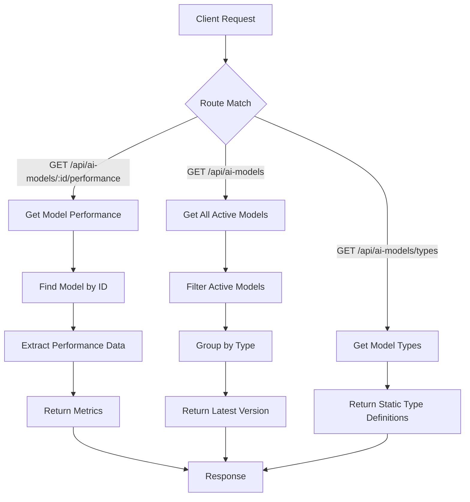
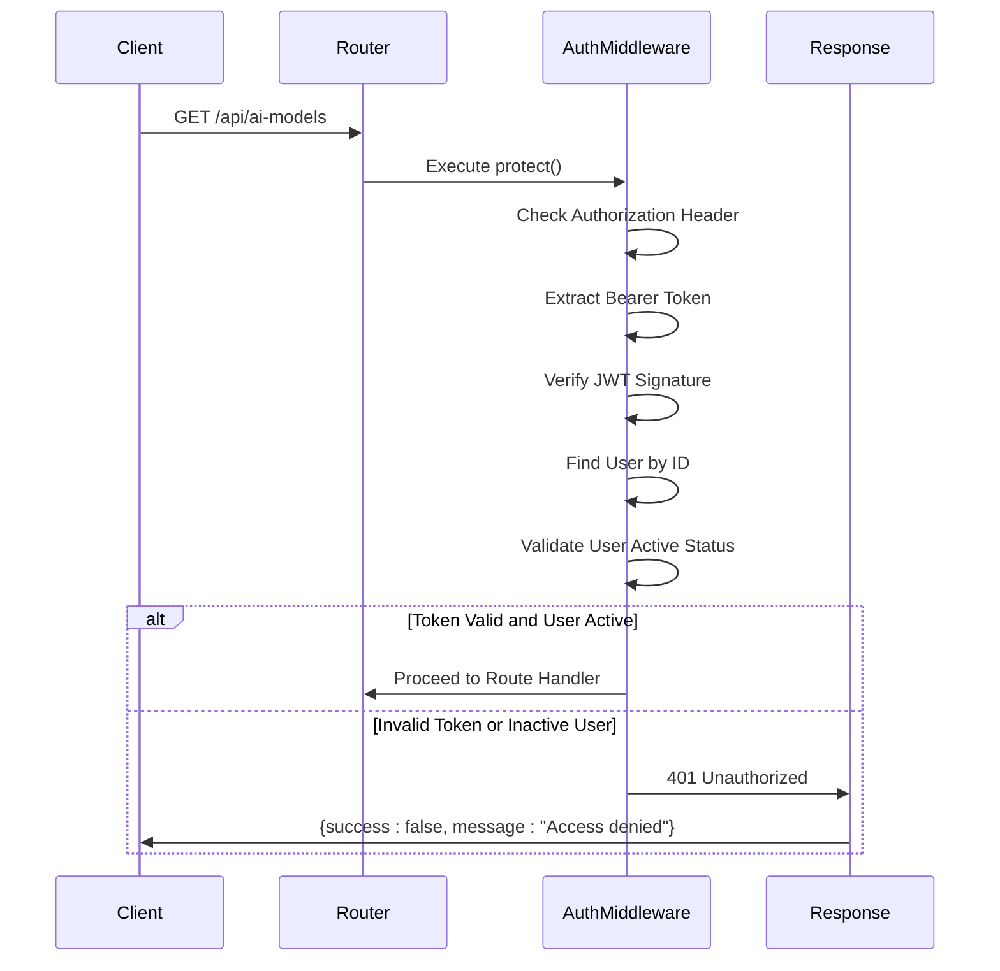
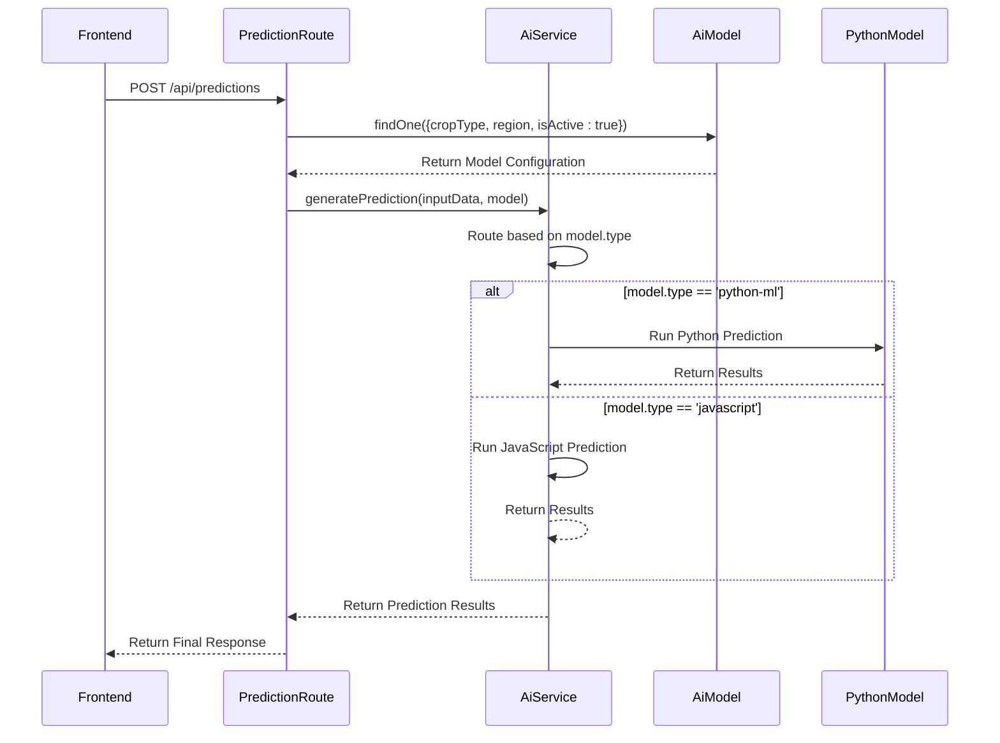
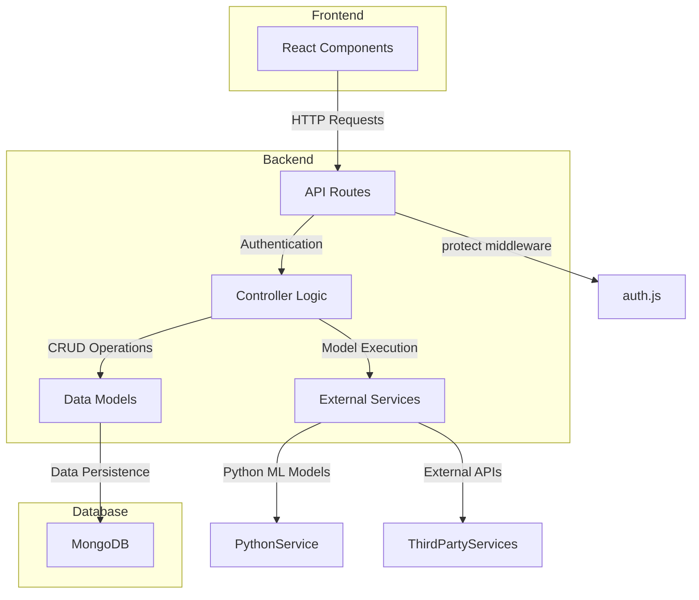

# AI Model Metadata Routes

<cite>
**Referenced Files in This Document**   
- [aiModels.js](file://HarvestIQ/backend/routes/aiModels.js)
- [AiModel.js](file://HarvestIQ/backend/models/AiModel.js)
- [auth.js](file://HarvestIQ/backend/middleware/auth.js)
- [aiController.js](file://HarvestIQ/backend/controllers/aiController.js)
- [predictions.js](file://HarvestIQ/backend/routes/predictions.js)
- [aiService.js](file://HarvestIQ/backend/services/aiService.js)
</cite>

## Table of Contents
1. [Introduction](#introduction)
2. [Core Endpoints](#core-endpoints)
3. [Model Data Structure](#model-data-structure)
4. [Authentication and Authorization](#authentication-and-authorization)
5. [API Response Examples](#api-response-examples)
6. [Integration with Prediction Engine](#integration-with-prediction-engine)
7. [Use Cases](#use-cases)
8. [Architecture Overview](#architecture-overview)
9. [Error Handling](#error-handling)
10. [Conclusion](#conclusion)

## Introduction

The AI Model Metadata Routes module in HarvestIQ's backend provides a RESTful API for managing and retrieving AI model configurations used in the prediction engine. This system enables dynamic model selection based on crop type, region, and performance metrics, supporting HarvestIQ's agricultural prediction capabilities. The module exposes endpoints for listing available models, retrieving model performance data, and accessing model type information, all protected by authentication middleware to ensure secure access.

**Section sources**
- [aiModels.js](file://HarvestIQ/backend/routes/aiModels.js#L1-L153)

## Core Endpoints

The AI model metadata routing module exposes three primary endpoints for accessing model information. The GET /api/ai-models endpoint retrieves all active AI models, grouping them by type and returning only the latest version of each model type. This endpoint is designed to provide frontend applications with a curated list of available models for user selection. The GET /api/ai-models/:id/performance endpoint retrieves detailed performance metrics for a specific model, including accuracy, success rate, and processing statistics. Additionally, the GET /api/ai-models/types endpoint provides metadata about available model types, including their capabilities and availability characteristics.



**Diagram sources**
- [aiModels.js](file://HarvestIQ/backend/routes/aiModels.js#L1-L153)

**Section sources**
- [aiModels.js](file://HarvestIQ/backend/routes/aiModels.js#L1-L153)

## Model Data Structure

The AiModel schema defines the structure for storing AI model configurations in the MongoDB database. Each model includes essential metadata fields such as name, description, version, and type, with validation rules to ensure data integrity. The model type is restricted to predefined values including 'javascript', 'python-ml', 'python-dl', and 'ensemble', enabling the system to route predictions to appropriate processing engines. Additional fields capture crop-specific information, accuracy metrics, and activation status, allowing for targeted model selection based on agricultural context.

```mermaid
classDiagram
class AiModel {
+String name
+String description
+String version
+String type
+String cropType
+String region
+Number accuracy
+Boolean isActive
+Date createdAt
+Date updatedAt
}
AiModel : +required name
AiModel : +required version
AiModel : +required type
AiModel : +required cropType
AiModel : +enum type[JavaScript,Python-ML,Python-DL,Ensemble]
AiModel : +default isActive : true
```

**Diagram sources**
- [AiModel.js](file://HarvestIQ/backend/models/AiModel.js#L4-L52)

**Section sources**
- [AiModel.js](file://HarvestIQ/backend/models/AiModel.js#L4-L52)

## Authentication and Authorization

All AI model metadata routes are protected by the authentication middleware defined in auth.js. The protect middleware intercepts requests, validates JWT tokens from the Authorization header, and attaches the authenticated user to the request object. This ensures that only authenticated users can access model information, maintaining system security. The middleware checks for token presence, verifies its validity, and confirms the user's active status before allowing request processing to continue. Error responses are standardized to provide clear feedback for authentication failures while avoiding information leakage.



**Diagram sources**
- [auth.js](file://HarvestIQ/backend/middleware/auth.js#L16-L63)
- [aiModels.js](file://HarvestIQ/backend/routes/aiModels.js#L6-L8)

**Section sources**
- [auth.js](file://HarvestIQ/backend/middleware/auth.js#L16-L63)
- [aiModels.js](file://HarvestIQ/backend/routes/aiModels.js#L6-L8)

## API Response Examples

The AI model metadata endpoints return standardized JSON responses with consistent structure. When retrieving all available models, the response includes a success flag, count of returned models, and an array of model objects containing name, description, version, type, and performance metrics. For model performance requests, additional detailed metrics are included such as total predictions, success rate, and average confidence. The model types endpoint returns a comprehensive list of available model types with their features and availability characteristics, enabling frontend applications to present meaningful information to users.

**Section sources**
- [aiModels.js](file://HarvestIQ/backend/routes/aiModels.js#L15-L45)
- [aiModels.js](file://HarvestIQ/backend/routes/aiModels.js#L50-L90)

## Integration with Prediction Engine

The AI model metadata system is tightly integrated with HarvestIQ's prediction engine, enabling dynamic model selection based on input parameters. When a prediction request is received, the system queries the AiModel collection to find the most appropriate model based on crop type and region. The aiService class uses this metadata to route requests to the correct processing engine, whether JavaScript, Python-based, ensemble, or external API. Model performance data is updated after each prediction, creating a feedback loop that informs future model selection and enables continuous improvement of prediction accuracy.



**Diagram sources**
- [predictions.js](file://HarvestIQ/backend/routes/predictions.js#L51-L177)
- [aiService.js](file://HarvestIQ/backend/services/aiService.js#L15-L50)
- [AiModel.js](file://HarvestIQ/backend/models/AiModel.js#L4-L52)

**Section sources**
- [predictions.js](file://HarvestIQ/backend/routes/predictions.js#L51-L177)
- [aiService.js](file://HarvestIQ/backend/services/aiService.js#L15-L50)

## Use Cases

The AI model metadata routes support several key use cases in the HarvestIQ application. The frontend model selection dropdown uses the GET /api/ai-models endpoint to populate options, allowing users to choose from available models for their predictions. Administrators use the Settings interface to manage model configurations, viewing performance metrics and activation status to make informed decisions about model deployment. The prediction engine leverages model metadata to automatically select the most appropriate model based on crop and region, ensuring optimal prediction accuracy. Additionally, the model types endpoint enables educational tooltips and feature comparisons in the user interface.

**Section sources**
- [aiModels.js](file://HarvestIQ/backend/routes/aiModels.js#L15-L153)
- [AiModel.js](file://HarvestIQ/backend/models/AiModel.js#L4-L52)

## Architecture Overview

The AI model metadata system follows a layered architecture with clear separation of concerns. The routes layer handles HTTP request routing and authentication, the controller layer processes business logic, and the model layer manages data persistence. This modular design enables independent development and testing of components while maintaining loose coupling. The system integrates with external services such as Python-based ML models through well-defined interfaces, allowing for technology flexibility and scalability. The use of middleware for authentication ensures consistent security policies across all endpoints.



**Diagram sources**
- [aiModels.js](file://HarvestIQ/backend/routes/aiModels.js#L1-L153)
- [aiController.js](file://HarvestIQ/backend/controllers/aiController.js#L1-L186)
- [AiModel.js](file://HarvestIQ/backend/models/AiModel.js#L1-L52)
- [aiService.js](file://HarvestIQ/backend/services/aiService.js#L1-L481)

**Section sources**
- [aiModels.js](file://HarvestIQ/backend/routes/aiModels.js#L1-L153)
- [aiController.js](file://HarvestIQ/backend/controllers/aiController.js#L1-L186)
- [AiModel.js](file://HarvestIQ/backend/models/AiModel.js#L1-L52)

## Error Handling

The AI model metadata routes implement comprehensive error handling to ensure robust operation under various failure conditions. All endpoints wrap their logic in try-catch blocks to capture and handle exceptions gracefully. Database errors, such as invalid model IDs, are specifically handled to return appropriate HTTP status codes and user-friendly messages. The system logs detailed error information for debugging while returning sanitized responses to clients to prevent information leakage. Authentication errors are standardized across all protected routes, providing consistent user feedback for access violations.

**Section sources**
- [aiModels.js](file://HarvestIQ/backend/routes/aiModels.js#L15-L45)
- [aiModels.js](file://HarvestIQ/backend/routes/aiModels.js#L50-L90)
- [auth.js](file://HarvestIQ/backend/middleware/auth.js#L16-L63)

## Conclusion

The AI Model Metadata Routes module provides a robust foundation for managing and accessing AI model configurations in HarvestIQ's backend. By exposing well-designed endpoints with comprehensive metadata, the system enables dynamic model selection and informed decision-making in the prediction engine. The integration of authentication middleware ensures secure access to model information, while the standardized response format simplifies frontend integration. This architecture supports HarvestIQ's goal of delivering accurate agricultural predictions through flexible, maintainable, and scalable AI model management.