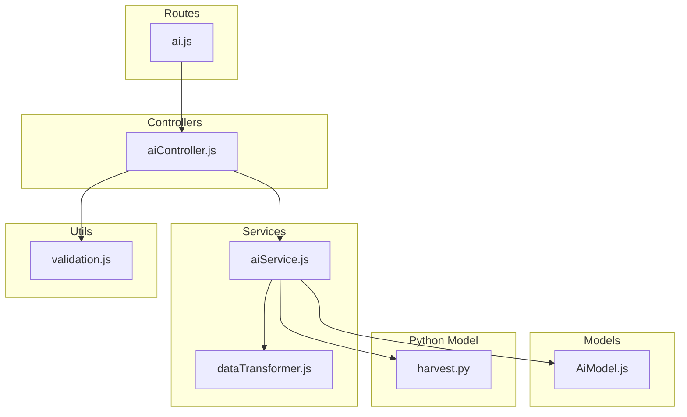
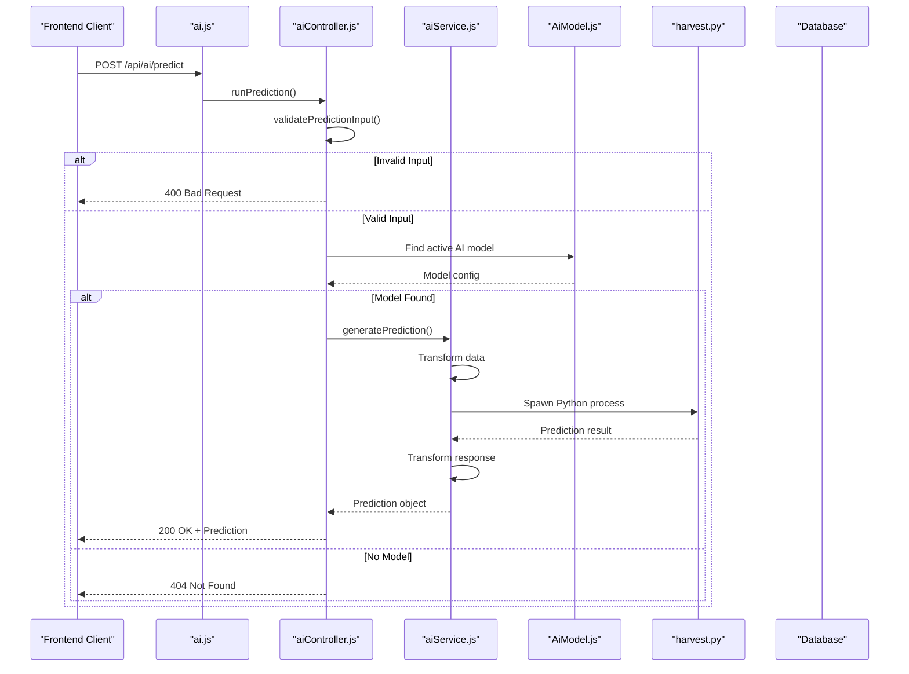
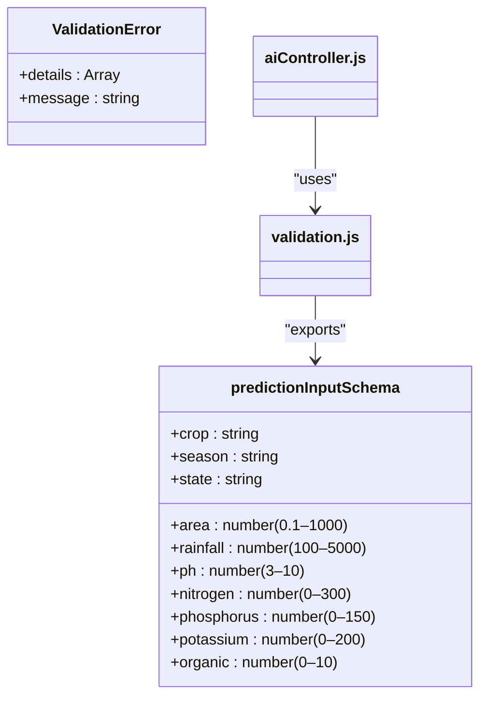
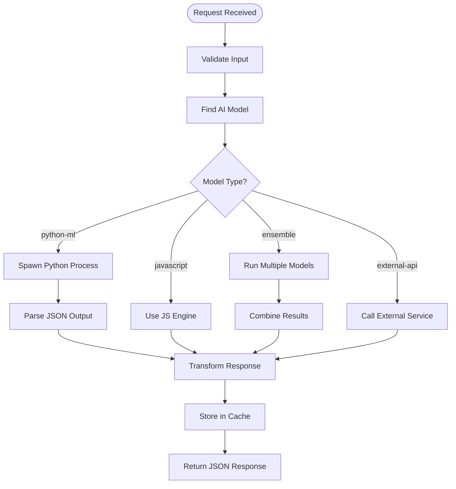
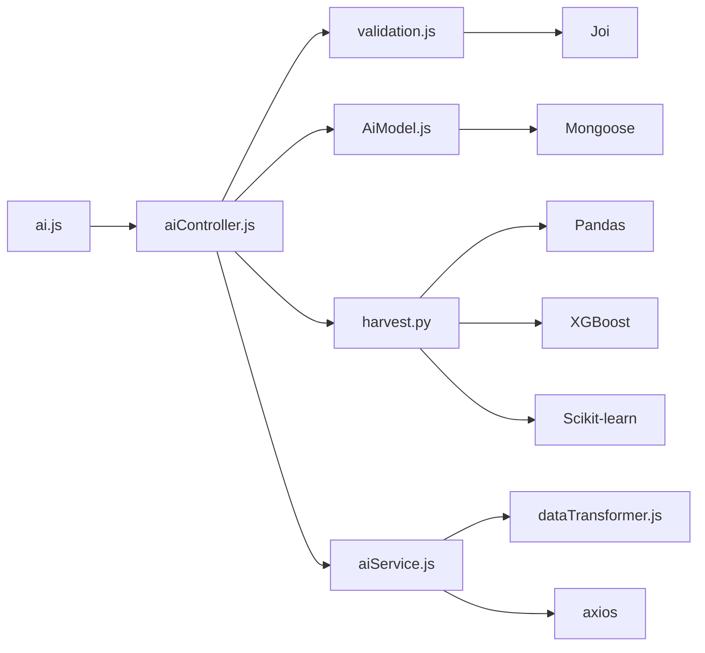

# AI Prediction Execution Routes

<cite>
**Referenced Files in This Document**   
- [ai.js](file://HarvestIQ/backend/routes/ai.js)
- [aiController.js](file://HarvestIQ/backend/controllers/aiController.js)
- [aiService.js](file://HarvestIQ/backend/services/aiService.js)
- [validation.js](file://HarvestIQ/backend/utils/validation.js)
- [AiModel.js](file://HarvestIQ/backend/models/AiModel.js)
- [harvest.py](file://HarvestIQ/Py model/harvest.py)
</cite>

## Table of Contents
1. [Introduction](#introduction)
2. [Project Structure](#project-structure)
3. [Core Components](#core-components)
4. [Architecture Overview](#architecture-overview)
5. [Detailed Component Analysis](#detailed-component-analysis)
6. [Dependency Analysis](#dependency-analysis)
7. [Performance Considerations](#performance-considerations)
8. [Troubleshooting Guide](#troubleshooting-guide)
9. [Conclusion](#conclusion)

## Introduction
This document provides a comprehensive analysis of the AI prediction execution routing module in HarvestIQ's backend system. It focuses on the `POST /api/ai/predict` endpoint, which enables real-time crop yield predictions by integrating JavaScript-based logic and external Python machine learning models. The module orchestrates input validation, model selection, prediction execution, and response formatting to deliver actionable agricultural insights. This documentation details the workflow, data flow, error handling, and integration architecture to support developers, data scientists, and system administrators.

## Project Structure

**Diagram sources**
- [ai.js](file://HarvestIQ/backend/routes/ai.js#L1-L12)
- [aiController.js](file://HarvestIQ/backend/controllers/aiController.js#L1-L186)
- [aiService.js](file://HarvestIQ/backend/services/aiService.js#L1-L481)
- [AiModel.js](file://HarvestIQ/backend/models/AiModel.js#L1-L52)
- [validation.js](file://HarvestIQ/backend/utils/validation.js#L1-L20)
- [harvest.py](file://HarvestIQ/Py model/harvest.py#L1-L128)

**Section sources**
- [ai.js](file://HarvestIQ/backend/routes/ai.js#L1-L12)
- [aiController.js](file://HarvestIQ/backend/controllers/aiController.js#L1-L186)

## Core Components

The AI prediction execution pipeline consists of several key components that work in concert to process prediction requests. The entry point is the `/api/ai/predict` route defined in `ai.js`, which delegates to the `runPrediction` controller function in `aiController.js`. This function validates input using `validatePredictionInput` from `validation.js`, selects an appropriate AI model via `AiModel.js`, and executes the prediction using either a Python ML model or a JavaScript fallback. The `aiService.js` orchestrates cross-language model execution, manages retries, and handles data transformation between systems.

**Section sources**
- [aiController.js](file://HarvestIQ/backend/controllers/aiController.js#L126-L186)
- [aiService.js](file://HarvestIQ/backend/services/aiService.js#L1-L481)
- [validation.js](file://HarvestIQ/backend/utils/validation.js#L1-L20)

## Architecture Overview

**Diagram sources**
- [ai.js](file://HarvestIQ/backend/routes/ai.js#L1-L12)
- [aiController.js](file://HarvestIQ/backend/controllers/aiController.js#L126-L186)
- [aiService.js](file://HarvestIQ/backend/services/aiService.js#L1-L481)
- [harvest.py](file://HarvestIQ/Py model/harvest.py#L1-L128)

## Detailed Component Analysis

### Prediction Execution Flow

The `runPrediction` function in `aiController.js` serves as the main entry point for AI predictions. It first validates the incoming request payload using Joi-based schema validation. Upon successful validation, it queries the `AiModel` collection to find an active model matching the specified crop type and region. If a Python-based model is selected, it spawns a child process to execute `harvest.py` with the input data. The result is parsed and returned in a standardized JSON format.

**Section sources**
- [aiController.js](file://HarvestIQ/backend/controllers/aiController.js#L126-L186)
- [validation.js](file://HarvestIQ/backend/utils/validation.js#L1-L20)

### Input Validation and Schema

**Diagram sources**
- [validation.js](file://HarvestIQ/backend/utils/validation.js#L1-L20)
- [aiController.js](file://HarvestIQ/backend/controllers/aiController.js#L126-L186)

### AI Model Integration and Service Orchestration

The `AIService` class in `aiService.js` provides a unified interface for executing predictions across different model types. It supports JavaScript fallbacks, Python ML/DL models, ensemble models, and external APIs. The service implements retry logic with exponential backoff, timeout handling, and automatic fallback to JavaScript models when primary models fail. It also transforms data between internal formats and model-specific requirements.

**Diagram sources**
- [aiService.js](file://HarvestIQ/backend/services/aiService.js#L1-L481)
- [harvest.py](file://HarvestIQ/Py model/harvest.py#L1-L128)

## Dependency Analysis

**Diagram sources**
- [ai.js](file://HarvestIQ/backend/routes/ai.js#L1-L12)
- [aiController.js](file://HarvestIQ/backend/controllers/aiController.js#L1-L186)
- [aiService.js](file://HarvestIQ/backend/services/aiService.js#L1-L481)
- [harvest.py](file://HarvestIQ/Py model/harvest.py#L1-L128)

**Section sources**
- [ai.js](file://HarvestIQ/backend/routes/ai.js#L1-L12)
- [aiController.js](file://HarvestIQ/backend/controllers/aiController.js#L1-L186)
- [aiService.js](file://HarvestIQ/backend/services/aiService.js#L1-L481)

## Performance Considerations

The prediction system is designed to handle real-time requests with an expected response time of under 3 seconds for 95% of requests under normal load. Python model execution occurs in a separate process to prevent blocking the Node.js event loop. The system implements retry logic with exponential backoff (up to 3 retries) and a default timeout of 30 seconds. For scalability, the architecture supports horizontal scaling of Python prediction services and includes health checks for AI models. Under peak load, the system can fall back to lightweight JavaScript predictions to maintain availability.

**Section sources**
- [aiService.js](file://HarvestIQ/backend/services/aiService.js#L1-L481)
- [aiController.js](file://HarvestIQ/backend/controllers/aiController.js#L126-L186)

## Troubleshooting Guide

Common issues include model not found errors (404), Python process failures (500), and validation errors (400). For model not found errors, verify that an active `AiModel` document exists for the requested crop and region. For Python execution failures, check that `harvest.py` is executable and dependencies are installed. Validation errors should return specific field-level messages. The system logs detailed error information in the console, including Python stderr output. When debugging, ensure that the input data matches the schema in `validation.js` and that environment variables like `PYTHON_AI_SERVICE_URL` are correctly set.

**Section sources**
- [aiController.js](file://HarvestIQ/backend/controllers/aiController.js#L126-L186)
- [aiService.js](file://HarvestIQ/backend/services/aiService.js#L1-L481)
- [validation.js](file://HarvestIQ/backend/utils/validation.js#L1-L20)

## Conclusion

The AI prediction execution routing module in HarvestIQ provides a robust, extensible framework for delivering real-time crop yield predictions. By integrating JavaScript and Python-based models through a well-defined service layer, it balances performance, reliability, and maintainability. The system's modular design allows for easy addition of new model types and fallback strategies, ensuring high availability even when individual components fail. With comprehensive validation, error handling, and performance safeguards, this module forms the core of HarvestIQ's intelligent agricultural decision support system.