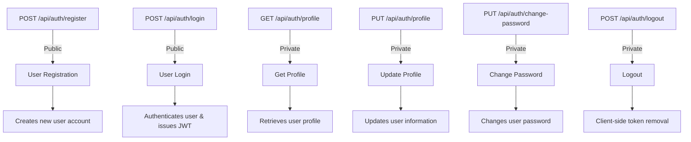
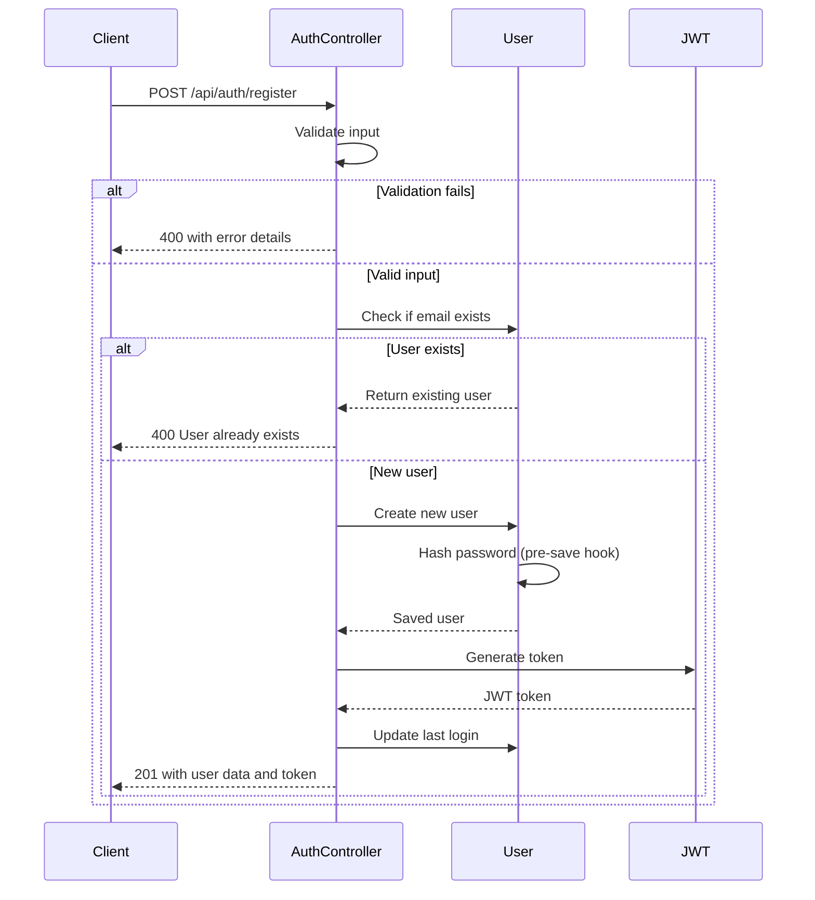
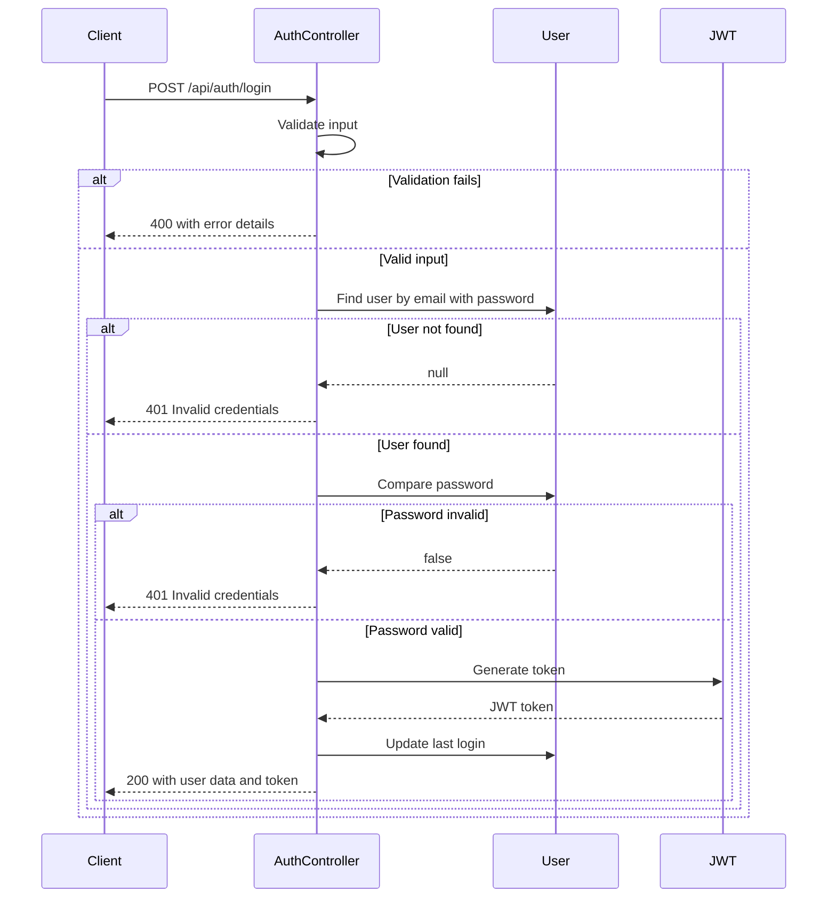
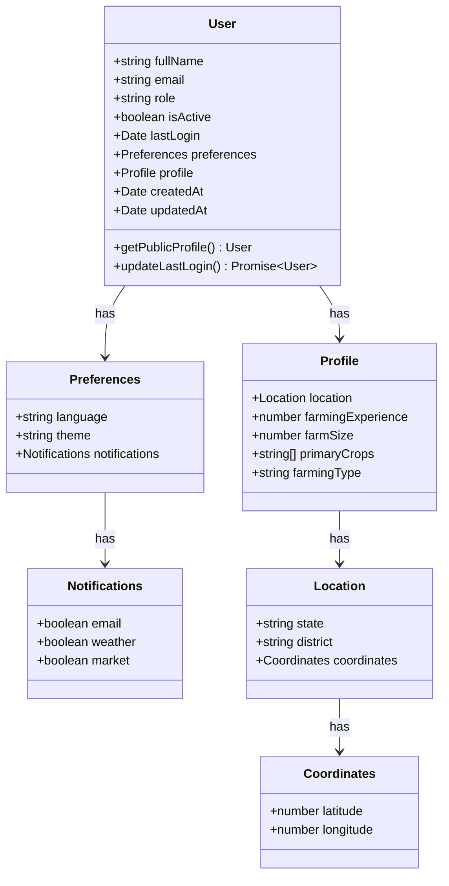
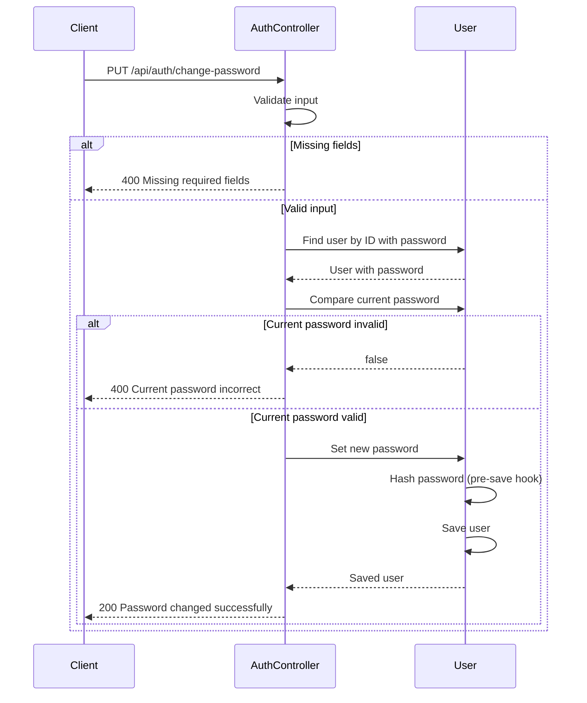
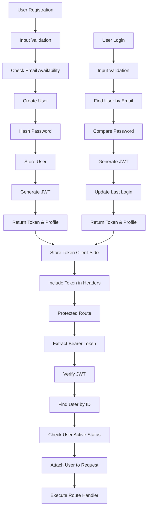
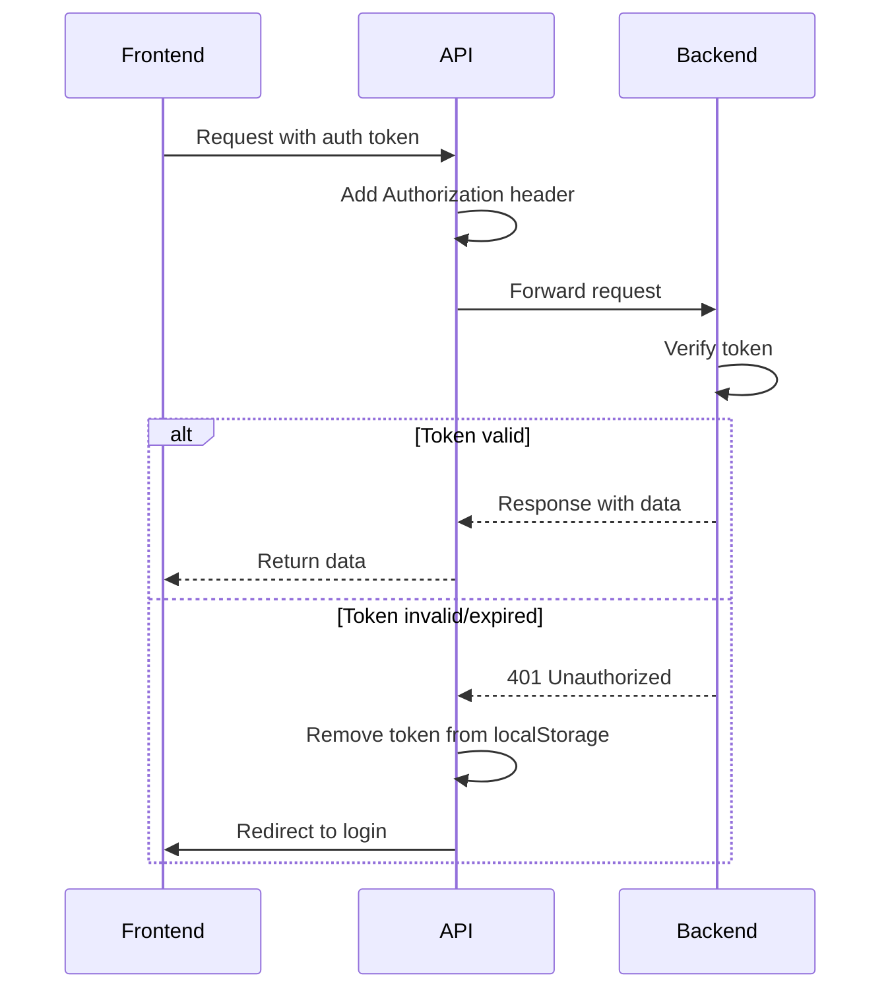

# Authentication Routes

<cite>
**Referenced Files in This Document**   
- [auth.js](file://HarvestIQ/backend/routes/auth.js)
- [auth.js](file://HarvestIQ/backend/middleware/auth.js)
- [User.js](file://HarvestIQ/backend/models/User.js)
- [validation.js](file://HarvestIQ/backend/utils/validation.js)
- [api.js](file://HarvestIQ/src/services/api.js)
</cite>

## Table of Contents
1. [Introduction](#introduction)
2. [Authentication Endpoints Overview](#authentication-endpoints-overview)
3. [User Registration](#user-registration)
4. [User Login](#user-login)
5. [Profile Management](#profile-management)
6. [Password Management](#password-management)
7. [Authentication Flow](#authentication-flow)
8. [Security Considerations](#security-considerations)
9. [Integration with Frontend](#integration-with-frontend)
10. [Error Handling](#error-handling)

## Introduction

The authentication routing module in HarvestIQ's backend provides a comprehensive system for user identity management, secure access control, and profile management. This document details the implementation of authentication endpoints, their integration with middleware components, and the overall security architecture. The system is designed to ensure secure user registration, authentication, and profile management while maintaining data integrity and protecting sensitive information.

The authentication system follows RESTful principles and implements industry-standard security practices including JWT-based authentication, password hashing with BcryptJS, and comprehensive input validation. The routes are organized in a modular fashion, separating public endpoints for registration and login from protected endpoints that require authentication.

**Section sources**
- [auth.js](file://HarvestIQ/backend/routes/auth.js#L1-L302)
- [middleware/auth.js](file://HarvestIQ/backend/middleware/auth.js#L1-L92)

## Authentication Endpoints Overview

The authentication module exposes six primary endpoints that handle different aspects of user authentication and profile management. These endpoints are categorized by access level, with public endpoints available to unauthenticated users and private endpoints protected by JWT authentication.



**Diagram sources**
- [auth.js](file://HarvestIQ/backend/routes/auth.js#L1-L302)

**Section sources**
- [auth.js](file://HarvestIQ/backend/routes/auth.js#L1-L302)

## User Registration

The user registration endpoint allows new users to create an account in the HarvestIQ system. This endpoint implements comprehensive validation to ensure data quality and security.

### Endpoint Details
- **Method**: POST
- **Path**: `/api/auth/register`
- **Access**: Public
- **Success Status**: 201 Created

### Request Payload Structure
The registration endpoint requires the following fields in the request body:

| Field | Type | Constraints | Required |
|-------|------|-------------|----------|
| fullName | string | 2-100 characters | Yes |
| email | string | Valid email format | Yes |
| password | string | Minimum 6 characters, contains uppercase, lowercase, and number | Yes |

### Validation Rules
The system applies the following validation rules:
- Full name must be between 2 and 100 characters
- Email must be a valid format and normalized
- Password must be at least 6 characters long
- Password must contain at least one uppercase letter, one lowercase letter, and one number

### Response Format
On successful registration, the endpoint returns a 201 status code with the following response structure:

```json
{
  "success": true,
  "message": "User registered successfully",
  "data": {
    "user": {
      "fullName": "John Doe",
      "email": "john@example.com",
      "role": "farmer",
      "preferences": { /* user preferences */ },
      "profile": { /* user profile data */ },
      "createdAt": "2024-01-01T00:00:00.000Z",
      "updatedAt": "2024-01-01T00:00:00.000Z"
    },
    "token": "eyJhbGciOiJIUzI1NiIsInR5cCI6IkpXVCJ9..."
  }
}
```

The response includes the user's public profile (excluding sensitive information like password) and a JWT authentication token for immediate login.

### Error Responses
The endpoint returns appropriate error codes for validation failures:
- **400 Bad Request**: Validation failed or user with email already exists
- **500 Internal Server Error**: Server error during registration



**Diagram sources**
- [auth.js](file://HarvestIQ/backend/routes/auth.js#L48-L100)
- [User.js](file://HarvestIQ/backend/models/User.js#L1-L165)

**Section sources**
- [auth.js](file://HarvestIQ/backend/routes/auth.js#L48-L100)
- [User.js](file://HarvestIQ/backend/models/User.js#L1-L165)

## User Login

The login endpoint authenticates existing users and issues JWT tokens for subsequent requests.

### Endpoint Details
- **Method**: POST
- **Path**: `/api/auth/login`
- **Access**: Public
- **Success Status**: 200 OK

### Request Payload Structure
The login endpoint requires the following fields:

| Field | Type | Required |
|-------|------|----------|
| email | string | Yes |
| password | string | Yes |

### Authentication Process
The login process follows these steps:
1. Validate input parameters
2. Find user by email (including password field)
3. Compare provided password with stored hash
4. Generate JWT token upon successful authentication
5. Update user's last login timestamp
6. Return user profile and token

### Response Format
On successful authentication, the endpoint returns a 200 status code with the following response:

```json
{
  "success": true,
  "message": "Login successful",
  "data": {
    "user": {
      "fullName": "John Doe",
      "email": "john@example.com",
      "role": "farmer",
      "preferences": { /* user preferences */ },
      "profile": { /* user profile data */ },
      "lastLogin": "2024-01-01T00:00:00.000Z",
      "createdAt": "2024-01-01T00:00:00.000Z",
      "updatedAt": "2024-01-01T00:00:00.000Z"
    },
    "token": "eyJhbGciOiJIUzI1NiIsInR5cCI6IkpXVCJ9..."
  }
}
```

### Error Responses
- **400 Bad Request**: Validation failed
- **401 Unauthorized**: Invalid email or password
- **500 Internal Server Error**: Server error during login



**Diagram sources**
- [auth.js](file://HarvestIQ/backend/routes/auth.js#L102-L157)
- [User.js](file://HarvestIQ/backend/models/User.js#L1-L165)

**Section sources**
- [auth.js](file://HarvestIQ/backend/routes/auth.js#L102-L157)
- [User.js](file://HarvestIQ/backend/models/User.js#L1-L165)

## Profile Management

The profile management endpoints allow authenticated users to retrieve and update their profile information.

### Get Profile Endpoint
- **Method**: GET
- **Path**: `/api/auth/profile`
- **Access**: Private (requires JWT)
- **Success Status**: 200 OK

#### Response Format
```json
{
  "success": true,
  "data": {
    "user": {
      "fullName": "John Doe",
      "email": "john@example.com",
      "role": "farmer",
      "preferences": { /* user preferences */ },
      "profile": { /* user profile data */ },
      "lastLogin": "2024-01-01T00:00:00.000Z",
      "createdAt": "2024-01-01T00:00:00.000Z",
      "updatedAt": "2024-01-01T00:00:00.000Z"
    }
  }
}
```

### Update Profile Endpoint
- **Method**: PUT
- **Path**: `/api/auth/profile`
- **Access**: Private (requires JWT)
- **Success Status**: 200 OK

#### Request Payload Structure
The update profile endpoint allows modification of the following fields:

| Field | Type | Description |
|-------|------|-------------|
| fullName | string | User's full name |
| preferences | object | User preferences (language, theme, notifications) |
| profile | object | User profile information (location, farming experience, etc.) |

#### Update Process
The system implements a whitelist approach to prevent unauthorized field updates:
1. Only specified fields in `allowedUpdates` array can be modified
2. Input validation is performed based on schema definitions
3. Updated user document is returned with success message

#### Response Format
```json
{
  "success": true,
  "message": "Profile updated successfully",
  "data": {
    "user": {
      "fullName": "John Doe",
      "email": "john@example.com",
      "role": "farmer",
      "preferences": { /* updated preferences */ },
      "profile": { /* updated profile data */ },
      "lastLogin": "2024-01-01T00:00:00.000Z",
      "createdAt": "2024-01-01T00:00:00.000Z",
      "updatedAt": "2024-01-01T00:00:00.000Z"
    }
  }
}
```

#### Error Responses
- **400 Bad Request**: Invalid update fields or validation errors
- **500 Internal Server Error**: Server error updating profile



**Diagram sources**
- [User.js](file://HarvestIQ/backend/models/User.js#L1-L165)

**Section sources**
- [auth.js](file://HarvestIQ/backend/routes/auth.js#L159-L215)
- [User.js](file://HarvestIQ/backend/models/User.js#L1-L165)

## Password Management

The password management endpoint allows users to change their passwords securely.

### Change Password Endpoint
- **Method**: PUT
- **Path**: `/api/auth/change-password`
- **Access**: Private (requires JWT)
- **Success Status**: 200 OK

### Request Payload Structure
The endpoint requires the following fields:

| Field | Type | Required |
|-------|------|----------|
| currentPassword | string | Yes |
| newPassword | string | Yes |

### Password Change Process
The system implements the following security measures:
1. Verify current password before allowing change
2. Enforce minimum password length (6 characters)
3. Hash new password using BcryptJS before storage
4. Return success confirmation without sensitive information

### Response Format
On successful password change:
```json
{
  "success": true,
  "message": "Password changed successfully"
}
```

### Error Responses
- **400 Bad Request**: Missing fields, current password incorrect, or new password too short
- **500 Internal Server Error**: Server error changing password



**Diagram sources**
- [auth.js](file://HarvestIQ/backend/routes/auth.js#L217-L274)
- [User.js](file://HarvestIQ/backend/models/User.js#L1-L165)

**Section sources**
- [auth.js](file://HarvestIQ/backend/routes/auth.js#L217-L274)
- [User.js](file://HarvestIQ/backend/models/User.js#L1-L165)

## Authentication Flow

The authentication system follows a comprehensive flow from user registration to protected resource access.



**Diagram sources**
- [auth.js](file://HarvestIQ/backend/routes/auth.js#L1-L302)
- [middleware/auth.js](file://HarvestIQ/backend/middleware/auth.js#L1-L92)

**Section sources**
- [auth.js](file://HarvestIQ/backend/routes/auth.js#L1-L302)
- [middleware/auth.js](file://HarvestIQ/backend/middleware/auth.js#L1-L92)

## Security Considerations

The authentication system implements multiple security measures to protect user data and prevent common vulnerabilities.

### JWT Implementation
The system uses JSON Web Tokens for stateless authentication:
- Tokens are generated using HS256 algorithm
- Secret key stored in environment variable (`JWT_SECRET`)
- Default expiration of 7 days, configurable via `JWT_EXPIRE` environment variable
- Token verification includes user existence and active status checks

```javascript
// Token generation with configurable expiration
export const generateToken = (userId) => {
  return jwt.sign({ userId }, process.env.JWT_SECRET, {
    expiresIn: process.env.JWT_EXPIRE || '7d'
  });
};
```

### Password Security
The system implements robust password security measures:
- Passwords are hashed using BcryptJS with salt rounds of 12
- Password field is excluded from default queries to prevent accidental exposure
- Password validation enforces complexity requirements (minimum length, mixed case, numbers)
- Pre-save middleware automatically hashes passwords before storage

### Input Validation
Comprehensive validation is implemented using express-validator:
- Registration: Full name length, email format, password complexity
- Login: Email format, password presence
- Profile updates: Field whitelisting to prevent unauthorized modifications
- Password changes: Current password verification, minimum length enforcement

### Rate Limiting
While not explicitly shown in the auth.js file, the package-lock.json indicates the presence of `express-rate-limit` (version 7.5.1), suggesting that rate limiting is implemented at the application level to prevent brute force attacks on authentication endpoints.

### Error Handling
The system implements consistent error handling:
- Validation errors return 400 with detailed error messages
- Authentication failures return 401 with generic messages to prevent information disclosure
- Server errors return 500 with minimal information in production
- All errors follow a consistent response format with success flag, message, and optional error details

**Section sources**
- [auth.js](file://HarvestIQ/backend/routes/auth.js#L1-L302)
- [middleware/auth.js](file://HarvestIQ/backend/middleware/auth.js#L1-L92)
- [User.js](file://HarvestIQ/backend/models/User.js#L1-L165)

## Integration with Frontend

The authentication routes are designed to work seamlessly with the frontend application through the API service layer.

### Frontend API Integration
The frontend uses an axios instance configured with interceptors to handle authentication:



### Token Management
The frontend implements the following token management practices:
- Store JWT in localStorage with key 'harvestiq_token'
- Include token in Authorization header for all authenticated requests
- Automatically remove token on 401 responses (token expiration)
- Redirect to login page when authentication is required

### Example Usage
```javascript
// Register new user
const register = async (userData) => {
  try {
    const response = await API.post('/auth/register', userData);
    // Store token and user data
    localStorage.setItem('harvestiq_token', response.data.token);
    localStorage.setItem('harvestiq_user', JSON.stringify(response.data.user));
    return response.data;
  } catch (error) {
    throw error;
  }
};
```

**Diagram sources**
- [api.js](file://HarvestIQ/src/services/api.js#L1-L52)

**Section sources**
- [api.js](file://HarvestIQ/src/services/api.js#L1-L52)
- [auth.js](file://HarvestIQ/backend/routes/auth.js#L1-L302)

## Error Handling

The authentication system implements comprehensive error handling to provide meaningful feedback while maintaining security.

### Error Response Structure
All error responses follow a consistent format:

```json
{
  "success": false,
  "message": "Descriptive error message",
  "errors": [ /* validation errors, if applicable */ ]
}
```

### Error Types and Status Codes
The system uses appropriate HTTP status codes for different error conditions:

| Status Code | Scenario | Example Message |
|-------------|---------|----------------|
| 400 | Validation failure or bad request | "Validation failed", "Current password is incorrect" |
| 401 | Authentication failure | "Invalid email or password", "Access denied. No token provided." |
| 403 | Authorization failure | "Access denied. Insufficient permissions." |
| 500 | Server errors | "Server error during registration" |

### Development vs Production
The system differentiates between development and production environments:
- In development: Error responses include detailed error messages for debugging
- In production: Error responses provide minimal information to prevent information disclosure

### Middleware Error Handling
The authentication middleware includes comprehensive error handling:
- Token verification errors return 401 with "Token invalid or expired" message
- User not found or inactive users return 401 with appropriate messaging
- Server errors in middleware return 500 with generic error message

**Section sources**
- [auth.js](file://HarvestIQ/backend/routes/auth.js#L1-L302)
- [middleware/auth.js](file://HarvestIQ/backend/middleware/auth.js#L1-L92)