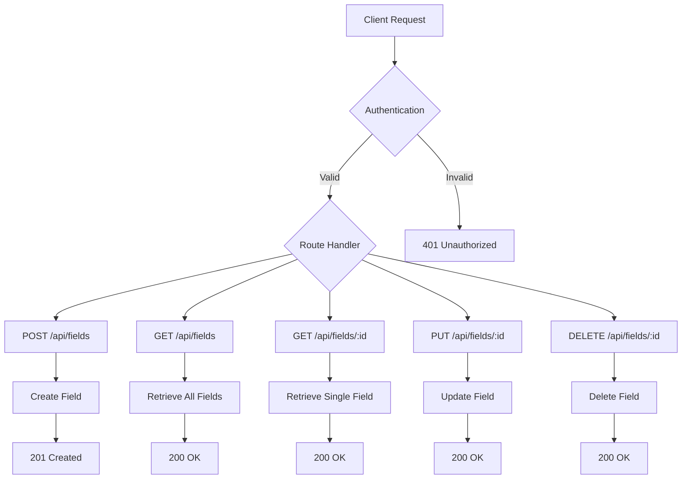
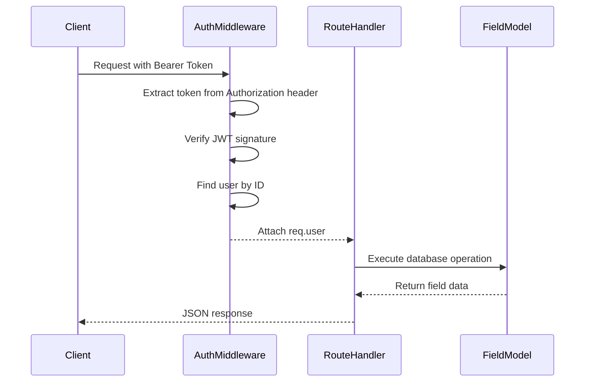
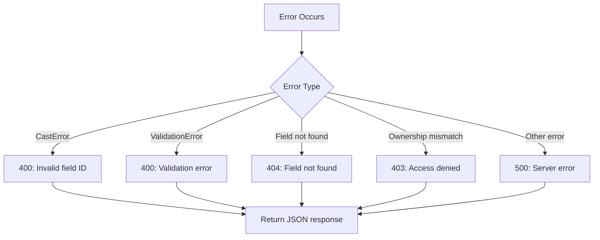
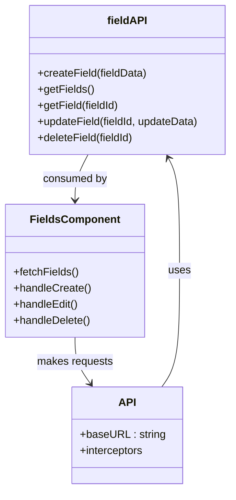

# Field Management Routes

<cite>
**Referenced Files in This Document**   
- [fields.js](file://HarvestIQ/backend/routes/fields.js)
- [Field.js](file://HarvestIQ/backend/models/Field.js)
- [auth.js](file://HarvestIQ/backend/middleware/auth.js)
- [Fields.jsx](file://HarvestIQ/src/components/Fields.jsx)
- [api.js](file://HarvestIQ/src/services/api.js)
</cite>

## Table of Contents
1. [Introduction](#introduction)
2. [CRUD Endpoints Overview](#crud-endpoints-overview)
3. [Request and Response Structure](#request-and-response-structure)
4. [Ownership and Authentication](#ownership-and-authentication)
5. [Error Handling](#error-handling)
6. [Frontend Integration](#frontend-integration)
7. [Use Cases](#use-cases)

## Introduction
The Field Management module in HarvestIQ's backend provides a comprehensive RESTful API for managing agricultural fields. This document details the implementation of CRUD (Create, Read, Update, Delete) operations for field data, including geographic coordinates, soil characteristics, crop information, and field size. The routes enforce strict ownership validation and authentication to ensure data security and integrity.

**Section sources**
- [fields.js](file://HarvestIQ/backend/routes/fields.js#L1-L250)

## CRUD Endpoints Overview

### POST /api/fields - Create New Field
Creates a new field entry with geographic and agricultural data. The route requires authentication and validates essential fields before creating a new record in the database.

### GET /api/fields - Retrieve All Fields
Fetches all fields associated with the authenticated user, sorted by creation date in descending order.

### GET /api/fields/:id - Retrieve Specific Field
Retrieves a single field by its unique identifier, with ownership validation to ensure the requesting user has access to the requested resource.

### PUT /api/fields/:id - Update Field
Updates an existing field's information, allowing partial updates of field properties while maintaining ownership validation.

### DELETE /api/fields/:id - Delete Field
Removes a field from the system after verifying ownership and proper authentication.



**Diagram sources**
- [fields.js](file://HarvestIQ/backend/routes/fields.js#L1-L250)

**Section sources**
- [fields.js](file://HarvestIQ/backend/routes/fields.js#L1-L250)

## Request and Response Structure

### Request Body Structure
The field creation and update operations accept a JSON payload with the following structure:

- **name**: String (required) - Field name with maximum 100 characters
- **coordinates**: Object containing latitude and longitude values
- **size**: Number representing field area in hectares
- **soilType**: String indicating the soil classification
- **soilData**: Additional soil characteristics and nutrient information
- **description**: Optional text description of the field
- **currentCrop**: String specifying the currently planted crop

### Response Format
All endpoints return a standardized JSON response format:

```json
{
  "success": true,
  "data": { /* field data or null */ },
  "message": "Operation completed successfully"
}
```

For collection endpoints, an additional `count` field indicates the number of returned records.

**Section sources**
- [fields.js](file://HarvestIQ/backend/routes/fields.js#L10-L250)
- [Field.js](file://HarvestIQ/backend/models/Field.js#L1-L543)

## Ownership and Authentication

### Authentication Middleware
All field routes are protected by the `protect` middleware which verifies JWT tokens and attaches the authenticated user to the request object.



**Diagram sources**
- [fields.js](file://HarvestIQ/backend/routes/fields.js#L6-L8)
- [auth.js](file://HarvestIQ/backend/middleware/auth.js#L1-L93)

### Ownership Validation
Each route that accesses a specific field enforces ownership by including the user ID in the database query:

```javascript
const field = await Field.findOne({
  _id: req.params.id,
  userId: req.user.id
});
```

This ensures users can only access, modify, or delete fields they own, preventing unauthorized access to other users' data.

**Section sources**
- [fields.js](file://HarvestIQ/backend/routes/fields.js#L107-L115)
- [fields.js](file://HarvestIQ/backend/routes/fields.js#L138-L146)
- [fields.js](file://HarvestIQ/backend/routes/fields.js#L212-L220)

## Error Handling

### Error Types and Responses
The field management routes implement comprehensive error handling for various scenarios:

#### 400 Bad Request
- **Invalid field ID**: Triggered when the provided ID has incorrect format
- **Missing required fields**: When name, coordinates, or size are not provided
- **Validation errors**: When field data fails schema validation

#### 401 Unauthorized
- **No token provided**: When no authentication token is included in the request
- **Invalid or expired token**: When the provided token cannot be verified

#### 403 Forbidden
- **Access denied**: When a user attempts to access a field they don't own

#### 404 Not Found
- **Field not found**: When the requested field ID doesn't exist or doesn't belong to the user

#### 500 Internal Server Error
- **Database operation failures**: When unexpected errors occur during database operations



**Diagram sources**
- [fields.js](file://HarvestIQ/backend/routes/fields.js#L45-L55)
- [fields.js](file://HarvestIQ/backend/routes/fields.js#L118-L125)
- [fields.js](file://HarvestIQ/backend/routes/fields.js#L178-L188)

**Section sources**
- [fields.js](file://HarvestIQ/backend/routes/fields.js#L1-L250)

## Frontend Integration

### API Service Implementation
The frontend uses the `fieldAPI` service to interact with the field management endpoints, handling request/response transformations and error states.



**Diagram sources**
- [api.js](file://HarvestIQ/src/services/api.js#L314-L368)
- [Fields.jsx](file://HarvestIQ/src/components/Fields.jsx#L88-L142)

### Form Handling and Validation
The Fields component implements form validation and data transformation before making API calls, ensuring proper data types (converting strings to numbers for coordinates and size).

**Section sources**
- [Fields.jsx](file://HarvestIQ/src/components/Fields.jsx#L88-L142)
- [api.js](file://HarvestIQ/src/services/api.js#L314-L368)

## Use Cases

### Field Creation from Dashboard
Farmers can create new fields through the Dashboard interface by providing field details including name, size, coordinates, soil type, and current crop information. The form validates inputs before submission and handles success/error states appropriately.

### Data Synchronization for Predictions
Field data serves as foundational information for AI-powered predictions. When creating a prediction, the system uses field characteristics such as soil type, size, and location to generate accurate yield forecasts and recommendations.

### Field Management Workflow
The complete field management workflow enables farmers to:
1. Add new fields to their account
2. View all their fields in a list format
3. Edit field details as conditions change
4. Remove fields that are no longer in use
5. Access field-specific analytics and predictions

This workflow supports ongoing farm management and decision-making processes.

**Section sources**
- [Fields.jsx](file://HarvestIQ/src/components/Fields.jsx#L1-L435)
- [fields.js](file://HarvestIQ/backend/routes/fields.js#L1-L250)