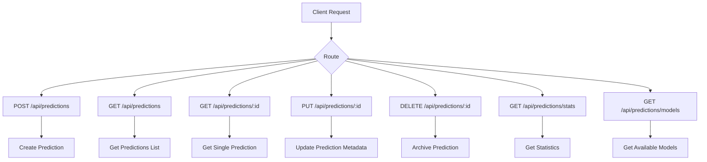
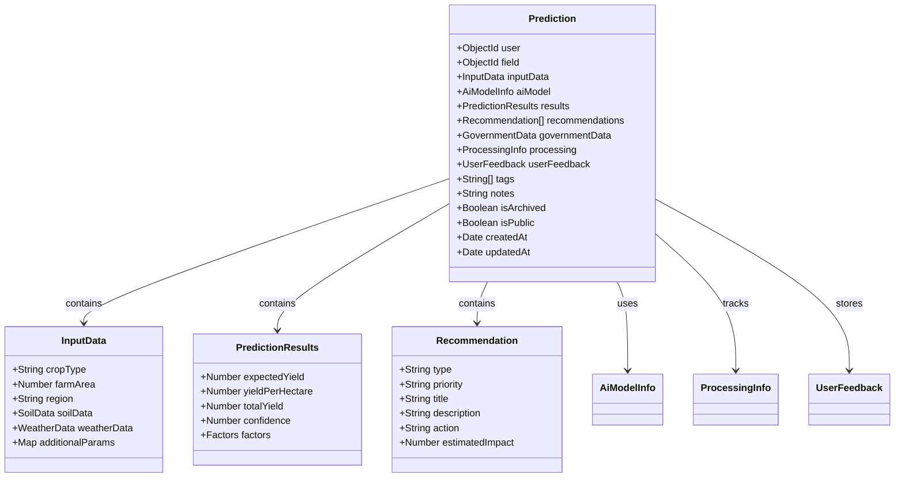
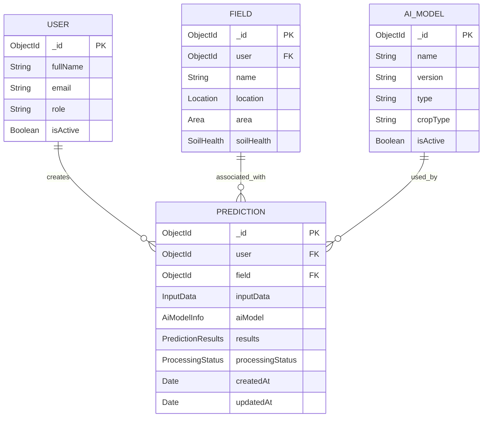
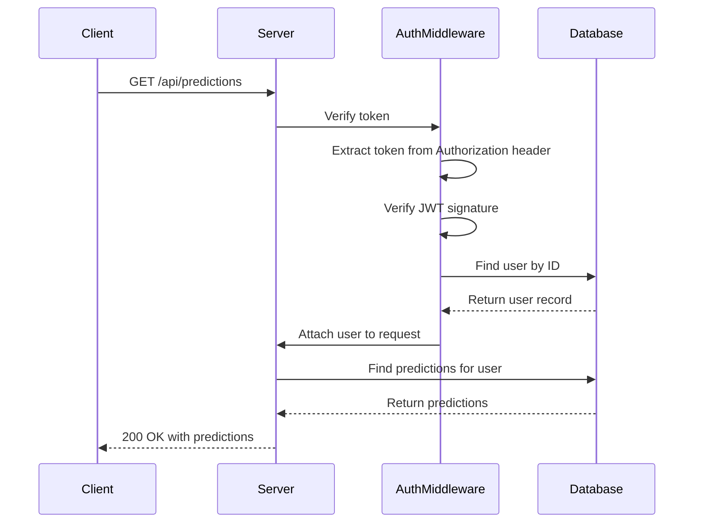
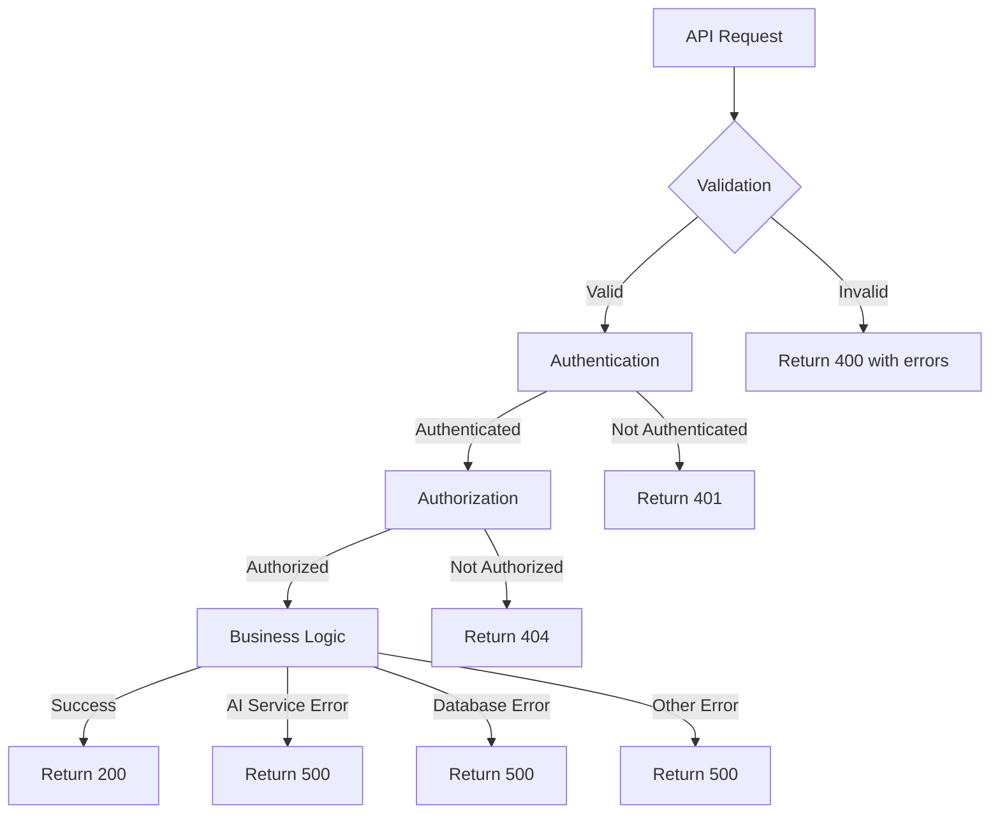
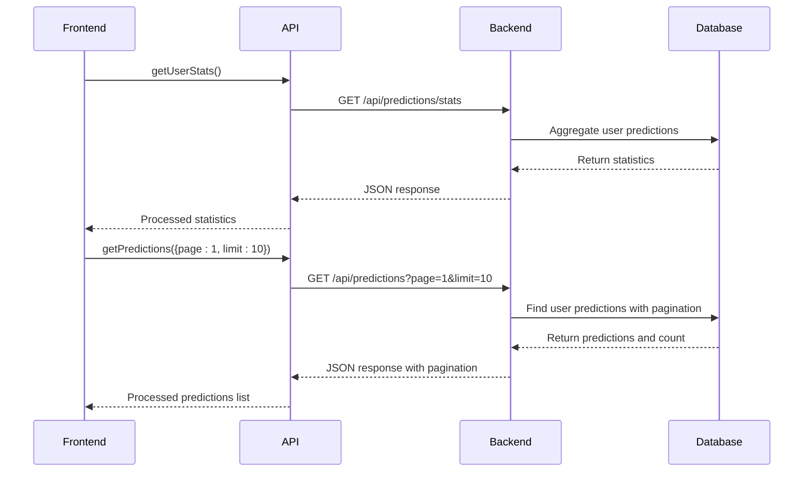

# Prediction History Routes

<cite>
**Referenced Files in This Document**   
- [predictions.js](file://HarvestIQ/backend/routes/predictions.js)
- [Prediction.js](file://HarvestIQ/backend/models/Prediction.js)
- [auth.js](file://HarvestIQ/backend/middleware/auth.js)
- [aiService.js](file://HarvestIQ/backend/services/aiService.js)
- [AiModel.js](file://HarvestIQ/backend/models/AiModel.js)
- [Field.js](file://HarvestIQ/backend/models/Field.js)
- [Analytics.jsx](file://HarvestIQ/src/components/Analytics.jsx)
- [Reports.jsx](file://HarvestIQ/src/components/Reports.jsx)
- [api.js](file://HarvestIQ/src/services/api.js)
</cite>

## Table of Contents
1. [Introduction](#introduction)
2. [Route Endpoints](#route-endpoints)
3. [Prediction Data Structure](#prediction-data-structure)
4. [User and Field Context Integration](#user-and-field-context-integration)
5. [Authentication and Authorization](#authentication-and-authorization)
6. [Request and Response Examples](#request-and-response-examples)
7. [Error Handling Scenarios](#error-handling-scenarios)
8. [Integration with Frontend Components](#integration-with-frontend-components)
9. [Performance and Scalability Considerations](#performance-and-scalability-considerations)

## Introduction

The Prediction History module in HarvestIQ's backend provides a comprehensive REST API for managing agricultural yield predictions. This system enables users to create, retrieve, update, and archive prediction records that contain detailed crop yield forecasts, confidence scores, and actionable recommendations. The module is designed to support data-driven decision making for farmers by maintaining a historical record of predictions tied to specific fields and user accounts. The routes are built on Express.js with MongoDB as the data store, following RESTful principles and incorporating robust validation, authentication, and error handling mechanisms.

**Section sources**
- [predictions.js](file://HarvestIQ/backend/routes/predictions.js#L1-L468)

## Route Endpoints

The prediction history module exposes several endpoints for managing prediction records. All routes are protected by authentication middleware, ensuring that only authenticated users can access the functionality. The primary endpoints include:

- **POST /api/predictions**: Creates a new prediction based on user input data and AI model processing
- **GET /api/predictions**: Retrieves a paginated list of predictions for the authenticated user
- **GET /api/predictions/:id**: Retrieves a specific prediction by its unique identifier
- **PUT /api/predictions/:id**: Updates metadata such as notes, tags, and user feedback for a prediction
- **DELETE /api/predictions/:id**: Archives a prediction rather than permanently deleting it
- **GET /api/predictions/stats**: Retrieves statistical summaries of the user's prediction history
- **GET /api/predictions/models**: Lists available AI models for prediction generation

These endpoints follow consistent response patterns with a success flag, message, and data payload, making integration with frontend components straightforward and predictable.



**Diagram sources**
- [predictions.js](file://HarvestIQ/backend/routes/predictions.js#L1-L468)

**Section sources**
- [predictions.js](file://HarvestIQ/backend/routes/predictions.js#L1-L468)

## Prediction Data Structure

The prediction object contains comprehensive information about agricultural yield forecasts, including input parameters, results, recommendations, and metadata. The data structure is defined in the Prediction model and includes several key components:

### Input Data
The input data captures the parameters provided by the user for generating predictions:
- **Crop type**: One of the supported crops (Wheat, Rice, Sugarcane, etc.)
- **Farm area**: Size of the field in hectares
- **Region**: Geographic location of the field
- **Soil data**: pH level, organic content, and nutrient levels
- **Weather data**: Temperature, rainfall, and humidity
- **Additional parameters**: A flexible map for advanced model inputs

### Prediction Results
The results section contains the AI-generated forecast:
- **Expected yield**: Total predicted yield in tons
- **Yield per hectare**: Productivity metric
- **Total yield**: Calculated as yield per hectare multiplied by farm area
- **Confidence score**: Percentage indicating prediction reliability
- **Factors**: Detailed breakdown of elements influencing the prediction

### Recommendations
The system generates actionable recommendations based on the prediction:
- **Type**: Category of recommendation (weather, irrigation, soil, etc.)
- **Priority**: Urgency level (low, medium, high, critical)
- **Title and description**: Clear explanation of the recommendation
- **Action**: Specific steps the user should take
- **Estimated impact**: Expected percentage improvement

### Metadata and Processing Information
Additional context and system information:
- **Processing status**: Current state (pending, processing, completed, failed)
- **Processing time**: Duration of AI model execution
- **User feedback**: Ratings, comments, and actual yield data
- **Tags and notes**: User-defined metadata
- **Archival status**: Whether the prediction is archived



**Diagram sources**
- [Prediction.js](file://HarvestIQ/backend/models/Prediction.js#L1-L388)

**Section sources**
- [Prediction.js](file://HarvestIQ/backend/models/Prediction.js#L1-L388)

## User and Field Context Integration

Predictions are tightly integrated with user and field contexts to provide personalized and location-specific insights. Each prediction record is linked to a specific user and optionally to a specific field, enabling contextual data retrieval and analysis.

### User Association
Every prediction is associated with a user through the user ObjectId field. This relationship enables:
- Secure access control based on ownership
- Personalized prediction history for each user
- Aggregation of statistics at the user level
- User-specific model preferences and defaults

### Field Integration
Predictions can be linked to specific fields when relevant:
- Field reference allows retrieval of field-specific data like soil health and location
- Validation ensures users can only create predictions for fields they own
- Population of field data in responses provides context without additional queries
- Field metadata enhances prediction accuracy by incorporating historical data

### Contextual Data Retrieval
The system leverages these relationships to provide enriched responses:
- When retrieving predictions, field data is populated to show field name and location
- User statistics are calculated based on all non-archived predictions
- Filtering and sorting capabilities allow users to find predictions by crop type, region, or model
- The virtual fields in the schema provide derived data like prediction age and accuracy percentage



**Diagram sources**
- [Prediction.js](file://HarvestIQ/backend/models/Prediction.js#L1-L388)
- [Field.js](file://HarvestIQ/backend/models/Field.js#L1-L543)
- [User.js](file://HarvestIQ/backend/models/User.js#L1-L166)

**Section sources**
- [Prediction.js](file://HarvestIQ/backend/models/Prediction.js#L1-L388)
- [Field.js](file://HarvestIQ/backend/models/Field.js#L1-L543)

## Authentication and Authorization

The prediction history routes implement a robust authentication and authorization system to ensure data security and privacy. All routes are protected by the `protect` middleware, which verifies user identity and enforces access control.

### Authentication Process
The authentication flow follows these steps:
1. The client includes a Bearer token in the Authorization header
2. The `protect` middleware extracts and verifies the JWT token
3. The user ID from the token is used to find the corresponding user record
4. Access is denied if the token is invalid, expired, or the user is inactive

### Authorization Rules
The system enforces strict ownership-based access control:
- Users can only access their own predictions
- Field validation ensures predictions can only be created for owned fields
- The `findOne` queries include the user ID as a filter criterion
- Attempts to access unauthorized predictions return 404 errors (not 403) to avoid revealing existence of other users' data

### Security Considerations
Several security measures are implemented:
- Passwords are hashed using bcrypt with a salt factor of 12
- JWT tokens have a configurable expiration (default 7 days)
- The system uses parameterized queries to prevent MongoDB injection
- Input validation prevents malformed data from being processed
- Error messages are sanitized in production to avoid information leakage



**Diagram sources**
- [predictions.js](file://HarvestIQ/backend/routes/predictions.js#L1-L468)
- [auth.js](file://HarvestIQ/backend/middleware/auth.js#L1-L92)

**Section sources**
- [predictions.js](file://HarvestIQ/backend/routes/predictions.js#L1-L468)
- [auth.js](file://HarvestIQ/backend/middleware/auth.js#L1-L92)

## Request and Response Examples

This section provides concrete examples of request and response payloads for the prediction history endpoints.

### Creating a Prediction
**Request:**
```json
POST /api/predictions
Authorization: Bearer <token>
Content-Type: application/json

{
  "inputData": {
    "cropType": "Wheat",
    "farmArea": 2.5,
    "region": "Punjab",
    "soilData": {
      "phLevel": 6.8,
      "organicContent": 2.3
    },
    "weatherData": {
      "temperature": 22,
      "rainfall": 650
    }
  },
  "aiModel": {
    "modelId": "64a1b2c3d4e5f6a7b8c9d0e1"
  },
  "field": "64a1b2c3d4e5f6a7b8c9d0e2"
}
```

**Response:**
```json
{
  "success": true,
  "message": "Prediction created successfully",
  "data": {
    "prediction": {
      "user": "64a1b2c3d4e5f6a7b8c9d0e0",
      "field": "64a1b2c3d4e5f6a7b8c9d0e2",
      "inputData": {
        "cropType": "Wheat",
        "farmArea": 2.5,
        "region": "Punjab",
        "soilData": {
          "phLevel": 6.8,
          "organicContent": 2.3
        },
        "weatherData": {
          "temperature": 22,
          "rainfall": 650
        }
      },
      "aiModel": {
        "modelId": "64a1b2c3d4e5f6a7b8c9d0e1",
        "modelName": "Wheat-Yield-Model",
        "modelVersion": "2.1.0",
        "modelType": "python-ml"
      },
      "results": {
        "expectedYield": 12.5,
        "yieldPerHectare": 5.0,
        "totalYield": 12.5,
        "confidence": 92
      },
      "recommendations": [
        {
          "type": "irrigation",
          "priority": "medium",
          "title": "Optimize Irrigation Schedule",
          "description": "Current irrigation pattern could be improved for better water efficiency.",
          "action": "Implement drip irrigation system",
          "estimatedImpact": 15
        }
      ],
      "processing": {
        "status": "completed",
        "processingTime": 2450
      },
      "createdAt": "2023-06-15T10:30:00.000Z",
      "updatedAt": "2023-06-15T10:30:00.000Z"
    }
  }
}
```

### Retrieving Predictions
**Request:**
```json
GET /api/predictions?page=1&limit=10&cropType=Wheat&sortBy=createdAt&sortOrder=desc
Authorization: Bearer <token>
```

**Response:**
```json
{
  "success": true,
  "data": {
    "predictions": [
      {
        "_id": "64a1b2c3d4e5f6a7b8c9d0e3",
        "inputData": {
          "cropType": "Wheat",
          "farmArea": 2.5,
          "region": "Punjab"
        },
        "aiModel": {
          "modelName": "Wheat-Yield-Model",
          "modelType": "python-ml"
        },
        "results": {
          "expectedYield": 12.5,
          "confidence": 92
        },
        "field": {
          "name": "North Field",
          "location": {
            "address": "Village: Dhuri, District: Sangrur"
          }
        },
        "createdAt": "2023-06-15T10:30:00.000Z"
      }
    ],
    "pagination": {
      "currentPage": 1,
      "totalPages": 3,
      "totalCount": 25,
      "hasNextPage": true,
      "hasPrevPage": false
    }
  }
}
```

**Section sources**
- [predictions.js](file://HarvestIQ/backend/routes/predictions.js#L1-L468)
- [Prediction.js](file://HarvestIQ/backend/models/Prediction.js#L1-L388)

## Error Handling Scenarios

The prediction history module implements comprehensive error handling to provide meaningful feedback to clients and maintain system stability.

### Validation Errors
When input data fails validation, the system returns detailed error information:
```json
{
  "success": false,
  "message": "Validation failed",
  "errors": [
    {
      "value": "Corn",
      "msg": "Invalid crop type",
      "param": "inputData.cropType",
      "location": "body"
    },
    {
      "value": 0.005,
      "msg": "Farm area must be at least 0.01 hectares",
      "param": "inputData.farmArea",
      "location": "body"
    }
  ]
}
```

### Resource Not Found
When a prediction or field cannot be found:
```json
{
  "success": false,
  "message": "Field not found or access denied"
}
```

### Authentication and Authorization Errors
For unauthenticated or unauthorized requests:
```json
{
  "success": false,
  "message": "Access denied. No token provided."
}
```
```json
{
  "success": false,
  "message": "Token invalid or expired."
}
```

### Server Errors
For internal server issues:
```json
{
  "success": false,
  "message": "Server error creating prediction"
}
```

### AI Service Errors
When the AI prediction service fails:
```json
{
  "success": false,
  "message": "Failed to generate prediction",
  "error": "Internal server error"
}
```

The system distinguishes between client errors (4xx) and server errors (5xx), with appropriate status codes:
- **400 Bad Request**: Validation failures or malformed input
- **401 Unauthorized**: Missing or invalid authentication
- **403 Forbidden**: Insufficient permissions (rarely used to avoid information leakage)
- **404 Not Found**: Resource not found or access denied
- **500 Internal Server Error**: Unexpected server-side issues
- **503 Service Unavailable**: External AI services unavailable



**Diagram sources**
- [predictions.js](file://HarvestIQ/backend/routes/predictions.js#L1-L468)
- [aiService.js](file://HarvestIQ/backend/services/aiService.js#L1-L482)

**Section sources**
- [predictions.js](file://HarvestIQ/backend/routes/predictions.js#L1-L468)

## Integration with Frontend Components

The prediction history routes are designed to support key frontend components in the HarvestIQ application, particularly the Reports and Analytics modules.

### Reports Component
The Reports component uses the prediction history API to display a user's prediction history:
- **GET /api/predictions** fetches the list of predictions for display in a table
- **Pagination parameters** enable efficient loading of large datasets
- **Filtering options** allow users to find predictions by crop type, region, or date range
- **Search functionality** is supported through query parameters
- **Archiving** allows users to hide predictions without losing data

### Analytics Component
The Analytics component leverages prediction data for statistical analysis and visualization:
- **GET /api/predictions/stats** provides summary statistics for dashboard displays
- **Crop type distribution** is used in pie charts to show farming patterns
- **Confidence scores** are aggregated to assess prediction reliability over time
- **Yield trends** are analyzed to identify improvements or issues
- **Recommendation effectiveness** is tracked when users provide feedback

### Data Flow
The integration follows a consistent pattern:
1. React components use the `predictionAPI` service to make requests
2. The service handles authentication headers and error parsing
3. Data is transformed for use in charts and tables
4. User interactions trigger updates to prediction records
5. Real-time feedback is provided through loading states and notifications



**Diagram sources**
- [predictions.js](file://HarvestIQ/backend/routes/predictions.js#L1-L468)
- [api.js](file://HarvestIQ/src/services/api.js#L268-L317)
- [Analytics.jsx](file://HarvestIQ/src/components/Analytics.jsx#L0-L46)
- [Reports.jsx](file://HarvestIQ/src/components/Reports.jsx#L0-L51)

**Section sources**
- [Analytics.jsx](file://HarvestIQ/src/components/Analytics.jsx#L0-L46)
- [Reports.jsx](file://HarvestIQ/src/components/Reports.jsx#L0-L51)
- [api.js](file://HarvestIQ/src/services/api.js#L268-L317)

## Performance and Scalability Considerations

The prediction history module incorporates several performance optimizations to handle growing datasets and maintain responsive user experiences.

### Database Indexing
Strategic indexes are defined on the Prediction model to accelerate common queries:
- **user + createdAt**: Optimizes retrieval of user predictions in chronological order
- **inputData.cropType + inputData.region**: Speeds up filtering by crop and region
- **processing.status**: Improves queries for predictions by status
- **aiModel.modelType**: Enhances filtering by model type
- **isArchived**: Allows efficient separation of active and archived predictions

### Pagination
The GET /api/predictions endpoint implements server-side pagination:
- Default limit of 10 predictions per page
- Configurable page and limit parameters
- Total count and pagination metadata in responses
- Skip-based implementation for efficient cursoring through results

### Data Population
The system uses MongoDB population to include related data:
- Field data is populated with name and location
- AI model data is populated with name, version, and type
- Selective population minimizes payload size while providing context

### Caching Opportunities
While not currently implemented, the architecture supports future caching:
- User statistics could be cached for frequently accessed data
- Model availability responses could be cached temporarily
- Field data could be cached to reduce database load

### Scalability Features
The design accommodates future growth:
- Asynchronous processing for AI model execution
- Error handling with retry mechanisms for external services
- Modular service architecture allowing independent scaling
- Efficient query patterns that minimize database load

**Section sources**
- [Prediction.js](file://HarvestIQ/backend/models/Prediction.js#L1-L388)
- [predictions.js](file://HarvestIQ/backend/routes/predictions.js#L1-L468)