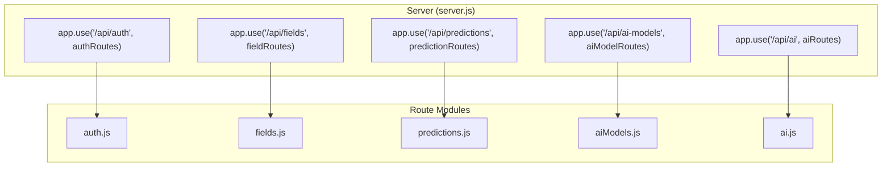
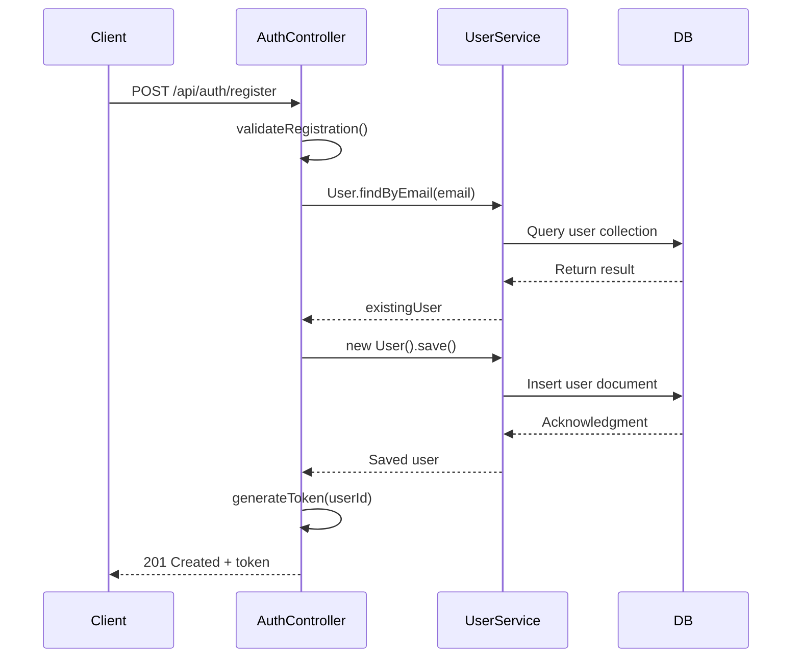
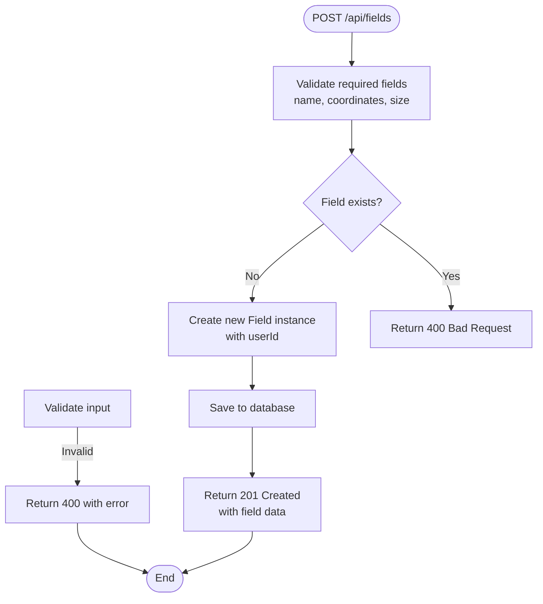
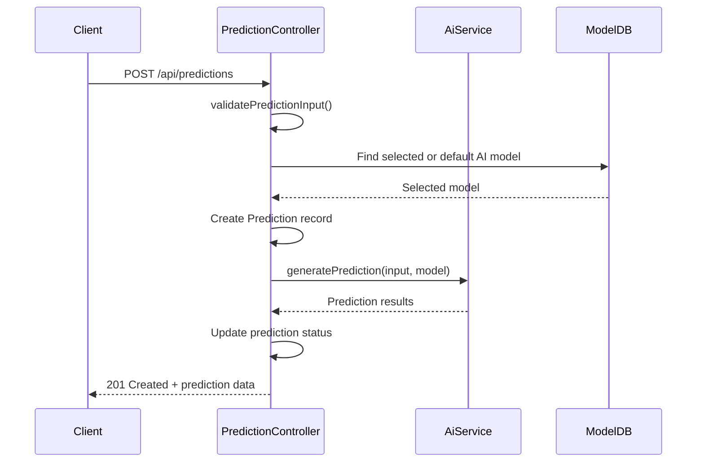
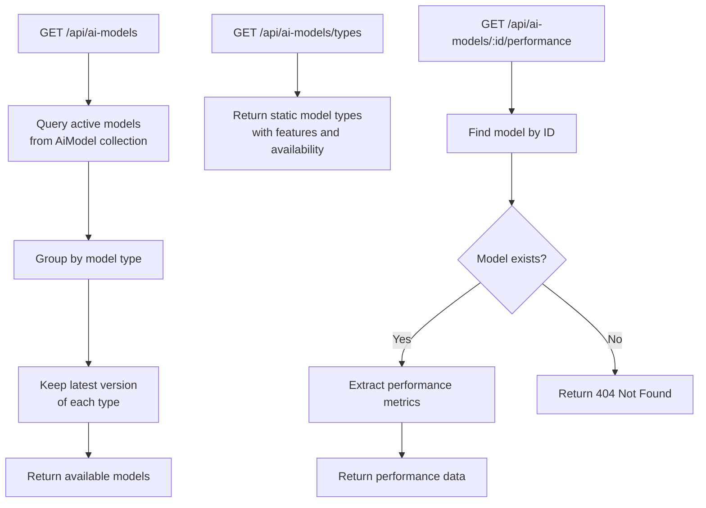
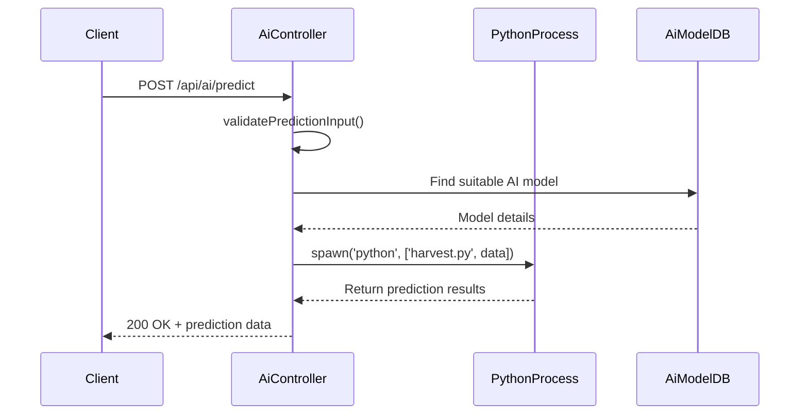
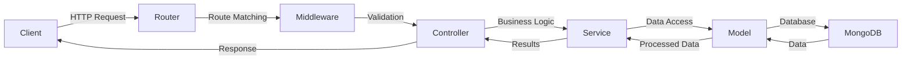
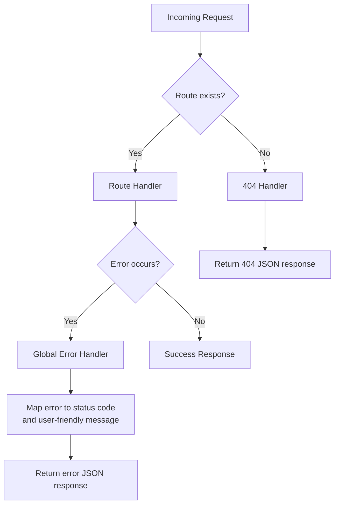

# Routing System

<cite>
**Referenced Files in This Document**   
- [auth.js](file://HarvestIQ/backend/routes/auth.js)
- [fields.js](file://HarvestIQ/backend/routes/fields.js)
- [predictions.js](file://HarvestIQ/backend/routes/predictions.js)
- [aiModels.js](file://HarvestIQ/backend/routes/aiModels.js)
- [ai.js](file://HarvestIQ/backend/routes/ai.js)
- [server.js](file://HarvestIQ/backend/server.js)
</cite>

## Table of Contents
1. [Introduction](#introduction)
2. [Route Mounting and API Structure](#route-mounting-and-api-structure)
3. [Authentication Routes](#authentication-routes)
4. [Field Management Routes](#field-management-routes)
5. [Prediction History Routes](#prediction-history-routes)
6. [AI Model Metadata Routes](#ai-model-metadata-routes)
7. [Real-Time Prediction Routes](#real-time-prediction-routes)
8. [Request-Response Flow](#request-response-flow)
9. [Error Handling and 404 Response](#error-handling-and-404-response)
10. [API Versioning and Modularity](#api-versioning-and-modularity)

## Introduction
The HarvestIQ backend implements a modular RESTful routing system using Express.js to manage agricultural data and AI-driven predictions. The routing architecture is organized into dedicated files based on functional domains, enabling separation of concerns, maintainability, and scalability. Each route file handles specific aspects of the application including user authentication, field management, prediction history, AI model metadata, and real-time predictions. Routes are mounted under versioned prefixes at `/api`, ensuring a clean and scalable API structure. This document details each route file, its endpoints, HTTP methods, request-response flows, and architectural patterns.

## Route Mounting and API Structure
The routing system follows a modular design where each feature is encapsulated in its own route file and mounted under a specific API prefix in the main server file. This approach promotes code organization, reusability, and easier maintenance.



**Diagram sources**
- [server.js](file://HarvestIQ/backend/server.js#L20-L24)
- [auth.js](file://HarvestIQ/backend/routes/auth.js)
- [fields.js](file://HarvestIQ/backend/routes/fields.js)
- [predictions.js](file://HarvestIQ/backend/routes/predictions.js)
- [aiModels.js](file://HarvestIQ/backend/routes/aiModels.js)
- [ai.js](file://HarvestIQ/backend/routes/ai.js)

**Section sources**
- [server.js](file://HarvestIQ/backend/server.js#L20-L24)

## Authentication Routes
The `auth.js` route file handles all user authentication operations under the `/api/auth` prefix. It supports registration, login, profile management, and password changes using secure JWT-based authentication.

### Endpoints
- `POST /api/auth/register`: Registers a new user with validation
- `POST /api/auth/login`: Authenticates user and returns JWT token
- `GET /api/auth/profile`: Retrieves current user's public profile
- `PUT /api/auth/profile`: Updates user profile information
- `PUT /api/auth/change-password`: Changes user password with validation
- `POST /api/auth/logout`: Handles client-side logout (token invalidation placeholder)

Each route applies input validation using `express-validator` and authentication middleware where appropriate. Private routes use the `protect` middleware to ensure only authenticated users can access them.



**Diagram sources**
- [auth.js](file://HarvestIQ/backend/routes/auth.js#L35-L295)
- [middleware/auth.js](file://HarvestIQ/backend/middleware/auth.js#L15-L21)

**Section sources**
- [auth.js](file://HarvestIQ/backend/routes/auth.js#L1-L302)

## Field Management Routes
The `fields.js` route file provides CRUD operations for agricultural fields under the `/api/fields` prefix. All routes require authentication via the `protect` middleware.

### Endpoints
- `POST /api/fields`: Creates a new field with ownership assignment
- `GET /api/fields`: Retrieves all fields belonging to the authenticated user
- `GET /api/fields/:id`: Retrieves a specific field by ID with ownership check
- `PUT /api/fields/:id`: Updates field details with validation
- `DELETE /api/fields/:id`: Deletes a field after ownership verification

The routes enforce data ownership by checking that the requesting user owns the field being accessed or modified. Input validation ensures required fields like name, coordinates, and size are present.



**Diagram sources**
- [fields.js](file://HarvestIQ/backend/routes/fields.js#L1-L249)
- [models/Field.js](file://HarvestIQ/backend/models/Field.js)

**Section sources**
- [fields.js](file://HarvestIQ/backend/routes/fields.js#L1-L249)

## Prediction History Routes
The `predictions.js` route file manages prediction history under `/api/predictions`, providing comprehensive operations for creating, retrieving, updating, and archiving predictions.

### Endpoints
- `POST /api/predictions`: Creates a new prediction with AI model selection
- `GET /api/predictions`: Retrieves user's predictions with pagination
- `GET /api/predictions/:id`: Gets a specific prediction by ID
- `PUT /api/predictions/:id`: Updates prediction metadata (notes, tags, feedback)
- `DELETE /api/predictions/:id`: Archives a prediction (soft delete)
- `GET /api/predictions/stats`: Retrieves prediction statistics
- `GET /api/predictions/models`: Lists available AI models for predictions

The routes support query parameters for filtering, sorting, and pagination. The system tracks prediction processing status and integrates with AI models for result generation.



**Diagram sources**
- [predictions.js](file://HarvestIQ/backend/routes/predictions.js#L1-L468)
- [services/aiService.js](file://HarvestIQ/backend/services/aiService.js)

**Section sources**
- [predictions.js](file://HarvestIQ/backend/routes/predictions.js#L1-L468)

## AI Model Metadata Routes
The `aiModels.js` route file exposes AI model metadata under `/api/ai-models`, allowing clients to discover available models and their performance characteristics.

### Endpoints
- `GET /api/ai-models`: Retrieves all active AI models, returning the latest version of each type
- `GET /api/ai-models/:id/performance`: Gets detailed performance metrics for a specific model
- `GET /api/ai-models/types`: Lists available AI model types with descriptions and features

The routes provide transparency into the AI capabilities available to users, helping them understand which models are available and their respective strengths.



**Diagram sources**
- [aiModels.js](file://HarvestIQ/backend/routes/aiModels.js#L1-L153)
- [models/AiModel.js](file://HarvestIQ/backend/models/AiModel.js)

**Section sources**
- [aiModels.js](file://HarvestIQ/backend/routes/aiModels.js#L1-L153)

## Real-Time Prediction Routes
The `ai.js` route file handles real-time AI predictions under `/api/ai`, serving as a direct interface to the AI prediction engine.

### Endpoints
- `GET /api/ai/models`: Retrieves available AI models for real-time prediction
- `POST /api/ai/predict`: Executes a real-time prediction using the appropriate AI model

This route file acts as a lightweight gateway to the AI functionality, delegating the actual prediction logic to the `aiController`. It supports both JavaScript-based models and Python ML models through inter-process communication.



**Diagram sources**
- [ai.js](file://HarvestIQ/backend/routes/ai.js#L1-L12)
- [controllers/aiController.js](file://HarvestIQ/backend/controllers/aiController.js)

**Section sources**
- [ai.js](file://HarvestIQ/backend/routes/ai.js#L1-L12)

## Request-Response Flow
The request-response flow follows a consistent pattern across all routes, moving from the Express router through validation, business logic, and data access layers.



Each request passes through validation middleware (where defined), then to controller functions that handle the business logic. Controllers interact with services and models to process data, with models handling database operations through Mongoose. The response is formatted consistently with a success flag, message, and data payload.

**Section sources**
- [auth.js](file://HarvestIQ/backend/routes/auth.js)
- [fields.js](file://HarvestIQ/backend/routes/fields.js)
- [predictions.js](file://HarvestIQ/backend/routes/predictions.js)

## Error Handling and 404 Response
The system implements comprehensive error handling at both the route and global levels. Each route includes try-catch blocks to handle operational errors, while specific validation errors are managed using `express-validator`.

The global 404 handler is defined in `server.js` and catches all undefined routes, returning a consistent JSON response:

```javascript
app.use('*', (req, res) => {
  res.status(404).json({
    success: false,
    message: 'Route not found'
  });
});
```

Additionally, a global error handler middleware processes uncaught exceptions, translating common error types (ValidationError, CastError, etc.) into appropriate HTTP status codes and user-friendly messages while preserving technical details in development mode.



**Diagram sources**
- [server.js](file://HarvestIQ/backend/server.js#L135-L152)
- [auth.js](file://HarvestIQ/backend/routes/auth.js)

**Section sources**
- [server.js](file://HarvestIQ/backend/server.js#L135-L152)

## API Versioning and Modularity
The routing system is designed with future API versioning in mind. Currently, all routes are mounted under `/api` without a version number, but the modular structure makes it easy to introduce versioning by adding version prefixes.

The route modularity supports maintainability and separation of concerns by:
- Grouping related functionality in dedicated files
- Isolating route logic from business logic (controllers)
- Enabling independent development and testing of route modules
- Facilitating code reuse through shared middleware

Future API versions could be implemented by creating new route directories (e.g., `routes/v2/`) or by adding version-specific route files, while maintaining backward compatibility with existing clients.

```mermaid
graph TD
subgraph "Current Structure"
A["routes/auth.js"]
B["routes/fields.js"]
C["routes/predictions.js"]
D["routes/aiModels.js"]
E["routes/ai.js"]
end
subgraph "Future Versioning"
F["routes/v2/auth.js"]
G["routes/v2/fields.js"]
H["routes/v2/predictions.js"]
end
I[server.js] --> |app.use('/api/v1/auth')| A
I --> |app.use('/api/v2/auth')| F
```

**Diagram sources**
- [server.js](file://HarvestIQ/backend/server.js#L20-L24)
- [auth.js](file://HarvestIQ/backend/routes/auth.js)

**Section sources**
- [server.js](file://HarvestIQ/backend/server.js#L20-L24)
- [auth.js](file://HarvestIQ/backend/routes/auth.js)