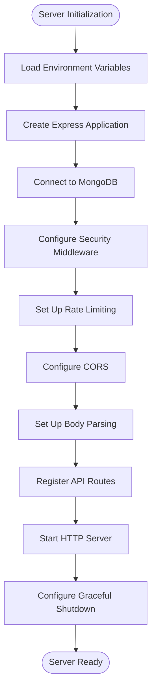
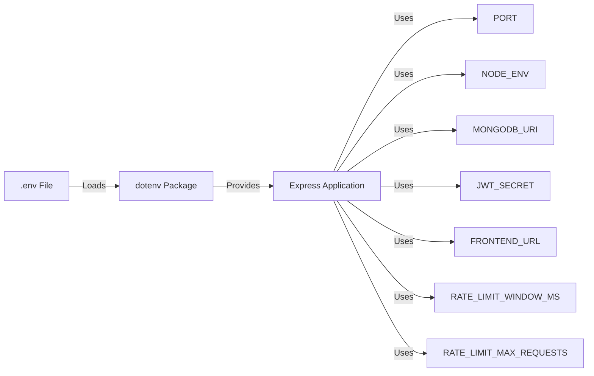
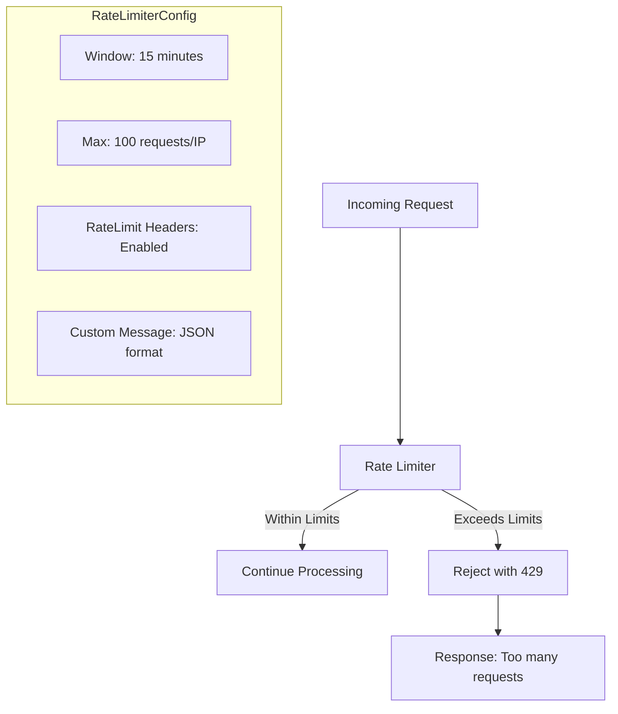
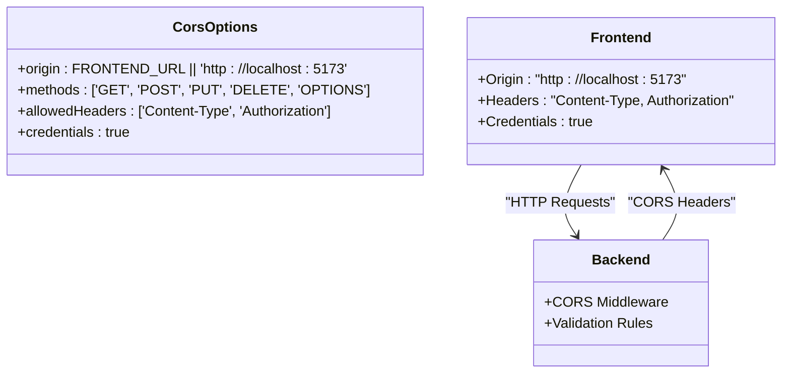
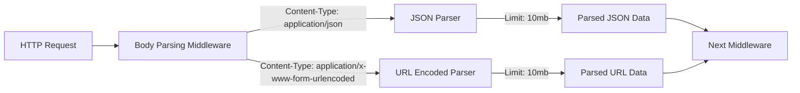
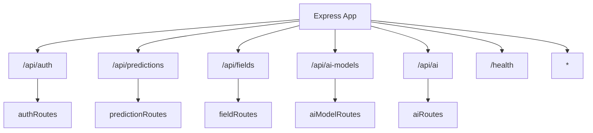
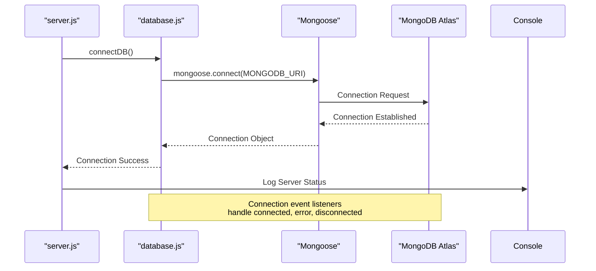
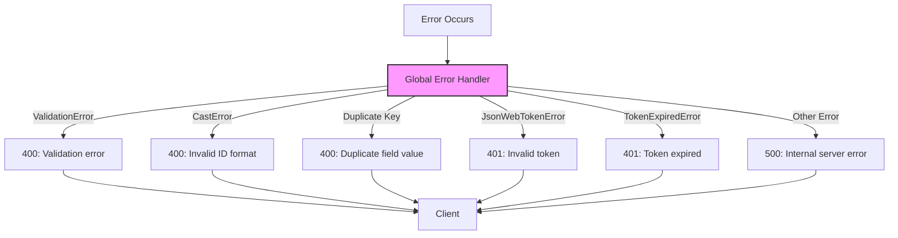
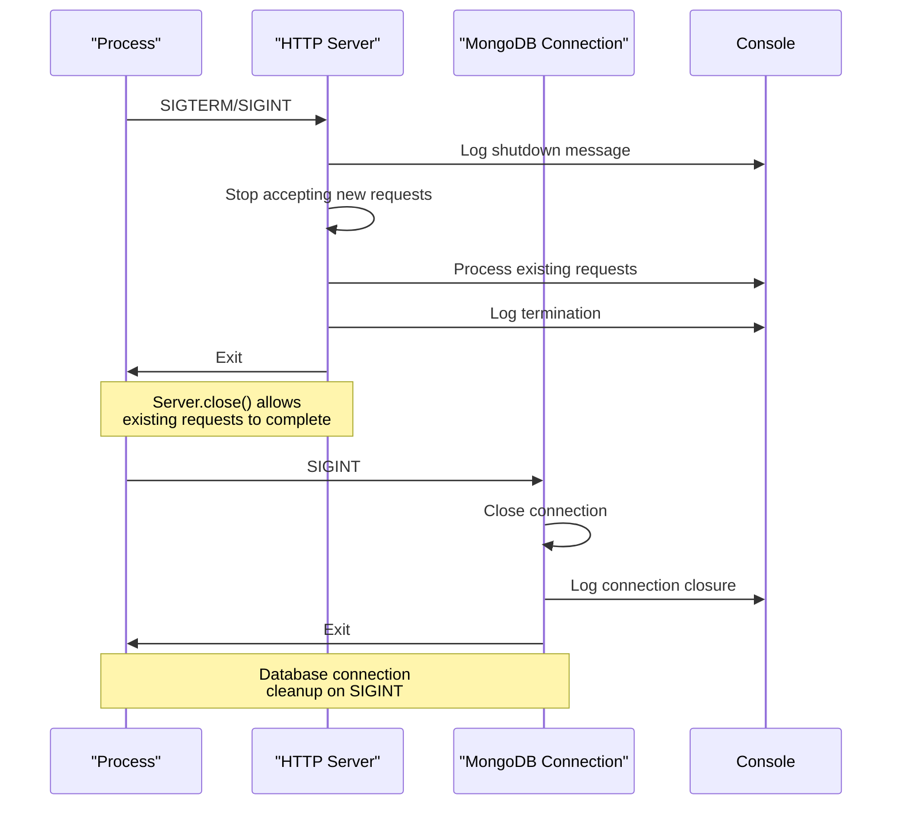
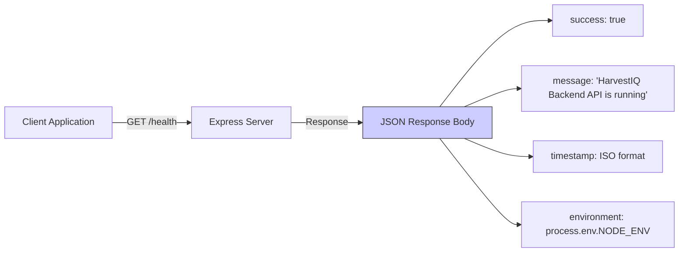

# Server Architecture

<cite>
**Referenced Files in This Document**   
- [server.js](file://backend/server.js)
- [database.js](file://backend/config/database.js)
- [auth.js](file://backend/middleware/auth.js)
</cite>

## Table of Contents
1. [Introduction](#introduction)
2. [Server Initialization Process](#server-initialization-process)
3. [Environment Configuration](#environment-configuration)
4. [Security Implementation](#security-implementation)
5. [Request Handling and Middleware](#request-handling-and-middleware)
6. [Database Connection Management](#database-connection-management)
7. [Error Handling Strategy](#error-handling-strategy)
8. [Graceful Shutdown Process](#graceful-shutdown-process)
9. [Health Monitoring](#health-monitoring)
10. [Conclusion](#conclusion)

## Introduction

The HarvestIQ backend server architecture is built on Express.js, providing a robust foundation for the agricultural intelligence platform. This document details the comprehensive server initialization and configuration process, covering environment setup, security measures, request handling, database connectivity, error management, and graceful shutdown procedures. The architecture follows modern Node.js best practices with a focus on security, reliability, and maintainability.

**Section sources**
- [server.js](file://backend/server.js#L1-L152)
- [database.js](file://backend/config/database.js#L1-L52)

## Server Initialization Process

The server initialization process begins with the import of essential dependencies and configuration modules. The Express application is instantiated and configured with various middleware components before establishing database connections and starting the HTTP server.



**Diagram sources**
- [server.js](file://backend/server.js#L1-L152)

**Section sources**
- [server.js](file://backend/server.js#L1-L50)

## Environment Configuration

The server configuration begins with environment variable loading using the dotenv package. This approach allows for flexible configuration across different deployment environments while maintaining security by keeping sensitive information out of the codebase.



The environment variables are accessed throughout the application to configure various components, including the server port, database connection string, authentication secrets, and rate limiting parameters. This centralized configuration approach enables easy environment-specific adjustments without code changes.

**Section sources**
- [server.js](file://backend/server.js#L10-L12)
- [database.js](file://backend/config/database.js#L3-L4)

## Security Implementation

The server implements multiple layers of security to protect against common web vulnerabilities. The security configuration includes Helmet for HTTP header protection, rate limiting to prevent abuse, and CORS configuration to control cross-origin requests.

### Helmet Security Configuration

Helmet is configured with specific security policies to enhance the server's protection:

```mermaid
classDiagram
class Helmet {
+crossOriginResourcePolicy : { policy : "cross-origin" }
+contentSecurityPolicy : default
+xssFilter : true
+frameguard : true
+hsts : true
+ieNoOpen : true
+noSniff : true
}
class SecurityMiddleware {
+applyHelmet() : void
+setRateLimiting() : void
+configureCORS() : void
}
SecurityMiddleware --> Helmet : "uses"
```

**Diagram sources**
- [server.js](file://backend/server.js#L20-L24)

The cross-origin resource policy is specifically set to "cross-origin" to allow resource sharing between different origins while maintaining security controls.

### Rate Limiting Strategy

The rate limiting implementation uses express-rate-limit to protect against brute force attacks and API abuse:



The rate limiting configuration is environment-aware, with configurable window duration and maximum request limits through environment variables, allowing for flexible adjustment based on deployment requirements.

**Diagram sources**
- [server.js](file://backend/server.js#L26-L37)

### CORS Configuration

The Cross-Origin Resource Sharing (CORS) configuration enables secure communication between the backend server and frontend application:



The configuration explicitly allows the frontend origin, specified HTTP methods, required headers, and supports credentials for authenticated requests, ensuring secure cross-origin communication.

**Diagram sources**
- [server.js](file://backend/server.js#L39-L47)

## Request Handling and Middleware

The server is configured with comprehensive middleware to handle various aspects of HTTP request processing, including body parsing, routing, and error handling.

### Body Parsing Middleware

The server configures body parsing middleware to handle different content types with appropriate limits:



Both JSON and URL-encoded data are processed with a 10MB payload limit, balancing the need to handle substantial data payloads while protecting against denial-of-service attacks from excessively large requests.

**Section sources**
- [server.js](file://backend/server.js#L49-L50)

### Routing Configuration

The server implements a modular routing system with dedicated route handlers for different API endpoints:



The routing configuration includes a health check endpoint and a catch-all handler for undefined routes, providing comprehensive API coverage with proper error handling.

**Section sources**
- [server.js](file://backend/server.js#L52-L65)

## Database Connection Management

The database connection management is handled through a dedicated configuration module that establishes and maintains the MongoDB connection using Mongoose.



The database configuration includes event listeners for connection status changes and implements graceful shutdown procedures to properly close the database connection when the application terminates.

**Diagram sources**
- [database.js](file://backend/config/database.js#L5-L15)
- [server.js](file://backend/server.js#L18-L19)

**Section sources**
- [database.js](file://backend/config/database.js#L1-L52)

## Error Handling Strategy

The server implements a comprehensive global error handling strategy that translates various error types into appropriate HTTP responses with meaningful messages.



The error handler specifically addresses Mongoose validation errors, casting errors, duplicate key violations, JWT authentication errors, and other common error types, providing clear feedback to clients while maintaining security by not exposing sensitive error details in production environments.

**Diagram sources**
- [server.js](file://backend/server.js#L67-L91)

**Section sources**
- [server.js](file://backend/server.js#L67-L91)
- [auth.js](file://backend/middleware/auth.js#L46-L92)

## Graceful Shutdown Process

The server implements a robust graceful shutdown process to handle termination signals and ensure proper cleanup of resources.



The graceful shutdown process listens for SIGTERM and SIGINT signals, allowing the server to stop accepting new requests while completing processing of existing requests before terminating. Additionally, unhandled promise rejections and uncaught exceptions are properly handled to prevent silent failures and ensure the application exits with an appropriate status code.

**Diagram sources**
- [server.js](file://backend/server.js#L93-L135)
- [database.js](file://backend/config/database.js#L44-L52)

**Section sources**
- [server.js](file://backend/server.js#L93-L135)
- [database.js](file://backend/config/database.js#L44-L52)

## Health Monitoring

The server includes a health check endpoint that provides system status information for monitoring and orchestration purposes.



The health check endpoint returns a JSON response containing the service status, descriptive message, current timestamp, and environment information, enabling external monitoring systems to verify the server's operational status.

**Section sources**
- [server.js](file://backend/server.js#L52-L57)

## Conclusion

The HarvestIQ server architecture demonstrates a well-structured Express.js application with comprehensive configuration for production deployment. The initialization process follows best practices with proper environment configuration, security measures, request handling, and error management. The implementation of graceful shutdown procedures and health monitoring ensures reliability and maintainability in production environments. This architecture provides a solid foundation for the agricultural intelligence platform, balancing security, performance, and developer experience.