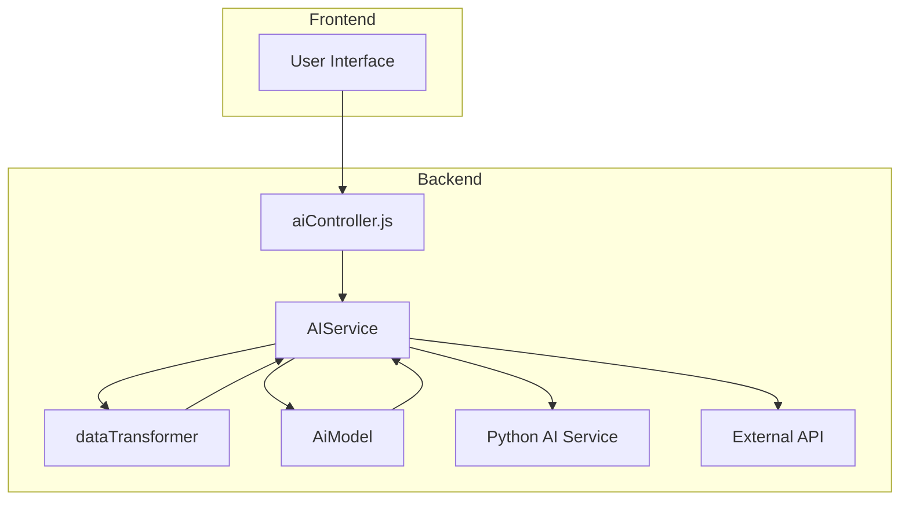
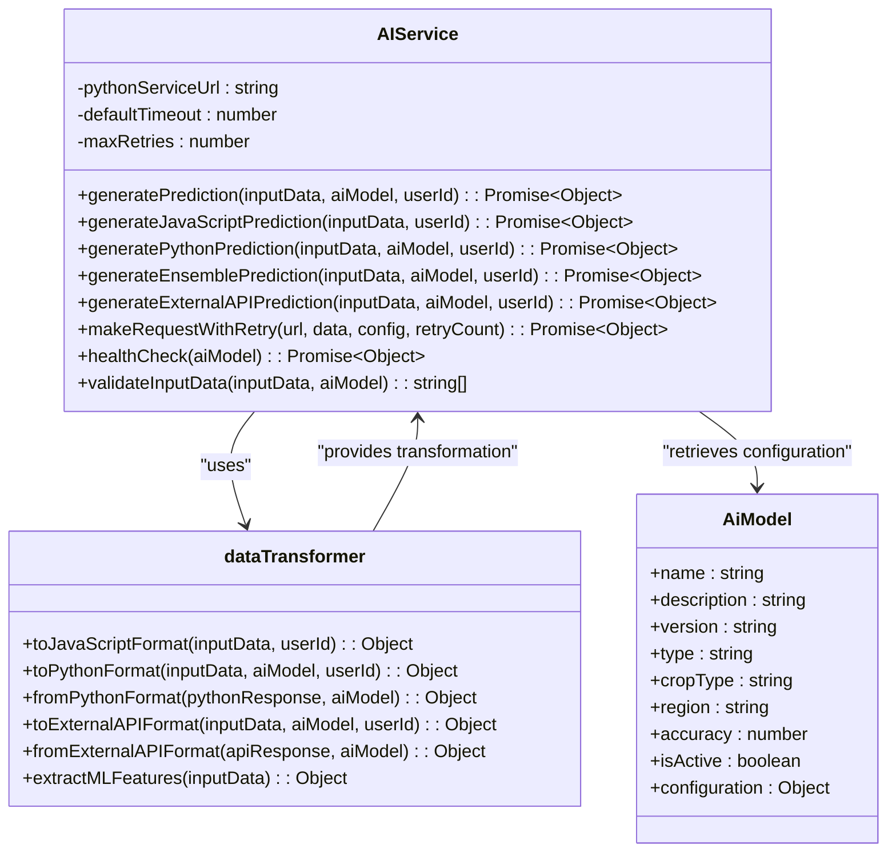
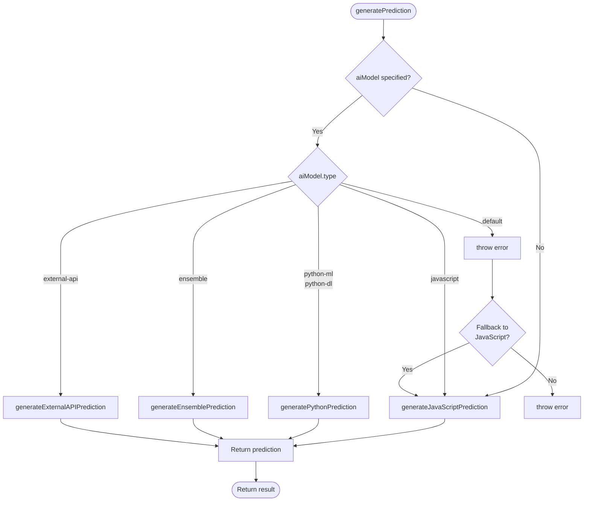
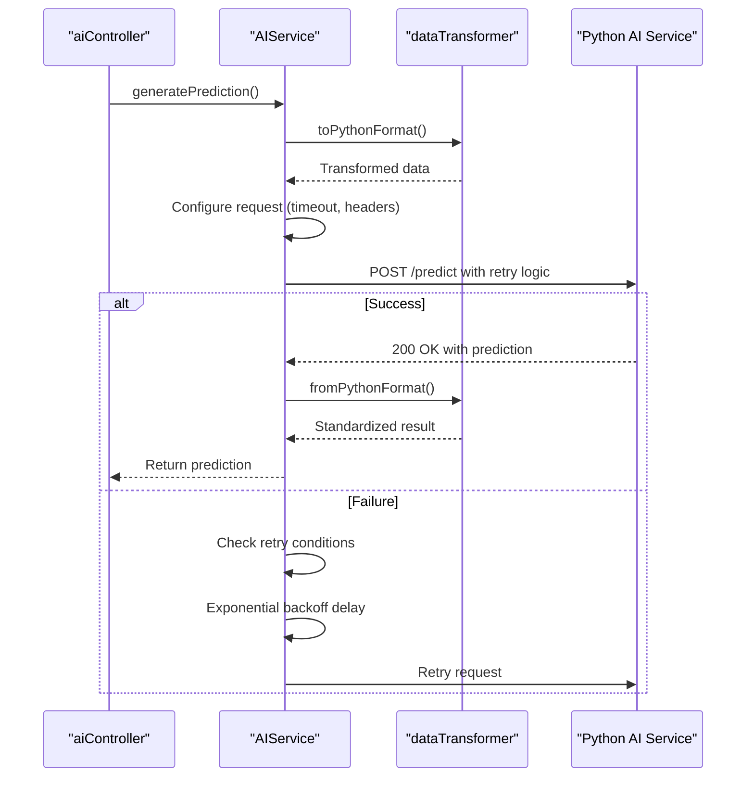
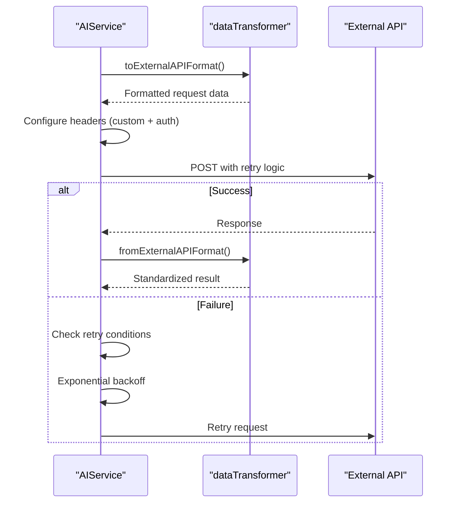
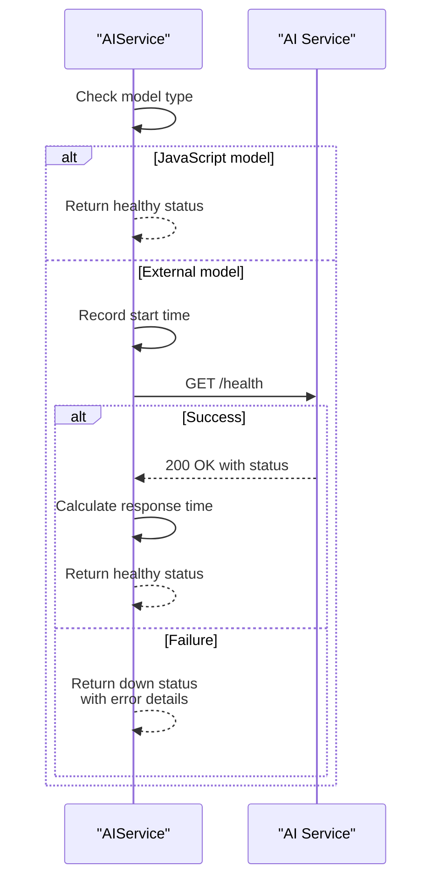
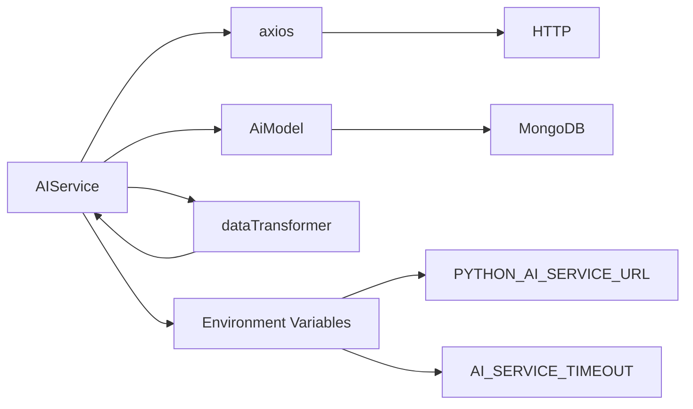

# AI Service

<cite>
**Referenced Files in This Document**   
- [aiService.js](file://HarvestIQ/backend/services/aiService.js)
- [dataTransformer.js](file://HarvestIQ/backend/services/dataTransformer.js)
- [aiController.js](file://HarvestIQ/backend/controllers/aiController.js)
- [AiModel.js](file://HarvestIQ/backend/models/AiModel.js)
- [package.json](file://HarvestIQ/backend/package.json)
</cite>

## Table of Contents
1. [Introduction](#introduction)
2. [Core Components](#core-components)
3. [Architecture Overview](#architecture-overview)
4. [Detailed Component Analysis](#detailed-component-analysis)
5. [Dependency Analysis](#dependency-analysis)
6. [Performance Considerations](#performance-considerations)
7. [Troubleshooting Guide](#troubleshooting-guide)
8. [Conclusion](#conclusion)

## Introduction
The AIService class serves as the central orchestrator for AI prediction workflows in HarvestIQ's backend system. It implements a robust, extensible architecture that supports multiple AI model types including JavaScript-based fallbacks, Python machine learning models, ensemble strategies, and external API integrations. The service follows the singleton pattern to ensure consistent state management and efficient resource utilization across the application. This documentation provides a comprehensive analysis of the service's architecture, routing logic, error handling mechanisms, and integration patterns.

## Core Components

The AIService class is the primary component responsible for managing AI prediction workflows. It acts as a facade that abstracts the complexity of different AI model types and provides a unified interface for prediction generation. The service implements dependency management through its integration with the dataTransformer utility and AiModel database model, enabling seamless data transformation and model configuration retrieval. The singleton pattern implementation ensures that only one instance of the service exists throughout the application lifecycle, promoting consistency and reducing resource overhead.

**Section sources**
- [aiService.js](file://HarvestIQ/backend/services/aiService.js#L4-L477)

## Architecture Overview



**Diagram sources**
- [aiService.js](file://HarvestIQ/backend/services/aiService.js#L4-L477)
- [aiController.js](file://HarvestIQ/backend/controllers/aiController.js#L0-L186)
- [dataTransformer.js](file://HarvestIQ/backend/services/dataTransformer.js#L0-L472)

## Detailed Component Analysis

### AIService Class Analysis
The AIService class implements the singleton pattern through module-level instantiation, ensuring a single shared instance across the application. This design choice provides several advantages: consistent configuration state, efficient resource management, and simplified dependency injection. The service manages its dependencies through direct imports of the AiModel model and dataTransformer utility, creating a cohesive ecosystem for AI prediction workflows.



**Diagram sources**
- [aiService.js](file://HarvestIQ/backend/services/aiService.js#L4-L477)
- [dataTransformer.js](file://HarvestIQ/backend/services/dataTransformer.js#L0-L472)
- [AiModel.js](file://HarvestIQ/backend/models/AiModel.js#L0-L52)

### Prediction Routing Logic
The generatePrediction method implements a sophisticated routing mechanism that directs prediction requests to appropriate handlers based on model type. The routing logic supports four primary model types: javascript, python-ml/python-dl, ensemble, and external-api. When no model is specified, the service automatically falls back to the JavaScript prediction engine, ensuring availability even when preferred models are unavailable. The method employs a try-catch block with comprehensive error handling, automatically falling back to JavaScript predictions when other model types fail.



**Diagram sources**
- [aiService.js](file://HarvestIQ/backend/services/aiService.js#L32-L88)

### Python Prediction Workflow
The Python prediction workflow demonstrates a well-structured integration pattern between the Node.js backend and Python-based AI models. The process begins with data transformation using the dataTransformer service, which converts frontend input into a format suitable for Python models. The service then configures HTTP request parameters including timeout values and authentication headers, with support for API key-based authentication. The makeRequestWithRetry method provides robust error handling with exponential backoff, ensuring resilience against transient network issues.



**Diagram sources**
- [aiService.js](file://HarvestIQ/backend/services/aiService.js#L88-L147)
- [dataTransformer.js](file://HarvestIQ/backend/services/dataTransformer.js#L0-L472)

### Ensemble Prediction Strategy
The ensemble prediction strategy implements a sophisticated approach to combining multiple AI models for improved accuracy and reliability. The service retrieves individual models specified in the ensemble configuration and executes predictions in parallel using Promise.allSettled, which ensures that failures in individual models do not prevent the overall ensemble from producing results. The implementation includes error isolation, where failed predictions are filtered out, and only successful predictions contribute to the final result. The weighted averaging algorithm combines predictions based on configurable weights, with equal weights as the default when no specific weights are provided.

```mermaid
flowchart TD
Start([generateEnsemblePrediction]) --> GetModels[Retrieve ensemble models]
GetModels --> ExecutePredictions[Execute predictions in parallel]
ExecutePredictions --> FilterSuccess{Filter successful predictions}
FilterSuccess --> |No successful predictions| ThrowError[Throw error]
FilterSuccess --> |Successful predictions exist| Combine[Combine predictions]
Combine --> WeightedAverage[Calculate weighted average]
WeightedAverage --> MergeRecommendations[Merge recommendations<br>(remove duplicates)]
MergeRecommendations --> ReturnResult[Return combined result]
ThrowError --> ReturnResult
ReturnResult --> End([Return result])
```

**Diagram sources**
- [aiService.js](file://HarvestIQ/backend/services/aiService.js#L149-L219)

### External API Integration
The external API integration pattern provides a flexible framework for connecting with third-party AI services. The implementation supports dynamic header configuration, allowing each external API to specify custom headers in addition to standard content-type headers. Authentication is handled through bearer tokens when an API key is configured in the model settings. The service URL is resolved from the model configuration, with fallback to environment variables, enabling flexible deployment configurations. The integration leverages the same retry logic and data transformation patterns used for internal services, ensuring consistent behavior across different integration types.



**Diagram sources**
- [aiService.js](file://HarvestIQ/backend/services/aiService.js#L221-L265)

### Health Check Functionality
The health check functionality provides monitoring capabilities for AI service availability, enabling proactive detection of service disruptions. The implementation differentiates between JavaScript models, which are considered always healthy due to their in-process nature, and external services that require HTTP health checks. For external services, the method measures response time and captures detailed status information from the health endpoint. The error handling strategy returns a comprehensive status object even when health checks fail, providing valuable diagnostic information for monitoring systems.



**Diagram sources**
- [aiService.js](file://HarvestIQ/backend/services/aiService.js#L320-L351)

### Error Handling Strategy
The error handling strategy in AIService is comprehensive and resilient, designed to maintain service availability even under adverse conditions. The primary mechanism is fallback to JavaScript predictions when other model types fail, ensuring that users always receive some form of prediction result. The retry logic classifies errors as retryable based on specific criteria including connection timeouts, connection resets, DNS lookup failures, and server errors (5xx status codes). The exponential backoff algorithm starts with a 1-second delay and doubles with each retry, capped at 10 seconds, preventing overwhelming external services during outages.

```mermaid
flowchart TD
Start([Error Occurred]) --> CheckRetryable{"isRetryableError?"}
CheckRetryable --> |No| CheckFallback{"Fallback to<br>JavaScript?"}
CheckRetryable --> |Yes| CheckRetries{"retryCount < maxRetries?"}
CheckRetries --> |No| CheckFallback
CheckRetries --> |Yes| CalculateDelay[Calculate delay:<br>min(1000 * 2^retryCount, 10000)]
CalculateDelay --> Wait[Wait for delay period]
Wait --> Retry[Retry request]
Retry --> CheckRetryable
CheckFallback --> |Yes| UseJavaScript[Use JavaScript prediction]
CheckFallback --> |No| ThrowError[Throw original error]
UseJavaScript --> ReturnResult[Return fallback result]
ThrowError --> ReturnResult
ReturnResult --> End([Complete])
```

**Diagram sources**
- [aiService.js](file://HarvestIQ/backend/services/aiService.js#L267-L318)

## Dependency Analysis

The AIService class has well-defined dependencies that follow the principle of separation of concerns. The primary dependencies include the axios library for HTTP communication, the AiModel database model for retrieving model configurations, and the dataTransformer utility for data format conversion. The service also depends on environment variables for configuration, particularly PYTHON_AI_SERVICE_URL and AI_SERVICE_TIMEOUT, allowing for flexible deployment across different environments. The package.json file reveals that axios is explicitly listed as a dependency, confirming the service's reliance on this HTTP client for external communications.



**Diagram sources**
- [aiService.js](file://HarvestIQ/backend/services/aiService.js#L1-L36)
- [package.json](file://HarvestIQ/backend/package.json#L1-L36)

**Section sources**
- [aiService.js](file://HarvestIQ/backend/services/aiService.js#L1-L36)
- [package.json](file://HarvestIQ/backend/package.json#L1-L36)

## Performance Considerations
The AIService implementation includes several performance optimizations. The singleton pattern reduces memory overhead by ensuring only one instance exists. The use of Promise.allSettled for ensemble predictions enables parallel execution, minimizing total processing time. The retry mechanism with exponential backoff prevents overwhelming external services during periods of high load or temporary outages. The data transformation layer is optimized to handle format conversions efficiently, with methods like extractMLFeatures providing pre-processed features that can improve model performance. Configuration values are cached at the instance level, avoiding repeated environment variable lookups during request processing.

## Troubleshooting Guide
Common issues with the AIService typically involve configuration errors, connectivity problems, or model-specific failures. For configuration issues, verify that environment variables like PYTHON_AI_SERVICE_URL are correctly set. Connectivity problems may require checking network configurations and firewall settings, particularly for external API integrations. When ensemble models fail, examine individual model health and ensure all referenced models are active. The comprehensive logging in error handling provides valuable diagnostic information, with specific error messages indicating the source of failures. Monitoring the health check endpoint can proactively identify service disruptions before they impact users.

**Section sources**
- [aiService.js](file://HarvestIQ/backend/services/aiService.js#L320-L351)

## Conclusion
The AIService class represents a sophisticated, production-ready implementation of an AI orchestration layer. Its design demonstrates several best practices including the singleton pattern for state management, comprehensive error handling with fallback mechanisms, and modular architecture that supports multiple AI model types. The service's integration with data transformation utilities and database models creates a cohesive ecosystem for AI predictions, while its support for external APIs enables extensibility beyond the core platform. The implementation balances flexibility with reliability, providing a robust foundation for HarvestIQ's agricultural intelligence capabilities.