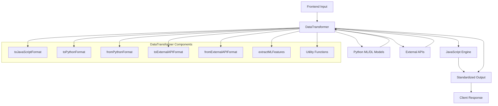
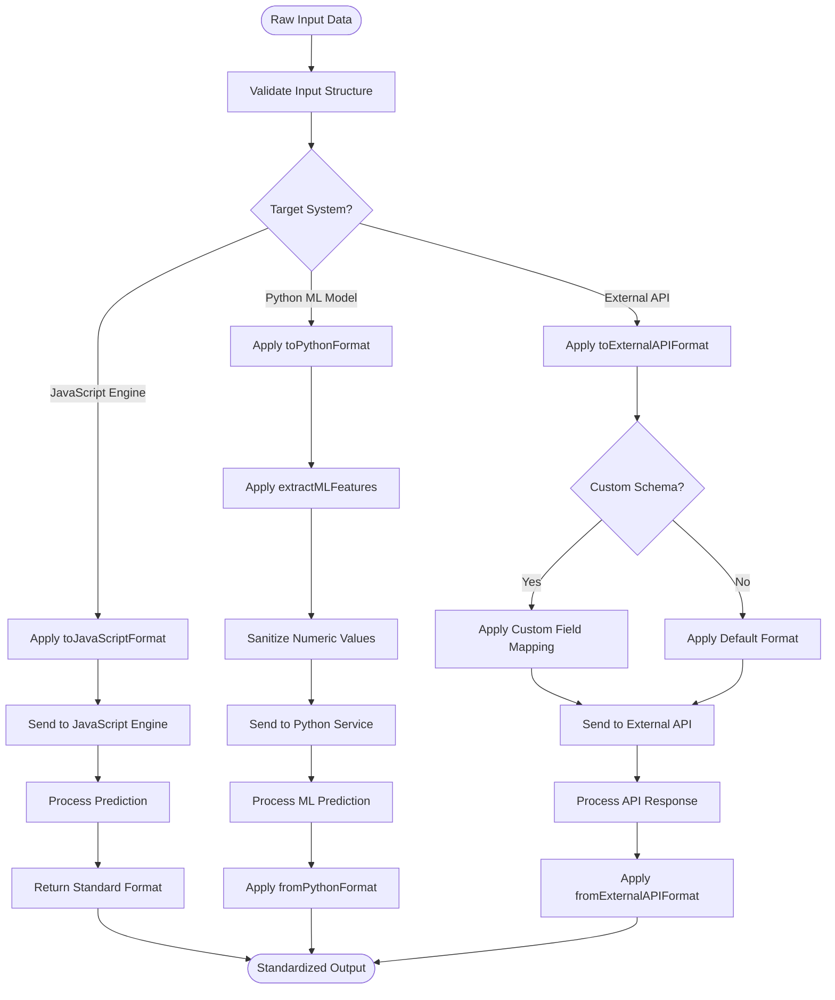
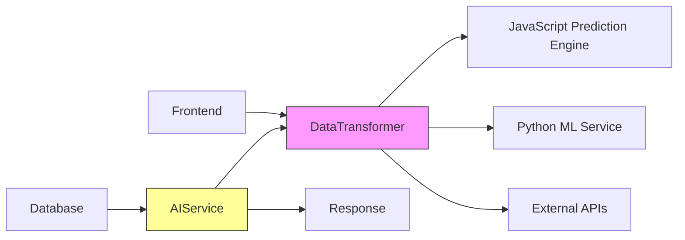

# Data Transformer

<cite>
**Referenced Files in This Document**   
- [dataTransformer.js](file://HarvestIQ/backend/services/dataTransformer.js)
- [aiService.js](file://HarvestIQ/backend/services/aiService.js)
- [dataTransformer.js](file://HarvestIQ/src/services/dataTransformer.js)
</cite>

## Table of Contents
1. [Introduction](#introduction)
2. [Core Transformation Methods](#core-transformation-methods)
3. [Utility Functions and Feature Engineering](#utility-functions-and-feature-engineering)
4. [Data Flow and Integration](#data-flow-and-integration)
5. [Error Handling and Edge Cases](#error-handling-and-edge-cases)
6. [Architecture Overview](#architecture-overview)
7. [Detailed Component Analysis](#detailed-component-analysis)
8. [Dependency Analysis](#dependency-analysis)
9. [Performance Considerations](#performance-considerations)
10. [Troubleshooting Guide](#troubleshooting-guide)
11. [Conclusion](#conclusion)

## Introduction

The DataTransformer service in HarvestIQ serves as the central data format conversion engine that enables interoperability between the frontend application, backend services, Python-based machine learning models, and external third-party APIs. This comprehensive documentation details the service's architecture, transformation methods, utility functions, and integration patterns that ensure data integrity across the system.

The service operates as a singleton instance, providing standardized methods to transform data between various formats required by different components of the HarvestIQ ecosystem. It handles the critical responsibility of preparing input data for prediction engines, normalizing responses from AI services, and facilitating seamless integration with external systems through custom schema mapping.

**Section sources**
- [dataTransformer.js](file://HarvestIQ/backend/services/dataTransformer.js#L1-L40)

## Core Transformation Methods

### toJavaScriptFormat Method

The `toJavaScriptFormat` method transforms frontend input data into the format required by the JavaScript prediction engine, which serves as the fallback prediction system. This method extracts essential agricultural parameters from the input data and structures them in a flat object format optimized for quick processing.

The transformation includes crop type, farm area, region, and user identification, along with optional soil and weather data. Missing values are handled gracefully by setting them to null rather than omitting the fields entirely, ensuring consistent data structure. The method also supports additional parameters through the spread operator, allowing for extensibility without modifying the core transformation logic.

[SPEC SYMBOL](file://HarvestIQ/backend/services/dataTransformer.js#L13-L35)

### toPythonFormat Method

The `toPythonFormat` method prepares data for consumption by Python-based machine learning and deep learning models. This transformation is more comprehensive than the JavaScript format, featuring nested object structures that align with Python service expectations.

The method organizes data into logical groups including model metadata, user context, agricultural data, soil parameters, weather data, and model-specific parameters. It also incorporates feature engineering through the `extractMLFeatures` method, which adds derived features that enhance model accuracy. All numeric values are sanitized to ensure type consistency, and the current planting season is automatically determined based on the system date.

[SPEC SYMBOL](file://HarvestIQ/backend/services/dataTransformer.js#L44-L89)

### fromPythonFormat Method

The `fromPythonFormat` method normalizes responses from Python AI services into HarvestIQ's standard prediction format. This transformation handles the conversion of Python-specific field names and data structures into the application's consistent response schema.

The method processes prediction results, metadata, recommendations, and government data from the Python service response. It ensures numeric values are properly sanitized and confidence scores are converted to percentage format. The transformation also preserves important model performance metrics and uncertainty bounds for transparency and debugging purposes.

[SPEC SYMBOL](file://HarvestIQ/backend/services/dataTransformer.js#L97-L122)

### toExternalAPIFormat Method

The `toExternalAPIFormat` method facilitates integration with third-party services by transforming data into external API-compatible formats. The method supports both default and custom schema mappings, providing flexibility for different integration requirements.

When a custom schema is configured for an AI model, the method uses the `applyCustomMapping` function to transform fields according to the specified mapping rules. Otherwise, it applies a standardized format with nested agricultural and environmental data structures. Each request is assigned a unique request ID generated by the `generateRequestId` method to support tracking and debugging.

[SPEC SYMBOL](file://HarvestIQ/backend/services/dataTransformer.js#L131-L168)

### fromExternalAPIFormat Method

The `fromExternalAPIFormat` method parses responses from external APIs and normalizes them into HarvestIQ's standard prediction format. Similar to the input transformation, this method supports both default parsing logic and custom response mappings.

For custom schemas, the method uses `parseCustomResponse` to map external API fields to the application's internal structure. The default parser extracts yield predictions, confidence scores, and recommendations from common response patterns. This dual approach ensures compatibility with a wide range of external services while maintaining data consistency within the application.

[SPEC SYMBOL](file://HarvestIQ/backend/services/dataTransformer.js#L176-L197)

**Section sources**
- [dataTransformer.js](file://HarvestIQ/backend/services/dataTransformer.js#L13-L197)

## Utility Functions and Feature Engineering

### extractMLFeatures Method

The `extractMLFeatures` method performs feature engineering to enhance the predictive power of machine learning models. It creates derived features from raw input data that capture complex relationships and patterns not immediately apparent in the original data.

The method implements categorical encoding for crop types and regions, transforming text labels into numerical representations suitable for ML algorithms. It also creates feature categories for soil pH, rainfall, humidity, and farm size, converting continuous values into meaningful classifications. The method calculates derived metrics such as NPK ratios and soil fertility index, providing the models with higher-level insights.

[SPEC SYMBOL](file://HarvestIQ/backend/services/dataTransformer.js#L204-L236)

### Data Sanitization Functions

The DataTransformer service includes robust data sanitization capabilities to handle edge cases and ensure data quality. The `sanitizeNumeric` method safely converts string values to numbers while handling null, undefined, and invalid inputs by returning null instead of NaN.

This approach prevents type errors in downstream systems and maintains data integrity. The method is used throughout the transformation process to ensure all numeric fields contain valid numbers or null values, never strings or NaN, which could cause issues in mathematical operations or model inference.

[SPEC SYMBOL](file://HarvestIQ/backend/services/dataTransformer.js#L256-L260)

### Seasonal and Categorical Functions

The service includes several utility functions for contextual data processing. The `getCurrentSeason` method determines the current agricultural season (kharif, rabi, or zaid) based on the system date, providing relevant context for crop predictions.

Categorical encoding functions like `encodeCropType` and `encodeRegion` convert text labels into numerical representations using predefined mappings. These functions support the integration of categorical variables into machine learning models that require numerical input. The encoding schemes are designed to be consistent across the application, ensuring compatibility between different components.

[SPEC SYMBOL](file://HarvestIQ/backend/services/dataTransformer.js#L262-L282)

### Feature Completeness Scoring

The `calculateFeatureCompleteness` method evaluates the completeness of input data by calculating the ratio of provided fields to expected fields. This score helps assess data quality and can be used to determine confidence levels in predictions.

The method considers essential fields, soil data fields, and weather data fields in its calculation, providing a comprehensive assessment of data completeness. The resulting score is used by prediction models to adjust confidence levels, with more complete datasets generally receiving higher confidence scores.

[SPEC SYMBOL](file://HarvestIQ/backend/services/dataTransformer.js#L393-L419)

**Section sources**
- [dataTransformer.js](file://HarvestIQ/backend/services/dataTransformer.js#L204-L419)

## Data Flow and Integration

### Integration with AI Service

The DataTransformer service is tightly integrated with the AIService, which orchestrates prediction requests across different model types. When a prediction request is received, the AIService routes it to the appropriate prediction method based on the model type, using the DataTransformer to prepare the input data.

For Python models, the AIService calls `toPythonFormat` to transform the data before sending it to the Python service, then uses `fromPythonFormat` to normalize the response. Similarly, for external API integrations, it uses `toExternalAPIFormat` and `fromExternalAPIFormat` to handle the data transformation. This integration pattern ensures consistent data handling across all prediction pathways.

[SPEC SYMBOL](file://HarvestIQ/backend/services/aiService.js#L94-L138)
[SPEC SYMBOL](file://HarvestIQ/backend/services/aiService.js#L195-L237)

### Fallback Mechanism

The system implements a robust fallback mechanism that leverages the DataTransformer service. When primary prediction methods fail, the system automatically falls back to the JavaScript prediction engine, using `toJavaScriptFormat` to prepare the data for this simpler model.

This fallback ensures that users always receive a prediction, even when more sophisticated models are unavailable. The transformation to JavaScript format is designed to be minimal and fast, supporting the fallback engine's role as a reliable alternative when other services are down or experiencing issues.

[SPEC SYMBOL](file://HarvestIQ/backend/services/aiService.js#L60-L89)

**Section sources**
- [aiService.js](file://HarvestIQ/backend/services/aiService.js#L18-L55)

## Error Handling and Edge Cases

### Missing Value Management

The DataTransformer service implements comprehensive strategies for handling missing values and incomplete data. For optional fields, the service uses nullish coalescing operators to set default values of null when data is missing, preserving the expected data structure.

This approach ensures that downstream systems receive consistent data shapes regardless of input completeness. The service avoids omitting fields entirely, which could cause issues with schema validation and data processing in dependent components.

### Invalid Numeric Input Handling

The `sanitizeNumeric` method provides robust handling of invalid numeric inputs. Instead of throwing errors or allowing NaN values to propagate, the method returns null for any value that cannot be properly converted to a number.

This graceful degradation prevents cascading failures in the prediction pipeline and allows models to handle missing numeric data appropriately. The approach prioritizes system stability over strict data validation, recognizing that agricultural data often contains gaps or inconsistencies.

### Schema Mapping Resilience

The custom schema mapping functions `applyCustomMapping` and `parseCustomResponse` are designed to handle incomplete or malformed mappings gracefully. These methods use optional chaining and nullish coalescing to prevent errors when expected fields are missing from the input data or mapping configuration.

The `getNestedValue` and `setNestedValue` utility functions support deep property access and assignment, enabling flexible data transformation while handling intermediate undefined values safely. This resilience is critical for maintaining integration stability with external systems that may change their APIs or have inconsistent data quality.

[SPEC SYMBOL](file://HarvestIQ/backend/services/dataTransformer.js#L421-L463)

**Section sources**
- [dataTransformer.js](file://HarvestIQ/backend/services/dataTransformer.js#L256-L260)
- [dataTransformer.js](file://HarvestIQ/backend/services/dataTransformer.js#L421-L463)

## Architecture Overview

**Diagram sources **
- [dataTransformer.js](file://HarvestIQ/backend/services/dataTransformer.js#L13-L467)

**Section sources**
- [dataTransformer.js](file://HarvestIQ/backend/services/dataTransformer.js#L1-L473)

## Detailed Component Analysis

### Data Transformation Pipeline

The DataTransformer service implements a comprehensive pipeline for data format conversion across the HarvestIQ ecosystem. The pipeline begins with raw input from the frontend, which contains agricultural parameters in a user-friendly format.

The service then applies the appropriate transformation method based on the target system, whether it's the JavaScript fallback engine, Python ML models, or external APIs. Each transformation method applies specific formatting rules, type conversions, and feature engineering to prepare the data for its intended destination.

After processing by external systems, response data flows back through the transformer, which normalizes it into HarvestIQ's standard prediction format. This bidirectional transformation capability ensures seamless interoperability while maintaining data consistency across the application.

**Diagram sources **
- [dataTransformer.js](file://HarvestIQ/backend/services/dataTransformer.js#L13-L197)

**Section sources**
- [dataTransformer.js](file://HarvestIQ/backend/services/dataTransformer.js#L13-L467)

## Dependency Analysis

**Diagram sources **
- [dataTransformer.js](file://HarvestIQ/backend/services/dataTransformer.js#L1-L473)
- [aiService.js](file://HarvestIQ/backend/services/aiService.js#L1-L482)

**Section sources**
- [dataTransformer.js](file://HarvestIQ/backend/services/dataTransformer.js#L1-L473)
- [aiService.js](file://HarvestIQ/backend/services/aiService.js#L1-L482)

## Performance Considerations

The DataTransformer service is designed for high performance and low latency, as it sits on the critical path of prediction requests. The transformation methods are implemented as synchronous operations where possible, avoiding unnecessary async/await overhead for simple data mapping tasks.

The service minimizes computational complexity by using efficient JavaScript operations for data transformation. The utility functions are optimized for performance, with categorical encoding using object lookups rather than iterative searches. Feature engineering calculations are kept simple to avoid introducing significant processing delays.

For high-traffic scenarios, the service could benefit from memoization of frequently used transformations and caching of encoding mappings. However, the current implementation prioritizes code clarity and maintainability over micro-optimizations, recognizing that transformation overhead is typically negligible compared to model inference times.

## Troubleshooting Guide

When diagnosing issues with the DataTransformer service, consider the following common scenarios:

1. **Missing fields in output**: Verify that input data contains the expected structure and that optional chaining is not causing fields to be omitted. Check that the `sanitizeNumeric` method is not converting valid strings to null.

2. **Schema mapping failures**: When using custom mappings, ensure that the source paths in the mapping configuration correctly match the structure of the input data. Use the `getNestedValue` method's error handling to identify path resolution issues.

3. **Feature engineering inconsistencies**: Verify that categorical encodings are consistent between training and prediction environments. Check that the `encodeCropType` and `encodeRegion` mappings include all supported values.

4. **Season calculation errors**: Confirm that the system date is correct, as the `getCurrentSeason` method relies on the server's date and time settings.

5. **External API integration issues**: Validate that the `toExternalAPIFormat` and `fromExternalAPIFormat` methods are correctly handling the specific requirements of the target API, including authentication headers and request structure.

**Section sources**
- [dataTransformer.js](file://HarvestIQ/backend/services/dataTransformer.js#L1-L473)

## Conclusion

The DataTransformer service is a critical component of the HarvestIQ architecture, enabling seamless interoperability between diverse systems through standardized data format conversion. By providing robust methods for transforming data to and from JavaScript, Python ML, and external API formats, the service ensures data integrity across the application ecosystem.

The service's comprehensive feature engineering capabilities enhance prediction accuracy by creating derived features that capture complex agricultural patterns. Its graceful handling of edge cases and missing data ensures system reliability even with imperfect input. The tight integration with the AIService enables sophisticated routing and fallback mechanisms that maintain service availability.

Through its well-designed architecture and comprehensive utility functions, the DataTransformer service exemplifies best practices in data transformation, providing a reliable foundation for HarvestIQ's predictive capabilities while maintaining flexibility for future integration requirements.