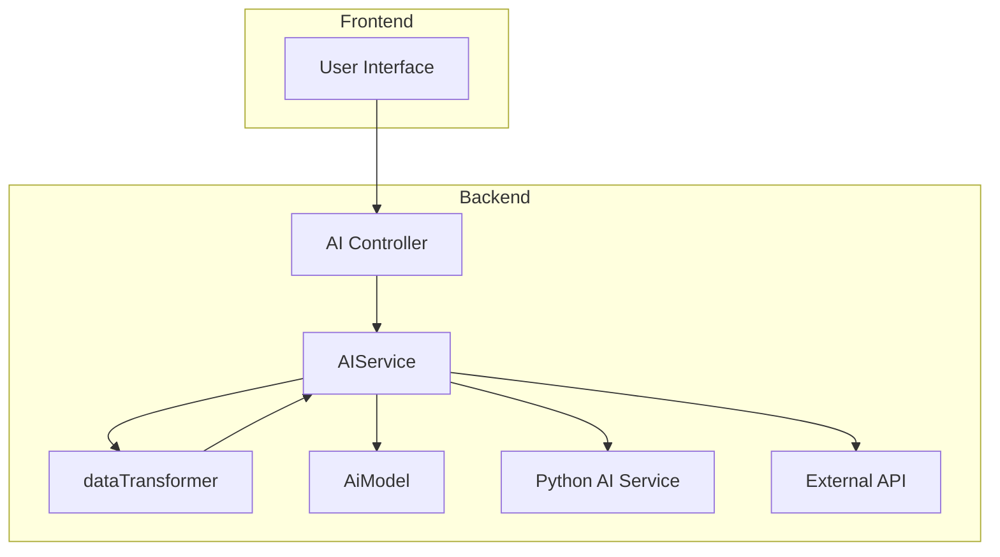
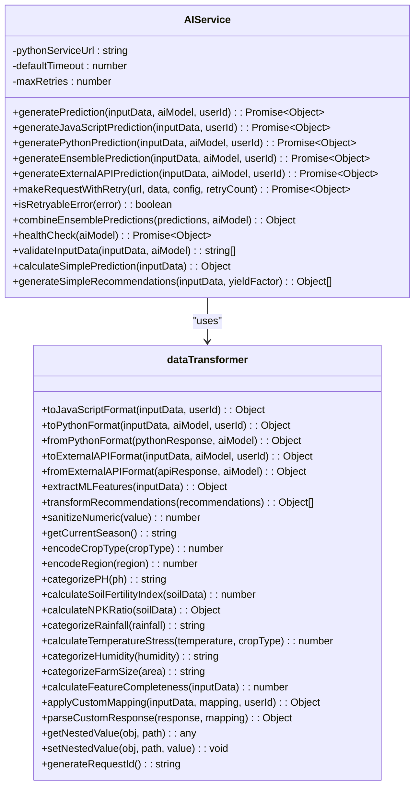
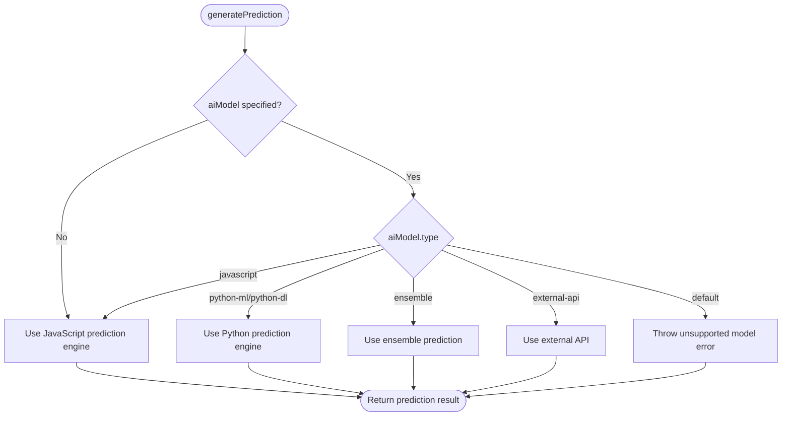
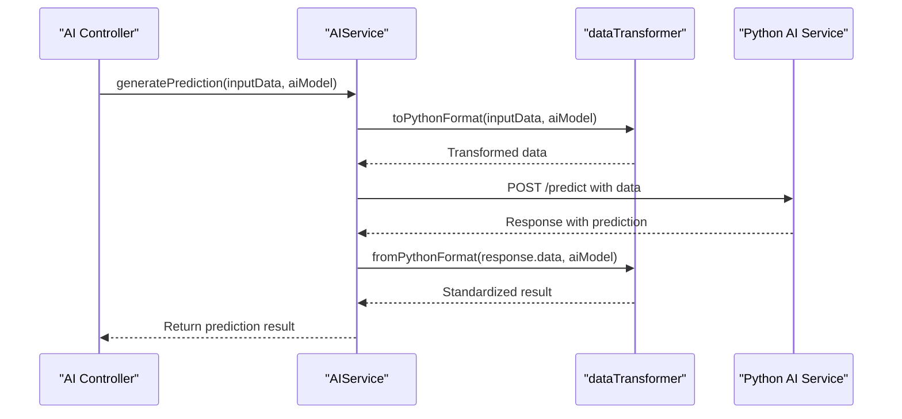
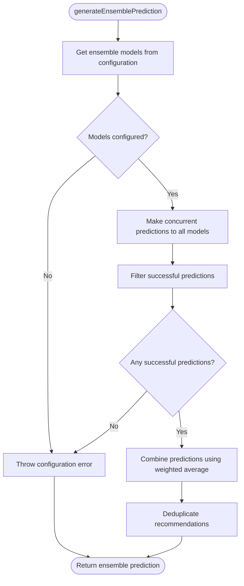
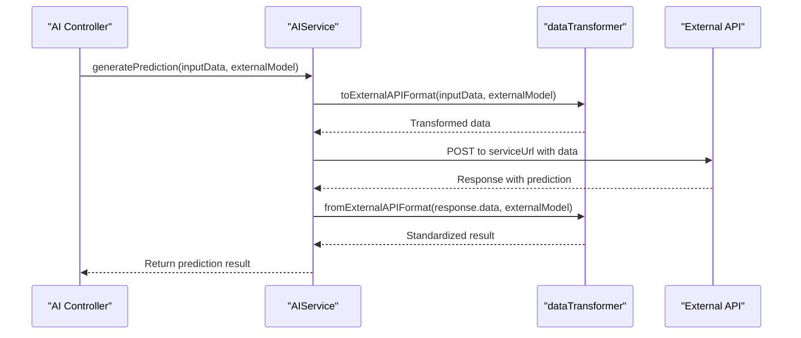
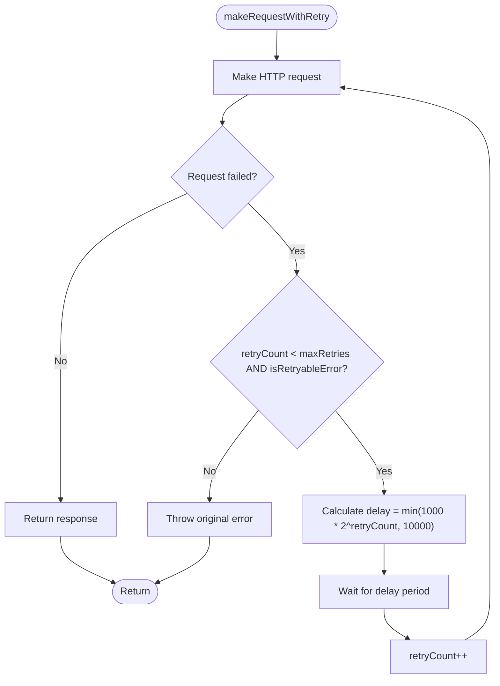
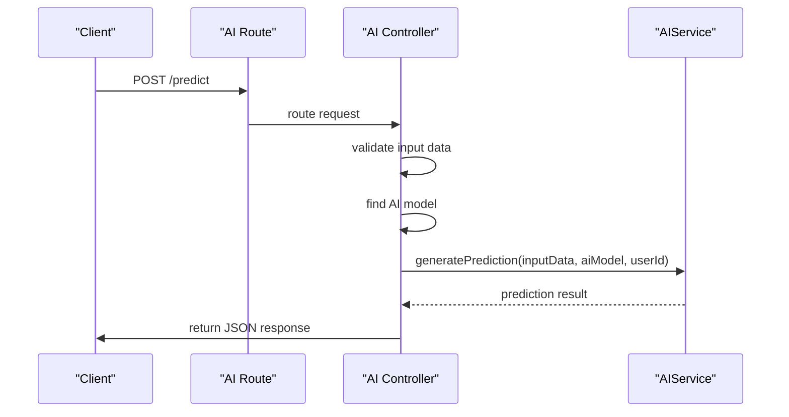

# Service Layer

<cite>
**Referenced Files in This Document**   
- [aiService.js](file://HarvestIQ/backend/services/aiService.js)
- [dataTransformer.js](file://HarvestIQ/backend/services/dataTransformer.js)
- [aiController.js](file://HarvestIQ/backend/controllers/aiController.js)
- [ai.js](file://HarvestIQ/backend/routes/ai.js)
- [AiModel.js](file://HarvestIQ/backend/models/AiModel.js)
</cite>

## Table of Contents
1. [Introduction](#introduction)
2. [Service Layer Architecture](#service-layer-architecture)
3. [AIService Class and Singleton Pattern](#aiservice-class-and-singleton-pattern)
4. [Prediction Routing Logic](#prediction-routing-logic)
5. [Python Prediction Workflow](#python-prediction-workflow)
6. [Ensemble Prediction Strategy](#ensemble-prediction-strategy)
7. [External API Integration](#external-api-integration)
8. [Data Transformer Service](#data-transformer-service)
9. [Error Handling and Fallback Mechanisms](#error-handling-and-fallback-mechanisms)
10. [Service Usage from Controllers](#service-usage-from-controllers)
11. [Dependency Management](#dependency-management)

## Introduction

The service layer in HarvestIQ's backend architecture serves as the central component for business logic encapsulation, separating core application functionality from request handling concerns. This layer provides a clean abstraction between the controllers (which handle HTTP requests) and the underlying data models and external services. The primary services in this layer are the AIService and dataTransformer, which work together to provide AI-powered crop yield predictions to farmers. The service layer implements sophisticated routing logic to direct prediction requests to appropriate models based on type, handles data transformation between different format requirements, manages external service integrations, and provides robust error handling with fallback mechanisms.

**Section sources**
- [aiService.js](file://HarvestIQ/backend/services/aiService.js#L1-L50)
- [dataTransformer.js](file://HarvestIQ/backend/services/dataTransformer.js#L1-L50)

## Service Layer Architecture

The service layer in HarvestIQ follows a modular architecture with clear separation of concerns. The AIService class acts as the primary entry point for all AI prediction functionality, while the dataTransformer service handles format conversion between different components of the system. This architecture enables the application to support multiple types of AI models (JavaScript, Python ML/DL, ensemble, and external APIs) through a unified interface. The service layer abstracts away the complexities of communicating with different model types, providing a consistent API to the controllers. This design promotes reusability, testability, and maintainability, as business logic is centralized and decoupled from the HTTP request/response cycle.



**Diagram sources**
- [aiService.js](file://HarvestIQ/backend/services/aiService.js#L1-L50)
- [dataTransformer.js](file://HarvestIQ/backend/services/dataTransformer.js#L1-L50)
- [aiController.js](file://HarvestIQ/backend/controllers/aiController.js#L1-L20)

**Section sources**
- [aiService.js](file://HarvestIQ/backend/services/aiService.js#L1-L100)
- [dataTransformer.js](file://HarvestIQ/backend/services/dataTransformer.js#L1-L100)

## AIService Class and Singleton Pattern

The AIService class is implemented as a singleton to ensure that only one instance exists throughout the application lifecycle. This pattern is appropriate for the service layer as it manages shared resources and configuration that should be consistent across all prediction requests. The singleton instance is exported as both a named export (`aiService`) and a default export, making it easily accessible throughout the application. The class constructor initializes key configuration values from environment variables, including the Python AI service URL, default timeout, and maximum retry attempts. This centralized configuration management ensures consistency across all service operations and simplifies deployment across different environments.



**Diagram sources**
- [aiService.js](file://HarvestIQ/backend/services/aiService.js#L4-L477)
- [dataTransformer.js](file://HarvestIQ/backend/services/dataTransformer.js#L5-L468)

**Section sources**
- [aiService.js](file://HarvestIQ/backend/services/aiService.js#L4-L477)
- [dataTransformer.js](file://HarvestIQ/backend/services/dataTransformer.js#L5-L468)

## Prediction Routing Logic

The AIService implements a comprehensive routing mechanism in the `generatePrediction` method that directs prediction requests to appropriate model types based on the AI model configuration. The method first checks if a specific model is provided; if not, it defaults to the JavaScript prediction engine. For explicit model types, the service uses a switch statement to route to the appropriate prediction method: JavaScript models use the local `generateJavaScriptPrediction` method, Python ML/DL models use `generatePythonPrediction`, ensemble models use `generateEnsemblePrediction`, and external APIs use `generateExternalAPIPrediction`. This routing logic enables the system to support multiple AI model types through a unified interface, allowing administrators to configure different models for different crops and regions while maintaining a consistent API for clients.



**Diagram sources**
- [aiService.js](file://HarvestIQ/backend/services/aiService.js#L18-L55)

**Section sources**
- [aiService.js](file://HarvestIQ/backend/services/aiService.js#L18-L55)

## Python Prediction Workflow

The Python prediction workflow in HarvestIQ involves several coordinated steps to transform data, make HTTP requests, and process responses. When a prediction request is routed to a Python model, the `generatePythonPrediction` method first transforms the input data using the dataTransformer's `toPythonFormat` method, which structures the data according to the expected schema of the Python AI service. The method then configures the HTTP request with appropriate headers, timeout values, and authentication tokens based on the model configuration. The service makes the request to the Python AI service using axios with retry logic implemented through the `makeRequestWithRetry` method. Upon receiving a response, the service transforms the Python model's output back to the standard format using the dataTransformer's `fromPythonFormat` method before returning the results to the caller.



**Diagram sources**
- [aiService.js](file://HarvestIQ/backend/services/aiService.js#L78-L145)
- [dataTransformer.js](file://HarvestIQ/backend/services/dataTransformer.js#L50-L150)

**Section sources**
- [aiService.js](file://HarvestIQ/backend/services/aiService.js#L78-L145)
- [dataTransformer.js](file://HarvestIQ/backend/services/dataTransformer.js#L50-L150)

## Ensemble Prediction Strategy

The ensemble prediction strategy in HarvestIQ combines multiple AI models using a weighted averaging approach to produce more robust and accurate predictions. When an ensemble model is selected, the `generateEnsemblePrediction` method retrieves the configuration to identify which individual models should be included in the ensemble. The service then makes concurrent prediction requests to each model in the ensemble using `Promise.allSettled`, which allows some models to fail without preventing the entire ensemble from completing. Successful predictions are filtered and combined using a weighted average, where weights can be specified in the model configuration or default to equal weighting. The ensemble result includes combined yield predictions, confidence scores, and deduplicated recommendations from all contributing models, providing a more comprehensive analysis than any single model could produce.



**Diagram sources**
- [aiService.js](file://HarvestIQ/backend/services/aiService.js#L147-L196)

**Section sources**
- [aiService.js](file://HarvestIQ/backend/services/aiService.js#L147-L196)

## External API Integration

The external API integration pattern in HarvestIQ's service layer provides a flexible mechanism for incorporating third-party AI services into the prediction system. The `generateExternalAPIPrediction` method handles communication with external APIs by first transforming the input data to the required format using the dataTransformer's `toExternalAPIFormat` method. This transformation can apply custom field mappings defined in the model configuration or use a default format. The method configures the HTTP request with appropriate headers, authentication tokens, and timeout values based on the model's configuration. The service makes the request to the external API endpoint with retry logic and exponential backoff. Upon receiving a response, the service transforms the external API's output back to the standard format using the dataTransformer's `fromExternalAPIFormat` method, which can also apply custom response parsing based on configuration. This pattern enables HarvestIQ to integrate with various external AI providers while maintaining a consistent internal API.



**Diagram sources**
- [aiService.js](file://HarvestIQ/backend/services/aiService.js#L198-L238)
- [dataTransformer.js](file://HarvestIQ/backend/services/dataTransformer.js#L250-L350)

**Section sources**
- [aiService.js](file://HarvestIQ/backend/services/aiService.js#L198-L238)
- [dataTransformer.js](file://HarvestIQ/backend/services/dataTransformer.js#L250-L350)

## Data Transformer Service

The dataTransformer service is a critical component that handles format conversion between the frontend, backend, and various AI models. It provides methods to transform data to and from JavaScript, Python, and external API formats, ensuring compatibility across different system components. The service includes comprehensive data transformation capabilities, including field mapping, type conversion, feature engineering for machine learning models, and custom schema handling. For Python models, the transformer extracts ML features such as crop encoding, region encoding, soil fertility index, and temperature stress index to enhance prediction accuracy. The service also includes utility methods for sanitizing numeric values, categorizing continuous variables, and calculating derived features like NPK ratios and feature completeness scores. This centralized data transformation logic ensures consistency and reduces duplication across the application.

```mermaid
classDiagram
class dataTransformer {
+toJavaScriptFormat(inputData, userId) : Object
+toPythonFormat(inputData, aiModel, userId) : Object
+fromPythonFormat(pythonResponse, aiModel) : Object
+toExternalAPIFormat(inputData, aiModel, userId) : Object
+fromExternalAPIFormat(apiResponse, aiModel) : Object
+extractMLFeatures(inputData) : Object
+transformRecommendations(recommendations) : Object[]
+sanitizeNumeric(value) : number
+getCurrentSeason() : string
+encodeCropType(cropType) : number
+encodeRegion(region) : number
+categorizePH(ph) : string
+calculateSoilFertilityIndex(soilData) : number
+calculateNPKRatio(soilData) : Object
+categorizeRainfall(rainfall) : string
+calculateTemperatureStress(temperature, cropType) : number
+categorizeHumidity(humidity) : string
+categorizeFarmSize(area) : string
+calculateFeatureCompleteness(inputData) : number
+applyCustomMapping(inputData, mapping, userId) : Object
+parseCustomResponse(response, mapping) : Object
+getNestedValue(obj, path) : any
+setNestedValue(obj, path, value) : void
+generateRequestId() : string
}
dataTransformer --> "Input Data" : transforms
dataTransformer --> "JavaScript Format" : produces
dataTransformer --> "Python Format" : produces
dataTransformer --> "External API Format" : produces
dataTransformer --> "Standardized Output" : produces
```

**Diagram sources**
- [dataTransformer.js](file://HarvestIQ/backend/services/dataTransformer.js#L5-L468)

**Section sources**
- [dataTransformer.js](file://HarvestIQ/backend/services/dataTransformer.js#L5-L468)

## Error Handling and Fallback Mechanisms

The service layer implements comprehensive error handling and fallback mechanisms to ensure system reliability and availability. The `generatePrediction` method includes a try-catch block that logs errors and provides a fallback to the JavaScript prediction engine when other model types fail. This fallback mechanism ensures that predictions can still be generated even when external services are unavailable. The service also implements retry logic with exponential backoff in the `makeRequestWithRetry` method, which automatically retries failed requests for retryable errors such as timeouts, connection resets, DNS lookup failures, and server errors (5xx status codes). The retry delay follows an exponential backoff pattern, starting at 1 second and doubling with each retry up to a maximum of 10 seconds. This approach helps the system recover from transient network issues and temporary service outages while preventing overwhelming external services with rapid retry requests.



**Diagram sources**
- [aiService.js](file://HarvestIQ/backend/services/aiService.js#L240-L270)
- [aiService.js](file://HarvestIQ/backend/services/aiService.js#L272-L288)

**Section sources**
- [aiService.js](file://HarvestIQ/backend/services/aiService.js#L240-L288)

## Service Usage from Controllers

The AIService is consumed by controllers to handle HTTP requests for AI predictions. The aiController uses the service layer to implement the `runPrediction` endpoint, which validates input data, retrieves the appropriate AI model from the database, and delegates to the AIService for prediction generation. The controller acts as a thin layer that handles request parsing, validation, and response formatting, while the business logic remains encapsulated in the service layer. This separation of concerns allows the service layer to be reused across different controllers and integration points. The controller imports the singleton aiService instance and calls its methods directly, passing through the validated input data, model configuration, and user context. This pattern ensures that the service layer remains independent of the HTTP framework and can be easily tested in isolation.



**Diagram sources**
- [aiController.js](file://HarvestIQ/backend/controllers/aiController.js#L100-L150)
- [ai.js](file://HarvestIQ/backend/routes/ai.js#L1-L12)

**Section sources**
- [aiController.js](file://HarvestIQ/backend/controllers/aiController.js#L100-L150)
- [ai.js](file://HarvestIQ/backend/routes/ai.js#L1-L12)

## Dependency Management

Dependency management in the service layer is handled through standard JavaScript module imports and the singleton pattern. The AIService imports the dataTransformer service directly, creating a direct dependency between these core services. The service layer also depends on external libraries such as axios for HTTP requests and the AiModel data model for retrieving model configurations from the database. These dependencies are declared in the package.json file and managed through npm. The singleton pattern used for the AIService and dataTransformer instances ensures that dependencies are resolved at application startup and remain consistent throughout the application lifecycle. This approach to dependency management promotes loose coupling, as services depend on abstractions rather than concrete implementations, and enables easier testing through dependency injection patterns when needed.

**Section sources**
- [aiService.js](file://HarvestIQ/backend/services/aiService.js#L1-L10)
- [dataTransformer.js](file://HarvestIQ/backend/services/dataTransformer.js#L1-L10)
- [package.json](file://HarvestIQ/backend/package.json)