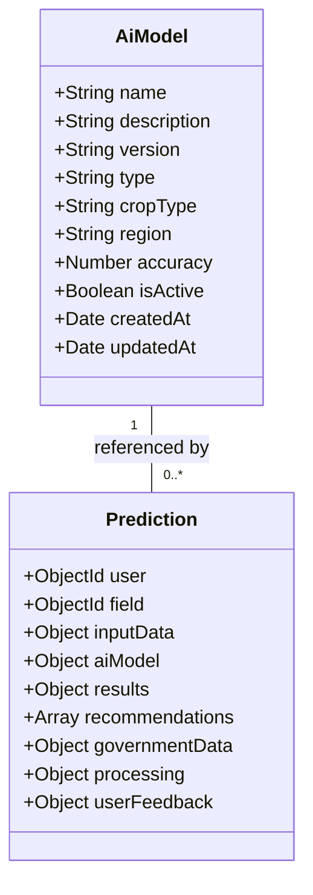
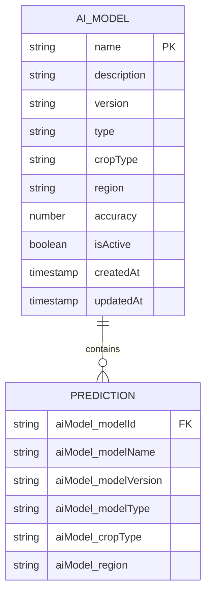
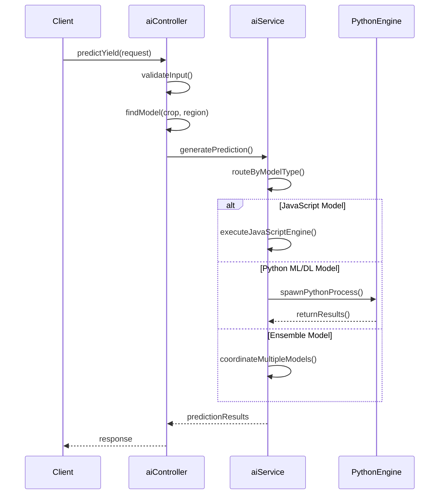

# AI Model Schema

<cite>
**Referenced Files in This Document**   
- [AiModel.js](file://HarvestIQ/backend/models/AiModel.js)
- [Prediction.js](file://HarvestIQ/backend/models/Prediction.js)
- [aiController.js](file://HarvestIQ/backend/controllers/aiController.js)
- [aiService.js](file://HarvestIQ/backend/services/aiService.js)
- [aiModels.js](file://HarvestIQ/backend/routes/aiModels.js)
</cite>

## Table of Contents
1. [Introduction](#introduction)
2. [Core Schema Definition](#core-schema-definition)
3. [Field Specifications](#field-specifications)
4. [Enumerated Types](#enumerated-types)
5. [Indexing Strategy](#indexing-strategy)
6. [Dynamic Model Management](#dynamic-model-management)
7. [Relationship with Predictions](#relationship-with-predictions)
8. [Sample Documents](#sample-documents)
9. [Active Status Management](#active-status-management)
10. [Model Versioning and Compatibility](#model-versioning-and-compatibility)

## Introduction

The AiModel schema in HarvestIQ serves as the central registry for AI-powered agricultural prediction models. This schema enables the system to dynamically manage and route prediction requests to appropriate AI engines based on crop type, region, and model capabilities. The design supports a multi-engine architecture where different types of AI models (JavaScript rule-based, Python ML/DL, and ensemble approaches) can coexist and be selectively invoked. The schema is implemented using Mongoose in a Node.js backend and integrates with the Prediction collection to maintain a complete history of model usage and performance.

**Section sources**
- [AiModel.js](file://HarvestIQ/backend/models/AiModel.js#L1-L53)

## Core Schema Definition

The AiModel schema defines the structure and constraints for AI model registration and management within the HarvestIQ system. Each model document contains metadata about the model's identity, capabilities, and operational status. The schema is designed to support dynamic discovery and selection of appropriate models for prediction requests based on agricultural parameters such as crop type and geographic region.



**Diagram sources**
- [AiModel.js](file://HarvestIQ/backend/models/AiModel.js#L1-L53)
- [Prediction.js](file://HarvestIQ/backend/models/Prediction.js#L1-L388)

**Section sources**
- [AiModel.js](file://HarvestIQ/backend/models/AiModel.js#L1-L53)

## Field Specifications

The AiModel schema contains several key fields that define the characteristics and behavior of AI models within the system:

### Name
The `name` field serves as the unique identifier for each AI model. It is required, trimmed of whitespace, and must be unique across all models in the system. An index is created on this field to enable fast lookups during model discovery and selection processes.

### Description
The `description` field provides a textual explanation of the model's purpose, methodology, or special characteristics. It supports up to 500 characters and defaults to an empty string if not provided.

### Version
The `version` field tracks the semantic version of the model using standard versioning notation (e.g., 1.0.0). This field is required and defaults to '1.0.0' for new models, enabling version-based routing and compatibility management.

### Type
The `type` field specifies the execution environment and methodology of the AI model. It is a required field with a constrained set of values that determine how predictions are generated and which engine processes the request.

### CropType
The `cropType` field indicates the agricultural crop for which the model is optimized. This field is required and limited to specific crop types grown in the regions served by HarvestIQ, ensuring models are applied appropriately.

### Region
The `region` field specifies the geographic area where the model is most effective. It defaults to 'all' if not specified, allowing models to be applied broadly or restricted to specific regions based on training data and performance characteristics.

### Accuracy
The `accuracy` field represents the measured performance of the model on a scale from 0 to 100. This numeric field is validated to ensure values fall within the specified range and defaults to null when not provided.

### IsActive
The `isActive` field is a boolean flag that controls whether the model is available for use in prediction requests. This enables safe deprecation and testing of models without removing them from the system.

**Section sources**
- [AiModel.js](file://HarvestIQ/backend/models/AiModel.js#L1-L53)

## Enumerated Types

The AiModel schema implements two critical enumerated types that constrain valid values for specific fields, ensuring data integrity and enabling type-safe operations throughout the system.

### Model Type Enumeration
The `type` field uses an enumeration to restrict values to four specific model categories:
- **javascript**: Rule-based models implemented in JavaScript within the HarvestIQ application
- **python-ml**: Machine learning models implemented in Python using traditional ML algorithms
- **python-dl**: Deep learning models implemented in Python using neural networks
- **ensemble**: Composite models that combine predictions from multiple individual models

This enumeration ensures that the system can reliably route prediction requests to the appropriate execution engine based on the model type, with each type corresponding to a specific processing pathway in the aiService.

### Crop Type Enumeration
The `cropType` field uses an enumeration to limit values to nine major crops grown in the regions served by HarvestIQ:
- Wheat
- Rice
- Sugarcane
- Cotton
- Maize
- Barley
- Mustard
- Potato
- Onion
- Tomato

This constraint ensures that models are only applied to appropriate crops, preventing erroneous predictions that could occur from applying a model trained on one crop type to a different crop.



**Diagram sources**
- [AiModel.js](file://HarvestIQ/backend/models/AiModel.js#L1-L53)
- [Prediction.js](file://HarvestIQ/backend/models/Prediction.js#L1-L388)

**Section sources**
- [AiModel.js](file://HarvestIQ/backend/models/AiModel.js#L1-L53)

## Indexing Strategy

The AiModel schema employs a targeted indexing strategy to optimize query performance for common access patterns in the HarvestIQ system.

### Name Index
The schema creates an index on the `name` field with both `unique: true` and `index: true` properties. This dual constraint ensures that:
1. No two models can have the same name (enforced at the database level)
2. Lookups by model name are performed efficiently with O(log n) complexity

This index is critical for the model discovery process, where the system frequently needs to locate specific models by their unique name during prediction routing and administrative operations.

### Timestamp Indexes
The schema includes timestamps configuration (`timestamps: true`), which automatically creates indexes on `createdAt` and `updatedAt` fields. These indexes support:
- Chronological sorting of models
- Time-based filtering for model management
- Performance monitoring and analytics

The combination of unique constraints and strategic indexing enables the system to efficiently manage a growing collection of AI models while maintaining data integrity and query performance.

**Section sources**
- [AiModel.js](file://HarvestIQ/backend/models/AiModel.js#L1-L53)

## Dynamic Model Management

The AiModel schema enables dynamic AI model management by serving as the foundation for a flexible prediction routing system. The HarvestIQ architecture uses model attributes to determine which engine processes each prediction request, allowing the system to support multiple AI technologies and seamlessly integrate new models.

### Prediction Routing Logic
The aiService class implements routing logic that examines the `type` field of selected models to determine the appropriate prediction pathway:
- **JavaScript models** are processed within the Node.js application using built-in algorithms
- **Python ML/DL models** are executed through external Python services using inter-process communication
- **Ensemble models** coordinate predictions across multiple individual models and combine results using weighted averaging

This routing mechanism allows HarvestIQ to leverage the strengths of different AI approaches while maintaining a unified prediction interface for clients.

### Model Selection Process
When a prediction request is received, the system follows a decision process:
1. Identify the crop type and region from input data
2. Query for active models matching these parameters
3. Select the most appropriate model based on type, version, and accuracy
4. Route the request to the corresponding engine via aiService

This dynamic selection enables the system to automatically use the best available model for each prediction scenario, improving overall accuracy and reliability.



**Diagram sources**
- [aiController.js](file://HarvestIQ/backend/controllers/aiController.js#L1-L187)
- [aiService.js](file://HarvestIQ/backend/services/aiService.js#L1-L482)

**Section sources**
- [aiService.js](file://HarvestIQ/backend/services/aiService.js#L1-L482)
- [aiController.js](file://HarvestIQ/backend/controllers/aiController.js#L1-L187)

## Relationship with Predictions

The AiModel schema maintains a critical relationship with the Prediction collection, enabling traceability and performance monitoring across the system.

### Reference Pattern
Rather than embedding the entire model definition in each prediction, the system uses a reference pattern where Prediction documents contain key model metadata:
- `aiModel.modelId`: Reference to the AiModel document
- `aiModel.modelName`: Copy of model name for historical accuracy
- `aiModel.modelVersion`: Copy of model version for reproducibility
- `aiModel.modelType`: Copy of model type for processing context

This approach balances data integrity with performance, ensuring that prediction records remain accurate even if the referenced model is later modified or deactivated.

### Historical Integrity
By storing model metadata copies in prediction records, the system preserves the exact context of each prediction. This is essential for:
- Reproducing past predictions
- Analyzing model performance over time
- Comparing results across different model versions
- Auditing prediction accuracy

The relationship enables comprehensive analytics while maintaining referential integrity through the modelId reference.

**Section sources**
- [Prediction.js](file://HarvestIQ/backend/models/Prediction.js#L1-L388)
- [aiService.js](file://HarvestIQ/backend/services/aiService.js#L1-L482)

## Sample Documents

The following sample documents illustrate the AiModel schema in practice for each supported model type:

### JavaScript Model
```json
{
  "name": "Wheat-Yield-Expert-System",
  "description": "Rule-based expert system for wheat yield prediction using agronomic principles",
  "version": "2.1.0",
  "type": "javascript",
  "cropType": "Wheat",
  "region": "all",
  "accuracy": 82,
  "isActive": true
}
```

### Python ML Model
```json
{
  "name": "Rice-Yield-RandomForest",
  "description": "Random Forest model trained on 10 years of rice cultivation data from Punjab",
  "version": "1.5.3",
  "type": "python-ml",
  "cropType": "Rice",
  "region": "Punjab",
  "accuracy": 91,
  "isActive": true
}
```

### Python DL Model
```json
{
  "name": "Cotton-Yield-CNN",
  "description": "Convolutional Neural Network model using satellite imagery and weather patterns",
  "version": "3.2.1",
  "type": "python-dl",
  "cropType": "Cotton",
  "region": "Gujarat",
  "accuracy": 94,
  "isActive": true
}
```

### Ensemble Model
```json
{
  "name": "Maize-Yield-Ensemble",
  "description": "Ensemble combining ML, DL, and expert system predictions with dynamic weighting",
  "version": "1.0.0",
  "type": "ensemble",
  "cropType": "Maize",
  "region": "all",
  "accuracy": 96,
  "isActive": true
}
```

**Section sources**
- [AiModel.js](file://HarvestIQ/backend/models/AiModel.js#L1-L53)

## Active Status Management

The `isActive` field plays a crucial role in the operational management of AI models within HarvestIQ, enabling several important capabilities.

### Safe Model Deprecation
When a model is superseded by a newer version or found to have accuracy issues, administrators can set `isActive: false` instead of deleting the model. This approach:
- Preserves historical prediction records that reference the model
- Maintains data integrity in analytics and reporting
- Allows for potential reactivation if needed
- Prevents breaking existing references in prediction history

### A/B Testing
The isActive flag enables controlled experimentation with new models:
1. Deploy a new model with `isActive: false`
2. Gradually route a percentage of prediction requests to the new model
3. Compare performance against the current model
4. Promote the new model to `isActive: true` once validated
5. Deprecate the old model by setting `isActive: false`

This process allows for evidence-based model improvements without disrupting service for users.

### Canary Deployments
The system supports canary deployment patterns where new models are initially activated for specific user segments or regions before full rollout. The isActive status can be combined with region and cropType filtering to implement sophisticated deployment strategies that minimize risk while validating model performance in production conditions.

**Section sources**
- [AiModel.js](file://HarvestIQ/backend/models/AiModel.js#L1-L53)
- [aiService.js](file://HarvestIQ/backend/services/aiService.js#L1-L482)

## Model Versioning and Compatibility

The AiModel schema supports a comprehensive model versioning strategy that ensures backward compatibility and enables systematic model improvement.

### Semantic Versioning
The `version` field uses semantic versioning (MAJOR.MINOR.PATCH) to communicate the nature of changes between model iterations:
- **MAJOR**: Incompatible API changes or fundamental methodology shifts
- **MINOR**: Backward-compatible feature additions or accuracy improvements
- **PATCH**: Backward-compatible bug fixes or minor optimizations

This convention helps the system and administrators understand the compatibility implications of model updates.

### Backward Compatibility
The system maintains backward compatibility in predictions through several mechanisms:
- Prediction requests include version tolerance parameters
- The aiService can fall back to previous model versions if newer ones fail
- Input data schemas are versioned independently of model versions
- Prediction responses include the exact model version used

### Version-Based Routing
The system can implement sophisticated routing rules based on version numbers:
- Always use the highest version for a given model type
- Route specific user segments to experimental model versions
- Maintain legacy model versions for users with specific requirements
- Gradually phase out older versions based on usage patterns

This versioning infrastructure enables HarvestIQ to continuously improve its AI capabilities while maintaining reliability and predictability for users.

**Section sources**
- [AiModel.js](file://HarvestIQ/backend/models/AiModel.js#L1-L53)
- [aiService.js](file://HarvestIQ/backend/services/aiService.js#L1-L482)