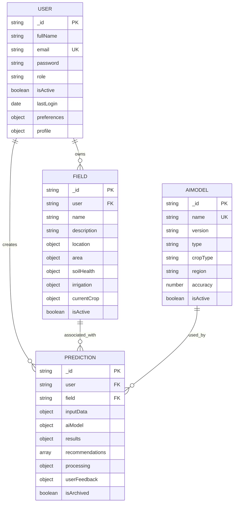

# Database Schema Design

<cite>
**Referenced Files in This Document**   
- [User.js](file://HarvestIQ/backend/models/User.js)
- [Field.js](file://HarvestIQ/backend/models/Field.js)
- [Prediction.js](file://HarvestIQ/backend/models/Prediction.js)
- [AiModel.js](file://HarvestIQ/backend/models/AiModel.js)
- [database.js](file://HarvestIQ/backend/config/database.js)
</cite>

## Table of Contents
1. [Introduction](#introduction)
2. [Data Model Overview](#data-model-overview)
3. [User Schema](#user-schema)
4. [Field Schema](#field-schema)
5. [Prediction Schema](#prediction-schema)
6. [AiModel Schema](#aimodel-schema)
7. [Collection Relationships](#collection-relationships)
8. [Indexing Strategy](#indexing-strategy)
9. [Data Lifecycle and Privacy](#data-lifecycle-and-privacy)
10. [Conclusion](#conclusion)

## Introduction
This document provides comprehensive documentation for the MongoDB schema used in HarvestIQ, an agricultural intelligence platform. The database design supports core functionality including user authentication, field management, AI-powered crop yield predictions, and model performance tracking. The schema is implemented using Mongoose ODM in a Node.js backend and consists of four primary collections: User, Field, Prediction, and AiModel. This documentation details each collection's structure, validation rules, indexing strategy, and relationships, providing a complete reference for developers, data analysts, and system architects working with the HarvestIQ platform.

## Data Model Overview
The HarvestIQ data model consists of four interconnected collections that support the platform's agricultural intelligence functionality. The User collection stores farmer profiles and authentication data. The Field collection maintains detailed information about agricultural plots including geolocation, soil properties, and crop history. The Prediction collection stores AI-generated yield forecasts with input parameters, results, and recommendations. The AiModel collection tracks metadata about the machine learning models used for predictions. These collections are connected through reference-based relationships, with Predictions linked to both Users and Fields, and Predictions referencing specific AiModel versions. The schema incorporates comprehensive validation, indexing for query performance, and virtual properties for derived data.



**Diagram sources**
- [User.js](file://HarvestIQ/backend/models/User.js)
- [Field.js](file://HarvestIQ/backend/models/Field.js)
- [Prediction.js](file://HarvestIQ/backend/models/Prediction.js)
- [AiModel.js](file://HarvestIQ/backend/models/AiModel.js)

**Section sources**
- [User.js](file://HarvestIQ/backend/models/User.js)
- [Field.js](file://HarvestIQ/backend/models/Field.js)
- [Prediction.js](file://HarvestIQ/backend/models/Prediction.js)
- [AiModel.js](file://HarvestIQ/backend/models/AiModel.js)

## User Schema
The User collection stores authentication credentials and profile information for HarvestIQ platform users, including farmers, agricultural experts, and administrators. Each user document contains authentication data (email, hashed password), personal information (full name, avatar), role-based access control (farmer, admin, expert), and user preferences (language, theme, notification settings). The schema includes comprehensive validation for email format and password strength, with password fields excluded from default queries for security. The profile subdocument captures agricultural-specific information such as farming experience, farm size, primary crops, and farming type. Virtual properties provide derived data like prediction count, while pre-save middleware automatically hashes passwords before storage.

**Section sources**
- [User.js](file://HarvestIQ/backend/models/User.js#L1-L165)

## Field Schema
The Field collection stores comprehensive information about agricultural plots, serving as the primary unit of analysis for crop predictions. Each field document is linked to a user and contains detailed data on location (geographic coordinates, administrative address, GeoJSON for mapping), physical characteristics (total and cultivable area with configurable units), and soil health metrics (pH, organic carbon, nutrient content, soil type, and texture). The schema includes crop history tracking with yield data, irrigation and water management details, infrastructure inventory, and environmental factors. Current crop status is tracked with planting and harvest dates. The collection features multiple indexes for efficient querying by user, location, crop type, and creation date, along with a geospatial index for location-based queries. Virtual properties calculate derived metrics such as field utilization percentage, soil test age, and current crop age.

**Section sources**
- [Field.js](file://HarvestIQ/backend/models/Field.js#L1-L543)

## Prediction Schema
The Prediction collection stores AI-generated crop yield forecasts and recommendations, serving as the core output of the HarvestIQ intelligence engine. Each prediction document references the creating user and optionally a specific field, capturing the complete context of the prediction. The inputData subdocument records all input parameters including crop type, farm area, region, soil health data, and weather conditions. The aiModel subdocument tracks which AI model was used, including its ID, name, version, and type. Results include expected yield metrics and confidence scores, while the recommendations array contains actionable insights categorized by type (weather, irrigation, soil, etc.) with priority levels and estimated impact. The processing subdocument tracks the prediction's status and performance metrics, while userFeedback captures post-harvest accuracy ratings. Virtual properties calculate prediction accuracy when actual yield data is provided and the age of predictions in days.

**Section sources**
- [Prediction.js](file://HarvestIQ/backend/models/Prediction.js#L1-L388)

## AiModel Schema
The AiModel collection stores metadata about the machine learning models used for crop yield predictions in HarvestIQ. Each model document contains identifying information (name, version, type), scope definitions (applicable crop type and region), and performance metrics (accuracy rating). The schema supports multiple model types including JavaScript-based models, Python ML/DL models, ensemble models, and external API integrations. Models can be activated or deactivated through the isActive flag, allowing for model version management and A/B testing. The collection includes a unique index on model names to prevent duplicates and supports tracking of model performance over time through integration with the prediction workflow. This collection enables the platform to manage a portfolio of AI models and route prediction requests to the most appropriate model based on crop type and regional requirements.

**Section sources**
- [AiModel.js](file://HarvestIQ/backend/models/AiModel.js#L1-L53)

## Collection Relationships
The HarvestIQ database implements a reference-based relationship model where collections are connected through ObjectId references rather than embedding. The primary relationship is between User and Field, where each Field document contains a user field referencing the User._id of the field's owner. Similarly, Prediction documents reference both User._id (via the user field) and optionally Field._id (via the field field) to establish ownership and context. Predictions also reference AiModel._id to track which model generated the prediction. These reference relationships enable efficient data retrieval through Mongoose population, allowing queries to return documents with related data from other collections. The relationship model supports data integrity through application-level validation and enables flexible querying patterns, such as retrieving all predictions for a user or all fields with active crops.

```mermaid
graph TD
User --> |owns| Field
User --> |creates| Prediction
Field --> |associated_with| Prediction
AiModel --> |used_by| Prediction
User -.->|"user: ObjectId ref"-> Field
User -.->|"user: ObjectId ref"-> Prediction
Field -.->|"field: ObjectId ref"-> Prediction
AiModel -.->|"aiModel.modelId: ObjectId ref"-> Prediction
```

**Diagram sources**
- [User.js](file://HarvestIQ/backend/models/User.js)
- [Field.js](file://HarvestIQ/backend/models/Field.js)
- [Prediction.js](file://HarvestIQ/backend/models/Prediction.js)
- [AiModel.js](file://HarvestIQ/backend/models/AiModel.js)

**Section sources**
- [User.js](file://HarvestIQ/backend/models/User.js)
- [Field.js](file://HarvestIQ/backend/models/Field.js)
- [Prediction.js](file://HarvestIQ/backend/models/Prediction.js)

## Indexing Strategy
The HarvestIQ database implements a comprehensive indexing strategy to optimize query performance for common operations. The User collection has a unique index on the email field for authentication lookups and an index on the isActive field for filtering active users. The Field collection features compound indexes on (user, isActive) for retrieving a user's active fields, geospatial indexes on location coordinates for proximity searches, and indexes on current crop type and creation date for sorting. The Prediction collection has indexes on (user, createdAt) for chronological retrieval of prediction history, (inputData.cropType, inputData.region) for filtering by agricultural parameters, and processing status for monitoring prediction workflows. The AiModel collection has a unique index on the name field to prevent duplicates. All collections leverage MongoDB's automatic _id index, and timestamp fields (createdAt, updatedAt) are indexed where appropriate for time-based queries.

**Section sources**
- [User.js](file://HarvestIQ/backend/models/User.js#L150-L152)
- [Field.js](file://HarvestIQ/backend/models/Field.js#L500-L507)
- [Prediction.js](file://HarvestIQ/backend/models/Prediction.js#L350-L356)
- [AiModel.js](file://HarvestIQ/backend/models/AiModel.js#L15-L17)

## Data Lifecycle and Privacy
HarvestIQ implements a structured data lifecycle management approach with specific retention policies and privacy considerations for agricultural data. User data is retained indefinitely while the account remains active, with inactive accounts (isActive: false) preserved for audit purposes but excluded from regular queries. Field data follows the same lifecycle as the associated user, with historical crop data preserved even after fields are deactivated. Prediction data is retained indefinitely by default but can be archived (isArchived: true) to remove from active views while preserving the record. The system implements privacy protections including password hashing, exclusion of sensitive fields from default queries, and role-based access control. Agricultural data is considered sensitive personal information, and the platform complies with data protection regulations by providing users with access to their data, the ability to delete their accounts, and transparency about data usage for AI model training. Data backups are performed regularly, and all data transfers use encryption in transit.

**Section sources**
- [User.js](file://HarvestIQ/backend/models/User.js)
- [Field.js](file://HarvestIQ/backend/models/Field.js)
- [Prediction.js](file://HarvestIQ/backend/models/Prediction.js)
- [AiModel.js](file://HarvestIQ/backend/models/AiModel.js)

## Conclusion
The HarvestIQ MongoDB schema is a well-structured, production-ready data model designed to support an agricultural intelligence platform. The four primary collections—User, Field, Prediction, and AiModel—form a cohesive system that captures the complete workflow from data input to AI-powered insights. The schema demonstrates best practices in MongoDB design with appropriate use of references for relationships, comprehensive validation rules, strategic indexing for performance, and virtual properties for derived data. The implementation leverages Mongoose features effectively while maintaining flexibility for future enhancements. The data model supports the platform's core functionality including user management, field monitoring, crop prediction, and model performance tracking, providing a solid foundation for scalable agricultural analytics.