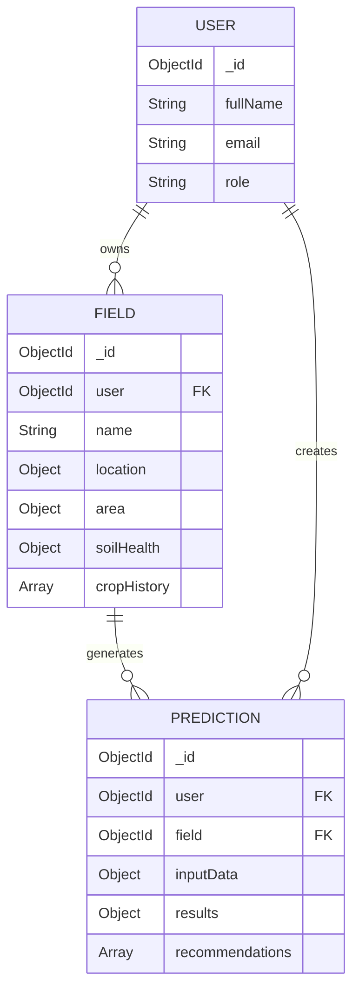

# Field Schema

<cite>
**Referenced Files in This Document**   
- [Field.js](file://backend/models/Field.js)
- [User.js](file://backend/models/User.js)
- [Prediction.js](file://backend/models/Prediction.js)
</cite>

## Table of Contents
1. [Introduction](#introduction)
2. [User Reference](#user-reference)
3. [Basic Field Information](#basic-field-information)
4. [Location](#location)
5. [Physical Characteristics](#physical-characteristics)
6. [Soil Health](#soil-health)
7. [Crop History](#crop-history)
8. [Irrigation](#irrigation)
9. [Infrastructure](#infrastructure)
10. [Environmental Factors](#environmental-factors)
11. [Current Crop Status](#current-crop-status)
12. [Certification](#certification)
13. [Validation Rules](#validation-rules)
14. [Indexes](#indexes)
15. [Virtuals](#virtuals)
16. [Instance Methods](#instance-methods)
17. [Static Methods](#static-methods)
18. [Sample Document](#sample-document)
19. [Relationships](#relationships)

## Introduction
The Field schema in HarvestIQ is a comprehensive data model designed to capture detailed agricultural field information for precision farming analytics. It supports advanced features such as soil health tracking, crop rotation history, spatial queries, and integration with AI-driven prediction systems. This document provides a complete reference to all schema components, including nested structures, validation rules, indexes, virtual properties, and methods.

**Section sources**
- [Field.js](file://backend/models/Field.js#L1-L542)

## User Reference
The `user` field establishes a relationship between a field and its owner. It is a required reference to the User model, ensuring every field belongs to a registered user.

- **Type**: ObjectId
- **Reference**: User model
- **Required**: Yes (with validation message)
- **Index**: Yes (for efficient querying by user)

**Section sources**
- [Field.js](file://backend/models/Field.js#L5-L10)

## Basic Field Information
Contains fundamental metadata about the field.

### name
- **Type**: String
- **Required**: Yes
- **Trim**: Yes
- **Max Length**: 100 characters

### description
- **Type**: String
- **Max Length**: 500 characters
- **Default**: Empty string

**Section sources**
- [Field.js](file://backend/models/Field.js#L12-L23)

## Location
Comprehensive geographic and administrative location data.

### coordinates
- **latitude**: Number (-90 to 90)
- **longitude**: Number (-180 to 180)
- Both have validation ranges and default to null

### address
Structured administrative address:
- **village**: String
- **district**: String
- **state**: String
- **pincode**: String
- **country**: String (default: "India")

### geoJson
Supports spatial queries:
- **type**: String ("Point" or "Polygon", default: "Point")
- **coordinates**: Mixed type (array of coordinates)

**Section sources**
- [Field.js](file://backend/models/Field.js#L25-L86)

## Physical Characteristics
Describes the physical dimensions and units of the field.

### total
- **Type**: Number
- **Required**: Yes
- **Minimum**: 0.01 hectares

### cultivable
- **Type**: Number
- **Minimum**: 0
- **Validation**: Must be ≤ total area

### unit
- **Type**: String
- **Enum**: ["hectares", "acres", "bigha", "kanal"]
- **Default**: "hectares"

**Section sources**
- [Field.js](file://backend/models/Field.js#L88-L108)

## Soil Health
Detailed soil composition and testing metadata.

### pH
- **Type**: Number (0-14 scale)
- **Default**: null

### organicCarbon
- **Type**: Number (0-100%)
- **Default**: null

### electricalConductivity
- **Type**: Number (≥0)
- **Default**: null

### nutrients
Nested structure for macronutrients (kg/ha):
- **nitrogen**: Number (≥0)
- **phosphorus**: Number (≥0)
- **potassium**: Number (≥0)
- **sulfur**: Number (≥0)

### micronutrients
Micronutrient levels in ppm:
- **zinc**, **iron**, **manganese**, **copper**, **boron** (all ≥0)

### metadata
- **lastTested**: Date
- **testingLab**: String
- **soilType**: Enum (8 soil types)
- **texture**: Enum (7 texture types)

**Section sources**
- [Field.js](file://backend/models/Field.js#L110-L178)

## Crop History
Array tracking historical crop cultivation.

Each entry contains:
- **year**: Number (2000-current year +1)
- **season**: Enum ["Kharif", "Rabi", "Zaid", "Perennial"]
- **cropType**: String (required)
- **variety**: String
- **yield**: Number (≥0)
- **yieldUnit**: Enum ["tons/ha", "quintal/acre", "kg/bigha"]
- **notes**: String (max 200 chars)

The array is automatically sorted in descending order by year.

**Section sources**
- [Field.js](file://backend/models/Field.js#L180-L211)

## Irrigation
Water management system details.

### source
- **Enum**: ["Rain-fed", "Tube well", "Canal", "Bore well", "River", "Pond", "Mixed"]
- **Default**: "Rain-fed"

### type
- **Enum**: ["None", "Flood", "Sprinkler", "Drip", "Furrow", "Mixed"]
- **Default**: "None"

### waterQuality
- **Enum**: ["Excellent", "Good", "Fair", "Poor", "Unknown"]
- **Default**: "Unknown"

### efficiency
- **Type**: Number (0-100%)
- **Default**: null

**Section sources**
- [Field.js](file://backend/models/Field.js#L213-L237)

## Infrastructure
Farm facilities and equipment.

### facilities
Boolean flags for:
- **farmHouse**
- **warehouse**
- **coldStorage**

### machinery
Array of equipment objects:
- **type**: Enum (7 types including "Other")
- **model**: String
- **year**: Number
- **condition**: Enum ["Excellent", "Good", "Fair", "Poor"]

**Section sources**
- [Field.js](file://backend/models/Field.js#L239-L272)

## Environmental Factors
Natural conditions affecting the field.

- **slope**: Enum ["Flat", "Gentle", "Moderate", "Steep"]
- **drainage**: Enum ["Excellent", "Good", "Fair", "Poor", "Water-logged"]
- **erosionRisk**: Enum ["Low", "Medium", "High"]
- **climateZone**: String

**Section sources**
- [Field.js](file://backend/models/Field.js#L274-L294)

## Current Crop Status
Real-time crop cultivation data.

- **cropType**: String
- **variety**: String
- **plantingDate**: Date
- **expectedHarvest**: Date
- **stage**: Enum ["Fallow", "Prepared", "Sown", "Growing", "Flowering", "Mature", "Harvested"]

**Section sources**
- [Field.js](file://backend/models/Field.js#L296-L315)

## Certification
Organic certification details.

### organic
- **certified**: Boolean (default: false)
- **certifyingBody**: String
- **validUntil**: Date

**Section sources**
- [Field.js](file://backend/models/Field.js#L317-L332)

## Validation Rules
Critical data integrity constraints.

- **Cultivable Area**: Must be ≤ total area via custom validator
- **Coordinate Ranges**: Latitude (-90 to 90), Longitude (-180 to 180)
- **Area Minimum**: Total area ≥ 0.01 hectares
- **Required Fields**: user, name, total area, crop history year/season/cropType
- **Pre-save Hook**: Automatically sets cultivable area to total area if not specified

**Section sources**
- [Field.js](file://backend/models/Field.js#L95-L103)

## Indexes
Database indexes for optimized querying.

- **user**: 1, isActive: 1 (user's active fields)
- **location.coordinates**: latitude and longitude
- **location.address**: state and district
- **currentCrop.cropType**: current crop type
- **area.total**: total field area
- **createdAt**: -1 (recent fields)
- **location.geoJson**: '2dsphere' (spatial queries)

**Section sources**
- [Field.js](file://backend/models/Field.js#L522-L530)

## Virtuals
Computed properties available when converted to JSON.

### utilizationPercentage
- **Calculation**: (cultivable / total) × 100
- **Returns**: Integer percentage

### soilTestAge
- **Calculation**: Days since last soil test
- **Returns**: Integer days or null

### currentCropAge
- **Calculation**: Days since planting date
- **Returns**: Integer days or null

**Section sources**
- [Field.js](file://backend/models/Field.js#L401-L418)

## Instance Methods
Behavioral methods attached to Field instances.

### addCropHistory(cropData)
- Adds new crop entry and sorts history by year (descending)
- Returns saved document

### updateSoilHealth(soilData)
- Merges new soil data with existing
- Updates lastTested timestamp
- Returns saved document

### updateCurrentCrop(cropData)
- Merges new crop data with current crop
- Returns saved document

### harvestCurrentCrop(yieldData)
- Transfers current crop to cropHistory
- Sets current crop to fallow
- Uses getCurrentSeason() to determine season
- Returns saved document

### getCurrentSeason()
- **Logic**: 
  - Kharif: June-October
  - Rabi: November-March
  - Zaid: April-May
- Returns current agricultural season

**Section sources**
- [Field.js](file://backend/models/Field.js#L427-L469)

## Static Methods
Class-level query methods.

### findByUser(userId, options)
- **Filters**: By user and isActive status
- **Optional**: Filter by hasCurrentCrop
- **Sort**: By createdAt (descending)
- Returns array of fields

### findNearby(latitude, longitude, maxDistance)
- **Spatial Query**: Uses GeoJSON 2dsphere index
- **Distance**: Default 10,000 meters (10km)
- **Filter**: Active fields only
- Returns nearby fields

### getStatsByUser(userId)
- **Aggregation Pipeline**: Calculates user's field statistics
- **Metrics**: 
  - Total fields and area
  - Cultivable area
  - Organic fields count
  - Fields with current crops
- Returns aggregated statistics object

**Section sources**
- [Field.js](file://backend/models/Field.js#L477-L502)

## Sample Document
```json
{
  "_id": "64a1b2c3d4e5f6a7b8c9d0e1",
  "user": "64a1b2c3d4e5f6a7b8c9d0e0",
  "name": "Eastern Farm Field",
  "description": "Primary wheat cultivation area with drip irrigation",
  "location": {
    "coordinates": {
      "latitude": 28.6139,
      "longitude": 77.2090
    },
    "address": {
      "village": "Green Valley",
      "district": "Central",
      "state": "Delhi",
      "pincode": "110001",
      "country": "India"
    },
    "geoJson": {
      "type": "Point",
      "coordinates": [77.2090, 28.6139]
    }
  },
  "area": {
    "total": 5.5,
    "cultivable": 5.2,
    "unit": "hectares"
  },
  "soilHealth": {
    "pH": 6.8,
    "organicCarbon": 1.2,
    "electricalConductivity": 0.45,
    "nutrients": {
      "nitrogen": 180,
      "phosphorus": 45,
      "potassium": 120,
      "sulfur": 25
    },
    "micronutrients": {
      "zinc": 4.2,
      "iron": 8.1,
      "manganese": 3.5,
      "copper": 1.8,
      "boron": 0.6
    },
    "lastTested": "2024-01-15T00:00:00.000Z",
    "testingLab": "AgriTest Labs",
    "soilType": "Alluvial",
    "texture": "Loamy"
  },
  "cropHistory": [
    {
      "year": 2023,
      "season": "Rabi",
      "cropType": "Wheat",
      "variety": "HD-2967",
      "yield": 4.8,
      "yieldUnit": "tons/ha",
      "notes": "Good yield despite late sowing"
    }
  ],
  "irrigation": {
    "source": "Tube well",
    "type": "Drip",
    "waterQuality": "Good",
    "efficiency": 90
  },
  "infrastructure": {
    "farmHouse": true,
    "warehouse": true,
    "coldStorage": false,
    "machinery": [
      {
        "type": "Tractor",
        "model": "Mahindra 575 DI",
        "year": 2020,
        "condition": "Good"
      }
    ]
  },
  "environment": {
    "slope": "Flat",
    "drainage": "Excellent",
    "erosionRisk": "Low",
    "climateZone": "Sub-tropical"
  },
  "currentCrop": {
    "cropType": "Wheat",
    "variety": "HD-3226",
    "plantingDate": "2024-11-15T00:00:00.000Z",
    "expectedHarvest": "2025-04-10T00:00:00.000Z",
    "stage": "Sown"
  },
  "tags": ["wheat", "irrigated", "certified"],
  "notes": "Field prepared with laser leveling in 2023",
  "isActive": true,
  "isOrganic": false,
  "certification": {
    "organic": {
      "certified": false,
      "certifyingBody": "",
      "validUntil": null
    }
  },
  "createdAt": "2024-06-15T10:30:00.000Z",
  "updatedAt": "2024-11-16T08:45:00.000Z",
  "utilizationPercentage": 95,
  "soilTestAge": 305,
  "currentCropAge": 1
}
```

**Section sources**
- [Field.js](file://backend/models/Field.js#L1-L542)

## Relationships
The Field schema maintains critical relationships with other models.

### User (Owner)
- **Type**: One-to-Many (One user owns many fields)
- **Reference**: `user` field references User model
- **Population**: Fields can be populated with user data
- **Cascade**: User deletion should deactivate associated fields

### Prediction (Analytics)
- **Type**: One-to-Many (One field has many predictions)
- **Reference**: Prediction model's `field` field references Field model
- **Usage**: Predictions use field data for crop yield forecasting
- **Population**: Predictions can include field details



**Diagram sources**
- [Field.js](file://backend/models/Field.js#L5-L10)
- [User.js](file://backend/models/User.js#L1-L165)
- [Prediction.js](file://backend/models/Prediction.js#L1-L387)

**Section sources**
- [Field.js](file://backend/models/Field.js#L5-L10)
- [Prediction.js](file://backend/models/Prediction.js#L7-L15)