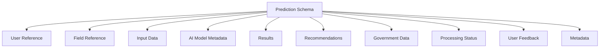
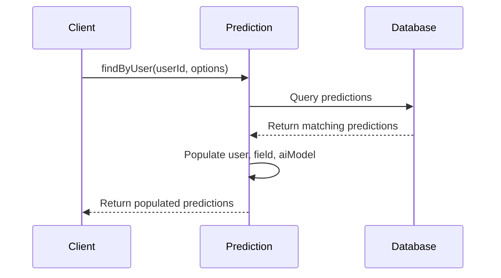
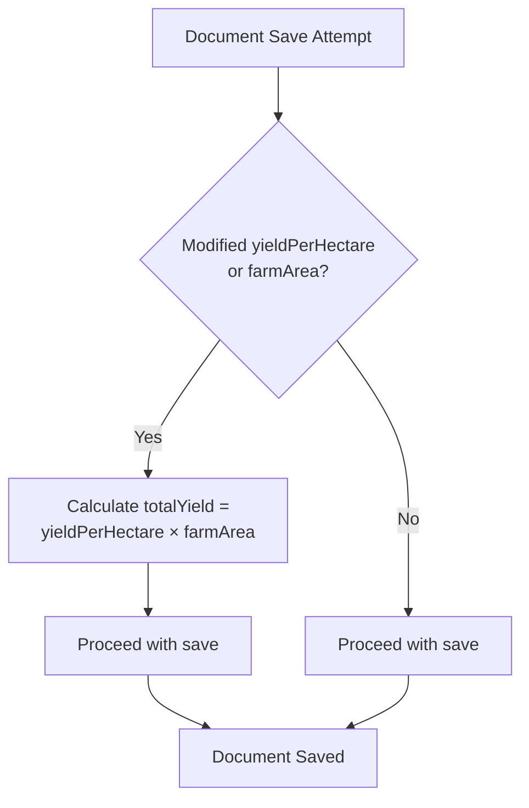
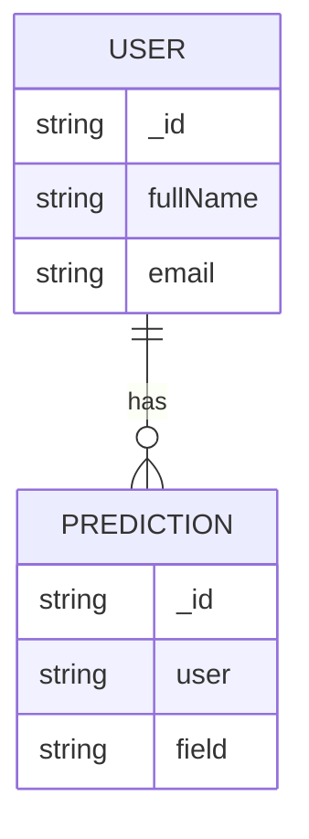

# Prediction Schema

<cite>
**Referenced Files in This Document**   
- [Prediction.js](file://HarvestIQ/backend/models/Prediction.js)
- [User.js](file://HarvestIQ/backend/models/User.js)
- [Field.js](file://HarvestIQ/backend/models/Field.js)
- [AiModel.js](file://HarvestIQ/backend/models/AiModel.js)
- [predictions.js](file://HarvestIQ/backend/routes/predictions.js)
- [aiService.js](file://HarvestIQ/backend/services/aiService.js)
</cite>

## Table of Contents
1. [Introduction](#introduction)
2. [Core Components](#core-components)
3. [Data Structure Breakdown](#data-structure-breakdown)
4. [Field Validations](#field-validations)
5. [Indexes](#indexes)
6. [Virtual Properties](#virtual-properties)
7. [Instance Methods](#instance-methods)
8. [Static Methods](#static-methods)
9. [Pre-Save Hook](#pre-save-hook)
10. [Sample Document](#sample-document)
11. [Relationships](#relationships)
12. [Conclusion](#conclusion)

## Introduction
The Prediction schema in HarvestIQ serves as the central data model for crop yield predictions, integrating user inputs, AI model metadata, prediction results, and actionable recommendations. This comprehensive schema enables farmers to receive data-driven insights about their agricultural operations while maintaining a complete history of predictions and their outcomes. The schema is designed to support multiple AI model types, incorporate government data sources, and provide detailed feedback mechanisms.

**Section sources**
- [Prediction.js](file://HarvestIQ/backend/models/Prediction.js#L1-L20)

## Core Components
The Prediction schema is composed of several core components that work together to deliver a complete prediction lifecycle. These components include user and field references, input data parameters, AI model metadata, prediction results, recommendations, government data integration, processing status tracking, and user feedback mechanisms. Each component plays a critical role in the prediction process, from data collection to result delivery and post-prediction analysis.



**Diagram sources**
- [Prediction.js](file://HarvestIQ/backend/models/Prediction.js#L25-L387)

**Section sources**
- [Prediction.js](file://HarvestIQ/backend/models/Prediction.js#L25-L387)

## Data Structure Breakdown
The Prediction schema is structured into logical sections that represent different aspects of the prediction process. The schema begins with user and optional field references, followed by comprehensive input data, AI model information, results, recommendations, government data integration, processing metadata, user interaction data, and additional metadata fields.

### User and Field References
The schema includes mandatory user reference and optional field reference to establish ownership and context for each prediction. The user field is required and indexed for performance, while the field reference allows for field-specific predictions when available.

**Section sources**
- [Prediction.js](file://HarvestIQ/backend/models/Prediction.js#L27-L36)

### Input Data Structure
The input data section captures essential agricultural parameters from users, including crop type, farm area, region, soil health data, weather conditions, and additional parameters for advanced AI models.

#### Crop Type and Farm Area
The cropType field accepts only predefined crop varieties, ensuring consistency across predictions. The farmArea field has a minimum requirement of 0.1 hectares to prevent unrealistic inputs.

**Section sources**
- [Prediction.js](file://HarvestIQ/backend/models/Prediction.js#L39-L51)

#### Soil and Weather Data
Soil health data includes pH level, organic content, and nutrient levels (nitrogen, phosphorus, potassium). Weather data captures rainfall, temperature, and humidity, with appropriate validation ranges for each parameter.

**Section sources**
- [Prediction.js](file://HarvestIQ/backend/models/Prediction.js#L53-L83)

### AI Model Metadata
The aiModel section contains information about the AI model used for generating the prediction, including model ID, name, version, type, and crop/region specificity. This metadata enables tracking of model performance and usage patterns.

**Section sources**
- [Prediction.js](file://HarvestIQ/backend/models/Prediction.js#L85-L107)

### Results Structure
The results section contains the core prediction output, including expected yield, yield per hectare, total yield, confidence score, and detailed factors that influenced the prediction. The total yield is automatically calculated based on yield per hectare and farm area.

**Section sources**
- [Prediction.js](file://HarvestIQ/backend/models/Prediction.js#L109-L147)

### Recommendations Array
The recommendations array provides actionable insights to farmers, with each recommendation containing type, priority, title, description, action steps, and estimated impact. Recommendations are categorized by type (weather, irrigation, soil, etc.) and prioritized by importance.

**Section sources**
- [Prediction.js](file://HarvestIQ/backend/models/Prediction.js#L149-L188)

### Government Data Integration
The governmentData section allows for integration of official agricultural data from government sources, including weather patterns, soil conditions, historical yield data, and market information. This data can supplement or validate user inputs.

**Section sources**
- [Prediction.js](file://HarvestIQ/backend/models/Prediction.js#L190-L204)

### Processing Status
The processing section tracks the lifecycle of a prediction request, including status (pending, processing, completed, failed, cancelled), processing time, error messages, and retry count. This metadata is crucial for monitoring system performance and troubleshooting issues.

**Section sources**
- [Prediction.js](file://HarvestIQ/backend/models/Prediction.js#L206-L233)

### User Feedback
The userFeedback section captures post-harvest evaluation of prediction accuracy, including rating, accuracy assessment, comments, and actual yield data. This feedback loop is essential for improving AI model performance over time.

**Section sources**
- [Prediction.js](file://HarvestIQ/backend/models/Prediction.js#L235-L250)

## Field Validations
The Prediction schema implements comprehensive field validations to ensure data quality and consistency across the application.

### Minimum Farm Area Validation
The farmArea field requires a minimum value of 0.1 hectares, preventing unrealistic inputs that could skew prediction results or indicate data entry errors.

**Section sources**
- [Prediction.js](file://HarvestIQ/backend/models/Prediction.js#L45-L48)

### Enumerated Types
The schema uses enumerated types to restrict values for several key fields, ensuring data consistency and simplifying downstream processing.

#### Crop Type Enumeration
The cropType field accepts only the following values: Wheat, Rice, Sugarcane, Cotton, Maize, Barley, Mustard, Potato, Onion, and Tomato. This controlled vocabulary ensures compatibility with AI models trained on specific crop types.

**Section sources**
- [Prediction.js](file://HarvestIQ/backend/models/Prediction.js#L40-L43)

#### Model Type Enumeration
The modelType field accepts only four values: javascript, python-ml, python-dl, and ensemble. This enumeration reflects the different AI technologies supported by the platform, from simple JavaScript algorithms to complex deep learning models and ensemble approaches.

**Section sources**
- [Prediction.js](file://HarvestIQ/backend/models/Prediction.js#L97-L100)

## Indexes
The Prediction schema includes several database indexes to optimize query performance for common access patterns.

### User and Creation Time Index
An index on user and createdAt fields enables efficient retrieval of predictions for a specific user sorted by creation time, which is essential for user dashboards and prediction history views.

**Section sources**
- [Prediction.js](file://HarvestIQ/backend/models/Prediction.js#L253-L253)

### Crop Type and Region Index
An index on inputData.cropType and inputData.region fields optimizes queries that filter predictions by crop and geographic region, supporting regional analysis and crop-specific insights.

**Section sources**
- [Prediction.js](file://HarvestIQ/backend/models/Prediction.js#L254-L254)

### Processing Status Index
An index on processing.status field enables efficient filtering of predictions by their processing state, which is crucial for monitoring system health and managing prediction workflows.

**Section sources**
- [Prediction.js](file://HarvestIQ/backend/models/Prediction.js#L255-L255)

## Virtual Properties
The Prediction schema includes virtual properties that provide derived data without storing it in the database, reducing redundancy and ensuring data consistency.

### Accuracy Percentage
The accuracyPercentage virtual property calculates the accuracy of a prediction by comparing the expected yield with the actual yield provided in user feedback. The calculation uses the formula: 100 - (|expected - actual| / expected) * 100, with results rounded to two decimal places.

```mermaid
graph TD
A[Expected Yield] --> C[Accuracy Calculation]
B[Actual Yield] --> C
C --> D[Difference = |Expected - Actual|]
D --> E[Accuracy = 100 - (Difference / Expected) * 100]
E --> F[Rounded Accuracy Percentage]
```

**Diagram sources**
- [Prediction.js](file://HarvestIQ/backend/models/Prediction.js#L261-L270)

**Section sources**
- [Prediction.js](file://HarvestIQ/backend/models/Prediction.js#L261-L270)

### Age in Days
The ageInDays virtual property calculates how many days have passed since the prediction was created, providing a convenient way to assess the recency of predictions without storing redundant timestamp data.

**Section sources**
- [Prediction.js](file://HarvestIQ/backend/models/Prediction.js#L272-L275)

## Instance Methods
The Prediction schema includes several instance methods that encapsulate common operations on prediction records.

### Update Status
The updateStatus method allows changing the processing status of a prediction and optionally setting an error message. This method is used throughout the prediction lifecycle to track progress and communicate issues.

**Section sources**
- [Prediction.js](file://HarvestIQ/backend/models/Prediction.js#L277-L284)

### Add User Feedback
The addUserFeedback method merges new feedback with existing feedback data, enabling incremental updates to user feedback without overwriting previous entries.

**Section sources**
- [Prediction.js](file://HarvestIQ/backend/models/Prediction.js#L286-L289)

### Archive and Unarchive
The archive and unarchive methods provide a soft delete mechanism, allowing predictions to be hidden from normal views while preserving them for historical analysis and record-keeping.

**Section sources**
- [Prediction.js](file://HarvestIQ/backend/models/Prediction.js#L291-L296)

## Static Methods
The Prediction schema includes static methods that provide query interfaces for retrieving prediction data.

### Find By User
The findByUser static method retrieves all non-archived predictions for a specific user, with optional filtering by crop type, region, and model type. The method automatically populates related user, field, and AI model data for comprehensive results.



**Diagram sources**
- [Prediction.js](file://HarvestIQ/backend/models/Prediction.js#L336-L355)

**Section sources**
- [Prediction.js](file://HarvestIQ/backend/models/Prediction.js#L336-L355)

### Get Statistics By User
The getStatsByUser static method uses MongoDB aggregation to calculate key statistics for a user's predictions, including total predictions, average confidence, average yield, unique crop types predicted, and the date of the latest prediction.

**Section sources**
- [Prediction.js](file://HarvestIQ/backend/models/Prediction.js#L357-L370)

## Pre-Save Hook
The Prediction schema includes a pre-save middleware hook that automatically calculates the total yield by multiplying yield per hectare by farm area whenever either of these values is modified. This ensures data consistency and reduces the risk of calculation errors in client applications.



**Diagram sources**
- [Prediction.js](file://HarvestIQ/backend/models/Prediction.js#L372-L378)

**Section sources**
- [Prediction.js](file://HarvestIQ/backend/models/Prediction.js#L372-L378)

## Sample Document
The following is a complete example of a prediction document showing a typical prediction lifecycle:

```json
{
  "_id": "64a1b2c3d4e5f6a7b8c9d0e1",
  "user": "64a1b2c3d4e5f6a7b8c9d0e2",
  "field": "64a1b2c3d4e5f6a7b8c9d0e3",
  "inputData": {
    "cropType": "Wheat",
    "farmArea": 2.5,
    "region": "Punjab",
    "soilData": {
      "phLevel": 6.8,
      "organicContent": 2.3,
      "nitrogen": 180,
      "phosphorus": 45,
      "potassium": 120
    },
    "weatherData": {
      "rainfall": 650,
      "temperature": 22.5,
      "humidity": 65
    }
  },
  "aiModel": {
    "modelId": "64a1b2c3d4e5f6a7b8c9d0e4",
    "modelName": "WheatYieldPredictor",
    "modelVersion": "2.1.0",
    "modelType": "python-ml"
  },
  "results": {
    "expectedYield": 12.5,
    "yieldPerHectare": 5.0,
    "totalYield": 12.5,
    "confidence": 92,
    "factors": {
      "weather": "government-data",
      "soil": "user-input",
      "yieldFactor": 1.15
    }
  },
  "recommendations": [
    {
      "type": "irrigation",
      "priority": "high",
      "title": "Optimize Irrigation Schedule",
      "description": "Current irrigation pattern may lead to water stress during flowering stage.",
      "action": "Implement drip irrigation system",
      "estimatedImpact": 15
    }
  ],
  "governmentData": {
    "weather": {
      "forecast": "Above average rainfall expected in next 30 days"
    },
    "market": {
      "priceTrend": "Increasing"
    }
  },
  "processing": {
    "status": "completed",
    "processingTime": 1250
  },
  "userFeedback": {
    "rating": 4,
    "accuracy": "high",
    "comments": "Prediction was accurate, implemented recommendations with good results.",
    "actualYield": 12.8
  },
  "tags": ["wheat", "high-yield"],
  "notes": "First prediction for this field after soil improvement.",
  "isArchived": false,
  "isPublic": false,
  "createdAt": "2023-07-01T10:30:00.000Z",
  "updatedAt": "2023-07-01T10:30:00.000Z",
  "accuracyPercentage": 97.66,
  "ageInDays": 45
}
```

**Section sources**
- [Prediction.js](file://HarvestIQ/backend/models/Prediction.js#L25-L387)

## Relationships
The Prediction schema establishes relationships with several other collections in the HarvestIQ system, creating a connected data model that supports comprehensive agricultural insights.

### User Collection Relationship
The prediction schema references the User collection through the user field, establishing ownership and enabling personalized prediction experiences. This relationship allows for user-specific filtering, statistics, and notifications.



**Diagram sources**
- [Prediction.js](file://HarvestIQ/backend/models/Prediction.js#L28-L30)
- [User.js](file://HarvestIQ/backend/models/User.js#L27-L29)

**Section sources**
- [Prediction.js](file://HarvestIQ/backend/models/Prediction.js#L28-L30)
- [User.js](file://HarvestIQ/backend/models/User.js#L27-L29)

### Field Collection Relationship
The optional relationship with the Field collection allows predictions to be associated with specific agricultural fields, enabling field-specific analysis and historical tracking. This relationship supports precision agriculture practices by maintaining field-specific data over time.

**Section sources**
- [Prediction.js](file://HarvestIQ/backend/models/Prediction.js#L32-L35)
- [Field.js](file://HarvestIQ/backend/models/Field.js#L28-L30)

### AiModel Collection Relationship
The relationship with the AiModel collection tracks which AI model was used to generate each prediction, enabling model performance tracking, version control, and comparative analysis of different AI approaches. This relationship supports the platform's multi-model architecture.

**Section sources**
- [Prediction.js](file://HarvestIQ/backend/models/Prediction.js#L88-L91)
- [AiModel.js](file://HarvestIQ/backend/models/AiModel.js#L28-L30)

## Conclusion
The Prediction schema in HarvestIQ represents a comprehensive data model for agricultural yield predictions, integrating user inputs, AI model metadata, prediction results, and feedback mechanisms. The schema is designed with performance, data integrity, and usability in mind, featuring appropriate indexes, validation rules, and virtual properties. Its relationships with User, Field, and AiModel collections create a connected ecosystem that supports data-driven decision-making for farmers. The combination of instance methods, static methods, and middleware hooks provides a robust API for interacting with prediction data throughout its lifecycle.