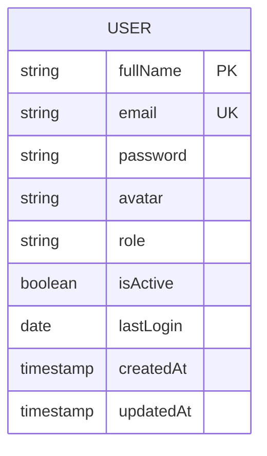
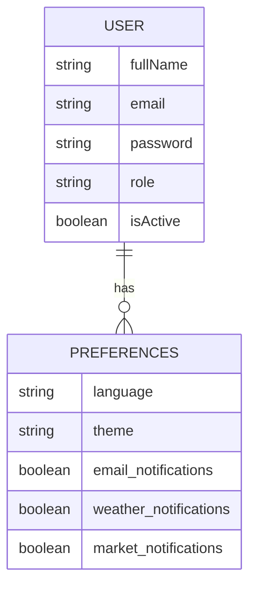
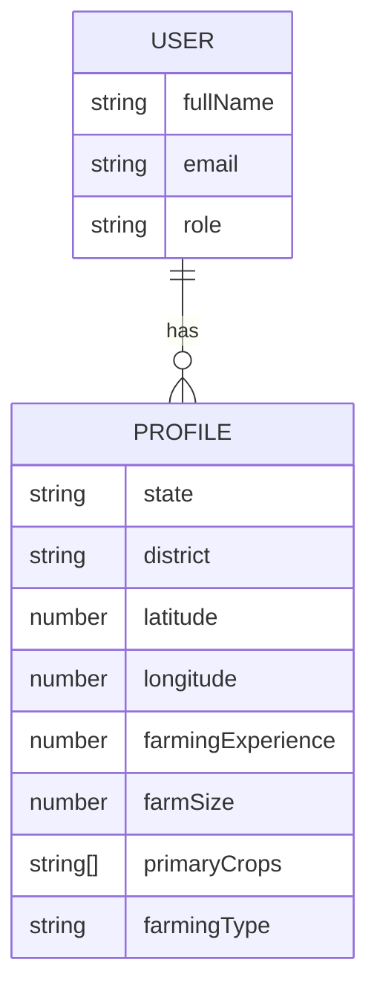
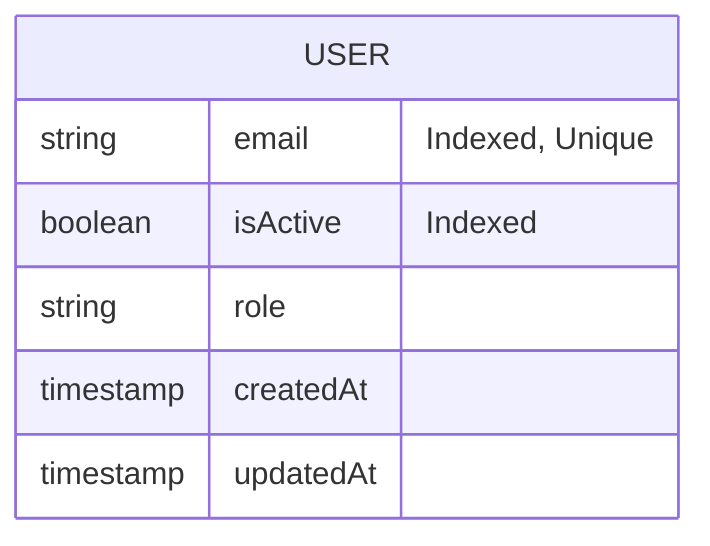
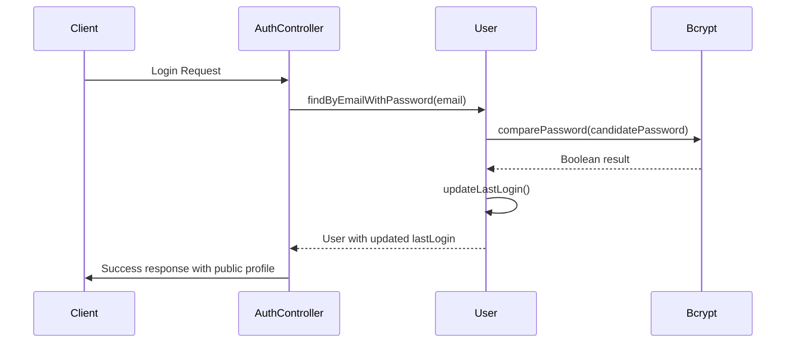
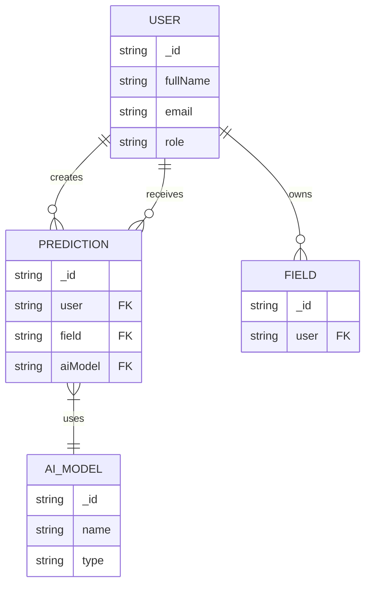

# User Schema

<cite>
**Referenced Files in This Document**   
- [User.js](file://HarvestIQ/backend/models/User.js)
- [Prediction.js](file://HarvestIQ/backend/models/Prediction.js)
- [Field.js](file://HarvestIQ/backend/models/Field.js)
- [AiModel.js](file://HarvestIQ/backend/models/AiModel.js)
- [auth.js](file://HarvestIQ/backend/routes/auth.js)
</cite>

## Table of Contents
1. [Introduction](#introduction)
2. [Core Fields](#core-fields)
3. [Preferences Structure](#preferences-structure)
4. [Profile Information](#profile-information)
5. [Data Validation and Constraints](#data-validation-and-constraints)
6. [Indexing Strategy](#indexing-strategy)
7. [Virtual Properties](#virtual-properties)
8. [Instance Methods](#instance-methods)
9. [Static Methods](#static-methods)
10. [Relationships with Other Collections](#relationships-with-other-collections)
11. [Sample Document](#sample-document)
12. [Security Considerations](#security-considerations)

## Introduction
The User schema in HarvestIQ serves as the foundation for the application's user management system, storing essential information for farmers, experts, and administrators. This comprehensive schema captures personal details, authentication credentials, user preferences, and detailed farming profiles. The design supports the platform's agricultural intelligence features by maintaining structured data that enables personalized recommendations, yield predictions, and regional insights. The schema is implemented using Mongoose for MongoDB, incorporating validation rules, indexing strategies, and security measures to ensure data integrity and performance.

**Section sources**
- [User.js](file://HarvestIQ/backend/models/User.js#L1-L20)

## Core Fields
The User schema contains several core fields that capture essential user information. The `fullName` field is a required string with a maximum length of 100 characters, ensuring complete user identification while preventing excessively long names. The `email` field serves as the unique identifier for each user, requiring a valid email format and enforcing uniqueness across the system. This field is automatically converted to lowercase and trimmed to prevent case sensitivity issues and whitespace errors. The `password` field is a required string with a minimum length of 6 characters, stored in a hashed format for security. The `role` field defines the user's access level with an enumeration of 'farmer', 'admin', or 'expert', defaulting to 'farmer' for new registrations. The `isActive` boolean field enables soft deletion functionality, allowing accounts to be deactivated without permanent data loss. The `lastLogin` field tracks the timestamp of the user's most recent authentication, supporting activity monitoring and security features.



**Diagram sources**
- [User.js](file://HarvestIQ/backend/models/User.js#L1-L50)

**Section sources**
- [User.js](file://HarvestIQ/backend/models/User.js#L1-L50)

## Preferences Structure
The preferences object in the User schema stores user-specific configuration settings that personalize the HarvestIQ experience. The `language` field supports multilingual functionality with a predefined enumeration of language codes including 'en', 'hi', 'pa', 'fr', 'es', 'de', 'ar', 'bn', 'ta', and 'te', defaulting to 'en' (English). This enables the platform to deliver content in the user's preferred language, with corresponding locale files available in the frontend. The `theme` field controls the visual appearance of the application, allowing users to choose between 'light' and 'dark' modes, with 'light' as the default setting. The `notifications` sub-object contains three boolean flags that manage different notification types: `email` for general communications, `weather` for weather-related alerts, and `market` for agricultural market updates. All notification types are enabled by default, ensuring users receive important information upon registration.



**Diagram sources**
- [User.js](file://HarvestIQ/backend/models/User.js#L50-L65)

**Section sources**
- [User.js](file://HarvestIQ/backend/models/User.js#L50-L65)
- [Settings.jsx](file://HarvestIQ/src/components/Settings.jsx#L405-L448)

## Profile Information
The profile object in the User schema captures detailed agricultural information specific to farmers, enabling personalized recommendations and regional insights. The `location` field contains nested properties for `state` and `district`, allowing the system to provide region-specific agricultural advice and market data. Geographic coordinates are stored as `latitude` and `longitude` numbers, supporting location-based services and mapping features. The `farmingExperience` field records the number of years the user has been farming as a non-negative number, contributing to personalized recommendations based on experience level. The `farmSize` field captures the total size of the user's farm in hectares as a non-negative number, essential for yield predictions and resource planning. The `primaryCrops` field is an array of strings that stores the main crops cultivated by the farmer, supporting crop-specific recommendations. The `farmingType` field is an enumeration with values 'organic', 'conventional', or 'mixed', defaulting to 'conventional', which influences the type of agricultural practices recommended.



**Diagram sources**
- [User.js](file://HarvestIQ/backend/models/User.js#L65-L100)

**Section sources**
- [User.js](file://HarvestIQ/backend/models/User.js#L65-L100)
- [Settings.jsx](file://HarvestIQ/src/components/Settings.jsx#L303-L332)

## Data Validation and Constraints
The User schema implements comprehensive validation rules to ensure data quality and integrity. The `fullName` field requires a value and enforces a maximum length of 100 characters with a custom error message. The `email` field has multiple validation constraints: it is required, must be unique across all users, must match a regular expression pattern for valid email addresses, and is automatically converted to lowercase and trimmed of whitespace. The uniqueness constraint prevents multiple accounts with the same email address, which is critical for authentication and communication. The `password` field requires a minimum of 6 characters with a descriptive error message, and is excluded from default queries for security reasons using `select: false`. The `role` field is constrained to the enumerated values of 'farmer', 'admin', or 'expert'. The `preferences.language` field validates against the supported language codes, while `preferences.theme` accepts only 'light' or 'dark' values. The `profile.farmingExperience` and `profile.farmSize` fields enforce non-negative values through the `min: 0` constraint, ensuring realistic data entry.

**Section sources**
- [User.js](file://HarvestIQ/backend/models/User.js#L1-L100)

## Indexing Strategy
The User schema employs a strategic indexing approach to optimize query performance for common access patterns. The `email` field has a unique index that serves multiple purposes: it enforces the uniqueness constraint and accelerates lookups during authentication processes. This index is critical for the login workflow, where users are frequently queried by their email address. The `isActive` field has a separate index to improve the performance of queries that filter active users, which is commonly used throughout the application to exclude deactivated accounts from results. These indexes support the platform's authentication workflows and user management operations, ensuring responsive performance even as the user base grows. The indexing strategy avoids redundancy by removing duplicate index definitions, maintaining database efficiency and preventing potential conflicts.



**Diagram sources**
- [User.js](file://HarvestIQ/backend/models/User.js#L100-L115)

**Section sources**
- [User.js](file://HarvestIQ/backend/models/User.js#L100-L115)

## Virtual Properties
The User schema includes virtual properties that provide computed data without storing it physically in the database. The `predictionCount` virtual field is configured to count the number of Prediction documents associated with a user, establishing a relationship between the User and Prediction collections. This virtual property uses Mongoose's population feature with `ref: 'Prediction'` to reference the Prediction model, `localField: '_id'` to match the user's ID, and `foreignField: 'user'` to identify the user reference in the Prediction schema. The `count: true` option ensures that only the count is returned rather than the full prediction documents, optimizing performance for displaying user statistics. This virtual enables efficient retrieval of a user's prediction history count for dashboard displays and analytics without requiring a separate query. The schema is configured with `toJSON: { virtuals: true }` and `toObject: { virtuals: true }` options, ensuring that virtual properties are included when the document is converted to JSON or a plain object.

**Section sources**
- [User.js](file://HarvestIQ/backend/models/User.js#L100-L115)
- [Prediction.js](file://HarvestIQ/backend/models/Prediction.js#L1-L20)

## Instance Methods
The User schema defines several instance methods that encapsulate user-related functionality and business logic. The `comparePassword` method asynchronously verifies a candidate password against the user's stored hashed password using bcrypt, returning a boolean result. This method handles the cryptographic comparison securely and includes error handling to prevent information leakage. The `getPublicProfile` method creates a sanitized version of the user document by converting it to a plain object and removing the password field, ensuring sensitive information is never exposed in API responses. This method is used when returning user data after authentication or in user profile endpoints. The `updateLastLogin` method updates the `lastLogin` timestamp to the current date and time, then saves the document to persist the change. This method is called during successful authentication to maintain accurate user activity records for security monitoring and analytics.



**Diagram sources**
- [User.js](file://HarvestIQ/backend/models/User.js#L115-L165)
- [auth.js](file://HarvestIQ/backend/routes/auth.js#L93-L150)

**Section sources**
- [User.js](file://HarvestIQ/backend/models/User.js#L115-L165)

## Static Methods
The User schema includes static methods that provide utility functions for querying users at the model level. The `findByEmail` static method searches for an active user by email address, performing a case-insensitive lookup by converting the input to lowercase and filtering for `isActive: true`. This method is used in various application contexts where user information is needed without authentication, such as profile lookups or public data displays. The `findByEmailWithPassword` static method is specifically designed for authentication workflows, finding an active user by email and explicitly including the password field in the result using `.select('+password')`. This method enables the authentication process to access the hashed password for comparison with the provided credentials. Both methods incorporate the `isActive` filter to ensure that deactivated accounts cannot be authenticated or accessed through these queries, supporting the soft deletion functionality.

**Section sources**
- [User.js](file://HarvestIQ/backend/models/User.js#L145-L165)
- [auth.js](file://HarvestIQ/backend/routes/auth.js#L93-L150)

## Relationships with Other Collections
The User schema maintains relationships with several other collections in the HarvestIQ application, forming the core of the data model. The most significant relationship is with the Prediction collection, where each Prediction document references a User through the `user` field. This one-to-many relationship enables the system to associate multiple predictions with a single user, supporting personalized yield forecasting and historical analysis. The Field collection also references User through its `user` field, establishing ownership of farm fields and enabling field-specific management and analysis. While not directly referenced in the User schema, the AiModel collection is indirectly related through the Prediction schema, where predictions are generated using specific AI models. These relationships support the platform's core functionality by connecting user accounts to their agricultural data, predictions, and analysis results, enabling a comprehensive view of each user's farming activities and insights.



**Diagram sources**
- [User.js](file://HarvestIQ/backend/models/User.js#L1-L165)
- [Prediction.js](file://HarvestIQ/backend/models/Prediction.js#L1-L20)
- [Field.js](file://HarvestIQ/backend/models/Field.js#L1-L20)
- [AiModel.js](file://HarvestIQ/backend/models/AiModel.js#L1-L20)

**Section sources**
- [User.js](file://HarvestIQ/backend/models/User.js#L1-L165)
- [Prediction.js](file://HarvestIQ/backend/models/Prediction.js#L1-L20)
- [Field.js](file://HarvestIQ/backend/models/Field.js#L1-L20)

## Sample Document
The following is a sample User document that illustrates the structure and data types used in the HarvestIQ application:

```json
{
  "_id": "64a1b2c3d4e5f6a7b8c9d0e1",
  "fullName": "Rajesh Kumar",
  "email": "rajesh.farmer@gmail.com",
  "avatar": "https://example.com/avatars/rajesh.jpg",
  "role": "farmer",
  "isActive": true,
  "lastLogin": "2023-12-15T08:30:00.000Z",
  "preferences": {
    "language": "hi",
    "theme": "light",
    "notifications": {
      "email": true,
      "weather": true,
      "market": true
    }
  },
  "profile": {
    "location": {
      "state": "Punjab",
      "district": "Ludhiana",
      "coordinates": {
        "latitude": 30.9010,
        "longitude": 75.8573
      }
    },
    "farmingExperience": 15,
    "farmSize": 8.5,
    "primaryCrops": ["Wheat", "Rice"],
    "farmingType": "conventional"
  },
  "predictionCount": 24,
  "createdAt": "2023-06-10T10:15:30.000Z",
  "updatedAt": "2023-12-15T08:30:00.000Z"
}
```

This sample represents a farmer user from Punjab, India, with 15 years of farming experience and an 8.5-hectare farm cultivating wheat and rice. The user has configured their preferences to use Hindi language with light theme and has all notification types enabled. The `predictionCount` virtual field shows they have generated 24 predictions, and their most recent login was in December 2023.

**Section sources**
- [User.js](file://HarvestIQ/backend/models/User.js#L1-L165)

## Security Considerations
The User schema implements several security measures to protect sensitive user information and prevent common vulnerabilities. The most critical security feature is password protection: the `password` field has `select: false` set in the schema, ensuring that passwords are never included in Mongoose queries by default, preventing accidental exposure in API responses. Passwords are hashed using bcrypt with a salt round of 12, providing strong protection against brute force attacks and rainbow table lookups. The pre-save middleware ensures that passwords are only hashed when modified, maintaining performance for other updates. Email addresses are normalized to lowercase before storage, preventing case-based enumeration attacks. The `isActive` field enables account deactivation without data deletion, allowing for security investigations and potential recovery. Authentication workflows use the dedicated `findByEmailWithPassword` static method to minimize the exposure of password data, retrieving it only when necessary for credential verification. The `getPublicProfile` instance method ensures that sensitive fields are removed before user data is returned to clients, implementing a principle of least privilege in data exposure.

**Section sources**
- [User.js](file://HarvestIQ/backend/models/User.js#L1-L165)
- [auth.js](file://HarvestIQ/backend/routes/auth.js#L93-L150)