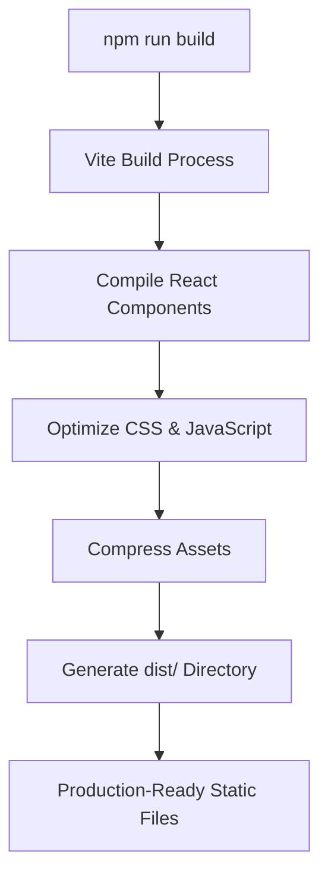
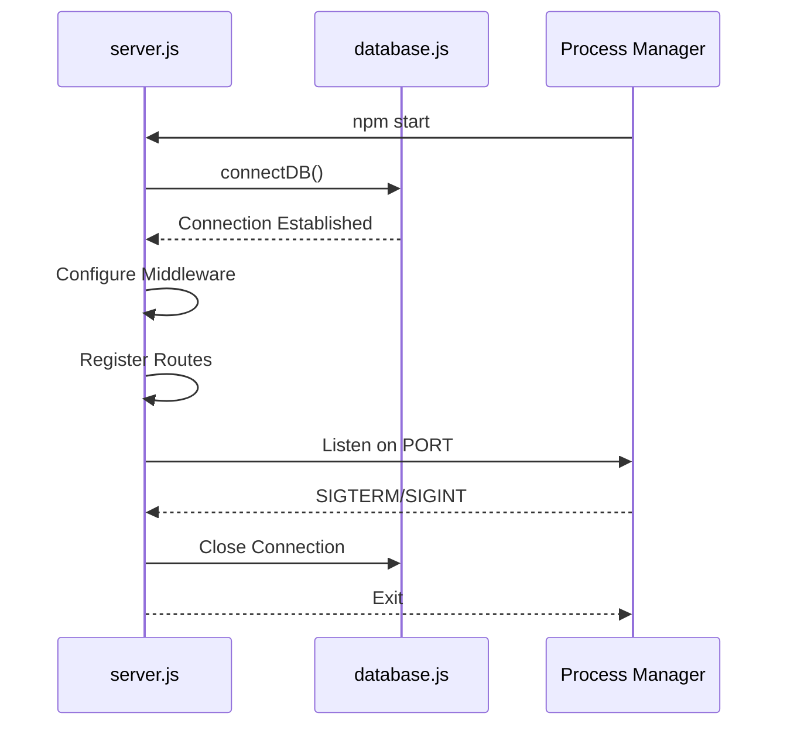
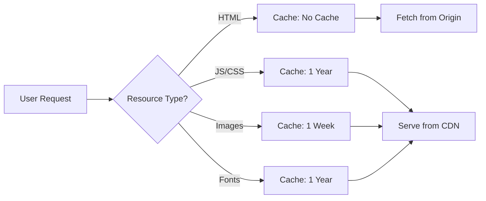
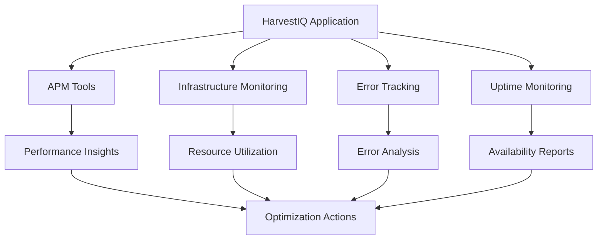
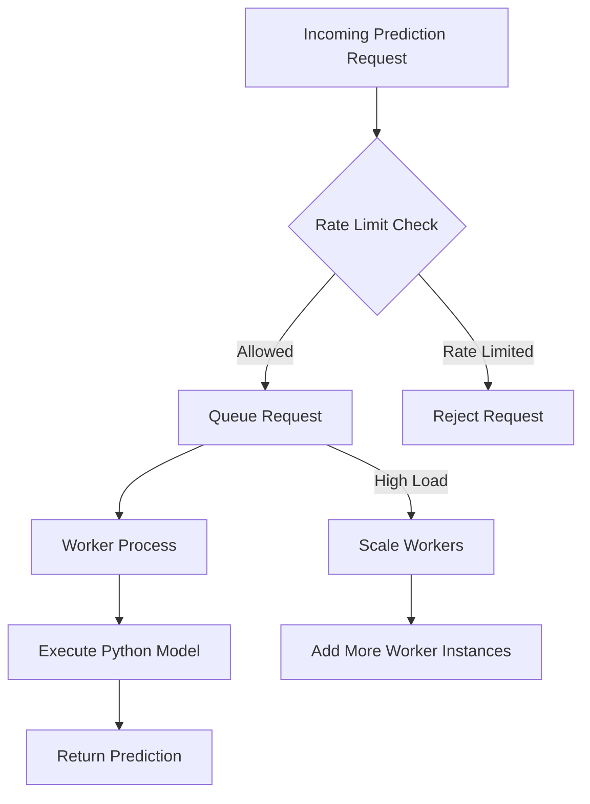

# Deployment Guide

<cite>
**Referenced Files in This Document**   
- [package.json](file://HarvestIQ/package.json)
- [vite.config.js](file://HarvestIQ/vite.config.js)
- [backend/package.json](file://HarvestIQ/backend/package.json)
- [backend/server.js](file://HarvestIQ/backend/server.js)
- [backend/config/database.js](file://HarvestIQ/backend/config/database.js)
- [backend/controllers/aiController.js](file://HarvestIQ/backend/controllers/aiController.js)
- [backend/routes/ai.js](file://HarvestIQ/backend/routes/ai.js)
- [README.md](file://HarvestIQ/README.md)
</cite>

## Table of Contents
1. [Introduction](#introduction)
2. [Frontend Production Build](#frontend-production-build)
3. [Backend Production Setup](#backend-production-setup)
4. [Deployment Options](#deployment-options)
5. [Reverse Proxy Configuration with Nginx](#reverse-proxy-configuration-with-nginx)
6. [Domain Setup and SSL/TLS Configuration](#domain-setup-and-ssl/tls-configuration)
7. [CDN Integration for Static Assets](#cdn-integration-for-static-assets)
8. [Health Check Endpoints and Monitoring](#health-check-endpoints-and-monitoring)
9. [Database Migration and Backup Procedures](#database-migration-and-backup-procedures)
10. [Scaling Considerations](#scaling-considerations)

## Introduction
This deployment guide provides comprehensive instructions for deploying the HarvestIQ application in a production environment. The application consists of a React frontend built with Vite and a Node.js/Express backend that integrates with a Python-based AI prediction model. This document covers all aspects of deployment including build processes, environment configuration, hosting options, security, monitoring, and scalability.

**Section sources**
- [README.md](file://HarvestIQ/README.md#L0-L12)

## Frontend Production Build
The HarvestIQ frontend is built using Vite, which provides optimized build commands for production deployment. The build process compiles React components, optimizes assets, and generates static files ready for deployment.

To build the frontend for production:

```bash
cd HarvestIQ
npm run build
```

This command executes the `vite build` script defined in the package.json file and generates optimized static assets in the `dist` directory. The build process includes:
- Code minification and tree-shaking
- CSS optimization
- Asset compression
- Bundle splitting for improved loading performance
- Internationalization (i18n) file bundling for 10 supported languages

The Vite configuration in `vite.config.js` specifies the React plugin for proper JSX compilation and HMR during development.



**Diagram sources**
- [package.json](file://HarvestIQ/package.json#L6-L9)
- [vite.config.js](file://HarvestIQ/vite.config.js#L1-L7)

**Section sources**
- [package.json](file://HarvestIQ/package.json#L6-L9)
- [vite.config.js](file://HarvestIQ/vite.config.js#L1-L7)

## Backend Production Setup
The HarvestIQ backend is a Node.js Express application that requires specific environment variables, database connectivity, and process management for production deployment.

### Environment Variables
Create a `.env` file in the backend directory with the following required variables:

```
NODE_ENV=production
PORT=5000
MONGODB_URI=mongodb+srv://<username>:<password>@cluster.mongodb.net/harvestiq-prod
FRONTEND_URL=https://yourdomain.com
JWT_SECRET=your_strong_jwt_secret_key
RATE_LIMIT_WINDOW_MS=900000
RATE_LIMIT_MAX_REQUESTS=100
```

### Database Connection
The backend connects to MongoDB using Mongoose. The connection is established through the `connectDB` function in `database.js`, which handles connection events, error handling, and graceful shutdown procedures.

### Process Management
The backend uses the `start` script in package.json to launch the server in production:

```bash
npm start
```

This executes `node server.js` and starts the Express server on the specified port. The server includes:
- Helmet for security headers
- CORS configuration for frontend integration
- Rate limiting to prevent abuse
- Global error handling with detailed error mapping
- Graceful shutdown handling for SIGTERM and SIGINT signals



**Diagram sources**
- [backend/package.json](file://HarvestIQ/backend/package.json#L6-L9)
- [backend/server.js](file://HarvestIQ/backend/server.js#L1-L152)
- [backend/config/database.js](file://HarvestIQ/backend/config/database.js#L1-L52)

**Section sources**
- [backend/package.json](file://HarvestIQ/backend/package.json#L6-L9)
- [backend/server.js](file://HarvestIQ/backend/server.js#L1-L152)
- [backend/config/database.js](file://HarvestIQ/backend/config/database.js#L1-L52)

## Deployment Options
HarvestIQ can be deployed using various platforms and methods, depending on infrastructure requirements and team expertise.

### Cloud Platform Deployment
**Frontend Deployment:**
- **Vercel**: Automatically deploys from Git repository with optimized edge network
- **Netlify**: Supports continuous deployment with built-in CDN and SSL

**Backend Deployment:**
- **Heroku**: Platform-as-a-service with easy deployment and scaling
- **AWS**: Deploy on EC2 instances or use Elastic Beanstalk for managed hosting
- **DigitalOcean**: Droplets provide virtual servers with full control over environment

### Containerization with Docker
Although not currently configured in the repository, Docker containerization can be implemented:

```dockerfile
# Frontend Dockerfile
FROM node:18-alpine as builder
WORKDIR /app
COPY package*.json ./
RUN npm ci
COPY . .
RUN npm run build

FROM nginx:alpine
COPY --from=builder /app/dist /usr/share/nginx/html
COPY nginx.conf /etc/nginx/nginx.conf
EXPOSE 80
CMD ["nginx", "-g", "daemon off;"]
```

```dockerfile
# Backend Dockerfile
FROM node:18-alpine
WORKDIR /app
COPY package*.json ./
RUN npm ci --only=production
COPY . .
EXPOSE 5000
CMD ["npm", "start"]
```

### Traditional Server Deployment
Deploy on a Linux server using PM2 for process management:

```bash
# Install PM2 globally
npm install -g pm2

# Start backend with PM2
pm2 start backend/server.js --name "harvestiq-backend"

# Start frontend server (serve static files)
pm2 start --name "harvestiq-frontend" -- serve -s dist
```

**Section sources**
- [backend/server.js](file://HarvestIQ/backend/server.js#L130-L152)

## Reverse Proxy Configuration with Nginx
Nginx should be used as a reverse proxy to serve the frontend and route API requests to the backend.

Example Nginx configuration:

```nginx
server {
    listen 80;
    server_name yourdomain.com;

    # Frontend static files
    location / {
        root /var/www/harvestiq/dist;
        try_files $uri $uri/ /index.html;
        expires 1y;
        add_header Cache-Control "public, immutable";
    }

    # API routes
    location /api/ {
        proxy_pass http://localhost:5000;
        proxy_http_version 1.1;
        proxy_set_header Upgrade $http_upgrade;
        proxy_set_header Connection 'upgrade';
        proxy_set_header Host $host;
        proxy_set_header X-Real-IP $remote_addr;
        proxy_set_header X-Forwarded-For $proxy_add_x_forwarded_for;
        proxy_set_header X-Forwarded-Proto $scheme;
        proxy_cache_bypass $http_upgrade;
    }

    # Health check endpoint
    location /health {
        proxy_pass http://localhost:5000/health;
        proxy_set_header Host $host;
        proxy_set_header X-Real-IP $remote_addr;
    }
}
```

This configuration serves static assets directly, proxies API requests to the Node.js backend, and properly handles the health check endpoint.

**Section sources**
- [backend/server.js](file://HarvestIQ/backend/server.js#L88-L94)

## Domain Setup and SSL/TLS Configuration
Proper domain and SSL configuration is essential for production deployment.

### Domain Setup
1. Purchase a domain from a registrar (e.g., GoDaddy, Namecheap)
2. Configure DNS records to point to your server IP or cloud provider
3. Set up A records for the root domain and CNAME records for www subdomain

### SSL/TLS Configuration
Use Let's Encrypt with Certbot to obtain free SSL certificates:

```bash
# Install Certbot
sudo apt-get install certbot python3-certbot-nginx

# Obtain SSL certificate
sudo certbot --nginx -d yourdomain.com -d www.yourdomain.com

# Auto-renewal setup
echo "0 12 * * * /usr/bin/certbot renew --quiet" | sudo crontab -
```

Update the Nginx configuration to use HTTPS:

```nginx
server {
    listen 443 ssl http2;
    server_name yourdomain.com;

    ssl_certificate /etc/letsencrypt/live/yourdomain.com/fullchain.pem;
    ssl_certificate_key /etc/letsencrypt/live/yourdomain.com/privkey.pem;
    
    # Security headers
    add_header Strict-Transport-Security "max-age=31536000" always;
    add_header X-Content-Type-Options nosniff;
    add_header X-Frame-Options DENY;
    
    # Rest of configuration...
}
```

**Section sources**
- [backend/server.js](file://HarvestIQ/backend/server.js#L30-L38)

## CDN Integration for Static Assets
Integrate a Content Delivery Network (CDN) to improve frontend performance and reduce latency.

### Implementation Options
1. **Cloudflare**: Free tier available with DDoS protection and global CDN
2. **AWS CloudFront**: High-performance CDN with extensive configuration options
3. **Akamai**: Enterprise-grade CDN with advanced features

### Configuration Steps
1. Upload static assets from the `dist` directory to the CDN
2. Configure cache policies:
   - HTML files: No cache or short TTL (5 minutes)
   - JavaScript/CSS: Long TTL (1 year) with content hashing
   - Images: Medium TTL (1 week)
3. Set up origin failover to the origin server
4. Enable HTTP/2 and Brotli compression

### Cache Headers
The Vite build automatically adds cache-busting hashes to asset filenames, enabling long cache durations:



**Diagram sources**
- [package.json](file://HarvestIQ/package.json#L6-L9)
- [vite.config.js](file://HarvestIQ/vite.config.js#L1-L7)

## Health Check Endpoints and Monitoring
The HarvestIQ backend includes built-in health check endpoints and should be monitored for production reliability.

### Health Check Endpoint
The `/health` endpoint provides server status information:

```http
GET /health
```

Response:
```json
{
  "success": true,
  "message": "HarvestIQ Backend API is running",
  "timestamp": "2025-01-01T00:00:00.000Z",
  "environment": "production"
}
```

This endpoint should be used by load balancers and monitoring services to verify server availability.

### Monitoring Recommendations
1. **Application Performance Monitoring (APM):**
   - Use tools like New Relic, Datadog, or Sentry
   - Monitor response times, error rates, and throughput

2. **Infrastructure Monitoring:**
   - Track CPU, memory, and disk usage
   - Monitor MongoDB performance and connection counts

3. **Error Tracking:**
   - Implement centralized logging with Winston or Bunyan
   - Set up alerts for unhandled exceptions and promise rejections

4. **Uptime Monitoring:**
   - Use external services like UptimeRobot or Pingdom
   - Configure alerts for downtime or slow responses



**Diagram sources**
- [backend/server.js](file://HarvestIQ/backend/server.js#L88-L94)
- [backend/server.js](file://HarvestIQ/backend/server.js#L136-L152)

**Section sources**
- [backend/server.js](file://HarvestIQ/backend/server.js#L88-L94)

## Database Migration and Backup Procedures
Proper database management is critical for data integrity and disaster recovery.

### Database Migration Strategy
1. **Schema Changes:**
   - Use Mongoose schema definitions in the models directory
   - Implement migration scripts for structural changes
   - Test migrations on staging environment first

2. **Data Migration:**
   - Export data from current database: `mongodump`
   - Import to new database: `mongorestore`
   - Validate data integrity after migration

### Backup Procedures
Implement regular automated backups:

```bash
# Daily backup script
#!/bin/bash
DATE=$(date +%Y%m%d_%H%M%S)
BACKUP_DIR="/backups/mongodb"
mongodump --uri="$MONGODB_URI" --out "$BACKUP_DIR/harvestiq_$DATE"

# Keep last 7 daily backups
find $BACKUP_DIR -name "harvestiq_*" -type d -mtime +7 -exec rm -rf {} \;

# Monthly archive
if [ $(date +%d) = "01" ]; then
    tar -czf "$BACKUP_DIR/archives/harvestiq_monthly_$(date +%Y%m).tar.gz" "$BACKUP_DIR/harvestiq_$DATE"
fi
```

### Disaster Recovery Plan
1. Store backups in multiple locations (on-premises and cloud)
2. Test restore procedures monthly
3. Document recovery steps and assign responsibilities
4. Implement point-in-time recovery if using MongoDB Atlas

**Section sources**
- [backend/config/database.js](file://HarvestIQ/backend/config/database.js#L1-L52)

## Scaling Considerations
As user load and AI prediction requests increase, the HarvestIQ application must be scaled appropriately.

### Frontend Scaling
- Deploy static assets to CDN for global distribution
- Use server-side rendering (SSR) if implemented in the future
- Implement code splitting to reduce initial load time

### Backend Scaling
1. **Vertical Scaling:**
   - Increase server resources (CPU, RAM)
   - Optimize Node.js process with appropriate heap size

2. **Horizontal Scaling:**
   - Deploy multiple backend instances behind a load balancer
   - Use sessionless authentication (JWT) for stateless scaling
   - Ensure MongoDB can handle increased connection counts

### AI Prediction Scaling
The AI prediction system has specific scaling requirements:



1. **Worker Pool Management:**
   - Limit concurrent Python processes to prevent resource exhaustion
   - Implement request queuing during peak loads
   - Monitor process spawn rates and memory usage

2. **Caching Strategy:**
   - Cache frequent prediction combinations
   - Use Redis or similar in-memory store
   - Implement cache invalidation based on model updates

3. **Load Testing:**
   - Simulate concurrent AI prediction requests
   - Measure response times and error rates
   - Identify bottlenecks in the prediction pipeline

### Performance Monitoring
Track key metrics:
- API response times (p50, p95, p99)
- Error rates by endpoint
- Concurrent AI prediction requests
- Database query performance
- Memory and CPU usage

**Diagram sources**
- [backend/controllers/aiController.js](file://HarvestIQ/backend/controllers/aiController.js#L1-L186)
- [backend/routes/ai.js](file://HarvestIQ/backend/routes/ai.js#L1-L12)

**Section sources**
- [backend/controllers/aiController.js](file://HarvestIQ/backend/controllers/aiController.js#L1-L186)
- [backend/routes/ai.js](file://HarvestIQ/backend/routes/ai.js#L1-L12)