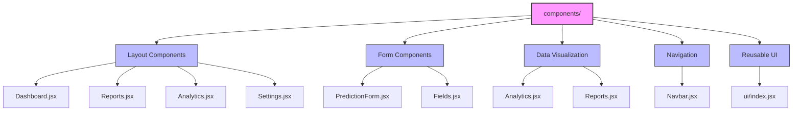
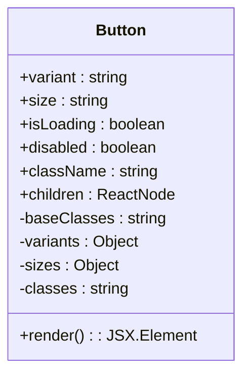
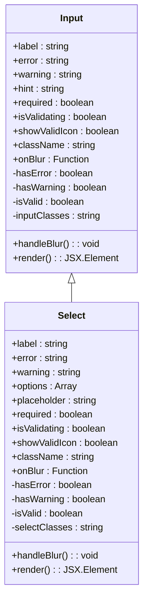

# Component Architecture

<cite>
**Referenced Files in This Document**   
- [Dashboard.jsx](file://HarvestIQ/src/components/Dashboard.jsx)
- [PredictionForm.jsx](file://HarvestIQ/src/components/PredictionForm.jsx)
- [Fields.jsx](file://HarvestIQ/src/components/Fields.jsx)
- [Reports.jsx](file://HarvestIQ/src/components/Reports.jsx)
- [Analytics.jsx](file://HarvestIQ/src/components/Analytics.jsx)
- [Settings.jsx](file://HarvestIQ/src/components/Settings.jsx)
- [Navbar.jsx](file://HarvestIQ/src/components/Navbar.jsx)
- [ui/index.jsx](file://HarvestIQ/src/components/ui/index.jsx)
- [AppContext.jsx](file://HarvestIQ/src/context/AppContext.jsx)
- [tailwind.config.js](file://HarvestIQ/tailwind.config.js)
</cite>

## Table of Contents
1. [Introduction](#introduction)
2. [Component Structure Overview](#component-structure-overview)
3. [Core Component Analysis](#core-component-analysis)
4. [Reusable UI Components](#reusable-ui-components)
5. [Component Composition Patterns](#component-composition-patterns)
6. [State Management and Context](#state-management-and-context)
7. [Accessibility and Responsive Design](#accessibility-and-responsive-design)
8. [Styling with Tailwind CSS](#styling-with-tailwind-css)
9. [Creating New Components](#creating-new-components)
10. [Conclusion](#conclusion)

## Introduction
HarvestIQ features a modular frontend component architecture designed for scalability, maintainability, and consistent user experience. The application's UI components are organized in the `components/` directory with a clear separation between layout components, form components, data visualization components, and reusable UI elements. This documentation provides a comprehensive analysis of the component architecture, focusing on the major components that form the core of the HarvestIQ application: Dashboard, PredictionForm, Fields, Reports, Analytics, Settings, and navigation components like Navbar. The architecture leverages React's component model, React Router for navigation, and a global context for state management, all styled with Tailwind CSS for a responsive and accessible user interface.

## Component Structure Overview
The HarvestIQ frontend components are organized in a feature-based structure within the `src/components/` directory. The architecture follows a clear pattern of separating concerns between different types of components. Layout components like Dashboard, Reports, Analytics, and Settings serve as page-level containers that orchestrate the overall structure and data flow for specific application views. Form components such as PredictionForm and Fields handle user input and data collection with multi-step workflows and validation. Data visualization components present information through charts, tables, and statistics. The `ui/` directory contains a library of reusable UI components that ensure consistent styling and behavior across the application. Navigation is managed by the Navbar component, which provides consistent access to all major application sections. This modular structure promotes code reuse, simplifies maintenance, and enables team members to work on different components independently.

**Diagram sources**
- [Dashboard.jsx](file://HarvestIQ/src/components/Dashboard.jsx)
- [PredictionForm.jsx](file://HarvestIQ/src/components/PredictionForm.jsx)
- [Fields.jsx](file://HarvestIQ/src/components/Fields.jsx)
- [Reports.jsx](file://HarvestIQ/src/components/Reports.jsx)
- [Analytics.jsx](file://HarvestIQ/src/components/Analytics.jsx)
- [Settings.jsx](file://HarvestIQ/src/components/Settings.jsx)
- [Navbar.jsx](file://HarvestIQ/src/components/Navbar.jsx)
- [ui/index.jsx](file://HarvestIQ/src/components/ui/index.jsx)

**Section sources**
- [Dashboard.jsx](file://HarvestIQ/src/components/Dashboard.jsx)
- [PredictionForm.jsx](file://HarvestIQ/src/components/PredictionForm.jsx)
- [Fields.jsx](file://HarvestIQ/src/components/Fields.jsx)
- [Reports.jsx](file://HarvestIQ/src/components/Reports.jsx)
- [Analytics.jsx](file://HarvestIQ/src/components/Analytics.jsx)
- [Settings.jsx](file://HarvestIQ/src/components/Settings.jsx)
- [Navbar.jsx](file://HarvestIQ/src/components/Navbar.jsx)

## Core Component Analysis
The HarvestIQ application is built around several major components that provide the core functionality for users. Each component serves a specific purpose in the agricultural intelligence workflow, from data input and prediction to analysis and management.

### Dashboard Component
The Dashboard component serves as the primary landing page and central hub for the HarvestIQ application. It provides an overview of key metrics, recent activities, and quick access to major features. The component uses real-time data hooks to fetch weather information, user statistics, and activity feeds, displaying them in an organized layout with visual indicators for data freshness and connection status. The dashboard features interactive statistics cards that users can click to navigate to relevant sections, creating a seamless user experience. A floating action button provides quick access to the prediction workflow, emphasizing the application's primary function. The component implements loading states with skeleton screens to provide visual feedback during data fetching, enhancing perceived performance.

**Section sources**
- [Dashboard.jsx](file://HarvestIQ/src/components/Dashboard.jsx)

### PredictionForm Component
The PredictionForm component implements a multi-step wizard for collecting agricultural data to generate crop yield predictions. The form is divided into three logical steps: Basic Information (crop type, farm area, region), Soil Health Metrics (pH level, organic content, nutrient levels), and Weather Data (rainfall, temperature, humidity). Each step is validated before allowing progression, with real-time validation feedback provided through the reusable UI components. The component manages form state, validation errors, and submission through a comprehensive state management system. Upon successful submission, it displays prediction results with confidence scores and provides options to create new predictions or return to the dashboard. The form uses custom animation hooks to create a smooth, engaging user experience with staggered animations and transitions between steps.

**Section sources**
- [PredictionForm.jsx](file://HarvestIQ/src/components/PredictionForm.jsx)

### Fields Component
The Fields component enables users to manage their agricultural fields by creating, editing, and viewing field information. It provides a form for entering field details including name, size, GPS coordinates, soil type, current crop, and descriptive notes. The component integrates with the backend API through the fieldAPI service to perform CRUD operations, with real-time updates to the fields list upon successful operations. Field entries are displayed as cards with key information and action buttons for editing and deletion. Each field card includes a button to initiate a prediction specifically for that field, creating a direct workflow from field management to prediction. The component handles loading states, errors, and empty states with appropriate UI feedback, ensuring a robust user experience.

**Section sources**
- [Fields.jsx](file://HarvestIQ/src/components/Fields.jsx)

### Reports Component
The Reports component displays a history of prediction results in a tabular format, allowing users to review past predictions and their outcomes. It fetches prediction data from the backend and presents key information including date, crop type, farm area, status, and yield prediction. The component includes quick statistics at the top showing total predictions, recent activity, completion rates, and success rates, providing immediate insights into prediction patterns. The table supports future enhancements like search and filtering, currently implemented as placeholders. The component handles various states including loading, error, and empty states, guiding users to create their first prediction when no data is available. Export functionality is planned for future implementation, with placeholder buttons indicating this capability.

**Section sources**
- [Reports.jsx](file://HarvestIQ/src/components/Reports.jsx)

### Analytics Component
The Analytics component provides detailed insights into prediction patterns and performance through data visualization. It displays key metrics such as total predictions, success rate, average processing time, and completed predictions over a user-selectable time range. The component features two primary visualizations: a monthly trends chart showing prediction volume and completion rates over time, and a crop distribution pie chart illustrating the proportion of different crops in the prediction history. These visualizations are created using simple CSS-based charts rather than external charting libraries, maintaining consistency with the application's design system. The component also includes performance insights that interpret the data and provide qualitative assessments of user activity and system performance.

**Section sources**
- [Analytics.jsx](file://HarvestIQ/src/components/Analytics.jsx)

### Settings Component
The Settings component allows users to manage their account preferences and settings across multiple tabs: Profile, Security, Preferences, and Notifications. The Profile tab enables users to update their personal information, while the Security tab handles password changes with appropriate validation. The Preferences tab includes language selection with support for 10 languages and RTL (right-to-left) text direction for Arabic, as well as theme selection between light and dark modes. The Notifications tab allows users to configure their notification preferences for different event types. The component implements form state management, validation, and success/error messaging to guide users through the settings process. A danger zone section provides access to account export and deletion functionality, with appropriate confirmation dialogs to prevent accidental actions.

**Section sources**
- [Settings.jsx](file://HarvestIQ/src/components/Settings.jsx)

### Navigation Component
The Navbar component provides consistent navigation throughout the HarvestIQ application. It features a responsive design that adapts to different screen sizes, with a horizontal navigation menu on desktop and a collapsible mobile menu on smaller screens. The navigation includes links to the Dashboard, Prediction, and Analytics sections, providing quick access to core functionality. The component also includes user-facing actions such as theme toggling, language selection, and user profile management. The language selector is particularly sophisticated, organizing languages into groups (Primary, European, Indian, Other) for better usability and supporting RTL text direction. The user menu provides access to settings and logout functionality. The navbar uses a glassmorphism design with backdrop blur effects, creating a modern, translucent appearance that integrates well with the application's overall aesthetic.

**Section sources**
- [Navbar.jsx](file://HarvestIQ/src/components/Navbar.jsx)

## Reusable UI Components
The `ui/index.jsx` file exports a comprehensive library of reusable UI components that ensure consistent styling, behavior, and user experience across the HarvestIQ application. These components abstract common UI patterns and provide a cohesive design system that can be easily applied throughout the application.

### Button Component
The Button component is a versatile UI element that supports multiple variants (primary, secondary, outline, ghost, danger), sizes (sm, md, lg, xl), and loading states. The primary variant uses a green gradient background, while other variants provide different visual treatments for various contexts. The component handles loading states by displaying a spinner animation and disabling interaction, providing clear feedback during asynchronous operations. All variants maintain consistent typography, spacing, and interactive states (hover, focus) to ensure a professional appearance and predictable behavior.

**Diagram sources**
- [ui/index.jsx](file://HarvestIQ/src/components/ui/index.jsx)

**Section sources**
- [ui/index.jsx](file://HarvestIQ/src/components/ui/index.jsx)

### Input and Select Components
The Input and Select components provide form controls with built-in validation feedback and consistent styling. Both components support labels, error messages, warning messages, and hint text, creating a comprehensive form experience. They display visual indicators for validation states, including error icons for invalid inputs, warning icons for potentially problematic values, and success icons for valid entries. During validation, a loading spinner indicates that validation is in progress. The components use conditional styling to change border colors based on validation state, providing immediate visual feedback. The Select component extends the base functionality with a dropdown interface for choosing from predefined options, maintaining the same validation and styling patterns as the Input component.

**Diagram sources**
- [ui/index.jsx](file://HarvestIQ/src/components/ui/index.jsx)

**Section sources**
- [ui/index.jsx](file://HarvestIQ/src/components/ui/index.jsx)

### Card and Layout Components
The Card component serves as a fundamental container for grouping related content with consistent styling and optional hover effects. It supports multiple variants including default, glass (with backdrop blur), and gradient, allowing for visual hierarchy and emphasis. The Card component is used extensively throughout the application to contain forms, statistics, and other content sections. The ProgressBar component provides visual feedback for processes with progress tracking, supporting different colors, sizes, and optional labels. The LoadingSpinner component displays animated spinners in various sizes and colors to indicate loading states. The Skeleton component provides loading placeholders with shimmer animations to maintain layout stability during content loading. These components work together to create a polished, professional interface with appropriate feedback for asynchronous operations.

**Section sources**
- [ui/index.jsx](file://HarvestIQ/src/components/ui/index.jsx)

## Component Composition Patterns
HarvestIQ employs several effective component composition patterns that promote reusability, maintainability, and a consistent user experience across the application.

### Container-Component Pattern
The application follows a container-component pattern where higher-level components (containers) manage state, data fetching, and business logic, while lower-level components focus on presentation and user interaction. For example, the Dashboard component acts as a container that fetches weather data, user statistics, and activity feeds, then passes this data to presentational components like statistics cards and activity lists. This