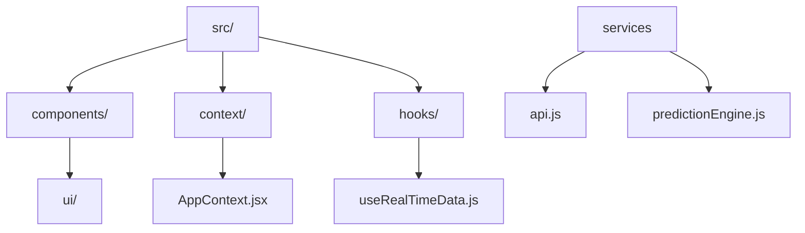
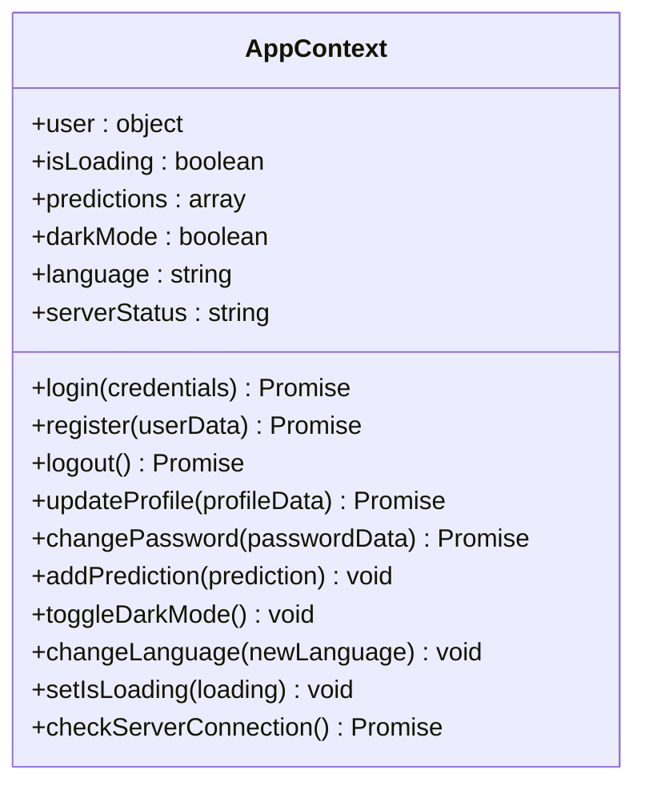
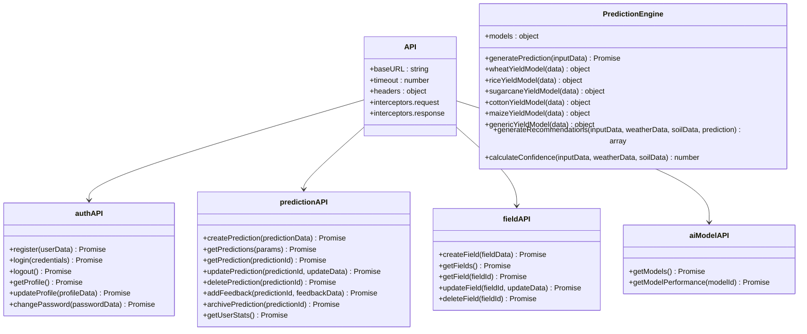
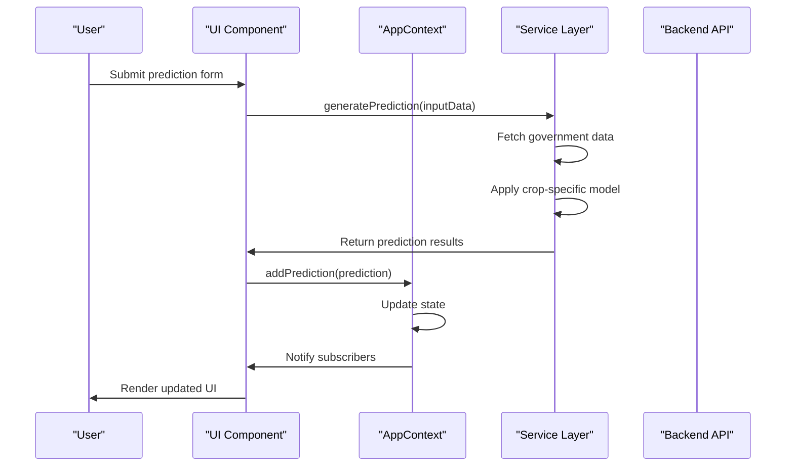

# Frontend Architecture

<cite>
**Referenced Files in This Document**   
- [App.jsx](file://src/App.jsx)
- [AppContext.jsx](file://src/context/AppContext.jsx)
- [ui/index.jsx](file://src/components/ui/index.jsx)
- [api.js](file://src/services/api.js)
- [predictionEngine.js](file://src/services/predictionEngine.js)
</cite>

## Table of Contents
1. [Introduction](#introduction)
2. [Project Structure](#project-structure)
3. [Component-Based Architecture](#component-based-architecture)
4. [Global State Management](#global-state-management)
5. [Routing System](#routing-system)
6. [UI Component Structure](#ui-component-structure)
7. [Service Layer Pattern](#service-layer-pattern)
8. [Data Flow](#data-flow)
9. [Performance Optimizations](#performance-optimizations)
10. [Conclusion](#conclusion)

## Introduction
HarvestIQ is a React-based frontend application designed to provide farmers with AI-powered crop yield predictions and agricultural insights. The application features a component-based architecture with modular UI components, reusable custom hooks, and a comprehensive state management system. This document details the architectural components and patterns used in the HarvestIQ frontend, including the React Context API for global state management, React Router for navigation, and a service layer for API communication and AI integration.

## Project Structure
The HarvestIQ frontend follows a well-organized folder structure that separates concerns and promotes maintainability. The `src/` directory contains the main application components, organized into logical folders:

- `components/`: Contains UI components and subcomponents
- `context/`: Houses the AppContext for global state management
- `hooks/`: Custom React hooks for reusable logic
- `locales/`: Internationalization files for multi-language support
- `services/`: API and service layer implementations
- `utils/`: Utility functions and helpers
- `App.jsx`: Main application component with routing
- `main.jsx`: Entry point of the application

This structure enables clear separation of concerns and makes the codebase easier to navigate and maintain.



**Diagram sources**
- [App.jsx](file://src/App.jsx)
- [AppContext.jsx](file://src/context/AppContext.jsx)
- [ui/index.jsx](file://src/components/ui/index.jsx)
- [api.js](file://src/services/api.js)
- [predictionEngine.js](file://src/services/predictionEngine.js)

## Component-Based Architecture
The HarvestIQ frontend employs a component-based architecture that promotes reusability and maintainability. The application is built from modular UI components that can be composed together to create complex interfaces. Key components include:

- `Analytics.jsx`: Dashboard for analyzing prediction patterns and performance
- `Auth.jsx`: Authentication interface for user login and registration
- `Dashboard.jsx`: Main dashboard with quick actions and real-time data
- `PredictionForm.jsx`: Multi-step form for creating crop yield predictions
- `Reports.jsx`: History and export functionality for predictions
- `Fields.jsx`: Management interface for agricultural fields
- `Settings.jsx`: User preferences and account settings
- `Welcome.jsx`: Landing page with application overview

Each component is responsible for a specific part of the user interface and follows React best practices for state management and lifecycle methods.

**Section sources**
- [Analytics.jsx](file://src/components/Analytics.jsx)
- [Auth.jsx](file://src/components/Auth.jsx)
- [Dashboard.jsx](file://src/components/Dashboard.jsx)
- [PredictionForm.jsx](file://src/components/PredictionForm.jsx)
- [Reports.jsx](file://src/components/Reports.jsx)
- [Fields.jsx](file://src/components/Fields.jsx)
- [Settings.jsx](file://src/components/Settings.jsx)
- [Welcome.jsx](file://src/components/Welcome.jsx)

## Global State Management
HarvestIQ uses the React Context API for global state management through the `AppContext.jsx` component. This context provides a centralized store for application-wide state, including user session data, theme preferences, language settings, and real-time data.

The `AppProvider` component initializes and manages several state variables:
- `user`: User session data including profile information
- `isLoading`: Loading state for API calls
- `predictions`: Collection of prediction results
- `darkMode`: Theme preference (light/dark mode)
- `language`: Current language for internationalization
- `serverStatus`: Connection status to the backend server

The context also exposes methods for authentication (login, register, logout), profile management, theme toggling, and language changes. User data is persisted in localStorage to maintain session state across page reloads.



**Diagram sources**
- [AppContext.jsx](file://src/context/AppContext.jsx#L12-L289)

## Routing System
The routing system in HarvestIQ is implemented in `App.jsx` using React Router. The application defines a comprehensive set of routes that correspond to different views and functionality:

- `/`: Welcome page (public)
- `/auth`: Authentication interface (public)
- `/dashboard`: Main dashboard (protected)
- `/prediction`: Prediction form (protected)
- `/reports`: Prediction history (protected)
- `/fields`: Field management (protected)
- `/analytics`: Analytics dashboard (protected)
- `/settings`: User settings (protected)

The routing system includes route protection through `ProtectedRoute` and `PublicRoute` components that check the user's authentication status. Unauthenticated users are redirected to the login page, while authenticated users are redirected to the dashboard when accessing public routes.

```mermaid
graph TD
A[App] --> B[Router]
B --> C[/]
B --> D[/auth]
B --> E[/dashboard]
B --> F[/prediction]
B --> G[/reports]
B --> H[/fields]
B --> I[/analytics]
B --> J[/settings]
C --> Welcome
D --> Auth
E --> Dashboard
F --> PredictionForm
G --> Reports
H --> Fields
I --> Analytics
J --> Settings
K[ProtectedRoute] --> E
K --> F
K --> G
K --> H
K --> I
K --> J
L[PublicRoute] --> C
L --> D
```

**Diagram sources**
- [App.jsx](file://src/App.jsx#L25-L47)

## UI Component Structure
The UI component structure in HarvestIQ is organized through the `ui/index.jsx` file, which exports a library of reusable UI components. These components follow a consistent design system and provide enhanced functionality over basic HTML elements.

Key UI components include:
- `Button`: Enhanced button with multiple variants and loading states
- `Input`: Form input with validation, error states, and visual feedback
- `Select`: Styled select dropdown with custom options
- `Card`: Container component with multiple variants and hover effects
- `Badge`: Status indicators with different colors and sizes
- `ProgressBar`: Visual progress indicator with customizable appearance
- `LoadingSpinner`: Animated loading indicator
- `Skeleton`: Loading skeleton for content placeholders
- `Toast`: Notification component for user feedback
- `Alert`: Alert messages with dismissible option
- `StatCard`: Dashboard card for displaying key metrics

These components are designed to be highly reusable and maintain a consistent look and feel throughout the application.

**Section sources**
- [ui/index.jsx](file://src/components/ui/index.jsx)

## Service Layer Pattern
HarvestIQ implements a service layer pattern through the `api.js` and `predictionEngine.js` files in the `services/` directory. This pattern separates API communication and business logic from the UI components, promoting separation of concerns and easier testing.

The `api.js` file contains:
- Axios instance configured with base URL and interceptors
- Request interceptor to add authentication tokens
- Response interceptor to handle authentication errors
- Service modules for different API endpoints:
  - `authAPI`: Authentication operations
  - `predictionAPI`: Prediction management
  - `fieldAPI`: Field management
  - `aiModelAPI`: AI model operations

The `predictionEngine.js` file implements the AI prediction logic with crop-specific models for wheat, rice, sugarcane, cotton, and maize. The engine integrates with government data services to provide comprehensive predictions based on multiple factors including weather, soil, historical data, and market prices.



**Diagram sources**
- [api.js](file://src/services/api.js)
- [predictionEngine.js](file://src/services/predictionEngine.js)

## Data Flow
The data flow in HarvestIQ follows a predictable pattern from user interaction to API call to state update. When a user interacts with the application, the following sequence occurs:

1. User performs an action (e.g., submits a prediction form)
2. Component handles the event and calls a service method
3. Service makes an API call to the backend
4. API response is processed and returned to the component
5. Component updates the global state through context methods
6. UI re-renders to reflect the new state

For example, when generating a prediction:
1. User fills out the prediction form and clicks "Generate Prediction"
2. `PredictionForm.jsx` calls `predictionEngine.generatePrediction()`
3. The prediction engine calls government data services and applies crop-specific models
4. Results are returned to the component
5. Component calls `addPrediction()` from the AppContext to update state
6. The dashboard and other components re-render with the new prediction

This unidirectional data flow ensures that state changes are predictable and traceable.



**Diagram sources**
- [AppContext.jsx](file://src/context/AppContext.jsx)
- [predictionEngine.js](file://src/services/predictionEngine.js)
- [PredictionForm.jsx](file://src/components/PredictionForm.jsx)

## Performance Optimizations
HarvestIQ implements several performance optimizations to ensure a smooth user experience:

1. **Code Splitting and Lazy Loading**: While not explicitly implemented in the current codebase, the modular structure supports code splitting by route or component.

2. **Custom Hooks for Reusable Logic**: The `useRealTimeData.js` file contains custom hooks that encapsulate complex logic for real-time data fetching and auto-refreshing:
   - `useAutoRefresh`: Generic hook for auto-refreshing data
   - `useWeatherData`: Real-time weather data
   - `useUserStats`: Real-time user statistics
   - `useActivityFeed`: Real-time activity feed
   - `useMarketPrices`: Market price updates
   - `useSystemHealth`: System health monitoring

3. **Efficient State Management**: The AppContext minimizes unnecessary re-renders by grouping related state and providing specific update methods.

4. **Optimized API Calls**: The API service uses interceptors to handle authentication and error handling consistently, reducing duplicate code.

5. **Loading States and Skeletons**: Components display loading spinners and skeleton screens during data fetching to improve perceived performance.

6. **Memoization**: Components use `React.useMemo` and `React.useCallback` to prevent unnecessary recalculations and re-renders.

These optimizations work together to create a responsive and efficient user interface.

**Section sources**
- [useRealTimeData.js](file://src/hooks/useRealTimeData.js)
- [AppContext.jsx](file://src/context/AppContext.jsx)
- [api.js](file://src/services/api.js)

## Conclusion
The HarvestIQ frontend architecture demonstrates a well-structured React application with clear separation of concerns and reusable components. The component-based design, global state management with React Context, and service layer pattern create a maintainable and scalable codebase. The routing system provides intuitive navigation, while the UI component library ensures consistency across the application. Performance optimizations like custom hooks and efficient state management contribute to a smooth user experience. This architecture provides a solid foundation for future enhancements and feature additions.