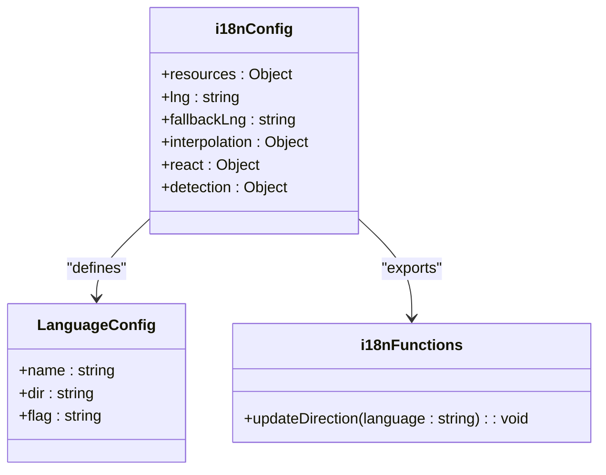
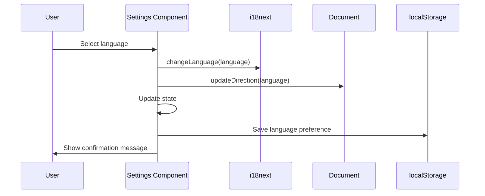
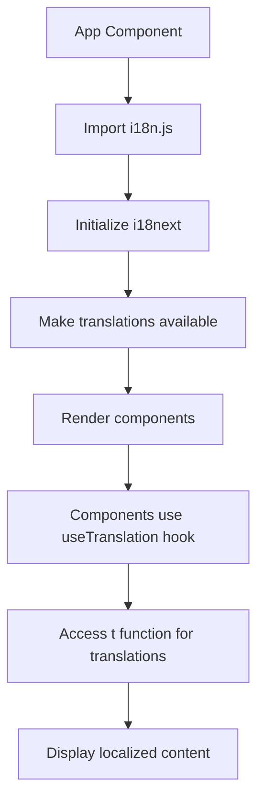
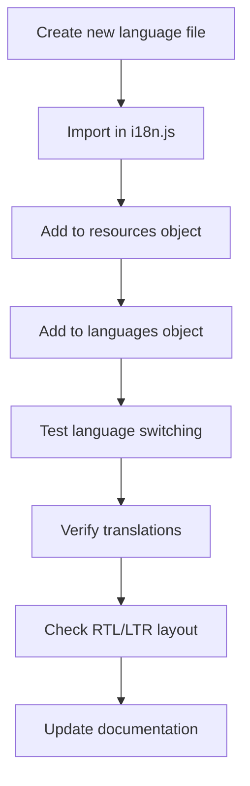

# Internationalization

<cite>
**Referenced Files in This Document**   
- [i18n.js](file://HarvestIQ/src/i18n.js)
- [Settings.jsx](file://HarvestIQ/src/components/Settings.jsx)
- [Navbar.jsx](file://HarvestIQ/src/components/Navbar.jsx)
- [en.json](file://HarvestIQ/src/locales/en.json)
- [ar.json](file://HarvestIQ/src/locales/ar.json)
- [App.jsx](file://HarvestIQ/src/App.jsx)
</cite>

## Table of Contents
1. [Introduction](#introduction)
2. [i18next Configuration](#i18next-configuration)
3. [Translation Files Structure](#translation-files-structure)
4. [Language Switching Implementation](#language-switching-implementation)
5. [Translation Usage in Components](#translation-usage-in-components)
6. [RTL Support for Arabic](#rtl-support-for-arabic)
7. [Adding New Languages](#adding-new-languages)
8. [Troubleshooting](#troubleshooting)

## Introduction

HarvestIQ implements a comprehensive internationalization (i18n) system using i18next to support 10 languages for agricultural intelligence platform users. The system enables seamless language switching, persistent user preferences, and proper handling of right-to-left (RTL) layouts for Arabic. This documentation details the implementation, configuration, and usage patterns for the i18n system across the application.

The internationalization system supports the following languages: English (en), Hindi (hi), Punjabi (pa), French (fr), Spanish (es), German (de), Arabic (ar), Bengali (bn), Tamil (ta), and Telugu (te). The system is designed to be extensible for adding additional languages as needed.

**Section sources**
- [i18n.js](file://HarvestIQ/src/i18n.js#L1-L88)
- [stack.md](file://HarvestIQ/stack.md#L49-L74)

## i18next Configuration

The i18next configuration is centralized in the `i18n.js` file, which initializes the internationalization system with all necessary settings and resources. The configuration imports the i18next library and react-i18next bindings to integrate with the React application.

The system is configured with 10 language resources, each imported from their respective JSON files in the `locales/` directory. These resources are organized into a `resources` object that maps language codes to their translation data. The configuration sets English as the default language (`lng: 'en'`) and fallback language (`fallbackLng: 'en'`) to ensure content is always available.

Language-specific configurations are exported as the `languages` object, which includes metadata for each supported language: display name, text direction (ltr or rtl), and country flag emoji. This metadata is used throughout the application for language selection UI and layout adjustments.



**Diagram sources**
- [i18n.js](file://HarvestIQ/src/i18n.js#L1-L88)

**Section sources**
- [i18n.js](file://HarvestIQ/src/i18n.js#L1-L88)

## Translation Files Structure

The translation files are organized in the `src/locales/` directory, with one JSON file for each supported language. Each file follows the same structure with nested objects for different sections of the application: welcome, auth, navigation, dashboard, prediction, and common.

The translation keys are organized hierarchically to reflect the application's structure and components. For example, navigation-related strings are grouped under the "navigation" key, while authentication strings are under "auth". This organization makes it easier to locate and manage translations for specific features.

Each translation file contains the same set of keys to ensure consistency across languages. The values are the localized text for each language. The system uses simple key-value pairs for translations, with nested objects for grouping related strings.

```json
{
  "welcome": {
    "title": "Welcome to HarvestIQ",
    "subtitle": "AI-powered crop yield prediction platform for North Indian agriculture."
  },
  "auth": {
    "login": "Login",
    "register": "Register"
  },
  "navigation": {
    "home": "Home",
    "dashboard": "Dashboard"
  }
}
```

The English translation file serves as the source of truth for available keys, and all other language files should mirror this structure. When adding new translations, the same key structure should be maintained across all language files.

**Diagram sources**
- [en.json](file://HarvestIQ/src/locales/en.json#L1-L83)
- [ar.json](file://HarvestIQ/src/locales/ar.json#L1-L83)

**Section sources**
- [en.json](file://HarvestIQ/src/locales/en.json#L1-L83)
- [ar.json](file://HarvestIQ/src/locales/ar.json#L1-L83)

## Language Switching Implementation

Language switching is implemented through the Settings component and the Navbar component, providing users with multiple ways to change their language preference. The system persists the selected language across sessions using localStorage.

The Settings component provides a comprehensive language selection interface with visual indicators for RTL languages. When a user selects a language, the `handleLanguageChange` function is called, which performs several operations: updates the i18next instance with `i18n.changeLanguage()`, calls `updateDirection()` to handle RTL/LTR layout changes, updates the component state, saves the preference to localStorage, and displays a confirmation message.



The `updateDirection` function, exported from `i18n.js`, is critical for handling text direction. It reads the direction property from the language configuration and applies it to the document's root element by setting `document.documentElement.dir`. This ensures that the entire application layout respects the text direction of the selected language.

The Navbar component also includes a language selector dropdown that allows quick language switching from any page. This provides a convenient alternative to accessing the Settings page for language changes.

**Diagram sources**
- [Settings.jsx](file://HarvestIQ/src/components/Settings.jsx#L23-L545)
- [Navbar.jsx](file://HarvestIQ/src/components/Navbar.jsx#L23-L366)

**Section sources**
- [Settings.jsx](file://HarvestIQ/src/components/Settings.jsx#L23-L545)
- [Navbar.jsx](file://HarvestIQ/src/components/Navbar.jsx#L23-L366)

## Translation Usage in Components

Translations are implemented in React components using the `useTranslation` hook from react-i18next. Components import this hook and call it to access the translation function `t` and the current language.

The `t` function is used to retrieve translated strings by key. For example, `t('navigation.home')` returns the translated text for the home navigation item in the current language. This function can handle nested keys using dot notation to traverse the translation object hierarchy.

The App component initializes the i18n system by importing `./i18n`, which executes the configuration and makes translations available throughout the application. This import is placed before other component imports to ensure the i18n system is ready when components are rendered.



Components throughout the application use the `useTranslation` hook to access translations. The hook returns an object with the `t` function and other properties like the current language. This pattern ensures that components automatically re-render when the language changes, providing a seamless user experience.

**Diagram sources**
- [App.jsx](file://HarvestIQ/src/App.jsx#L1-L51)
- [Settings.jsx](file://HarvestIQ/src/components/Settings.jsx#L23-L545)

**Section sources**
- [App.jsx](file://HarvestIQ/src/App.jsx#L1-L51)
- [Settings.jsx](file://HarvestIQ/src/components/Settings.jsx#L23-L545)

## RTL Support for Arabic

The internationalization system includes comprehensive support for right-to-left (RTL) layouts, specifically for the Arabic language. This is implemented through several coordinated mechanisms that ensure proper text direction and layout alignment.

The language configuration in `i18n.js` explicitly defines Arabic (`ar`) with `dir: 'rtl'`, while all other languages have `dir: 'ltr'`. This directional information is used by the `updateDirection` function to set the document's text direction when Arabic is selected.

When the Arabic language is activated, the system applies RTL styling to the entire document by setting `document.documentElement.dir = 'rtl'`. This CSS direction property automatically reverses the layout flow, aligning text to the right and reversing the order of inline elements.

The Settings component provides visual feedback for RTL languages by displaying an "RTL" indicator next to Arabic in the language selection grid. This helps users understand that selecting Arabic will change the text direction of the interface.

```mermaid
classDiagram
class LanguageConfig {
+en : {name : "English", dir : "ltr", flag : "🇺🇸"}
+hi : {name : "हिन्दी", dir : "ltr", flag : "🇮🇳"}
+pa : {name : "ਪੰਜਾਬੀ", dir : "ltr", flag : "🇮🇳"}
+fr : {name : "Français", dir : "ltr", flag : "🇫🇷"}
+es : {name : "Español", dir : "ltr", flag : "🇪🇸"}
+de : {name : "Deutsch", dir : "ltr", flag : "🇩🇪"}
+ar : {name : "العربية", dir : "rtl", flag : "🇸🇦"}
+bn : {name : "বাংলা", dir : "ltr", flag : "🇧🇩"}
+ta : {name : "தமிழ்", dir : "ltr", flag : "🇮🇳"}
+te : {name : "తెలుగు", dir : "ltr", flag : "🇮🇳"}
}
class LayoutManager {
+updateDirection(language : string)
+setDocumentDirection(dir : string)
+applyRTLStyles()
}
LanguageConfig --> LayoutManager : "triggers"
```

The system also configures i18next with `react: { useSuspense: false }` to prevent potential issues with React's concurrent rendering when switching between LTR and RTL layouts. This ensures a smooth transition between language directions without rendering artifacts.

**Diagram sources**
- [i18n.js](file://HarvestIQ/src/i18n.js#L67-L88)
- [Settings.jsx](file://HarvestIQ/src/components/Settings.jsx#L23-L545)

**Section sources**
- [i18n.js](file://HarvestIQ/src/i18n.js#L67-L88)
- [Settings.jsx](file://HarvestIQ/src/components/Settings.jsx#L23-L545)

## Adding New Languages

Adding new languages to the HarvestIQ platform follows a systematic process that ensures consistency and proper integration with the existing i18n system. The process involves creating translation files, updating configuration, and testing the implementation.

To add a new language, first create a JSON translation file in the `src/locales/` directory using the language code as the filename (e.g., `zh.json` for Chinese). This file should mirror the structure of the existing translation files, particularly the English (`en.json`) file, to ensure all necessary keys are present.

Next, import the new translation file in `i18n.js` and add it to the `resources` object with the appropriate language code. Then, add the language to the `languages` export object, including the display name, text direction (ltr or rtl), and country flag emoji.



For right-to-left languages, ensure the `dir` property is set to `'rtl'` in the language configuration. This will automatically trigger the RTL layout when the language is selected.

After implementation, thoroughly test the new language by switching to it in the Settings component and verifying that all interface elements display the correct translations. Check that dynamic content, plurals, and context-specific translations work correctly. Verify that the layout adjusts properly for RTL languages if applicable.

The language selector in both the Settings and Navbar components will automatically include the new language once it's configured in `i18n.js`, as these components dynamically generate language options from the `languages` object.

**Section sources**
- [i18n.js](file://HarvestIQ/src/i18n.js#L1-L88)
- [en.json](file://HarvestIQ/src/locales/en.json#L1-L83)

## Troubleshooting

Common issues with the internationalization system typically involve missing translations, encoding problems, or layout issues with RTL languages. Understanding these common problems and their solutions is essential for maintaining a robust multilingual application.

Missing translations often occur when new features are added without corresponding entries in all language files. To resolve this, ensure that when adding new translation keys, they are added to all language files, not just the English file. The fallback language (English) will display if a translation is missing, but this should be considered a temporary state.

Encoding issues can arise with languages that use non-Latin characters, such as Arabic, Hindi, or Chinese. Ensure all JSON files are saved with UTF-8 encoding to properly support special characters. Verify that the web server serves these files with the correct character encoding headers.

RTL layout issues may occur when switching to Arabic, particularly with components that have custom styling. Inspect the document's `dir` attribute to confirm it changes to `rtl` when Arabic is selected. Check that CSS rules that depend on text direction (like `text-align`, `float`, or `margin`) behave correctly in RTL mode.

Language persistence problems can occur if localStorage is cleared or if there's an issue with the language detection order. The system uses `['localStorage', 'navigator', 'htmlTag']` as the detection order, meaning it first checks localStorage, then the browser's language settings, and finally the HTML tag. If language preferences aren't persisting, verify that the language is being properly saved to localStorage in the language selection handlers.

When adding new languages, ensure the language code follows standard ISO 639-1 format (two lowercase letters) to maintain consistency with the existing implementation and i18next conventions.

**Section sources**
- [i18n.js](file://HarvestIQ/src/i18n.js#L1-L88)
- [Settings.jsx](file://HarvestIQ/src/components/Settings.jsx#L23-L545)
- [Navbar.jsx](file://HarvestIQ/src/components/Navbar.jsx#L23-L366)