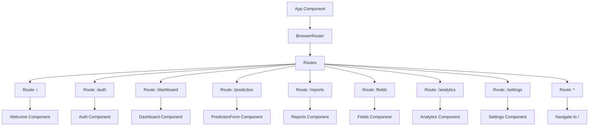
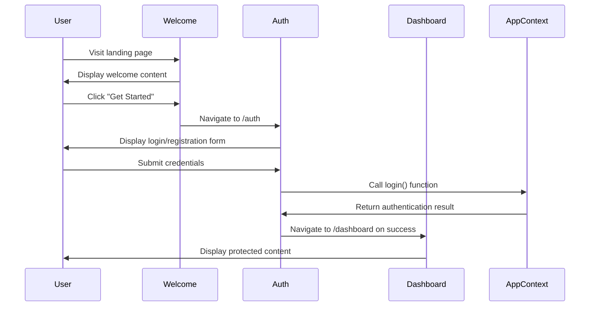
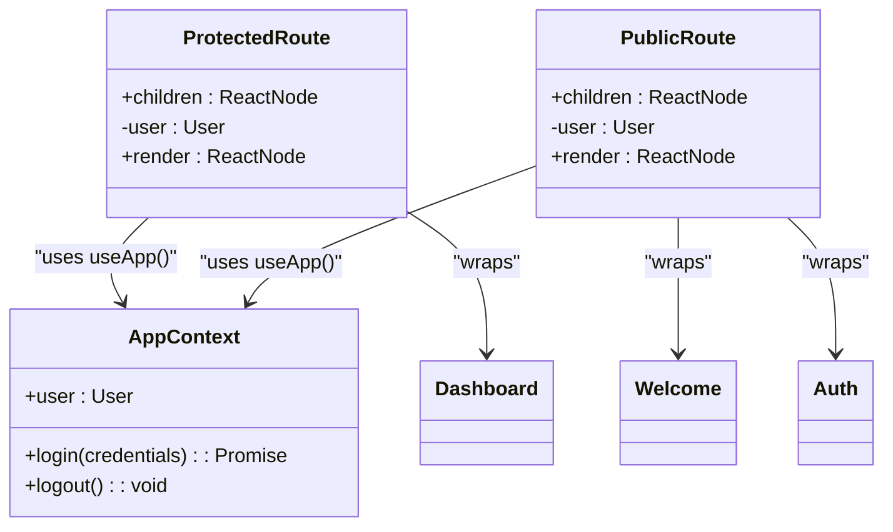
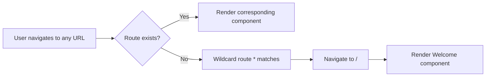
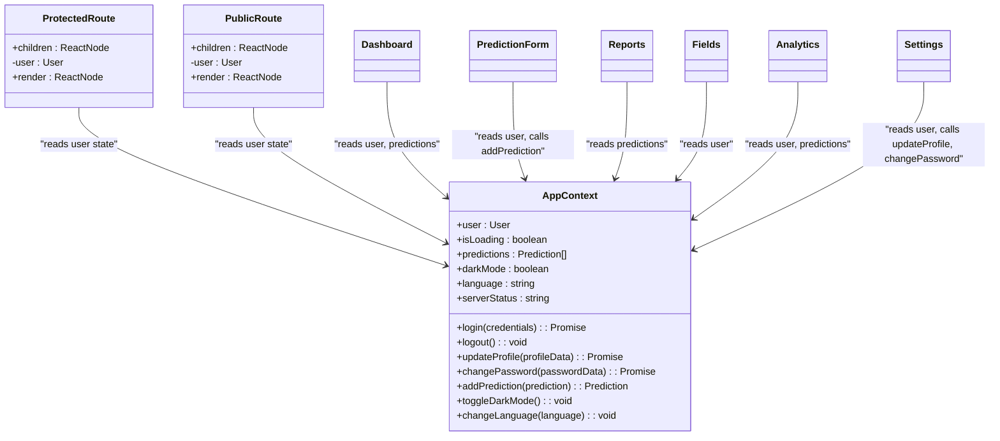
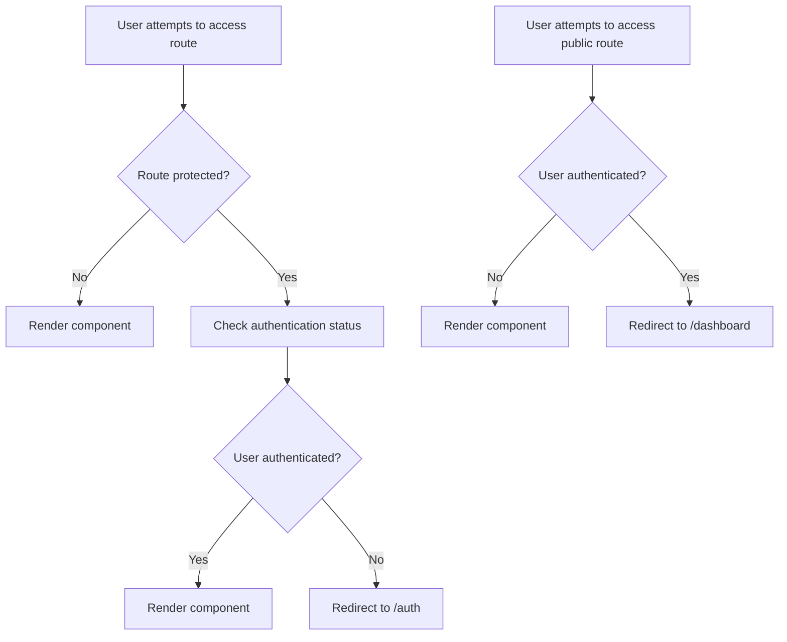
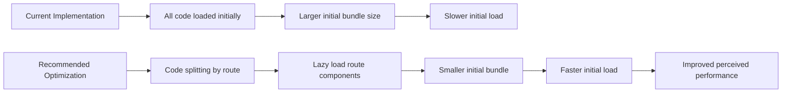

# Routing System

<cite>
**Referenced Files in This Document**   
- [App.jsx](file://HarvestIQ/src/App.jsx)
- [AppContext.jsx](file://HarvestIQ/src/context/AppContext.jsx)
- [Welcome.jsx](file://HarvestIQ/src/components/Welcome.jsx)
- [Auth.jsx](file://HarvestIQ/src/components/Auth.jsx)
- [Dashboard.jsx](file://HarvestIQ/src/components/Dashboard.jsx)
- [PredictionForm.jsx](file://HarvestIQ/src/components/PredictionForm.jsx)
- [Reports.jsx](file://HarvestIQ/src/components/Reports.jsx)
- [Fields.jsx](file://HarvestIQ/src/components/Fields.jsx)
- [Analytics.jsx](file://HarvestIQ/src/components/Analytics.jsx)
- [Settings.jsx](file://HarvestIQ/src/components/Settings.jsx)
</cite>

## Table of Contents
1. [Introduction](#introduction)
2. [Core Routing Implementation](#core-routing-implementation)
3. [Authentication Flow](#authentication-flow)
4. [Protected and Public Routes](#protected-and-public-routes)
5. [Navigation and Programmatic Routing](#navigation-and-programmatic-routing)
6. [Error Handling and Fallback Routes](#error-handling-and-fallback-routes)
7. [Route Parameters and State Management](#route-parameters-and-state-management)
8. [Security Considerations](#security-considerations)
9. [SEO and Performance](#seo-and-performance)
10. [Debugging and Troubleshooting](#debugging-and-troubleshooting)
11. [Architecture Overview](#architecture-overview)

## Introduction

The HarvestIQ application implements a client-side routing system using React Router to manage navigation between different views in the application. The routing system is designed to provide a seamless user experience while enforcing authentication requirements for protected resources. The application follows a single-page application (SPA) architecture where different views are rendered based on the current URL path without full page reloads.

The routing system controls access to eight primary application views: Welcome, Auth, Dashboard, PredictionForm, Reports, Fields, Analytics, and Settings. Each route is associated with a specific component that renders the corresponding view. The routing implementation includes higher-order components (ProtectedRoute and PublicRoute) to control access based on the user's authentication status, ensuring that unauthorized users cannot access protected resources and authenticated users are redirected appropriately.

## Core Routing Implementation

The routing system is implemented in the App.jsx file, which serves as the main entry point for the application's routing configuration. The implementation uses React Router's BrowserRouter, Routes, and Route components to define the application's navigation structure.



**Diagram sources**
- [App.jsx](file://HarvestIQ/src/App.jsx#L1-L50)

**Section sources**
- [App.jsx](file://HarvestIQ/src/App.jsx#L1-L50)

The routing configuration defines nine routes that map URL paths to specific components. The root path ("/") renders the Welcome component, which serves as the landing page for unauthenticated users. The "/auth" path renders the Auth component for user login and registration. The remaining routes correspond to the main application views that are accessible only to authenticated users.

The routing system uses React Router's Navigate component to handle redirects when users attempt to access routes they are not authorized to view. This ensures a consistent user experience by automatically redirecting users to appropriate destinations based on their authentication status.

## Authentication Flow

The routing system implements a comprehensive authentication flow that guides users through the process of accessing the application's protected resources. The flow begins with the Welcome component, which serves as the entry point for new users and provides information about the application's features and benefits.

When a user clicks the "Get Started" button on the Welcome page, they are navigated to the Auth component via programmatic routing using the useNavigate hook. The Auth component provides both login and registration functionality, allowing users to create an account or sign in with existing credentials.



**Diagram sources**
- [Welcome.jsx](file://HarvestIQ/src/components/Welcome.jsx#L1-L277)
- [Auth.jsx](file://HarvestIQ/src/components/Auth.jsx#L1-L440)
- [AppContext.jsx](file://HarvestIQ/src/context/AppContext.jsx#L1-L289)

**Section sources**
- [Welcome.jsx](file://HarvestIQ/src/components/Welcome.jsx#L1-L277)
- [Auth.jsx](file://HarvestIQ/src/components/Auth.jsx#L1-L440)

Upon successful authentication, the AppContext updates the user state and stores the user information in localStorage. The Auth component then navigates the user to the Dashboard component, which serves as the main interface for the application's protected features. This navigation flow ensures that users are properly authenticated before accessing sensitive application data and functionality.

## Protected and Public Routes

The routing system implements access control through two higher-order components: ProtectedRoute and PublicRoute. These components wrap the route elements and determine whether a user can access the associated component based on their authentication status.



**Diagram sources**
- [App.jsx](file://HarvestIQ/src/App.jsx#L15-L23)
- [AppContext.jsx](file://HarvestIQ/src/context/AppContext.jsx#L14-L20)

**Section sources**
- [App.jsx](file://HarvestIQ/src/App.jsx#L15-L23)

The ProtectedRoute component checks if a user is authenticated by accessing the user state from the AppContext via the useApp hook. If a user exists in the context, the protected content is rendered; otherwise, the user is redirected to the authentication page using the Navigate component. This ensures that only authenticated users can access routes such as Dashboard, PredictionForm, Reports, Fields, Analytics, and Settings.

Conversely, the PublicRoute component checks if a user is NOT authenticated. If no user exists in the context, the public content is rendered; otherwise, the user is redirected to the Dashboard. This prevents authenticated users from accessing the Welcome and Auth pages, providing a better user experience by automatically directing them to the main application interface.

The implementation of these higher-order components centralizes the authentication logic, making it easier to maintain and modify access control rules across the application. By wrapping route elements with these components, the routing configuration remains clean and readable while enforcing consistent security policies.

## Navigation and Programmatic Routing

The application implements navigation through both declarative routing (using route definitions) and programmatic routing (using the useNavigate hook). Programmatic routing is used extensively throughout the application to trigger navigation in response to user actions and application events.

```mermaid
flowchart TD
A[Navigation Events] --> B[User Interaction]
A --> C[Authentication State]
A --> D[Form Submission]
B --> E[Welcome: Get Started]
B --> F[Auth: Back to Home]
B --> G[Dashboard: Quick Actions]
B --> H[Reports: Back to Dashboard]
B --> I[Fields: Add Field]
B --> J[Analytics: Back to Dashboard]
B --> K[Settings: Back to Dashboard]
C --> L[Auth Success: Navigate to Dashboard]
C --> M[Auth Failure: Stay on Auth]
C --> N[Logout: Navigate to Welcome]
D --> O[PredictionForm: Submit]
D --> P[PredictionForm: Cancel]
E --> Q[useNavigate('/auth')]
F --> R[useNavigate('/')]
G --> S[useNavigate('/prediction')]
H --> T[useNavigate('/dashboard')]
I --> U[useNavigate('/fields')]
J --> V[useNavigate('/dashboard')]
K --> W[useNavigate('/dashboard')]
L --> X[useNavigate('/dashboard')]
M --> Y[Display Error]
N --> Z[useNavigate('/')]
O --> AA[useNavigate('/dashboard')]
P --> AB[useNavigate('/dashboard')]
```

**Diagram sources**
- [Welcome.jsx](file://HarvestIQ/src/components/Welcome.jsx#L1-L277)
- [Auth.jsx](file://HarvestIQ/src/components/Auth.jsx#L1-L440)
- [Dashboard.jsx](file://HarvestIQ/src/components/Dashboard.jsx#L1-L487)
- [PredictionForm.jsx](file://HarvestIQ/src/components/PredictionForm.jsx#L1-L677)
- [Reports.jsx](file://HarvestIQ/src/components/Reports.jsx#L1-L298)
- [Fields.jsx](file://HarvestIQ/src/components/Fields.jsx#L1-L434)
- [Analytics.jsx](file://HarvestIQ/src/components/Analytics.jsx#L1-L396)
- [Settings.jsx](file://HarvestIQ/src/components/Settings.jsx#L1-L547)

**Section sources**
- [Welcome.jsx](file://HarvestIQ/src/components/Welcome.jsx#L1-L277)
- [Auth.jsx](file://HarvestIQ/src/components/Auth.jsx#L1-L440)
- [Dashboard.jsx](file://HarvestIQ/src/components/Dashboard.jsx#L1-L487)

Programmatic navigation is implemented using React Router's useNavigate hook, which provides a function to navigate to different routes programmatically. This approach is used in various components to handle user interactions such as clicking buttons, submitting forms, and responding to authentication events.

For example, in the Welcome component, clicking the "Get Started" button triggers navigation to the authentication page. In the Auth component, successful login triggers navigation to the Dashboard, while clicking the "Back to Home" button navigates back to the Welcome page. Similarly, various buttons in the Dashboard and other components navigate to specific routes based on user actions.

The use of programmatic routing enhances the user experience by providing smooth transitions between views and enabling navigation in response to dynamic application state changes. It also allows for more complex navigation logic, such as conditional navigation based on form validation results or API responses.

## Error Handling and Fallback Routes

The routing system implements error handling through a wildcard route that catches undefined or invalid URLs and redirects users to the application's root path. This ensures that users are not presented with a blank page or error when navigating to non-existent routes.



**Diagram sources**
- [App.jsx](file://HarvestIQ/src/App.jsx#L1-L50)

**Section sources**
- [App.jsx](file://HarvestIQ/src/App.jsx#L1-L50)

The wildcard route is defined as the last route in the Routes component with the path "*", which matches any URL that hasn't been matched by previous routes. When this route is activated, it renders a Navigate component that redirects the user to the root path ("/").

This approach provides a graceful degradation for invalid URLs, ensuring that users always see meaningful content rather than a 404 error page. The redirection to the Welcome page allows users to start the application flow from the beginning, which is particularly useful for new users who might enter an incorrect URL.

In addition to the wildcard route, the application implements error handling within individual components. For example, the Auth component displays error messages when login or registration fails, and the Reports, Fields, Analytics, and Settings components handle API errors gracefully by displaying appropriate messages and retry options.

## Route Parameters and State Management

The routing system integrates with the application's state management through the AppContext, which provides a centralized store for user authentication state and other application data. While the current implementation does not extensively use route parameters, the foundation is in place for future enhancements.



**Diagram sources**
- [AppContext.jsx](file://HarvestIQ/src/context/AppContext.jsx#L1-L289)
- [App.jsx](file://HarvestIQ/src/App.jsx#L15-L23)

**Section sources**
- [AppContext.jsx](file://HarvestIQ/src/context/AppContext.jsx#L1-L289)

The AppContext stores the user object, which is used by the ProtectedRoute and PublicRoute components to determine access to different views. When a user logs in, their information is stored in the context and persisted in localStorage, ensuring that the authentication state survives page refreshes.

The context also manages other application state such as user preferences (dark mode, language), prediction history, and server status. Components that need to access this state can use the useApp hook to subscribe to changes and re-render when the state updates.

While the current routing implementation does not use URL parameters to pass data between views, the foundation could be extended to support features like pre-filling the PredictionForm with data from a specific field by including a field ID parameter in the URL.

## Security Considerations

The routing system implements several security measures to protect the application's resources and ensure that users can only access content they are authorized to view. The primary security mechanism is the ProtectedRoute component, which prevents unauthenticated users from accessing protected views.



**Diagram sources**
- [App.jsx](file://HarvestIQ/src/App.jsx#L15-L23)

**Section sources**
- [App.jsx](file://HarvestIQ/src/App.jsx#L15-L23)

The security model follows the principle of least privilege, where access to resources is denied by default unless explicitly granted. Protected routes require authentication, while public routes are restricted for authenticated users to prevent confusion and provide a better user experience.

The implementation relies on client-side authentication checks, which should be complemented by server-side authorization in production environments. While client-side checks provide a good user experience, they should not be considered a complete security solution as they can be bypassed by knowledgeable users.

Additional security considerations include:
- Storing authentication tokens securely in localStorage with appropriate naming to avoid conflicts
- Implementing proper logout functionality that clears the user state and authentication tokens
- Using HTTPS in production to protect authentication data in transit
- Validating user input on both client and server sides to prevent injection attacks

## SEO and Performance

The current routing implementation is a client-side rendered single-page application, which presents both opportunities and challenges for SEO and performance. As a SPA, the application loads a single HTML page and dynamically updates content as users navigate, providing a fast and responsive user experience.

For SEO, the application could benefit from implementing server-side rendering (SSR) or static site generation (SSG) to improve indexability by search engines. Currently, search engine crawlers may have difficulty indexing the content of individual views since they are rendered dynamically by JavaScript.

Performance optimizations that could be implemented include:



**Diagram sources**
- [App.jsx](file://HarvestIQ/src/App.jsx#L1-L50)

**Section sources**
- [App.jsx](file://HarvestIQ/src/App.jsx#L1-L50)

Code splitting by route would involve lazy loading route components using React's lazy and Suspense features. This would reduce the initial bundle size by only loading the code for the current route, improving initial load times and overall performance.

Additional performance considerations include:
- Implementing proper caching strategies for API responses
- Optimizing image and asset loading
- Minimizing re-renders through proper state management and memoization
- Using production builds with minification and tree shaking

## Debugging and Troubleshooting

When debugging routing issues in the HarvestIQ application, several common scenarios and solutions should be considered:

**Common Issues:**

1. **Unauthorized Access**: Users can access protected routes without authentication
   - Verify that ProtectedRoute components are properly wrapping all protected routes
   - Check that the useApp hook is correctly accessing the user state from AppContext
   - Ensure that authentication state is properly updated and persisted

2. **Infinite Redirect Loops**: Users are stuck in a redirect cycle
   - Check the logic in ProtectedRoute and PublicRoute components for conflicting conditions
   - Verify that authentication state changes are properly reflected in the UI
   - Ensure that Navigate components are not triggering redirects in render methods

3. **Navigation Not Working**: Programmatic navigation fails to change routes
   - Verify that useNavigate hook is being used within a Router context
   - Check for JavaScript errors that might prevent navigation code from executing
   - Ensure that event handlers are properly bound and not preventing default behavior

4. **State Loss on Navigation**: Application state is lost when navigating between routes
   - Verify that state is properly stored in AppContext or localStorage
   - Check that context providers are properly wrapped around routed components
   - Ensure that state persistence mechanisms are working correctly

**Debugging Tools:**

- Use browser developer tools to inspect React component hierarchy and props
- Monitor network requests to verify API calls related to authentication
- Check console for JavaScript errors that might affect routing behavior