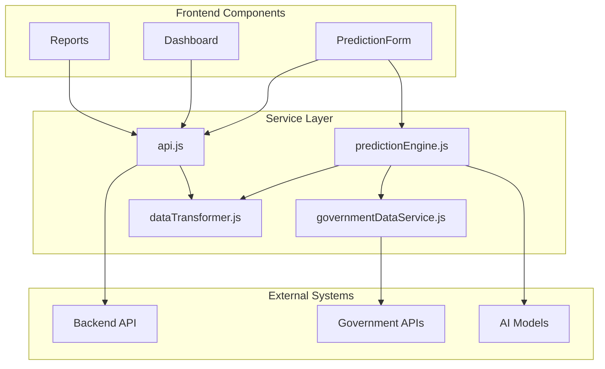
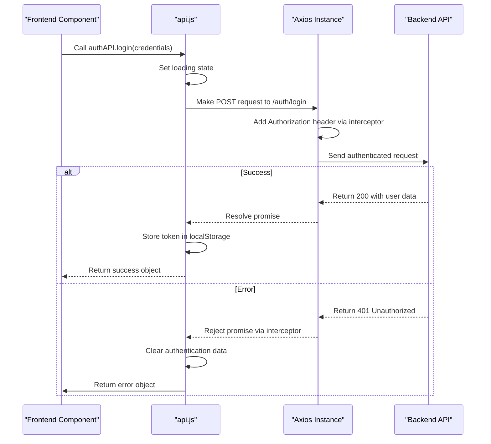
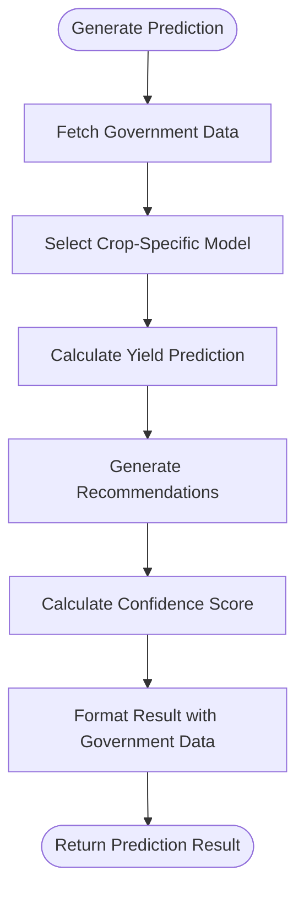
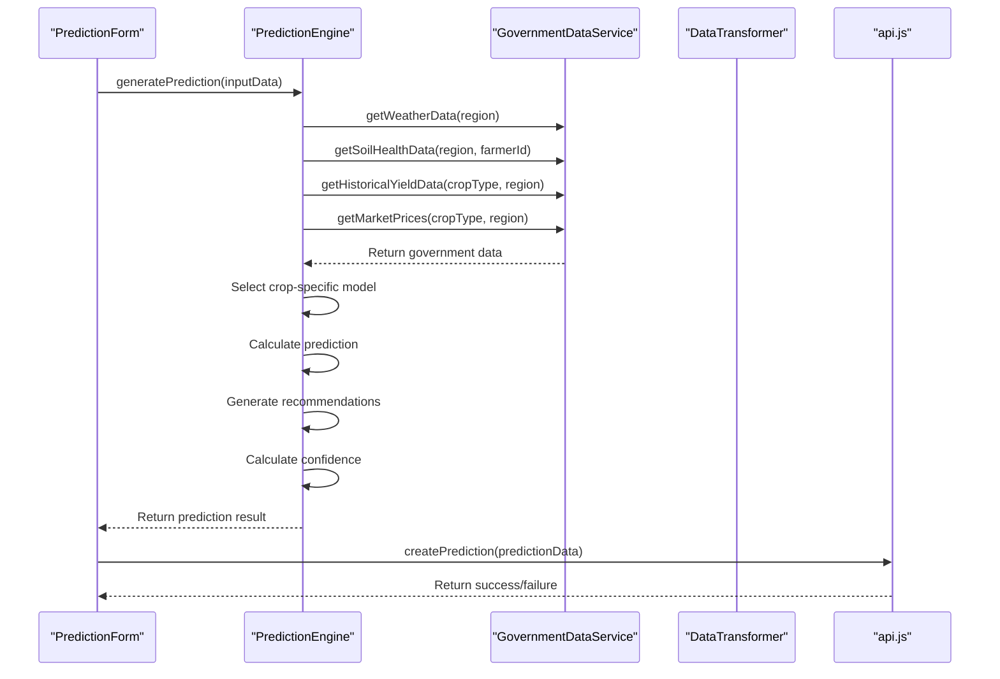

# Service Layer

<cite>
**Referenced Files in This Document**   
- [api.js](file://HarvestIQ/src/services/api.js)
- [predictionEngine.js](file://HarvestIQ/src/services/predictionEngine.js)
- [governmentDataService.js](file://HarvestIQ/src/services/governmentDataService.js)
- [dataTransformer.js](file://HarvestIQ/src/services/dataTransformer.js)
- [PredictionForm.jsx](file://HarvestIQ/src/components/PredictionForm.jsx)
- [AppContext.jsx](file://HarvestIQ/src/context/AppContext.jsx)
</cite>

## Table of Contents
1. [Introduction](#introduction)
2. [Service Layer Architecture](#service-layer-architecture)
3. [API Service Implementation](#api-service-implementation)
4. [Prediction Engine Service](#prediction-engine-service)
5. [Government Data Service](#government-data-service)
6. [Data Transformer Service](#data-transformer-service)
7. [Service Integration and Usage](#service-integration-and-usage)
8. [Error Handling and Security](#error-handling-and-security)
9. [Caching and Optimization](#caching-and-optimization)
10. [Conclusion](#conclusion)

## Introduction

The service layer in HarvestIQ implements a robust separation of concerns through dedicated modules that handle API communication, AI predictions, and external data integration. This architecture enables the frontend to interact with various backend systems and external data sources through well-defined service interfaces. The service layer abstracts complex communication patterns, data transformations, and error handling, providing a clean and consistent API for components to consume. This documentation details the implementation of each service module, their interactions, and best practices for usage throughout the application.

## Service Layer Architecture

The service layer in HarvestIQ follows a modular architecture with distinct services responsible for specific domains of functionality. This separation of concerns enhances maintainability, testability, and scalability of the application. The core services include api.js for handling authenticated requests to the backend REST API, predictionEngine.js for processing AI model inputs and formatting results, governmentDataService.js for integrating external agricultural data, and dataTransformer.js for standardizing data formats between different services.

The architecture promotes loose coupling between components by providing well-defined interfaces for data access and business logic. Each service encapsulates its domain-specific functionality while collaborating with other services through clearly defined contracts. This approach allows for independent development and testing of service modules, as well as easier replacement or enhancement of individual services without affecting the broader application.

**Diagram sources**
- [api.js](file://HarvestIQ/src/services/api.js)
- [predictionEngine.js](file://HarvestIQ/src/services/predictionEngine.js)
- [governmentDataService.js](file://HarvestIQ/src/services/governmentDataService.js)
- [dataTransformer.js](file://HarvestIQ/src/services/dataTransformer.js)

**Section sources**
- [api.js](file://HarvestIQ/src/services/api.js)
- [predictionEngine.js](file://HarvestIQ/src/services/predictionEngine.js)
- [governmentDataService.js](file://HarvestIQ/src/services/governmentDataService.js)
- [dataTransformer.js](file://HarvestIQ/src/services/dataTransformer.js)

## API Service Implementation

The api.js module implements a comprehensive service for handling authenticated requests to the backend REST API using Axios. It creates an Axios instance with base configuration including the API endpoint, timeout settings, and default headers. The service employs request and response interceptors to automatically handle authentication and error scenarios, providing a seamless experience for components consuming the API.

The request interceptor automatically adds the authentication token from localStorage to each request, ensuring that all API calls are properly authenticated without requiring components to manage authentication state. The response interceptor handles authentication errors by detecting 401 responses, clearing local authentication data, and redirecting users to the authentication page when necessary. This centralized error handling prevents unauthorized access attempts and provides a consistent user experience across the application.

The service exports multiple API modules organized by domain, including authAPI for authentication operations, predictionAPI for prediction management, fieldAPI for field management, and aiModelAPI for AI model operations. Each API function follows a consistent pattern of try-catch error handling, returning standardized response objects with success status, data, and error information. This pattern simplifies error handling in components and provides a uniform interface for API interactions.

**Diagram sources**
- [api.js](file://HarvestIQ/src/services/api.js)

**Section sources**
- [api.js](file://HarvestIQ/src/services/api.js)

## Prediction Engine Service

The predictionEngine.js module implements a sophisticated service for processing AI model inputs and generating crop yield predictions. It integrates government data with machine learning algorithms to provide comprehensive agricultural insights. The service uses a class-based approach with the PredictionEngine class containing crop-specific yield models for wheat, rice, sugarcane, cotton, and maize, as well as a generic model for other crops.

The prediction process begins by fetching relevant government data including weather, soil health, historical yield, and market prices through the governmentDataService. The engine then selects the appropriate crop-specific model based on the input data and calculates the prediction by combining user inputs with government data. Each crop model applies domain-specific factors such as optimal temperature ranges, rainfall requirements, and soil conditions to generate accurate yield estimates.

In addition to yield predictions, the engine generates comprehensive recommendations based on the input data and prediction results. These recommendations address weather-based, soil-based, and yield optimization opportunities, providing actionable insights for farmers. The service also calculates a confidence score based on data completeness and availability of government data, giving users an indication of prediction reliability.

**Diagram sources**
- [predictionEngine.js](file://HarvestIQ/src/services/predictionEngine.js)

**Section sources**
- [predictionEngine.js](file://HarvestIQ/src/services/predictionEngine.js)

## Government Data Service

The governmentDataService.js module provides integration with various Indian government agricultural APIs to fetch weather, soil health, historical yield, and market price data. The service is implemented as a class with methods for each data type, allowing for organized and maintainable code. It includes mock implementations for development purposes, with plans to replace them with actual API calls in production.

The service integrates with multiple government data sources including the India Meteorological Department (IMD) for weather data, the Government Open Data Platform for agricultural data, the Soil Health Card API for soil health information, and the Agricultural Marketing Division for market prices. Each method handles API calls with appropriate error handling and fallback mechanisms to ensure the application remains functional even when external services are unavailable.

The service includes helper methods for generating forecasts, creating soil recommendations, and calculating base yields and prices for different crops. These methods enhance the raw data with additional insights and context, providing more valuable information to the prediction engine. The service also implements simulated API delays to mimic real-world network conditions during development.

**Section sources**
- [governmentDataService.js](file://HarvestIQ/src/services/governmentDataService.js)

## Data Transformer Service

The dataTransformer.js module implements a critical service for standardizing data formats between different services in the application. It provides functions to transform data between frontend, backend, and AI model formats, ensuring compatibility across the system. The service exports two primary functions: toPythonFormat for transforming frontend input data to Python AI model format, and fromPythonFormat for transforming Python AI model responses to frontend format.

The toPythonFormat function transforms user input data into a structured format suitable for the Python AI models, including model metadata, user context, agricultural data, soil parameters, and weather parameters. This transformation ensures that the AI models receive data in the expected format, with proper type conversion and field mapping. The function also handles optional fields and provides default values where appropriate.

The fromPythonFormat function transforms the response from Python AI models into a simplified format for use in the frontend. It extracts relevant prediction results, confidence scores, and other key information, making it easier for components to consume the data. This transformation abstracts the complexity of the AI model response format, providing a clean and consistent interface for components.

**Section sources**
- [dataTransformer.js](file://HarvestIQ/src/services/dataTransformer.js)

## Service Integration and Usage

The services in HarvestIQ are integrated through the PredictionForm component, which demonstrates how multiple services work together to provide a comprehensive prediction experience. The component uses the predictionEngine service to generate predictions, which in turn utilizes the governmentDataService to fetch external data and the dataTransformer to format data for AI models.

When a user submits the prediction form, the component collects input data and passes it to the predictionEngine.generatePrediction method. This method orchestrates the interaction between services, fetching government data, selecting the appropriate prediction model, and generating recommendations. The result is then formatted and stored in the application context for access by other components.

The AppContext provides a centralized state management solution that coordinates service usage across the application. It handles authentication through the api.js service, stores user data in localStorage, and manages prediction history. This context allows components to access services and data without direct dependencies, promoting loose coupling and easier testing.

**Diagram sources**
- [PredictionForm.jsx](file://HarvestIQ/src/components/PredictionForm.jsx)
- [predictionEngine.js](file://HarvestIQ/src/services/predictionEngine.js)
- [governmentDataService.js](file://HarvestIQ/src/services/governmentDataService.js)
- [dataTransformer.js](file://HarvestIQ/src/services/dataTransformer.js)
- [api.js](file://HarvestIQ/src/services/api.js)

**Section sources**
- [PredictionForm.jsx](file://HarvestIQ/src/components/PredictionForm.jsx)
- [AppContext.jsx](file://HarvestIQ/src/context/AppContext.jsx)

## Error Handling and Security

The service layer implements comprehensive error handling and security measures to ensure reliable and secure operation. The api.js service uses Axios interceptors to handle authentication errors globally, automatically logging out users and redirecting to the authentication page when tokens expire or become invalid. This prevents unauthorized access attempts and provides a consistent user experience.

Each service method implements try-catch blocks to handle potential errors, returning standardized error objects that components can easily interpret. The governmentDataService includes fallback mechanisms for when external APIs are unavailable, ensuring the application remains functional even with partial data. The predictionEngine gracefully handles errors during prediction generation, providing meaningful error messages to users.

Security considerations include proper handling of authentication tokens in localStorage, with automatic removal when sessions expire. The service layer avoids exposing sensitive information in error messages and implements input validation to prevent injection attacks. The use of HTTPS for all API communications ensures data privacy and integrity during transmission.

**Section sources**
- [api.js](file://HarvestIQ/src/services/api.js)
- [predictionEngine.js](file://HarvestIQ/src/services/predictionEngine.js)
- [governmentDataService.js](file://HarvestIQ/src/services/governmentDataService.js)

## Caching and Optimization

The service layer incorporates several caching and optimization strategies to enhance performance and user experience. The api.js service could be extended to implement response caching for frequently accessed data such as AI model configurations and user profiles, reducing redundant API calls. The governmentDataService includes simulated API delays to represent real-world network conditions during development.

The predictionEngine optimizes performance by using Promise.all to fetch multiple government data sources concurrently, minimizing total request time. This parallelization ensures that the prediction process completes as quickly as possible, even when integrating data from multiple external sources. The service also implements a generic yield model as a fallback when specific crop models are not available, ensuring predictions can be generated for all crop types.

Future optimization opportunities include implementing client-side caching of government data to reduce API calls, adding request debouncing for search operations, and implementing pagination for large datasets. The service architecture supports these enhancements through its modular design, allowing optimizations to be added without affecting the broader application.

**Section sources**
- [predictionEngine.js](file://HarvestIQ/src/services/predictionEngine.js)
- [governmentDataService.js](file://HarvestIQ/src/services/governmentDataService.js)

## Conclusion

The service layer in HarvestIQ demonstrates a well-architected approach to handling API communication, AI predictions, and external data integration. Through the separation of concerns implemented in dedicated service modules, the application achieves high maintainability, testability, and scalability. The api.js service provides a robust foundation for authenticated API interactions, while the predictionEngine.js and governmentDataService.js modules enable sophisticated agricultural insights through AI and government data integration.

The dataTransformer.js service plays a crucial role in ensuring compatibility between different system components by standardizing data formats. Together, these services create a cohesive ecosystem that empowers farmers with actionable insights for crop yield optimization. The implementation of error handling, security measures, and optimization strategies further enhances the reliability and performance of the application.

This service layer architecture provides a solid foundation for future enhancements, including the integration of additional AI models, expansion of government data sources, and implementation of advanced caching strategies. By adhering to principles of separation of concerns and modular design, the service layer ensures that HarvestIQ can continue to evolve and meet the changing needs of agricultural professionals.