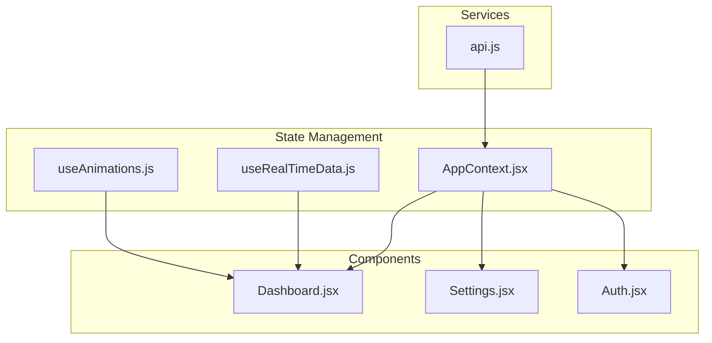
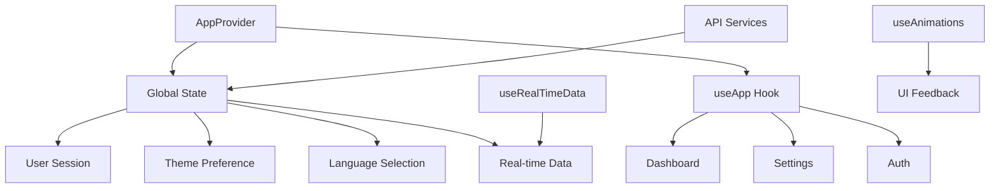
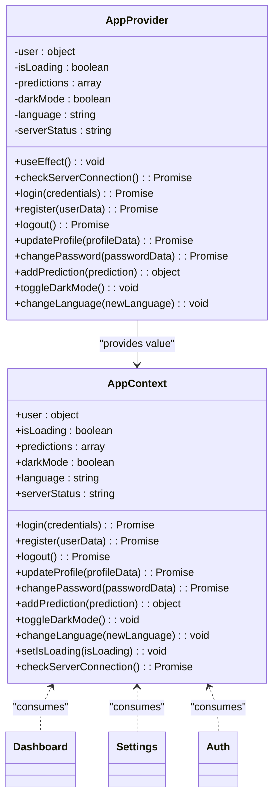
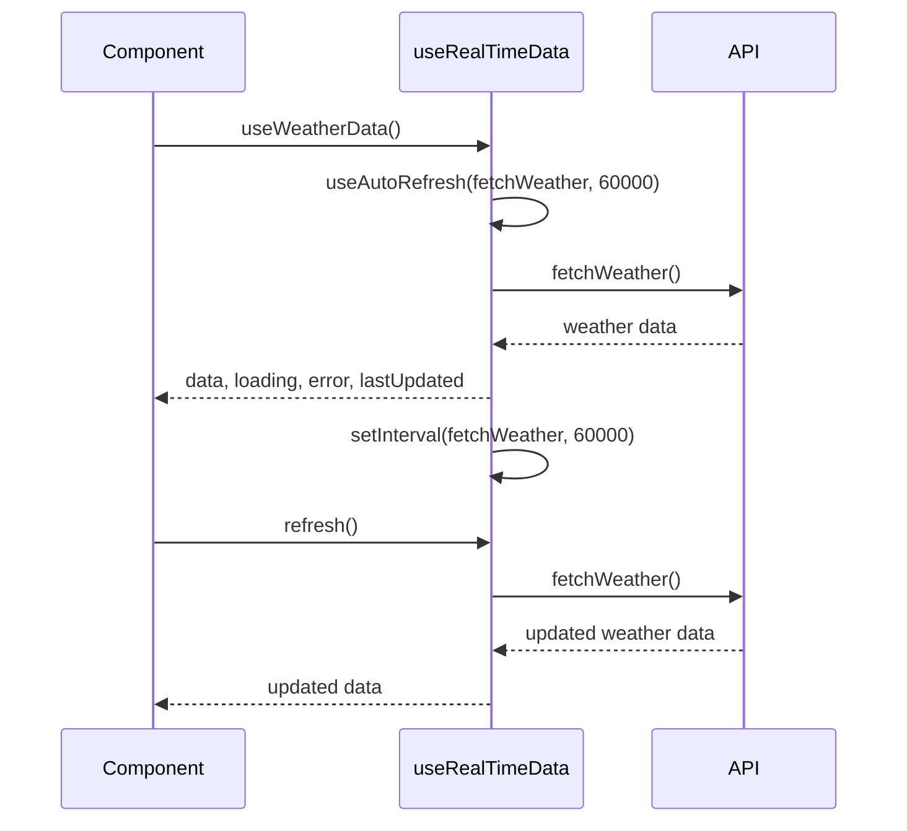
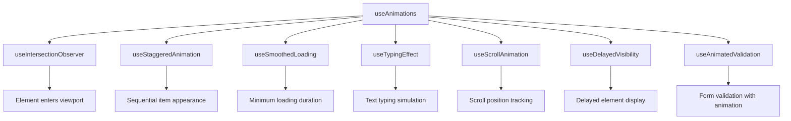
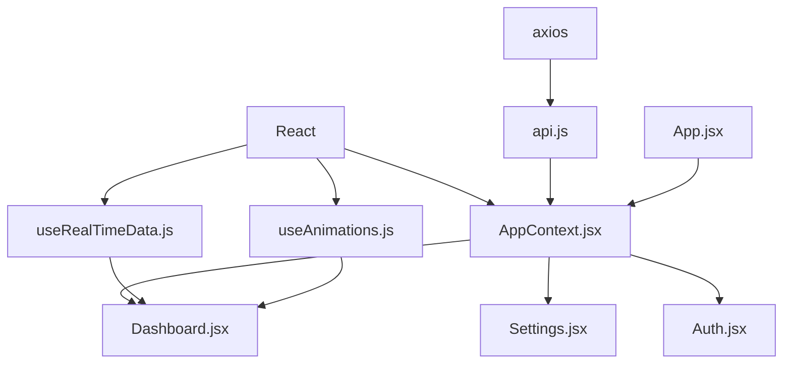

# State Management

<cite>
**Referenced Files in This Document**   
- [AppContext.jsx](file://HarvestIQ/src/context/AppContext.jsx)
- [useRealTimeData.js](file://HarvestIQ/src/hooks/useRealTimeData.js)
- [useAnimations.js](file://HarvestIQ/src/hooks/useAnimations.js)
- [api.js](file://HarvestIQ/src/services/api.js)
- [Settings.jsx](file://HarvestIQ/src/components/Settings.jsx)
- [Dashboard.jsx](file://HarvestIQ/src/components/Dashboard.jsx)
- [Auth.jsx](file://HarvestIQ/src/components/Auth.jsx)
- [App.jsx](file://HarvestIQ/src/App.jsx)
</cite>

## Table of Contents
1. [Introduction](#introduction)
2. [Project Structure](#project-structure)
3. [Core Components](#core-components)
4. [Architecture Overview](#architecture-overview)
5. [Detailed Component Analysis](#detailed-component-analysis)
6. [Dependency Analysis](#dependency-analysis)
7. [Performance Considerations](#performance-considerations)
8. [Troubleshooting Guide](#troubleshooting-guide)
9. [Conclusion](#conclusion)

## Introduction
This document provides comprehensive documentation for the state management system in HarvestIQ's frontend application. The system is built around React Context API, specifically through the AppContext.jsx implementation, which manages global application state including user session, theme preference (dark/light), language selection, and real-time data updates. The documentation details the context provider pattern, consumer usage across components, custom hooks for real-time data streaming and UI animations, state persistence mechanisms, data flow from API responses to context updates, and performance optimization techniques. The system enables a seamless user experience with responsive UI feedback and real-time agricultural data updates while maintaining scalability and maintainability.

## Project Structure
The HarvestIQ frontend application follows a well-organized structure with clear separation of concerns. The state management system is primarily located in the `src` directory, with core components organized into logical folders. The `context` folder contains AppContext.jsx, which serves as the central state management hub. The `hooks` folder houses custom hooks including useRealTimeData.js for streaming agricultural data and useAnimations.js for UI feedback states. The `components` folder contains various UI components that consume the global state, while the `services` folder manages API interactions that update the state. This structure enables maintainability and scalability, allowing developers to easily locate and modify state-related functionality.

**Diagram sources**
- [AppContext.jsx](file://HarvestIQ/src/context/AppContext.jsx)
- [useRealTimeData.js](file://HarvestIQ/src/hooks/useRealTimeData.js)
- [useAnimations.js](file://HarvestIQ/src/hooks/useAnimations.js)
- [Dashboard.jsx](file://HarvestIQ/src/components/Dashboard.jsx)
- [Settings.jsx](file://HarvestIQ/src/components/Settings.jsx)
- [Auth.jsx](file://HarvestIQ/src/components/Auth.jsx)
- [api.js](file://HarvestIQ/src/services/api.js)

**Section sources**
- [AppContext.jsx](file://HarvestIQ/src/context/AppContext.jsx)
- [useRealTimeData.js](file://HarvestIQ/src/hooks/useRealTimeData.js)
- [useAnimations.js](file://HarvestIQ/src/hooks/useAnimations.js)

## Core Components
The state management system in HarvestIQ consists of several core components that work together to provide a robust and scalable solution. The AppContext.jsx file implements the React Context API to manage global application state, including user session, theme preference, language selection, and real-time data updates. The useRealTimeData.js custom hook provides functionality for auto-refreshing data with configurable intervals, enabling real-time weather data, user statistics, activity feeds, market prices, and system health monitoring. The useAnimations.js hook enhances user experience with intersection observer animations, staggered animations, smooth loading states, typing effects, and scroll-triggered animations. These components work in concert to create a responsive and engaging user interface that reflects real-time agricultural data and provides immediate feedback on user interactions.

**Section sources**
- [AppContext.jsx](file://HarvestIQ/src/context/AppContext.jsx#L1-L289)
- [useRealTimeData.js](file://HarvestIQ/src/hooks/useRealTimeData.js#L1-L270)
- [useAnimations.js](file://HarvestIQ/src/hooks/useAnimations.js#L1-L152)

## Architecture Overview
The state management architecture in HarvestIQ follows a centralized pattern using React Context API, with AppContext.jsx serving as the single source of truth for global application state. The architecture implements a provider-consumer pattern where the AppProvider component wraps the entire application, making the global state available to all child components through the useApp custom hook. This approach eliminates the need for prop drilling and enables efficient state management across deeply nested component hierarchies. The architecture also incorporates custom hooks for specialized functionality, such as real-time data streaming and UI animations, which are consumed by various components throughout the application. The system integrates with API services to fetch and update data, ensuring that the global state remains synchronized with the backend.

**Diagram sources**
- [AppContext.jsx](file://HarvestIQ/src/context/AppContext.jsx#L22-L289)
- [useRealTimeData.js](file://HarvestIQ/src/hooks/useRealTimeData.js#L1-L270)
- [useAnimations.js](file://HarvestIQ/src/hooks/useAnimations.js#L1-L152)
- [Dashboard.jsx](file://HarvestIQ/src/components/Dashboard.jsx)
- [Settings.jsx](file://HarvestIQ/src/components/Settings.jsx)
- [Auth.jsx](file://HarvestIQ/src/components/Auth.jsx)
- [api.js](file://HarvestIQ/src/services/api.js)

## Detailed Component Analysis

### AppContext Analysis
The AppContext.jsx component implements the React Context API to manage global application state in HarvestIQ. It uses the createContext function to create a context object that can be consumed by any component in the application. The AppProvider component initializes the global state with user session, loading status, predictions, dark mode preference, language selection, and server status. It also provides functions for authentication (login, register, logout), profile management (updateProfile, changePassword), prediction management (addPrediction), and settings (toggleDarkMode, changeLanguage). The component uses useEffect hooks to load user data from localStorage on app start and to save user data to localStorage when it changes, ensuring state persistence across sessions.

**Diagram sources**
- [AppContext.jsx](file://HarvestIQ/src/context/AppContext.jsx#L12-L289)

**Section sources**
- [AppContext.jsx](file://HarvestIQ/src/context/AppContext.jsx#L1-L289)

### useRealTimeData Analysis
The useRealTimeData.js custom hook provides functionality for auto-refreshing data with configurable intervals, enabling real-time updates for various aspects of the application. It exports several specialized hooks including useWeatherData, useUserStats, useActivityFeed, useMarketPrices, and useSystemHealth, each tailored to a specific type of real-time data. The core useAutoRefresh hook handles the auto-refresh logic, using setInterval to periodically fetch data and update the component state. It also handles visibility changes, pausing auto-refresh when the tab is not visible and resuming when it becomes visible again. This optimization reduces unnecessary network requests and improves performance. The hook returns data, loading status, error information, last updated timestamp, and functions to manually refresh or control auto-refresh.

**Diagram sources**
- [useRealTimeData.js](file://HarvestIQ/src/hooks/useRealTimeData.js#L1-L270)

**Section sources**
- [useRealTimeData.js](file://HarvestIQ/src/hooks/useRealTimeData.js#L1-L270)

### useAnimations Analysis
The useAnimations.js custom hook provides a collection of utility functions for enhancing user experience with various animations and transitions. It includes hooks for intersection observer animations, which trigger when elements come into view; staggered animations, which apply delayed visibility to lists of items; smooth loading states, which ensure loading indicators are visible for a minimum duration; typing effects, which simulate text being typed; scroll-triggered animations, which respond to scroll position; and delayed visibility, which shows elements after a specified delay. These hooks are designed to be reusable across components, promoting consistency in the user interface. The animations are implemented using React's useEffect and useRef hooks, ensuring proper cleanup and avoiding memory leaks.

**Diagram sources**
- [useAnimations.js](file://HarvestIQ/src/hooks/useAnimations.js#L1-L152)

**Section sources**
- [useAnimations.js](file://HarvestIQ/src/hooks/useAnimations.js#L1-L152)

## Dependency Analysis
The state management system in HarvestIQ has a well-defined dependency structure that ensures modularity and maintainability. The AppContext.jsx component depends on React's built-in hooks (useState, useEffect, useContext) and the axios library for API interactions through the api.js service. The useRealTimeData.js hook depends on React's hooks and the AppContext for accessing user information. The useAnimations.js hook depends only on React's core functionality. Components such as Dashboard.jsx, Settings.jsx, and Auth.jsx depend on the AppContext through the useApp hook, consuming the global state and provided functions. The App.jsx file serves as the entry point, wrapping the entire application with the AppProvider to make the global state available to all components.

**Diagram sources**
- [AppContext.jsx](file://HarvestIQ/src/context/AppContext.jsx)
- [useRealTimeData.js](file://HarvestIQ/src/hooks/useRealTimeData.js)
- [useAnimations.js](file://HarvestIQ/src/hooks/useAnimations.js)
- [api.js](file://HarvestIQ/src/services/api.js)
- [Dashboard.jsx](file://HarvestIQ/src/components/Dashboard.jsx)
- [Settings.jsx](file://HarvestIQ/src/components/Settings.jsx)
- [Auth.jsx](file://HarvestIQ/src/components/Auth.jsx)
- [App.jsx](file://HarvestIQ/src/App.jsx)

**Section sources**
- [AppContext.jsx](file://HarvestIQ/src/context/AppContext.jsx)
- [useRealTimeData.js](file://HarvestIQ/src/hooks/useRealTimeData.js)
- [useAnimations.js](file://HarvestIQ/src/hooks/useAnimations.js)
- [api.js](file://HarvestIQ/src/services/api.js)

## Performance Considerations
The state management system in HarvestIQ incorporates several performance optimization techniques to ensure a responsive and efficient user experience. The use of React Context API is optimized by memoizing the context value to prevent unnecessary re-renders of consumer components. The useRealTimeData.js hook implements auto-refresh with configurable intervals and visibility-based pausing to reduce unnecessary network requests. The system uses localStorage for state persistence, reducing the need for repeated API calls on application startup. The useAnimations.js hook provides optimized animation utilities that minimize re-renders and improve perceived performance. Additionally, the system implements error boundaries to prevent crashes from propagating and affecting the entire application. These optimizations ensure that the application remains responsive even when handling large amounts of real-time agricultural data.

**Section sources**
- [AppContext.jsx](file://HarvestIQ/src/context/AppContext.jsx)
- [useRealTimeData.js](file://HarvestIQ/src/hooks/useRealTimeData.js)
- [useAnimations.js](file://HarvestIQ/src/hooks/useAnimations.js)

## Troubleshooting Guide
Common issues with the state management system in HarvestIQ typically relate to state persistence, real-time data updates, and component re-renders. If user preferences are not persisting across sessions, verify that localStorage is properly configured and that the useEffect hooks in AppContext.jsx are correctly saving and loading data. If real-time data is not updating as expected, check the auto-refresh intervals in useRealTimeData.js and ensure that the visibility change event listeners are functioning correctly. For performance issues related to unnecessary re-renders, verify that the context value is properly memoized and that components are only consuming the state they need. If authentication state is not synchronizing across components, ensure that the AppProvider is properly wrapping the entire application and that the useApp hook is being used correctly. Debugging can be facilitated by the console.log statements in AppContext.jsx that track localStorage operations and user state changes.

**Section sources**
- [AppContext.jsx](file://HarvestIQ/src/context/AppContext.jsx)
- [useRealTimeData.js](file://HarvestIQ/src/hooks/useRealTimeData.js)

## Conclusion
The state management system in HarvestIQ's frontend application provides a robust and scalable solution for managing global application state. By leveraging React Context API through AppContext.jsx, the system enables efficient state management across the application without the complexity of prop drilling. The integration of custom hooks for real-time data streaming and UI animations enhances the user experience with responsive feedback and up-to-date agricultural information. State persistence through localStorage ensures that user preferences are maintained across sessions, while performance optimizations prevent unnecessary re-renders and network requests. The system's modular architecture and clear dependency structure make it maintainable and extensible, providing a solid foundation for future enhancements. Overall, the state management system effectively supports HarvestIQ's mission of providing intelligent agricultural insights to farmers.