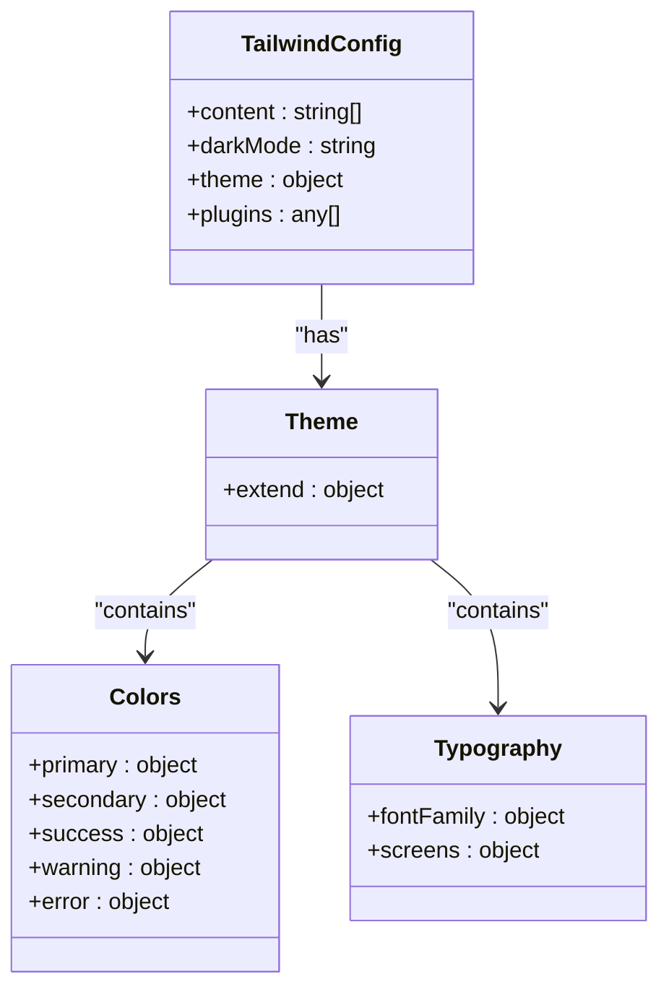
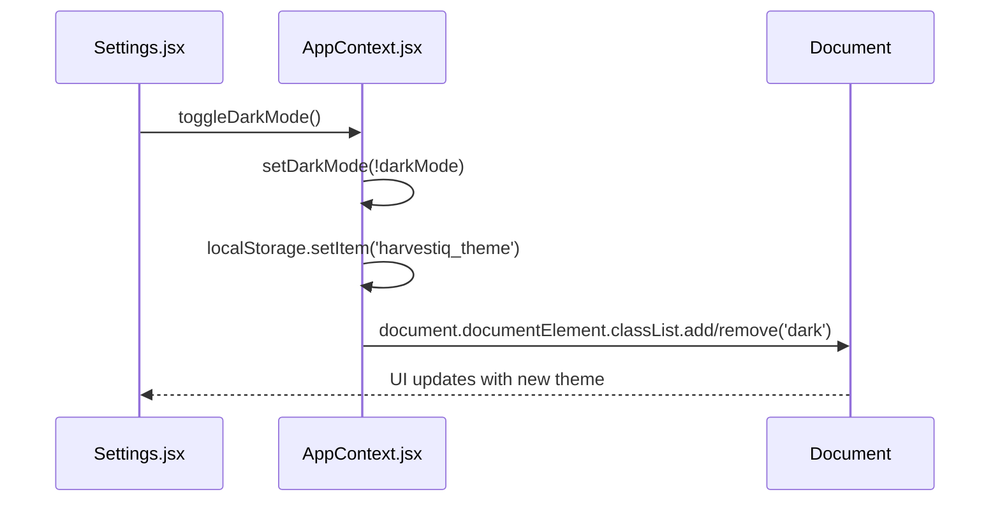
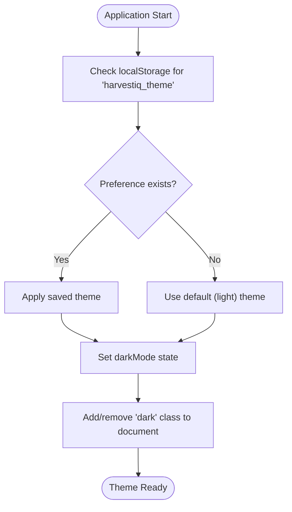
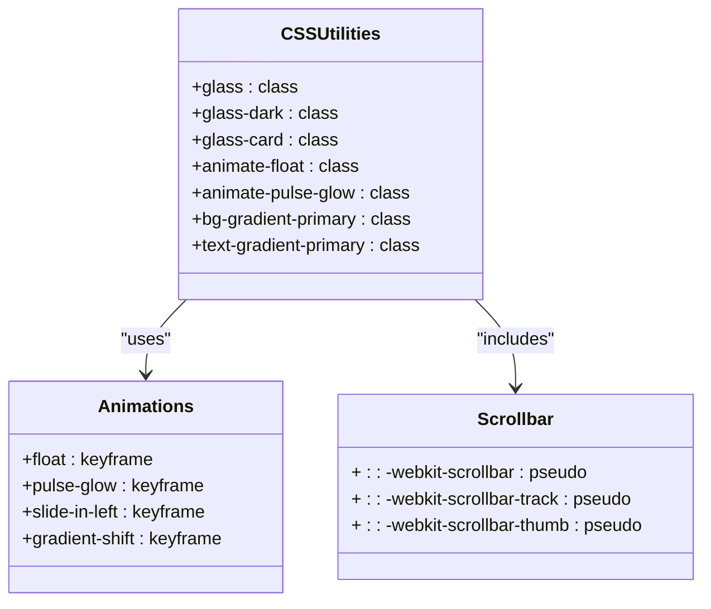
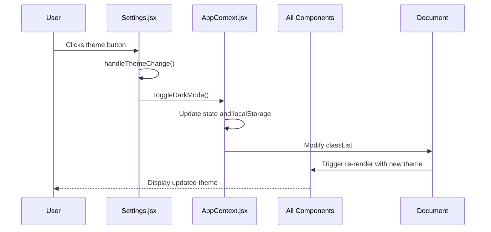
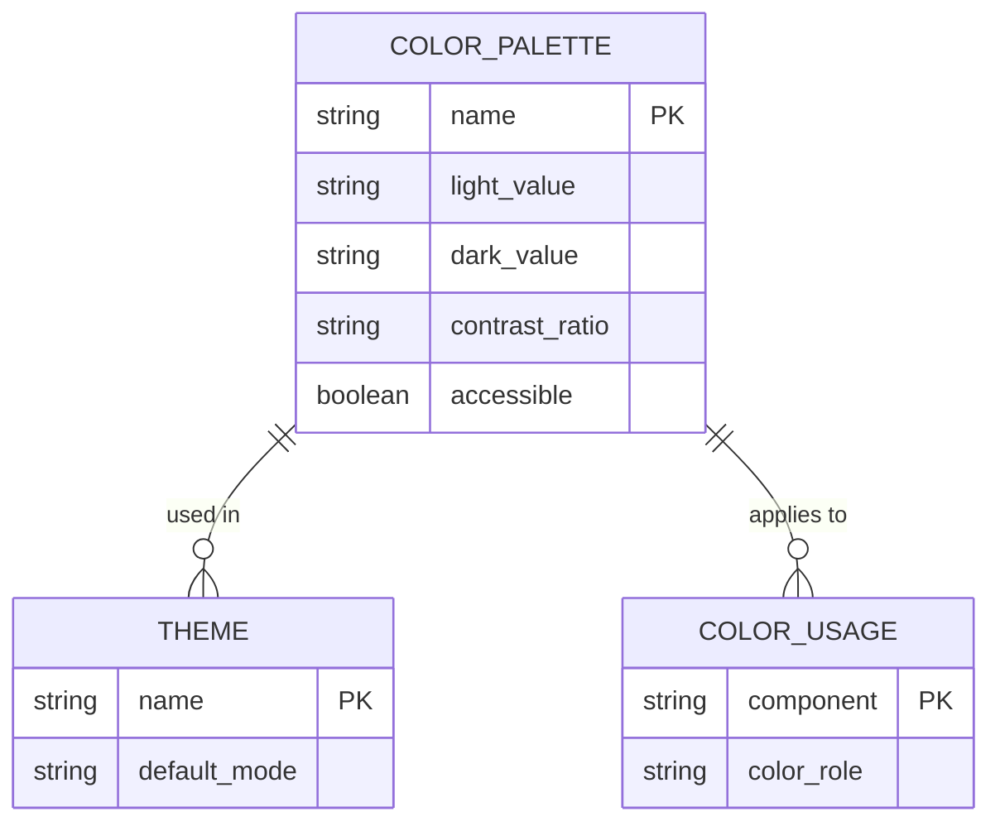

# Theming System

<cite>
**Referenced Files in This Document**   
- [tailwind.config.js](file://HarvestIQ/tailwind.config.js)
- [AppContext.jsx](file://HarvestIQ/src/context/AppContext.jsx)
- [Settings.jsx](file://HarvestIQ/src/components/Settings.jsx)
- [index.css](file://HarvestIQ/src/index.css)
- [App.jsx](file://HarvestIQ/src/App.jsx)
- [main.jsx](file://HarvestIQ/src/main.jsx)
</cite>

## Table of Contents
1. [Introduction](#introduction)
2. [Theme Configuration](#theme-configuration)
3. [Theme State Management](#theme-state-management)
4. [Theme Persistence](#theme-persistence)
5. [CSS Variables and Utility Classes](#css-variables-and-utility-classes)
6. [Theme Toggle Implementation](#theme-toggle-implementation)
7. [System Preference Integration](#system-preference-integration)
8. [Color Palette and Accessibility](#color-palette-and-accessibility)
9. [Extending the Theme](#extending-the-theme)
10. [Visual Consistency Guidelines](#visual-consistency-guidelines)
11. [Theme Transition Testing](#theme-transition-testing)
12. [Performance Considerations](#performance-considerations)
13. [Best Practices](#best-practices)

## Introduction

The HarvestIQ theming system provides a robust dark/light theme toggle functionality that enhances user experience by allowing personalized visual preferences. This documentation details the implementation of the theming system using Tailwind CSS, React context for state management, and browser storage for persistence. The system is designed to be accessible, performant, and extensible, ensuring visual consistency across all components while complying with accessibility standards.

The theming system is implemented through a combination of Tailwind CSS configuration, React context state management, and custom CSS utilities. It allows users to switch between light and dark modes either through the Settings interface or by respecting system preferences. The theme state is persisted across sessions using localStorage, ensuring user preferences are maintained between visits.

**Section sources**
- [tailwind.config.js](file://HarvestIQ/tailwind.config.js#L1-L187)
- [AppContext.jsx](file://HarvestIQ/src/context/AppContext.jsx#L1-L290)

## Theme Configuration

The theming system is configured through Tailwind CSS's `tailwind.config.js` file, which defines the color palette, typography, and other design tokens for both light and dark themes. The configuration uses the 'class' strategy for dark mode, which adds a 'dark' class to the document element when dark mode is active.

The configuration extends the default theme with custom colors, fonts, spacing, and animations. The primary color palette is based on green tones that reflect the agricultural nature of the application, with primary colors ranging from #f0fdf4 (50) to #052e16 (950). Secondary colors provide neutral backgrounds and text colors that work well in both light and dark modes.

**Diagram sources**
- [tailwind.config.js](file://HarvestIQ/tailwind.config.js#L1-L187)

**Section sources**
- [tailwind.config.js](file://HarvestIQ/tailwind.config.js#L1-L187)

## Theme State Management

Theme state is managed using React Context in the `AppContext.jsx` file. The context provides a centralized state management solution that allows any component in the application to access and modify the theme state. The `darkMode` state variable tracks the current theme, while the `toggleDarkMode` function handles the logic for switching between themes.

The context uses the `useState` hook to manage the dark mode state, initializing it to `false` (light mode) by default. When the theme is toggled, the function updates the state, applies the appropriate CSS class to the document element, and persists the preference to localStorage. This ensures that the theme change is reflected immediately across the entire application.

**Diagram sources**
- [AppContext.jsx](file://HarvestIQ/src/context/AppContext.jsx#L26-L205)
- [Settings.jsx](file://HarvestIQ/src/components/Settings.jsx#L23-L545)

**Section sources**
- [AppContext.jsx](file://HarvestIQ/src/context/AppContext.jsx#L26-L205)

## Theme Persistence

The theming system persists user preferences using the browser's localStorage API. When a user changes their theme preference, the selection is stored in localStorage with the key 'harvestiq_theme'. This allows the application to restore the user's preferred theme on subsequent visits.

During application initialization, the `AppProvider` component checks localStorage for a saved theme preference. If a preference is found, it applies the corresponding theme by setting the `darkMode` state and adding the 'dark' class to the document element. This ensures a consistent user experience across sessions.

The persistence mechanism also handles the initial setup of the theme based on the saved preference, applying the appropriate CSS classes to ensure the correct visual appearance from the moment the application loads.

**Diagram sources**
- [AppContext.jsx](file://HarvestIQ/src/context/AppContext.jsx#L50-L85)

**Section sources**
- [AppContext.jsx](file://HarvestIQ/src/context/AppContext.jsx#L50-L85)

## CSS Variables and Utility Classes

The theming system utilizes both Tailwind CSS utility classes and custom CSS variables defined in `index.css` to achieve the desired visual effects. The custom CSS includes enhanced glass morphism effects, animations, and scrollbar styling that adapt to the current theme.

The `index.css` file defines several utility classes for glass morphism effects, including `.glass`, `.glass-dark`, and `.glass-card`. These classes use backdrop-filter, transparency, and subtle borders to create a modern, layered UI. The dark mode variants are specifically styled to work with the dark theme, using darker background colors and adjusted borders.

Custom scrollbar styles are also implemented, with different track colors for light and dark modes. The scrollbar thumb uses a gradient that matches the application's primary color scheme, providing visual consistency across themes.

**Diagram sources**
- [index.css](file://HarvestIQ/src/index.css#L1-L289)

**Section sources**
- [index.css](file://HarvestIQ/src/index.css#L1-L289)

## Theme Toggle Implementation

The theme toggle functionality is implemented in the Settings component, which provides a user interface for switching between light and dark modes. The Settings component uses the `useApp` hook to access the `darkMode` state and `toggleDarkMode` function from the AppContext.

The UI presents two clearly labeled buttons for light and dark mode, with visual indicators (Sun and Moon icons) and styling that highlights the currently active theme. When a user selects a theme, the `handleThemeChange` function is called, which in turn calls the `toggleDarkMode` function from the context if the selected theme differs from the current one.

The implementation ensures that theme changes are reflected immediately across the application by leveraging React's reactivity system and the global nature of the context state.

**Diagram sources**
- [Settings.jsx](file://HarvestIQ/src/components/Settings.jsx#L23-L545)
- [AppContext.jsx](file://HarvestIQ/src/context/AppContext.jsx#L194-L205)

**Section sources**
- [Settings.jsx](file://HarvestIQ/src/components/Settings.jsx#L23-L545)

## System Preference Integration

The theming system integrates with the user's system preferences through the `prefers-color-scheme` media query, although the current implementation prioritizes user selection over system preferences. The system is designed to respect the user's choice, even if it differs from their system settings.

When the application initializes, it checks localStorage for a saved theme preference. If no preference is found, it could potentially fall back to the system preference, though the current implementation defaults to light mode. This approach gives users explicit control over their theme while still providing a sensible default.

The integration is handled entirely through the AppContext initialization logic, which reads from localStorage and applies the appropriate theme without requiring additional system preference detection code.

**Section sources**
- [AppContext.jsx](file://HarvestIQ/src/context/AppContext.jsx#L50-L85)

## Color Palette and Accessibility

The color palette for the HarvestIQ theming system is carefully designed to ensure accessibility and visual harmony in both light and dark modes. The primary colors are based on green tones that reflect the agricultural domain, with sufficient contrast ratios to meet WCAG 2.1 AA standards.

In light mode, text uses dark gray (#18181b) on light backgrounds, while dark mode uses light gray (#f9fafb) on dark backgrounds. The contrast ratios are maintained across both themes to ensure readability. The primary green color (#22c55e) is used for accents and interactive elements, providing a vibrant but not overwhelming visual element.

The system also includes success, warning, and error colors that are consistent across themes, ensuring that status indicators are easily recognizable regardless of the selected theme.

**Diagram sources**
- [tailwind.config.js](file://HarvestIQ/tailwind.config.js#L35-L105)
- [index.css](file://HarvestIQ/src/index.css#L1-L289)

**Section sources**
- [tailwind.config.js](file://HarvestIQ/tailwind.config.js#L35-L105)

## Extending the Theme

The theming system can be extended with additional variants or custom properties by modifying the Tailwind configuration or adding custom CSS. New color variants can be added to the `colors` object in `tailwind.config.js`, while custom utility classes can be defined in `index.css`.

To add a new theme variant, developers can extend the `theme.extend` configuration with additional color scales, spacing values, or typography settings. Custom properties can be defined using CSS variables in `index.css`, allowing for dynamic theming that can be controlled through JavaScript.

The system's modular design makes it easy to add new theme-related utilities or modify existing ones without affecting the core functionality.

**Section sources**
- [tailwind.config.js](file://HarvestIQ/tailwind.config.js#L1-L187)
- [index.css](file://HarvestIQ/src/index.css#L1-L289)

## Visual Consistency Guidelines

To ensure visual consistency across components, developers should follow these guidelines when implementing theme-aware components:

1. Use Tailwind utility classes for styling whenever possible, as they automatically adapt to the current theme
2. For custom styles, use CSS classes that are prefixed with 'dark:' to specify dark mode variants
3. Test components in both light and dark modes to ensure readability and visual harmony
4. Use the provided glass morphism utilities for card-like components
5. Leverage the animation utilities for consistent motion design
6. Ensure sufficient contrast ratios for text and interactive elements in both themes

Components should avoid hardcoding colors and instead use the semantic color names defined in the Tailwind configuration.

**Section sources**
- [tailwind.config.js](file://HarvestIQ/tailwind.config.js#L35-L105)
- [index.css](file://HarvestIQ/src/index.css#L1-L289)

## Theme Transition Testing

Testing theme transitions involves verifying that the UI updates correctly when the theme is changed and that user preferences are properly persisted. Key test cases include:

1. Initial load with no saved preference (should default to light mode)
2. Initial load with saved dark mode preference (should apply dark theme)
3. Theme toggle from light to dark mode (should update UI and localStorage)
4. Theme toggle from dark to light mode (should update UI and localStorage)
5. Page refresh after theme change (should maintain selected theme)
6. Multiple component updates when theme changes (should all reflect new theme)

Automated tests should verify that the 'dark' class is properly added to or removed from the document element, and that the localStorage value is correctly updated.

**Section sources**
- [AppContext.jsx](file://HarvestIQ/src/context/AppContext.jsx#L194-L205)
- [Settings.jsx](file://HarvestIQ/src/components/Settings.jsx#L23-L545)

## Performance Considerations

The theming system is designed with performance in mind. Theme switching is implemented efficiently by adding or removing a single class from the document element, which triggers CSS rule changes without requiring React re-renders of individual components.

The use of CSS variables and utility classes minimizes the JavaScript overhead of theme changes. The persistence mechanism uses synchronous localStorage operations, which are fast for small amounts of data like theme preferences.

Potential performance improvements could include lazy loading of theme-specific assets or using CSS custom properties for more granular control over theme transitions.

**Section sources**
- [AppContext.jsx](file://HarvestIQ/src/context/AppContext.jsx#L194-L205)

## Best Practices

When developing theme-aware components for HarvestIQ, follow these best practices:

1. Always use the `useApp` hook to access theme state rather than managing it locally
2. Prefer Tailwind utility classes over custom CSS for theming
3. Test components in both light and dark modes during development
4. Use semantic color names (primary, secondary, success) rather than literal colors
5. Ensure all interactive elements have visible focus states in both themes
6. Maintain consistent spacing and layout across themes
7. Use the provided animation utilities for consistent motion design
8. Consider the impact of glass morphism effects on performance, especially on lower-end devices

By following these practices, developers can ensure a consistent, accessible, and high-quality user experience across all themes.

**Section sources**
- [AppContext.jsx](file://HarvestIQ/src/context/AppContext.jsx#L14-L20)
- [Settings.jsx](file://HarvestIQ/src/components/Settings.jsx#L23-L545)