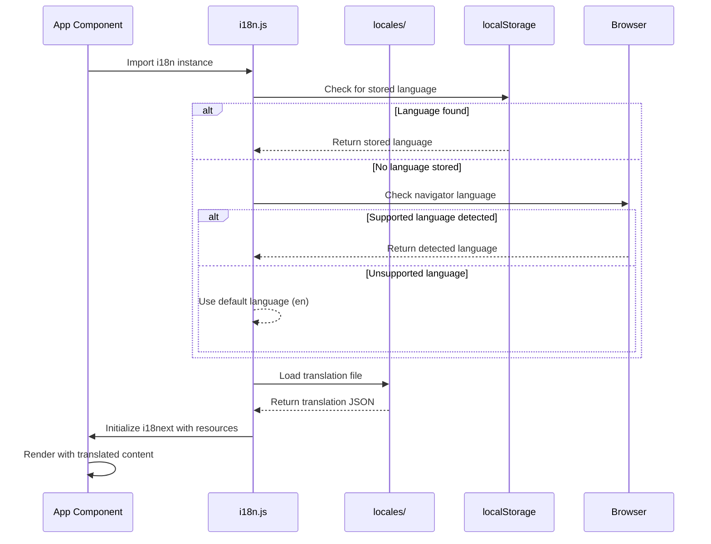
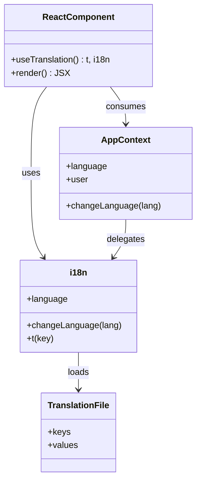
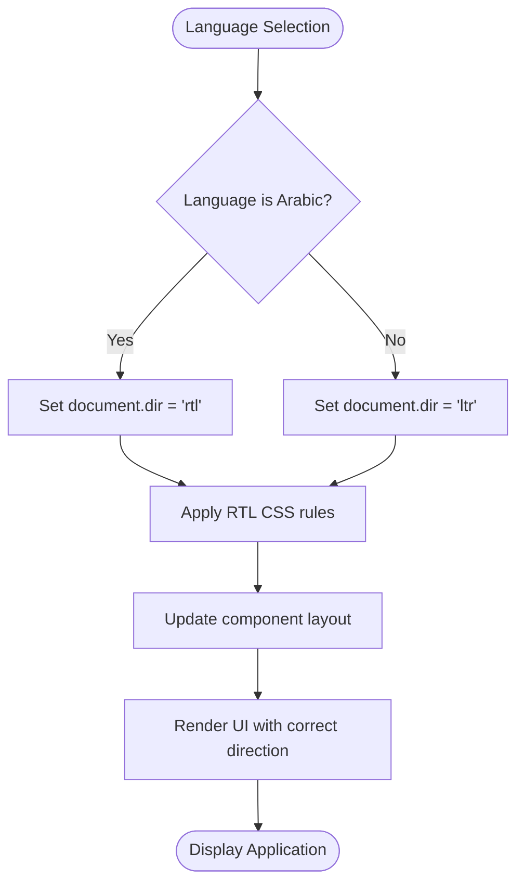

# Internationalization

<cite>
**Referenced Files in This Document**   
- [i18n.js](file://HarvestIQ/src/i18n.js)
- [App.jsx](file://HarvestIQ/src/App.jsx)
- [Navbar.jsx](file://HarvestIQ/src/components/Navbar.jsx)
- [Welcome.jsx](file://HarvestIQ/src/components/Welcome.jsx)
- [Auth.jsx](file://HarvestIQ/src/components/Auth.jsx)
- [Dashboard.jsx](file://HarvestIQ/src/components/Dashboard.jsx)
- [PredictionForm.jsx](file://HarvestIQ/src/components/PredictionForm.jsx)
- [Settings.jsx](file://HarvestIQ/src/components/Settings.jsx)
- [ar.json](file://HarvestIQ/src/locales/ar.json)
- [AppContext.jsx](file://HarvestIQ/src/context/AppContext.jsx)
</cite>

## Table of Contents
1. [Introduction](#introduction)
2. [i18next Implementation](#i18next-implementation)
3. [Translation Files Structure](#translation-files-structure)
4. [React Integration with Hooks](#react-integration-with-hooks)
5. [RTL Support for Arabic](#rtl-support-for-arabic)
6. [Language Preference Storage](#language-preference-storage)
7. [UI Component Translation Examples](#ui-component-translation-examples)
8. [Adding New Languages](#adding-new-languages)
9. [Conclusion](#conclusion)

## Introduction

The HarvestIQ application implements a comprehensive internationalization system supporting 10 languages, including Right-to-Left (RTL) support for Arabic. The system is built on i18next, a robust internationalization framework for JavaScript applications, and integrates seamlessly with React components through hooks. The internationalization architecture enables users to switch between languages dynamically, with language preferences persisted across sessions. The system supports both Left-to-Right (LTR) languages like English, Hindi, and French, as well as RTL languages like Arabic, ensuring proper text direction and layout for all supported languages. This documentation provides a detailed overview of the internationalization implementation, covering language detection, loading, switching, translation file structure, React integration, RTL support, and best practices for maintaining translation consistency.

**Section sources**
- [i18n.js](file://HarvestIQ/src/i18n.js#L1-L88)
- [App.jsx](file://HarvestIQ/src/App.jsx#L1-L51)

## i18next Implementation

The i18next implementation in HarvestIQ is configured through the `i18n.js` file, which serves as the central configuration point for the internationalization system. The implementation uses the `initReactI18next` plugin to integrate i18next with React, enabling translation capabilities throughout the component tree. Language resources are statically imported from JSON files in the `locales` directory and organized into a resources object that maps language codes to their respective translation objects. The default language is set to English ('en'), with English also serving as the fallback language when translations are missing for the selected language.

Language detection is configured to check multiple sources in a specific order: localStorage, browser navigator language, and HTML tag attributes. The detected language preference is cached in localStorage to ensure consistency across sessions. The initialization configuration includes interpolation settings to prevent HTML escaping of translation values, allowing for rich text content in translations. The i18next instance is initialized with the configured resources, default language, fallback language, and detection settings, making it available throughout the application via React's context API.

**Diagram sources**
- [i18n.js](file://HarvestIQ/src/i18n.js#L1-L88)

**Section sources**
- [i18n.js](file://HarvestIQ/src/i18n.js#L1-L88)

## Translation Files Structure

The translation files in HarvestIQ are organized in the `src/locales` directory, with each supported language having its own JSON file (e.g., `en.json`, `ar.json`, `hi.json`). This flat file structure simplifies language management and makes it easy to add new languages by creating additional JSON files. Each translation file contains a hierarchical structure of translation keys organized by feature or component, such as "welcome", "auth", "navigation", "dashboard", and "prediction". This organization by functional areas improves maintainability and makes it easier for translators to locate relevant strings.

The translation keys use a dot notation to represent the hierarchy, allowing for deep nesting of translation strings. For example, the welcome section contains keys like "welcome.title", "welcome.subtitle", and nested feature descriptions under "welcome.features". This structure enables contextual translations that consider the placement and purpose of each string within the application. The JSON format provides a simple, human-readable structure that can be easily edited by translators and integrated into the build process. All 10 language files follow the same structure, ensuring consistency across translations and making it straightforward to verify that all strings are properly translated for each language.

**Section sources**
- [i18n.js](file://HarvestIQ/src/i18n.js#L6-L26)
- [ar.json](file://HarvestIQ/src/locales/ar.json#L1-L83)

## React Integration with Hooks

The internationalization system integrates with React components through the `useTranslation` hook from `react-i18next`, which provides access to the translation function and current language state. Components import this hook and call it to obtain the `t` function for translating strings and the `i18n` object for language management. The hook automatically triggers re-renders when the language changes, ensuring that translated content updates dynamically without requiring page refreshes.

In addition to the `useTranslation` hook, the application uses a custom `AppContext` to manage language state at the application level. The context provides a `changeLanguage` function that updates both the React state and persists the selection to localStorage. Components like `Navbar.jsx` and `Settings.jsx` use both the hook and context to provide language selection interfaces, allowing users to switch languages through dropdown menus or language preference settings. The integration ensures that all text content in the application can be dynamically translated based on the user's language preference, including navigation items, form labels, buttons, and error messages.

**Diagram sources**
- [Navbar.jsx](file://HarvestIQ/src/components/Navbar.jsx#L1-L367)
- [Settings.jsx](file://HarvestIQ/src/components/Settings.jsx#L1-L547)

**Section sources**
- [Welcome.jsx](file://HarvestIQ/src/components/Welcome.jsx#L1-L278)
- [Auth.jsx](file://HarvestIQ/src/components/Auth.jsx#L1-L441)
- [Dashboard.jsx](file://HarvestIQ/src/components/Dashboard.jsx#L1-L488)
- [PredictionForm.jsx](file://HarvestIQ/src/components/PredictionForm.jsx#L1-L678)

## RTL Support for Arabic

The application provides comprehensive RTL support for Arabic language through a combination of CSS adjustments and programmatic layout changes. The `i18n.js` file includes a `languages` configuration object that specifies the text direction ('dir') for each supported language, with Arabic ('ar') explicitly set to 'rtl'. When Arabic is selected as the active language, the `updateDirection` function is called to modify the document's root element, setting both the `dir` attribute to 'rtl' and the `lang` attribute to 'ar'.

This programmatic approach ensures that the entire document respects RTL layout conventions, affecting text alignment, component positioning, and navigation flow. The CSS framework (Tailwind CSS) automatically adjusts layout properties like padding, margin, and float directions based on the root `dir` attribute, ensuring consistent RTL rendering across all components. Language-specific styling is applied through CSS classes that respond to the `dir` attribute, flipping icons, adjusting text alignment, and modifying component layouts as needed for RTL languages. The implementation ensures that Arabic text is displayed correctly from right to left, with proper glyph shaping and contextual letter forms, providing an authentic user experience for Arabic speakers.

**Diagram sources**
- [i18n.js](file://HarvestIQ/src/i18n.js#L65-L88)
- [AppContext.jsx](file://HarvestIQ/src/context/AppContext.jsx#L1-L290)

**Section sources**
- [i18n.js](file://HarvestIQ/src/i18n.js#L65-L88)
- [AppContext.jsx](file://HarvestIQ/src/context/AppContext.jsx#L1-L290)

## Language Preference Storage

Language preferences in HarvestIQ are stored in the user's localStorage, ensuring persistence across sessions and browser restarts. The `AppContext` component manages the language state and handles storage operations through the `changeLanguage` function, which updates both the React state and localStorage. When a user selects a language, the preference is immediately saved to localStorage under the key 'harvestiq_language', allowing the application to restore the user's language choice on subsequent visits.

For authenticated users, the language preference is also stored in the user profile, enabling synchronization across devices when the user logs in from different locations. The application checks localStorage on initialization to determine the user's preferred language, falling back to the browser's navigator language or the default English language if no preference is found. This multi-layered approach to language preference storage ensures a consistent user experience while accommodating both authenticated and anonymous users. The storage mechanism is implemented with proper error handling to gracefully manage cases where localStorage is unavailable or full.

**Section sources**
- [AppContext.jsx](file://HarvestIQ/src/context/AppContext.jsx#L1-L290)
- [i18n.js](file://HarvestIQ/src/i18n.js#L1-L88)

## UI Component Translation Examples

The internationalization system is applied consistently across all UI components in HarvestIQ, with translation keys organized by component and feature. For example, the `Welcome.jsx` component uses translation keys under the "welcome" namespace for its title, subtitle, and call-to-action buttons. The `Auth.jsx` component translates form labels, button text, and authentication prompts using keys in the "auth" namespace. Navigation elements in `Navbar.jsx` are translated using keys from the "navigation" namespace, ensuring consistent labeling across the application.

Form components like `PredictionForm.jsx` demonstrate the translation of complex UI elements, including input labels, validation messages, and step indicators. Error messages and common UI elements are translated using the "common" namespace, which contains shared strings like "loading", "error", "success", "cancel", "save", "edit", "delete", and "submit". This approach ensures consistency in terminology across the application and reduces duplication of translation strings. The use of contextual translation keys allows for nuanced translations that consider the specific usage and placement of each string, resulting in a natural and intuitive user experience in all supported languages.

**Section sources**
- [Welcome.jsx](file://HarvestIQ/src/components/Welcome.jsx#L1-L278)
- [Auth.jsx](file://HarvestIQ/src/components/Auth.jsx#L1-L441)
- [PredictionForm.jsx](file://HarvestIQ/src/components/PredictionForm.jsx#L1-L678)
- [ar.json](file://HarvestIQ/src/locales/ar.json#L1-L83)

## Adding New Languages

Adding new languages to the HarvestIQ application follows a systematic process that ensures consistency and maintainability. To add a new language, developers create a JSON translation file in the `src/locales` directory using the appropriate language code (e.g., `es.json` for Spanish). The new file should mirror the structure of existing translation files, organizing keys by feature or component with the same hierarchy and naming conventions.

After creating the translation file, the language must be registered in the `i18n.js` file by importing the JSON file and adding it to the `resources` object with the corresponding language code. The language should also be added to the `languages` configuration object, specifying the language name, text direction ('ltr' or 'rtl'), and appropriate flag emoji. For RTL languages, additional CSS adjustments may be necessary to ensure proper layout and text rendering.

The application's language detection and switching mechanisms automatically accommodate new languages without requiring changes to the core internationalization logic. However, quality assurance testing should verify that all UI elements are properly translated and that the layout adapts correctly to the new language's text direction and formatting requirements. Maintaining translation consistency across languages involves regular audits of translation files to ensure all keys are present and that terminology remains consistent with the application's evolving features.

**Section sources**
- [i18n.js](file://HarvestIQ/src/i18n.js#L1-L88)
- [AppContext.jsx](file://HarvestIQ/src/context/AppContext.jsx#L1-L290)

## Conclusion

The internationalization system in HarvestIQ provides a robust foundation for supporting multiple languages, including RTL languages like Arabic. By leveraging i18next and React integration patterns, the application delivers a seamless multilingual experience that adapts to user preferences and cultural conventions. The structured approach to translation files, combined with effective language detection, storage, and RTL support, ensures that the application is accessible to users across diverse linguistic backgrounds. The implementation demonstrates best practices in internationalization, including consistent key organization, proper text direction handling, and persistent language preferences. As the application continues to evolve, this internationalization framework provides a scalable foundation for adding new languages and maintaining translation quality across the user interface.