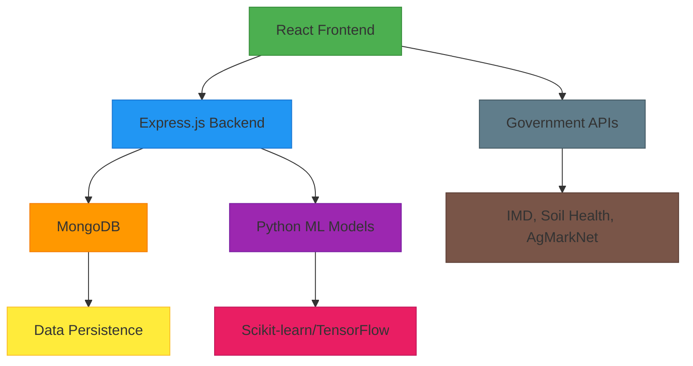
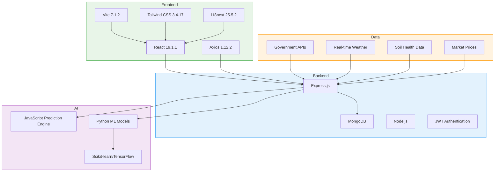
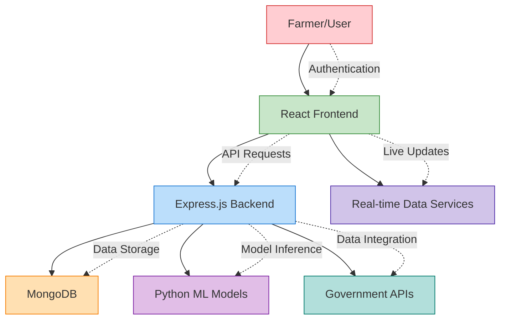
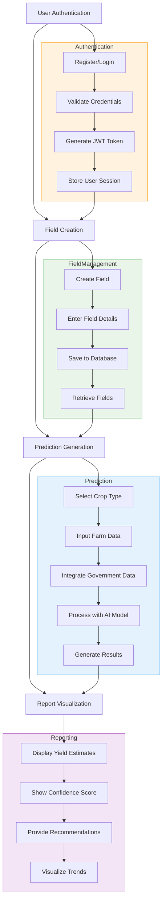
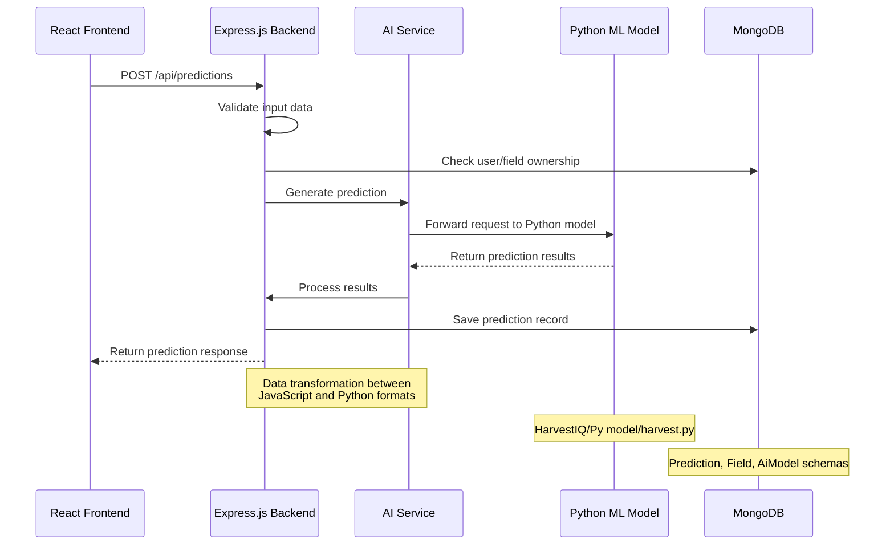

# System Overview

<cite>
**Referenced Files in This Document**   
- [AppContext.jsx](file://HarvestIQ/src/context/AppContext.jsx)
- [predictionEngine.js](file://HarvestIQ/src/services/predictionEngine.js)
- [governmentDataService.js](file://HarvestIQ/src/services/governmentDataService.js)
- [api.js](file://HarvestIQ/src/services/api.js)
- [aiController.js](file://HarvestIQ/backend/controllers/aiController.js)
- [aiService.js](file://HarvestIQ/backend/services/aiService.js)
- [Prediction.js](file://HarvestIQ/backend/models/Prediction.js)
- [Field.js](file://HarvestIQ/backend/models/Field.js)
- [AiModel.js](file://HarvestIQ/backend/models/AiModel.js)
- [ai.js](file://HarvestIQ/backend/routes/ai.js)
- [aiModels.js](file://HarvestIQ/backend/routes/aiModels.js)
- [predictions.js](file://HarvestIQ/backend/routes/predictions.js)
- [fields.js](file://HarvestIQ/backend/routes/fields.js)
- [auth.js](file://HarvestIQ/backend/routes/auth.js)
- [harvest.py](file://HarvestIQ/Py model/harvest.py)
</cite>

## Table of Contents
1. [Introduction](#introduction)
2. [Core Architecture](#core-architecture)
3. [Technology Stack](#technology-stack)
4. [Key Features](#key-features)
5. [System Context](#system-context)
6. [Core Workflows](#core-workflows)
7. [AI Integration](#ai-integration)
8. [Deployment Workflow](#deployment-workflow)
9. [Value Proposition](#value-proposition)

## Introduction

HarvestIQ is an AI-powered agricultural intelligence platform designed to revolutionize crop yield prediction and farm management. The system combines advanced machine learning algorithms with comprehensive farm data to provide farmers with accurate yield forecasts, actionable recommendations, and real-time analytics. Built as a full-stack application, HarvestIQ integrates a React frontend, Express.js backend, MongoDB data storage, and Python-based machine learning models to deliver a seamless user experience for agricultural stakeholders.

The platform empowers farmers with data-driven insights by analyzing multiple factors including weather patterns, soil health, historical yield data, and market trends. HarvestIQ's architecture is designed to support both JavaScript-based prediction engines and external Python ML models, providing flexibility in AI model deployment and integration.

**Section sources**
- [AppContext.jsx](file://HarvestIQ/src/context/AppContext.jsx#L1-L289)
- [stack.md](file://HarvestIQ/stack.md#L1-L284)

## Core Architecture

HarvestIQ follows a modular, three-tier architecture with clear separation of concerns between presentation, business logic, and data layers. The frontend React application communicates with the Express.js backend through RESTful APIs, while the backend processes requests, manages business logic, and interacts with MongoDB for data persistence. The AI components are integrated through a service-oriented approach, allowing for both internal JavaScript prediction engines and external Python ML models.

The system implements a context-based state management pattern using React Context API, which maintains user authentication status, application settings, and prediction history. The backend employs a model-controller-service architecture, where models define data schemas, controllers handle HTTP requests, and services encapsulate business logic and AI integration.

**Diagram sources**
- [AppContext.jsx](file://HarvestIQ/src/context/AppContext.jsx#L1-L289)
- [aiService.js](file://HarvestIQ/backend/services/aiService.js)
- [api.js](file://HarvestIQ/src/services/api.js#L1-L518)

**Section sources**
- [AppContext.jsx](file://HarvestIQ/src/context/AppContext.jsx#L1-L289)
- [aiService.js](file://HarvestIQ/backend/services/aiService.js)
- [api.js](file://HarvestIQ/src/services/api.js#L1-L518)

## Technology Stack

HarvestIQ leverages a modern technology stack optimized for performance, scalability, and developer productivity. The frontend is built with React 19.1.1, utilizing Vite as the build tool for fast development and optimized production builds. Tailwind CSS provides a utility-first styling approach with a custom design system featuring a primary green theme for agricultural branding.

The backend uses Express.js with MongoDB for data persistence, implementing a robust authentication system with JWT tokens and bcrypt password hashing. The AI infrastructure is designed for flexibility, supporting both JavaScript-based prediction engines and external Python ML models through a service adapter pattern.

**Diagram sources**
- [stack.md](file://HarvestIQ/stack.md#L1-L284)
- [package.json](file://HarvestIQ/package.json)
- [backend/package.json](file://HarvestIQ/backend/package.json)

**Section sources**
- [stack.md](file://HarvestIQ/stack.md#L1-L284)
- [package.json](file://HarvestIQ/package.json)
- [backend/package.json](file://HarvestIQ/backend/package.json)

## Key Features

HarvestIQ offers a comprehensive suite of features designed to address the critical needs of modern farmers and agricultural stakeholders. The platform's core functionality revolves around crop yield prediction, field management, and data-driven decision support.

### Field Management
The system enables farmers to create and manage multiple fields with detailed information including coordinates, size, soil type, and current crop. Each field record is associated with the user's account and can be updated throughout the growing season.

### Multi-language Support
HarvestIQ supports 10 languages including English, Hindi, Punjabi, French, Spanish, German, Arabic, Bengali, Tamil, and Telugu. The Arabic interface includes full RTL (right-to-left) text direction support, ensuring accessibility for diverse user groups.

### Real-time Analytics
The platform provides real-time data updates through auto-refreshing dashboards that display weather conditions, user statistics, and activity feeds. The system implements smart refresh logic with different intervals for different data types and pauses updates when the browser tab is inactive.

### Dark Mode
Users can toggle between light and dark themes based on their preferences. The theme setting is persisted in localStorage and applied to the document element, providing a comfortable viewing experience in different lighting conditions.

**Section sources**
- [AppContext.jsx](file://HarvestIQ/src/context/AppContext.jsx#L1-L289)
- [i18n.js](file://HarvestIQ/src/i18n.js)
- [App.css](file://HarvestIQ/src/App.css)

## System Context

The HarvestIQ system operates as an integrated platform connecting users with agricultural data, predictive analytics, and decision support tools. The system context diagram illustrates the interactions between the user, frontend application, backend services, data storage, and external AI models.

**Diagram sources**
- [AppContext.jsx](file://HarvestIQ/src/context/AppContext.jsx#L1-L289)
- [api.js](file://HarvestIQ/src/services/api.js#L1-L518)
- [aiService.js](file://HarvestIQ/backend/services/aiService.js)

**Section sources**
- [AppContext.jsx](file://HarvestIQ/src/context/AppContext.jsx#L1-L289)
- [api.js](file://HarvestIQ/src/services/api.js#L1-L518)
- [aiService.js](file://HarvestIQ/backend/services/aiService.js)

## Core Workflows

HarvestIQ implements four primary workflows that guide users through the process of farm management and yield prediction: user authentication, field creation, prediction generation, and report visualization.

### User Authentication
The authentication workflow begins with user registration or login, where credentials are validated and JWT tokens are issued upon successful authentication. The system implements comprehensive validation with requirements for uppercase, lowercase, and numeric characters in passwords.

### Field Creation
Farmers can create field records by providing essential information including field name, coordinates, size, soil type, and current crop. Each field is associated with the user's account and can be managed through CRUD operations.

### Prediction Generation
The prediction workflow involves collecting crop-specific data, integrating government data sources, and processing the information through the AI prediction engine. Users can select from available AI models or use the system's default recommendations.

### Report Visualization
After prediction generation, users can view detailed reports including yield estimates, confidence scores, and actionable recommendations. The system provides filtering and sorting capabilities for prediction history management.

**Diagram sources**
- [auth.js](file://HarvestIQ/backend/routes/auth.js#L1-L302)
- [fields.js](file://HarvestIQ/backend/routes/fields.js#L1-L249)
- [predictions.js](file://HarvestIQ/backend/routes/predictions.js#L1-L468)
- [Reports.jsx](file://HarvestIQ/src/components/Reports.jsx)

**Section sources**
- [auth.js](file://HarvestIQ/backend/routes/auth.js#L1-L302)
- [fields.js](file://HarvestIQ/backend/routes/fields.js#L1-L249)
- [predictions.js](file://HarvestIQ/backend/routes/predictions.js#L1-L468)
- [Reports.jsx](file://HarvestIQ/src/components/Reports.jsx)

## AI Integration

HarvestIQ's AI integration architecture is designed to seamlessly connect the JavaScript frontend with Python-based machine learning models. The system implements a modular prediction engine that can utilize either internal JavaScript algorithms or external Python ML services.

The integration follows a service adapter pattern, where the `aiService.js` component acts as an intermediary between the Express.js backend and the Python ML models. When a prediction request is received, the backend validates the input data, transforms it into the appropriate format, and forwards it to the Python model through a REST API or direct process invocation.

**Diagram sources**
- [aiService.js](file://HarvestIQ/backend/services/aiService.js)
- [predictionEngine.js](file://HarvestIQ/src/services/predictionEngine.js#L1-L375)
- [harvest.py](file://HarvestIQ/Py model/harvest.py)
- [Prediction.js](file://HarvestIQ/backend/models/Prediction.js#L385)

**Section sources**
- [aiService.js](file://HarvestIQ/backend/services/aiService.js)
- [predictionEngine.js](file://HarvestIQ/src/services/predictionEngine.js#L1-L375)
- [harvest.py](file://HarvestIQ/Py model/harvest.py)
- [Prediction.js](file://HarvestIQ/backend/models/Prediction.js#L385)

## Deployment Workflow

The HarvestIQ deployment workflow follows a structured process from development to production, ensuring reliability and scalability. The frontend and backend are deployed as separate services, with the React application served through a static file server and the Express.js backend running as a Node.js service.

The deployment process includes environment-specific configuration, with separate settings for development, staging, and production environments. The system uses MongoDB Atlas for cloud-based database hosting, ensuring high availability and automatic backups.

```mermaid
flowchart LR
A[Development] --> B[Testing]
B --> C[Staging]
C --> D[Production]
subgraph Development
A1[Local Development]
A2[Feature Branches]
A3[Code Reviews]
end
subgraph Testing
B1[Unit Tests]
B2[Integration Tests]
B3[AI Model Validation]
end
subgraph Staging
C1[Pre-production Environment]
C2[User Acceptance Testing]
C3[Performance Testing]
end
subgraph Production
C4[CI/CD Pipeline]
D1[Containerization]
D2[Cloud Deployment]
D3[Monitoring & Logging]
end
A --> A1 --> A2 --> A3 --> B
B --> B1 --> B2 --> B3 --> C
C --> C1 --> C2 --> C3 --> D
D --> C4 --> D1 --> D2 --> D3
style Development fill:#E8F5E8,stroke:#4CAF50
style Testing fill:#BBDEFB,stroke:#1976D2
style Staging fill:#FFE0B2,stroke:#F57C00
style Production fill:#F3E5F5,stroke:#9C27B0
```

**Diagram sources**
- [package.json](file://HarvestIQ/package.json)
- [backend/package.json](file://HarvestIQ/backend/package.json)
- [vite.config.js](file://HarvestIQ/vite.config.js)
- [Dockerfile](file://HarvestIQ/Dockerfile)

**Section sources**
- [package.json](file://HarvestIQ/package.json)
- [backend/package.json](file://HarvestIQ/backend/package.json)
- [vite.config.js](file://HarvestIQ/vite.config.js)

## Value Proposition

HarvestIQ delivers significant value to farmers and agricultural stakeholders by transforming complex data into actionable insights. The platform's AI-powered predictions help farmers optimize crop yields, reduce risks, and make informed decisions about planting, fertilization, and harvesting.

For agricultural cooperatives and government agencies, HarvestIQ provides a scalable platform for monitoring crop health, predicting regional yields, and planning resource allocation. The multi-language support and intuitive interface ensure accessibility for farmers across different regions and literacy levels.

The integration of government data sources with machine learning models creates a comprehensive intelligence platform that goes beyond simple yield prediction to provide holistic farm management guidance. By combining real-time weather data, soil health metrics, market prices, and historical trends, HarvestIQ empowers farmers to maximize productivity and profitability.

**Section sources**
- [README.md](file://HarvestIQ/README.md#L1-L12)
- [stack.md](file://HarvestIQ/stack.md#L1-L284)
- [AUTHENTICATION_SETUP.md](file://HarvestIQ/AUTHENTICATION_SETUP.md#L1-L