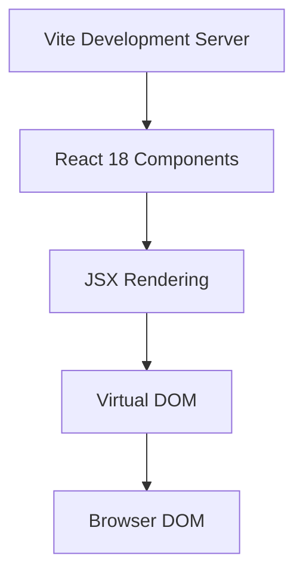
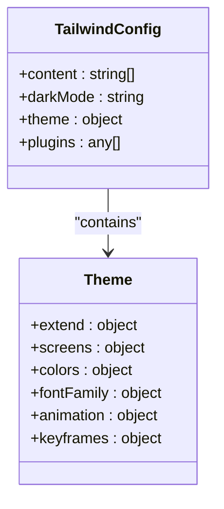
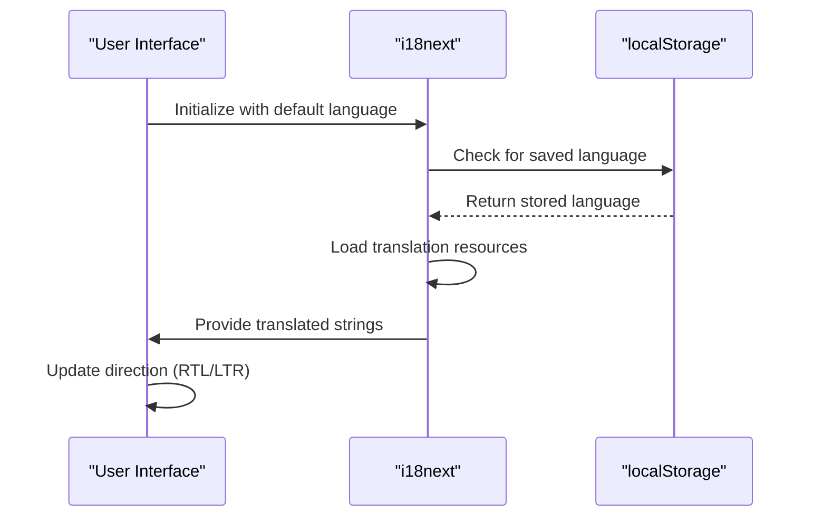
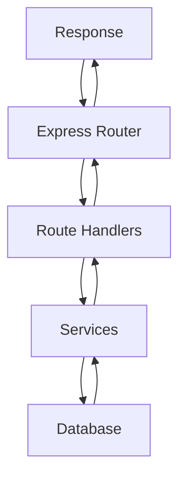
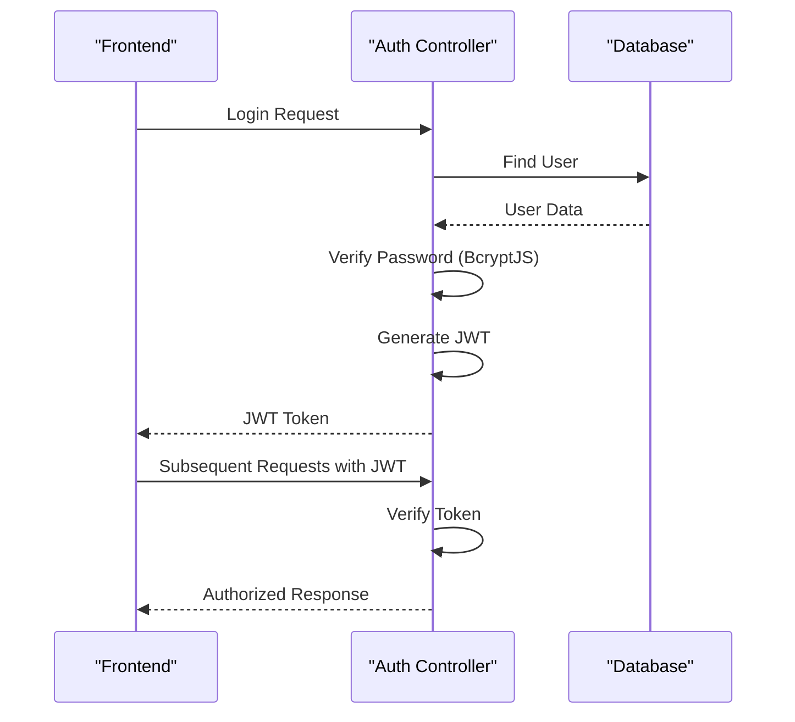
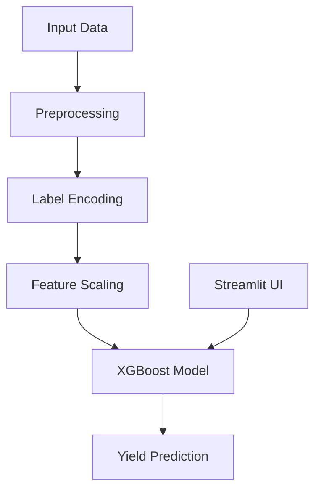
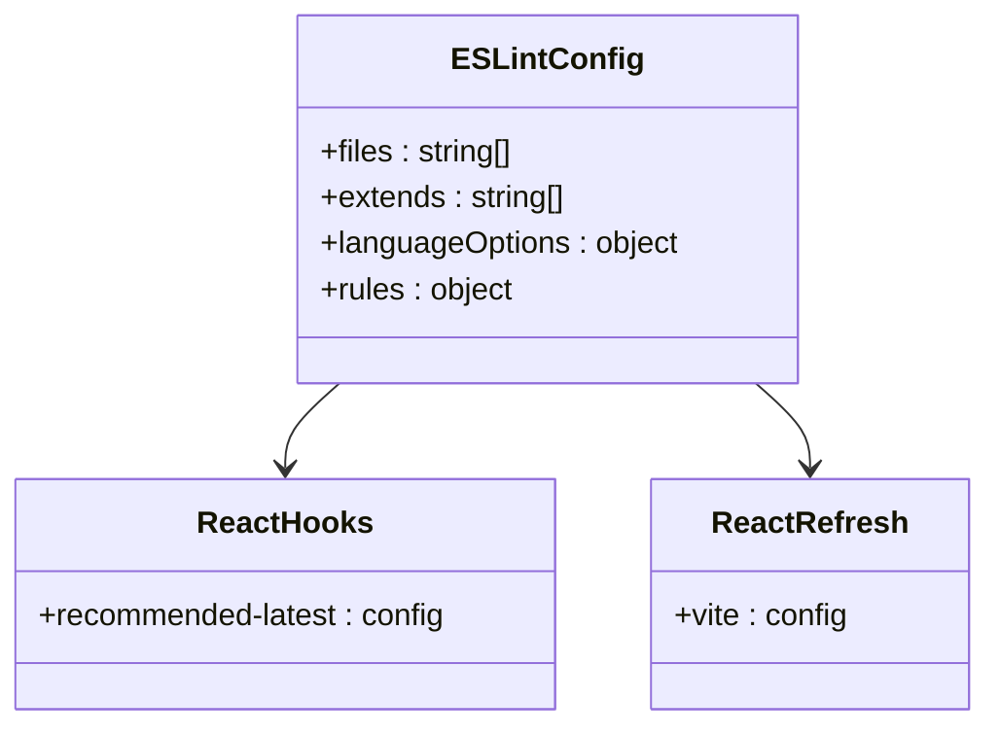

# Technology Stack

<cite>
**Referenced Files in This Document**   
- [vite.config.js](file://HarvestIQ/vite.config.js)
- [tailwind.config.js](file://HarvestIQ/tailwind.config.js)
- [postcss.config.js](file://HarvestIQ/postcss.config.js)
- [eslint.config.js](file://HarvestIQ/eslint.config.js)
- [src/i18n.js](file://HarvestIQ/src/i18n.js)
- [backend/server.js](file://HarvestIQ/backend/server.js)
- [Py model/harvest.py](file://HarvestIQ/Py model/harvest.py)
- [package.json](file://HarvestIQ/package.json)
- [backend/package.json](file://HarvestIQ/backend/package.json)
</cite>

## Table of Contents
1. [Introduction](#introduction)
2. [Frontend Technologies](#frontend-technologies)
3. [Backend Technologies](#backend-technologies)
4. [AI/ML Stack](#ai-ml-stack)
5. [Build and Linting Tools](#build-and-linting-tools)
6. [Dependency Management](#dependency-management)
7. [Technology Rationale](#technology-rationale)
8. [Conclusion](#conclusion)

## Introduction
HarvestIQ is a full-stack agricultural intelligence application that leverages modern web technologies, robust backend services, and machine learning models to provide crop yield predictions and field analytics. This document details the complete technology stack used in the application, including frontend, backend, AI/ML components, build tools, and dependency management strategies. The architecture is designed for scalability, security, and international usability, with clear separation between client, server, and data science components.

## Frontend Technologies

HarvestIQ's frontend is built using a modern JavaScript stack centered around React 18, Vite, Tailwind CSS, and supporting libraries for internationalization, icons, and API communication.

### React 18 with Vite
The frontend is powered by React 18, utilizing the Vite build tool for fast development and optimized production builds. Vite provides instant server start, hot module replacement, and efficient bundling through native ES modules.

**Diagram sources**
- [vite.config.js](file://HarvestIQ/vite.config.js)
- [src/main.jsx](file://HarvestIQ/src/main.jsx)

**Section sources**
- [vite.config.js](file://HarvestIQ/vite.config.js)
- [package.json](file://HarvestIQ/package.json)

### Tailwind CSS
The styling system uses Tailwind CSS, a utility-first CSS framework that enables rapid UI development with a consistent design system. The configuration includes custom themes, responsive breakpoints, animations, and dark mode support.

**Diagram sources**
- [tailwind.config.js](file://HarvestIQ/tailwind.config.js)

**Section sources**
- [tailwind.config.js](file://HarvestIQ/tailwind.config.js)
- [src/index.css](file://HarvestIQ/src/index.css)

### Internationalization with i18next
The application supports multiple languages through i18next, with translations available for English, Hindi, Punjabi, French, Spanish, German, Arabic, Bengali, Tamil, and Telugu. The system handles RTL/LTR direction switching and persists user preferences.

**Diagram sources**
- [src/i18n.js](file://HarvestIQ/src/i18n.js)

**Section sources**
- [src/i18n.js](file://HarvestIQ/src/i18n.js)
- [src/locales](file://HarvestIQ/src/locales)

### Lucide Icons and Axios
The UI incorporates Lucide icons for consistent, accessible visual elements. Axios is used for all API communications between the frontend and backend services, handling requests, responses, and error states.

**Section sources**
- [package.json](file://HarvestIQ/package.json)
- [src/services/api.js](file://HarvestIQ/src/services/api.js)

## Backend Technologies

The backend is built with Node.js and Express.js, providing a RESTful API with robust security, database integration, and authentication mechanisms.

### Node.js with Express.js
The server is implemented using Node.js with Express.js, providing a lightweight, performant foundation for the API. The architecture includes route handling, middleware, error handling, and health checks.

**Diagram sources**
- [backend/server.js](file://HarvestIQ/backend/server.js)

**Section sources**
- [backend/server.js](file://HarvestIQ/backend/server.js)
- [backend/routes](file://HarvestIQ/backend/routes)

### MongoDB with Mongoose
Data persistence is handled by MongoDB via the Mongoose ODM, providing schema-based modeling for users, fields, predictions, and AI models. This NoSQL approach offers flexibility for evolving data requirements.

**Section sources**
- [backend/models](file://HarvestIQ/backend/models)
- [backend/config/database.js](file://HarvestIQ/backend/config/database.js)

### Authentication and Security
The backend implements JWT-based authentication with BcryptJS for password hashing. Security is enhanced with Helmet for HTTP headers and CORS for cross-origin resource sharing control.

**Diagram sources**
- [backend/middleware/auth.js](file://HarvestIQ/backend/middleware/auth.js)
- [backend/controllers/aiController.js](file://HarvestIQ/backend/controllers/aiController.js)

**Section sources**
- [backend/middleware/auth.js](file://HarvestIQ/backend/middleware/auth.js)
- [backend/utils/validation.js](file://HarvestIQ/backend/utils/validation.js)

## AI/ML Stack

The AI/ML component is implemented in Python, using scikit-learn and XGBoost for crop yield prediction, with integration to the Node.js backend.

### Python with scikit-learn and XGBoost
The machine learning model in `harvest.py` uses XGBoost for regression, with scikit-learn for preprocessing, train-test splitting, and evaluation. The model predicts crop yield based on soil, weather, and agricultural factors.

**Diagram sources**
- [Py model/harvest.py](file://HarvestIQ/Py model/harvest.py)

**Section sources**
- [Py model/harvest.py](file://HarvestIQ/Py model/harvest.py)

### Node.js Integration
The Python model is integrated with the Node.js backend through the AI service and controller, likely using child processes or API calls to execute predictions and return results to the frontend.

**Section sources**
- [backend/services/aiService.js](file://HarvestIQ/backend/services/aiService.js)
- [backend/controllers/aiController.js](file://HarvestIQ/backend/controllers/aiController.js)

## Build and Linting Tools

The development workflow is supported by modern tooling for building, styling, and code quality assurance.

### Vite Configuration
Vite is configured with the React plugin for JSX support, providing a fast development server and optimized production builds with minimal configuration.

**Section sources**
- [vite.config.js](file://HarvestIQ/vite.config.js)

### PostCSS and Tailwind
PostCSS is configured with Tailwind CSS and Autoprefixer, enabling modern CSS features with cross-browser compatibility and utility-first styling.

**Section sources**
- [postcss.config.js](file://HarvestIQ/postcss.config.js)
- [tailwind.config.js](file://HarvestIQ/tailwind.config.js)

### ESLint Configuration
The codebase uses ESLint with plugins for React hooks and refresh, ensuring code quality, best practices, and detecting potential bugs in the React components.

**Diagram sources**
- [eslint.config.js](file://HarvestIQ/eslint.config.js)

**Section sources**
- [eslint.config.js](file://HarvestIQ/eslint.config.js)

## Dependency Management

Dependencies are managed through npm with separate package.json files for frontend and backend, allowing for independent versioning and deployment.

### Frontend Dependencies
The frontend package.json includes React, Vite, Tailwind, i18next, and UI-related dependencies with specific versions for stability and compatibility.

**Section sources**
- [package.json](file://HarvestIQ/package.json)

### Backend Dependencies
The backend package.json includes Express, MongoDB drivers, JWT authentication, security packages, and development dependencies, with proper environment-specific configurations.

**Section sources**
- [backend/package.json](file://HarvestIQ/backend/package.json)

### Version Compatibility
The stack maintains compatibility between major versions:
- React 18 with Vite 4+
- Node.js 18+ with Express 4+
- MongoDB 6+ with Mongoose 7+
- Python 3.8+ with scikit-learn 1.0+

## Technology Rationale

Each technology choice in HarvestIQ serves a specific purpose in creating a robust, scalable, and user-friendly agricultural intelligence platform.

### Frontend Choices
React 18 was selected for its component-based architecture and ecosystem. Vite provides superior build performance over traditional bundlers. Tailwind CSS enables rapid UI development with a consistent design language. i18next supports the application's international user base across multiple regions.

### Backend Choices
Node.js with Express offers a lightweight, scalable server solution that integrates well with the React frontend. MongoDB provides flexible data modeling for agricultural data that may vary by region and crop type. JWT authentication enables stateless, secure API access.

### AI/ML Choices
Python with scikit-learn and XGBoost represents the industry standard for machine learning workflows. XGBoost's performance in regression tasks makes it ideal for yield prediction. Streamlit enables rapid prototyping of the ML model interface.

### Tooling Choices
The combination of Vite, PostCSS, and ESLint creates a modern development workflow with fast feedback loops, consistent styling, and high code quality standards.

## Conclusion

HarvestIQ employs a comprehensive technology stack that effectively combines modern frontend frameworks, robust backend services, and advanced machine learning models. The architecture demonstrates a thoughtful approach to full-stack development, with clear separation of concerns, strong security practices, and international usability. The use of established, well-supported technologies ensures maintainability and scalability as the application evolves. This technology foundation enables HarvestIQ to deliver accurate crop yield predictions and valuable agricultural insights to users worldwide.