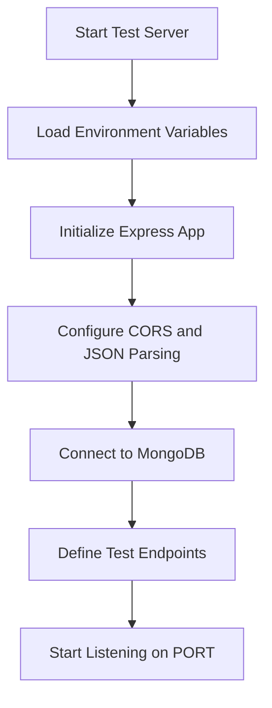
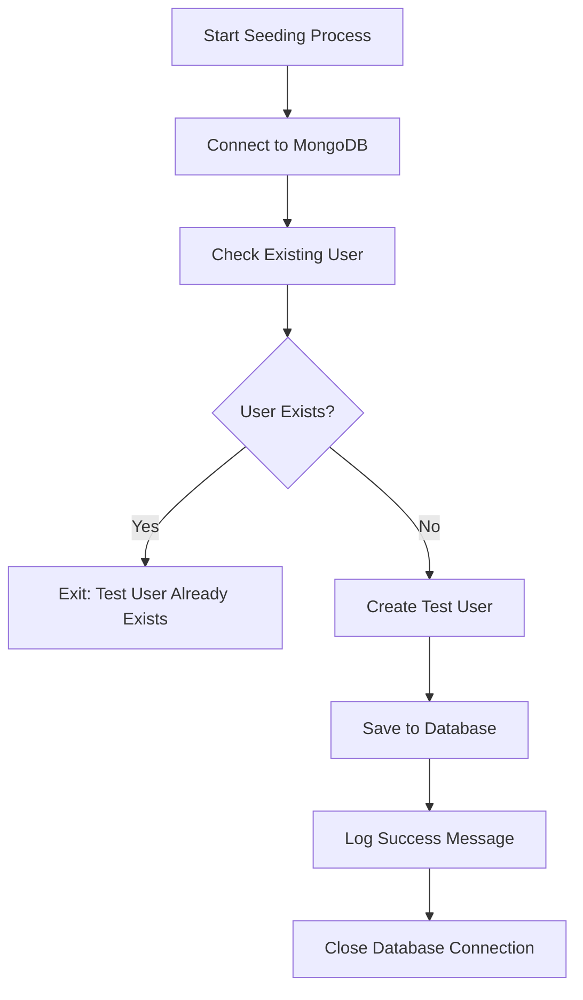
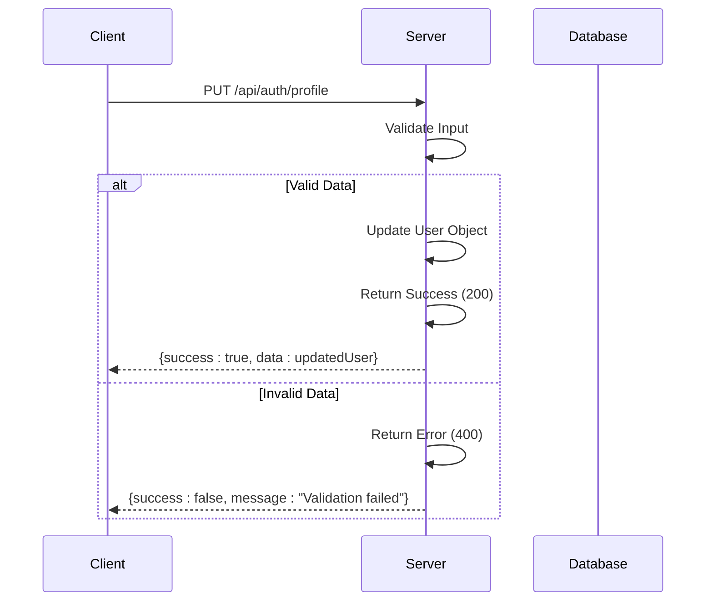

# Testing Strategy

<cite>
**Referenced Files in This Document**   
- [testServer.js](file://HarvestIQ/backend/testServer.js)
- [package.json](file://HarvestIQ/backend/package.json)
- [seedUser.js](file://HarvestIQ/backend/seedUser.js)
- [User.js](file://HarvestIQ/backend/models/User.js)
- [database.js](file://HarvestIQ/backend/config/database.js)
- [auth.js](file://HarvestIQ/backend/middleware/auth.js)
</cite>

## Table of Contents
1. [Introduction](#introduction)
2. [Testing Framework and Environment Setup](#testing-framework-and-environment-setup)
3. [Test Server Configuration](#test-server-configuration)
4. [Database Setup for Integration Testing](#database-setup-for-integration-testing)
5. [Types of Tests Implemented](#types-of-tests-implemented)
6. [Test Data Seeding and Cleanup](#test-data-seeding-and-cleanup)
7. [Authentication and Authorization Testing](#authentication-and-authorization-testing)
8. [CRUD and Error Handling Testing](#crud-and-error-handling-testing)
9. [AI Service and Data Transformation Testing](#ai-service-and-data-transformation-testing)
10. [Running Tests and CI/CD Integration](#running-tests-and-ci-cd-integration)
11. [Code Coverage and Testing Best Practices](#code-coverage-and-testing-best-practices)

## Introduction
The HarvestIQ backend testing strategy focuses on ensuring reliability, security, and performance of the agricultural intelligence platform's API layer. The current test infrastructure is built around a dedicated test server implementation in `testServer.js`, which simulates core authentication and user profile functionality. This document details the testing approach, environment configuration, and best practices employed in the project to validate backend services, with emphasis on integration testing, authentication flows, and data integrity.

**Section sources**
- [testServer.js](file://HarvestIQ/backend/testServer.js#L1-L143)

## Testing Framework and Environment Setup
While the current `package.json` indicates no formal test framework is configured (with the test script returning an error), the project structure suggests future integration with Jest or Mocha-based testing. The `testServer.js` file serves as a standalone testing endpoint that mimics production behavior for development and integration validation. This lightweight server enables frontend and integration testing without requiring a full test framework, allowing developers to validate API contracts and authentication flows in isolation.

The test environment leverages environment variables via `dotenv` for configuration, connecting to MongoDB using the `MONGODB_URI` variable. This setup allows for environment-specific configurations during testing, ensuring separation between development, testing, and production data stores.

**Section sources**
- [testServer.js](file://HarvestIQ/backend/testServer.js#L1-L20)
- [package.json](file://HarvestIQ/backend/package.json#L1-L37)

## Test Server Configuration
The `testServer.js` file implements a minimal Express server specifically designed for testing purposes. It includes CORS support, JSON parsing middleware, and MongoDB connectivity to support realistic integration testing scenarios. The server exposes several key endpoints for authentication testing:

- Health check at `/health` to verify server status
- Login endpoint at `/api/auth/login` with hardcoded credentials validation
- Profile update at `/api/auth/profile`
- Password change at `/api/auth/change-password`

These endpoints return predictable responses based on predefined test data, enabling consistent test behavior across different environments. The server uses the same Mongoose ODM for database interactions as the production code, ensuring data modeling consistency.



**Diagram sources**
- [testServer.js](file://HarvestIQ/backend/testServer.js#L1-L143)

**Section sources**
- [testServer.js](file://HarvestIQ/backend/testServer.js#L1-L143)

## Database Setup for Integration Testing
The integration testing environment uses MongoDB as the primary data store, connected via Mongoose ORM. The `testServer.js` establishes a direct connection to the database using the same connection logic found in the main application, ensuring consistency in data access patterns. The database setup includes proper error handling and connection event listeners to provide visibility into the database state during testing.

For integration tests, the system relies on a dedicated test database instance specified in the environment variables. This separation prevents test operations from affecting production or development data. The connection process includes comprehensive error handling and graceful shutdown procedures, mirroring production practices to ensure realistic test conditions.

**Section sources**
- [testServer.js](file://HarvestIQ/backend/testServer.js#L25-L39)
- [database.js](file://HarvestIQ/backend/config/database.js#L1-L52)

## Types of Tests Implemented
Although formal unit and integration test suites are not yet implemented (as indicated by the placeholder test script in package.json), the project infrastructure supports multiple testing types through its design:

### Unit Tests for Services
The modular service architecture in the `services` directory (e.g., `aiService.js`, `dataTransformer.js`) is designed to support unit testing. These services can be tested in isolation with mocked dependencies to validate business logic, data transformation rules, and AI integration patterns.

### Integration Tests for API Endpoints
The `testServer.js` provides a foundation for integration testing by exposing real API endpoints that interact with the database. These endpoints allow testing of request/response cycles, middleware execution, and database persistence.

### Model Validation Tests
The Mongoose models (e.g., `User.js`) include comprehensive validation rules that can be unit tested to ensure data integrity. The User model, for example, includes field validations, email format checks, and password requirements that should be verified through automated tests.

**Section sources**
- [testServer.js](file://HarvestIQ/backend/testServer.js#L41-L143)
- [User.js](file://HarvestIQ/backend/models/User.js#L1-L165)

## Test Data Seeding and Cleanup
The project includes a dedicated `seedUser.js` script for test data initialization. This script connects to MongoDB and creates a standardized test user with predefined credentials (`sample@gmail.com`/`141709Sj`). Before creating the user, it checks for existing records to prevent duplication, ensuring consistent test data state across multiple runs.

The seeding process includes comprehensive user profile information such as location (Punjab, India), farm size (10.5 acres), primary crops (Wheat, Rice), and farming experience. This realistic test data enables thorough testing of profile management features and personalized agricultural recommendations.

After seeding operations, the script properly closes the database connection to prevent resource leaks. This cleanup procedure is essential for maintaining database health during repeated test execution.



**Diagram sources**
- [seedUser.js](file://HarvestIQ/backend/seedUser.js#L1-L59)

**Section sources**
- [seedUser.js](file://HarvestIQ/backend/seedUser.js#L1-L59)
- [User.js](file://HarvestIQ/backend/models/User.js#L1-L165)

## Authentication and Authorization Testing
The test infrastructure includes comprehensive support for authentication middleware testing. The `testServer.js` implements a simplified login endpoint that validates credentials against hardcoded test values, returning a JWT token upon successful authentication. This allows frontend and integration tests to simulate authenticated user sessions.

The authentication flow includes:
- Credential validation with error handling for invalid inputs
- Successful login response with user data and token
- Profile update functionality with field validation
- Password change with current password verification

The system uses the same JWT-based authentication mechanism as production, with tokens generated using `jsonwebtoken` and validated through middleware. The `auth.js` middleware includes protection mechanisms, role-based access control, and ownership verification that can be tested through the exposed endpoints.

**Section sources**
- [testServer.js](file://HarvestIQ/backend/testServer.js#L51-L104)
- [auth.js](file://HarvestIQ/backend/middleware/auth.js#L1-L92)

## CRUD and Error Handling Testing
The test server implements full CRUD operations for user profile management, enabling comprehensive testing of data manipulation and error handling scenarios. The `/api/auth/profile` endpoint supports PUT requests for profile updates, accepting partial updates while maintaining default values for unspecified fields.

Error handling is implemented across all endpoints with appropriate HTTP status codes:
- 401 Unauthorized for authentication failures
- 400 Bad Request for validation errors
- 500 Internal Server Error for unexpected exceptions

Each error response includes a structured JSON payload with success flags, message descriptions, and optional error details, enabling consistent error handling in client applications.



**Diagram sources**
- [testServer.js](file://HarvestIQ/backend/testServer.js#L88-L104)

**Section sources**
- [testServer.js](file://HarvestIQ/backend/testServer.js#L88-L104)

## AI Service and Data Transformation Testing
While the current test server does not directly expose AI service endpoints, the architecture supports testing of AI integration through the service layer. The `aiService.js` and `dataTransformer.js` files in the services directory are designed to process agricultural data and generate predictions, which can be unit tested with mock inputs.

Data transformation logic can be validated by:
- Testing input validation rules
- Verifying output format consistency
- Checking error handling for malformed data
- Validating business rules for agricultural recommendations

Future test implementations should include mock AI model responses to simulate prediction generation without requiring actual machine learning model execution during tests.

**Section sources**
- [services/aiService.js](file://HarvestIQ/backend/services/aiService.js)
- [services/dataTransformer.js](file://HarvestIQ/backend/services/dataTransformer.js)

## Running Tests and CI/CD Integration
Currently, tests can be executed by starting the test server with Node.js:

```bash
node backend/testServer.js
```

The server runs on port 5000 (or the PORT environment variable) and connects to the MongoDB instance specified in MONGODB_URI. Frontend applications can then interact with the test endpoints to validate integration points.

For CI/CD integration, the project should implement a proper testing framework (Jest recommended) with:
- Automated unit and integration test execution
- Code coverage reporting
- Pre-commit hooks
- GitHub Actions or similar CI pipeline integration
- Database containerization for isolated test environments

The existing `seedUser.js` script can be incorporated into CI pipelines to ensure consistent test data across environments.

**Section sources**
- [testServer.js](file://HarvestIQ/backend/testServer.js#L139-L143)
- [package.json](file://HarvestIQ/backend/package.json#L1-L37)

## Code Coverage and Testing Best Practices
While formal code coverage metrics are not currently implemented, the project follows several testing best practices:

- **Environment Isolation**: Separate test database configuration prevents data contamination
- **Realistic Test Data**: Seed script creates comprehensive user profiles for thorough testing
- **Consistent Error Handling**: Standardized error response format across all endpoints
- **Modular Design**: Separation of concerns between routes, services, and models enables targeted testing
- **Database Validation**: Mongoose schemas include validation rules that should be covered by tests

Recommended improvements include:
- Implementing Jest with code coverage reporting
- Adding comprehensive unit tests for service layer logic
- Creating integration tests for all API endpoints
- Establishing minimum code coverage thresholds (80% recommended)
- Implementing automated testing in CI/CD pipeline
- Adding performance testing for critical endpoints

**Section sources**
- [testServer.js](file://HarvestIQ/backend/testServer.js#L1-L143)
- [package.json](file://HarvestIQ/backend/package.json#L1-L37)