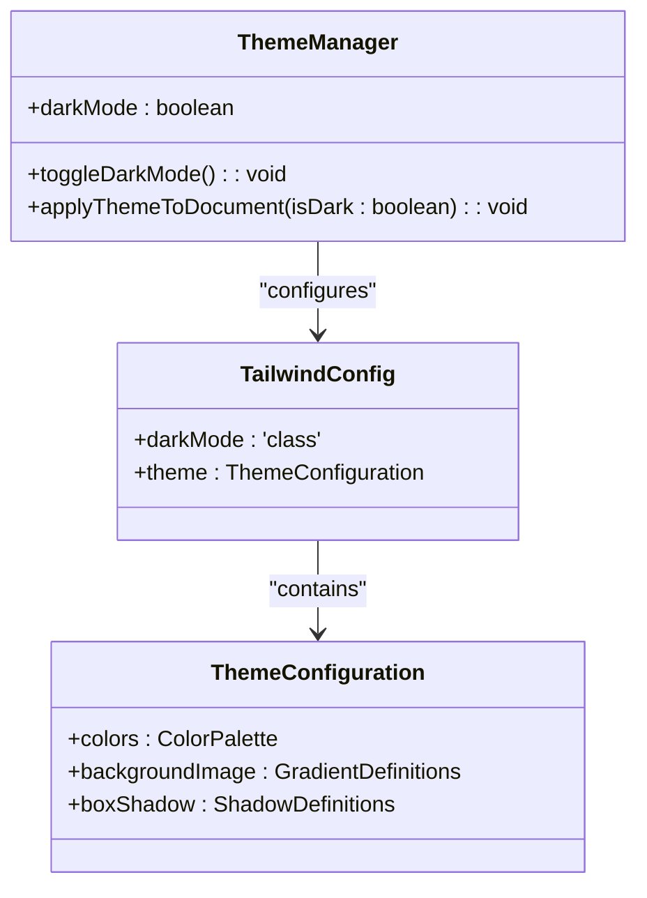
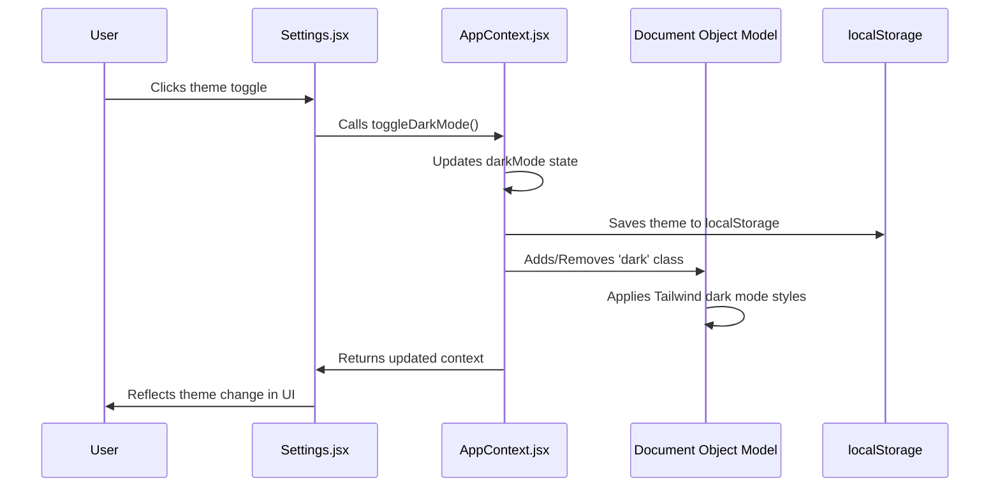
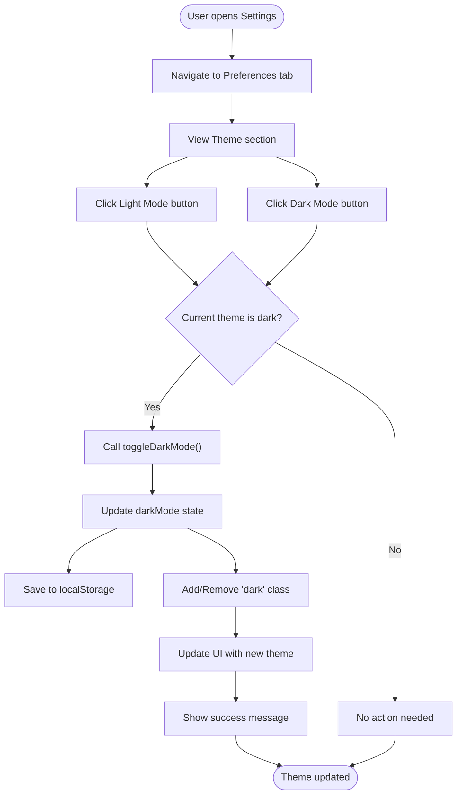
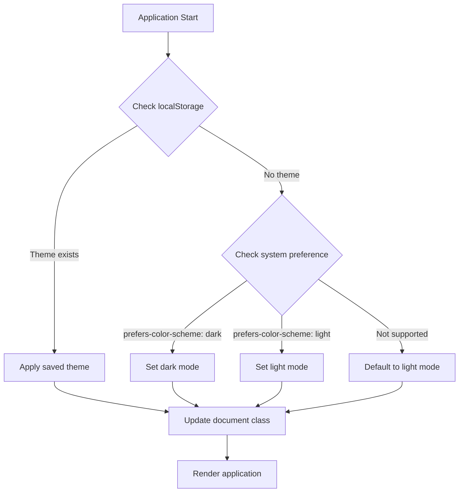
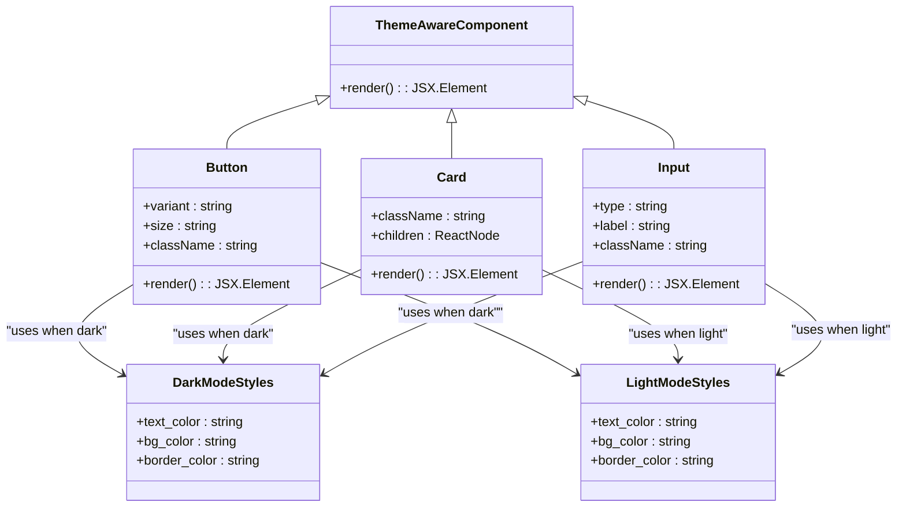
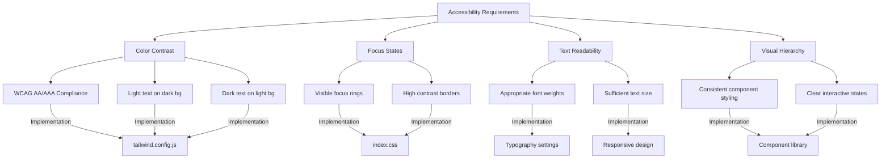
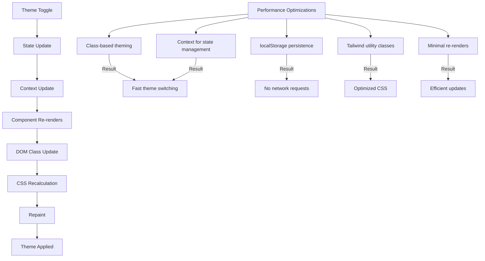

# Theming System

<cite>
**Referenced Files in This Document**   
- [tailwind.config.js](file://HarvestIQ/tailwind.config.js)
- [AppContext.jsx](file://HarvestIQ/src/context/AppContext.jsx)
- [Settings.jsx](file://HarvestIQ/src/components/Settings.jsx)
- [index.css](file://HarvestIQ/src/index.css)
</cite>

## Table of Contents
1. [Introduction](#introduction)
2. [Theme Implementation with Tailwind CSS](#theme-implementation-with-tailwind-css)
3. [Theme State Management](#theme-state-management)
4. [Settings Interface for Theme Switching](#settings-interface-for-theme-switching)
5. [Color Palette Definition](#color-palette-definition)
6. [Automatic Theme Detection](#automatic-theme-detection)
7. [Theme-Aware Components](#theme-aware-components)
8. [Accessibility Considerations](#accessibility-considerations)
9. [Performance Implications](#performance-implications)

## Introduction
The HarvestIQ application implements a comprehensive dark/light theme system that enhances user experience by providing visual comfort across different lighting conditions. This documentation details the implementation of the theming system using Tailwind CSS with dark mode variants and class-based toggling. The system allows users to switch between light and dark themes through a settings interface, with theme preferences persisted in localStorage. The implementation supports automatic theme detection based on user system preferences and ensures accessibility through proper color contrast in both themes.

## Theme Implementation with Tailwind CSS

The theming system in HarvestIQ leverages Tailwind CSS's dark mode variant with the 'class' strategy, allowing for precise control over theme-specific styling. This approach uses a CSS class to toggle between light and dark themes rather than relying on the system's prefers-color-scheme media query alone.



**Diagram sources**
- [tailwind.config.js](file://HarvestIQ/tailwind.config.js#L1-L187)
- [AppContext.jsx](file://HarvestIQ/src/context/AppContext.jsx#L1-L290)

**Section sources**
- [tailwind.config.js](file://HarvestIQ/tailwind.config.js#L1-L187)

## Theme State Management

Theme state is managed within the AppContext.jsx file, which uses React's Context API to provide theme state and functionality throughout the application. The theme state is persisted in localStorage to maintain user preferences across sessions.

The AppContext maintains the darkMode state using React's useState hook, with an initial value of false (light mode). When the theme is toggled, the state is updated and saved to localStorage under the key 'harvestiq_theme'. The theme is applied to the document by adding or removing the 'dark' class from the documentElement, which Tailwind CSS uses to apply dark mode variants.



**Diagram sources**
- [AppContext.jsx](file://HarvestIQ/src/context/AppContext.jsx#L1-L290)
- [Settings.jsx](file://HarvestIQ/src/components/Settings.jsx#L1-L548)

**Section sources**
- [AppContext.jsx](file://HarvestIQ/src/context/AppContext.jsx#L1-L290)

## Settings Interface for Theme Switching

The Settings.jsx component provides a user interface for switching between light and dark themes. The interface includes two clearly labeled buttons for each theme option, with visual indicators showing the currently active theme.

The theme switching functionality in Settings.jsx is implemented through the handleThemeChange function, which receives the desired theme as a parameter. This function calls the toggleDarkMode function from the AppContext when a theme change is required, ensuring consistency in theme state management across the application.



**Diagram sources**
- [Settings.jsx](file://HarvestIQ/src/components/Settings.jsx#L1-L548)

**Section sources**
- [Settings.jsx](file://HarvestIQ/src/components/Settings.jsx#L1-L548)

## Color Palette Definition

The color palette for both light and dark themes is defined in the tailwind.config.js file, which extends Tailwind's default theme with custom colors, gradients, and other design tokens. The configuration includes a comprehensive color system with primary, secondary, success, warning, and error color families, each with multiple shades.

The theme configuration also defines custom gradients for backgrounds, cards, and other UI elements, ensuring visual consistency across both themes. These gradients are specifically designed to work well in both light and dark modes, with appropriate color variations for each theme.

```mermaid
erDiagram
COLOR_PALETTE {
string name PK
string light_value
string dark_value
string description
}
GRADIENTS {
string name PK
string css_definition
string usage
}
SHADOWS {
string name PK
string css_definition
string usage
}
COLOR_PALETTE ||--o{ THEME : "belongs to"
GRADIENTS ||--o{ THEME : "belongs to"
SHADOWS ||--o{ THEME : "belongs to"
class THEME {
string name
string mode
}
```

**Diagram sources**
- [tailwind.config.js](file://HarvestIQ/tailwind.config.js#L1-L187)

**Section sources**
- [tailwind.config.js](file://HarvestIQ/tailwind.config.js#L1-L187)

## Automatic Theme Detection

While the current implementation primarily relies on user preference through manual selection, the system is designed to support automatic theme detection based on user system preferences. During application initialization, the AppContext checks localStorage for a saved theme preference, falling back to light mode if no preference is found.

The system could be extended to detect the user's system preference using the prefers-color-scheme media query, allowing for automatic theme selection that matches the user's operating system settings. This would provide a more seamless experience for users who have already configured their system for light or dark mode.



**Section sources**
- [AppContext.jsx](file://HarvestIQ/src/context/AppContext.jsx#L1-L290)

## Theme-Aware Components

Components throughout the HarvestIQ application are designed to be theme-aware, adapting their styling based on the current theme. This is achieved through Tailwind's dark mode variant (prefixed with 'dark:') which applies styles when the 'dark' class is present on the document element.

Theme-aware components use conditional styling with Tailwind classes that specify different properties for light and dark modes. For example, text colors are defined with both a default (light mode) color and a dark mode variant, ensuring readability in both themes. Backgrounds, borders, and other visual elements are similarly adapted for optimal appearance in each theme.



**Diagram sources**
- [Settings.jsx](file://HarvestIQ/src/components/Settings.jsx#L1-L548)
- [index.css](file://HarvestIQ/src/index.css#L1-L289)

**Section sources**
- [Settings.jsx](file://HarvestIQ/src/components/Settings.jsx#L1-L548)

## Accessibility Considerations

The theming system in HarvestIQ incorporates several accessibility considerations to ensure optimal color contrast and readability in both light and dark modes. The color palette has been carefully selected to meet WCAG (Web Content Accessibility Guidelines) contrast ratio requirements for text and background combinations.

In dark mode, the application uses a dark gray background (#18181b) rather than pure black, reducing eye strain while maintaining sufficient contrast with light text. Text colors are adjusted to ensure readability, with white or light gray text used for primary content in dark mode. Interactive elements maintain consistent visual hierarchy and focus states across both themes, ensuring they remain easily identifiable and accessible.



**Section sources**
- [tailwind.config.js](file://HarvestIQ/tailwind.config.js#L1-L187)
- [index.css](file://HarvestIQ/src/index.css#L1-L289)

## Performance Implications

The theme switching implementation in HarvestIQ is designed to be performant with minimal impact on application performance. The use of CSS classes to toggle themes allows for efficient style application by the browser's rendering engine, avoiding expensive re-renders of React components.

Theme state changes trigger a re-render of components that consume the AppContext, but this is limited to components that need to respond to theme changes. The use of localStorage for persistence ensures that theme preferences are maintained across sessions without requiring server requests. The initial theme detection and application occurs during application startup, minimizing runtime performance impact.

The implementation avoids inline styles and instead relies on Tailwind's utility classes, which are pre-generated and highly optimized. This approach reduces the amount of CSS that needs to be processed by the browser, contributing to faster rendering times. The theme toggle operation is essentially a single DOM manipulation (adding or removing a class), which is a lightweight operation that doesn't trigger layout recalculations across the entire document.



**Diagram sources**
- [AppContext.jsx](file://HarvestIQ/src/context/AppContext.jsx#L1-L290)
- [tailwind.config.js](file://HarvestIQ/tailwind.config.js#L1-L187)

**Section sources**
- [AppContext.jsx](file://HarvestIQ/src/context/AppContext.jsx#L1-L290)