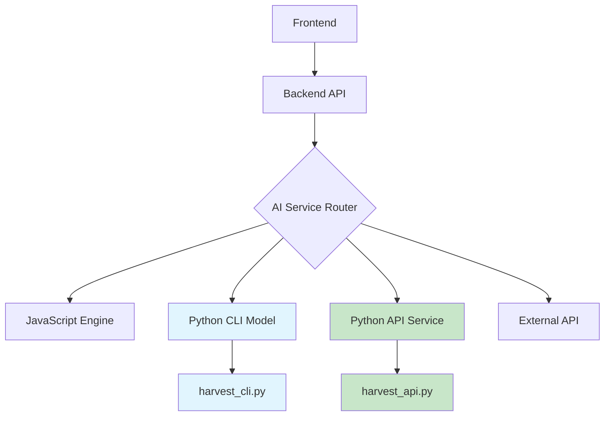

# HarvestIQ Architecture

## 🏗️ Technology Stack Overview

HarvestIQ is a comprehensive agricultural intelligence platform built with a modern, scalable technology stack:

### Frontend Technologies
- **Core Framework**: React 19.1.1 with Vite 7.1.2 for fast development and HMR
- **Routing**: React Router DOM 7.9.1 for client-side navigation
- **Styling**: Tailwind CSS 3.4.17 with custom design system
- **State Management**: React Context API
- **Internationalization**: i18next 25.5.2 with 10-language support
- **Icons**: Lucide React 0.544.0
- **Animations**: Custom CSS animations with Tailwind utilities
- **Real-time Data**: Custom hooks with auto-refresh capabilities

### Backend Technologies
- **Framework**: Express.js with ES6 modules
- **Database**: MongoDB Atlas with Mongoose ODM
- **Authentication**: JWT with bcrypt password hashing
- **Security**: Helmet, CORS, rate limiting
- **Validation**: express-validator for input validation

### AI & Machine Learning
- **Current Implementation**: JavaScript-based prediction engine with 5 crop-specific models
- **Ready for Integration**: Python-based ML models (FastAPI, Scikit-learn/TensorFlow)
- **Data Sources**: Government APIs (IMD weather, soil health cards, market prices)

## 📁 Project Structure

```
HarvestIQ/
├── src/                    # Frontend source code
│   ├── components/         # React UI components
│   │   ├── ui/            # Reusable UI component library
│   │   ├── Auth.jsx       # Authentication components
│   │   ├── Dashboard.jsx  # Real-time dashboard interface
│   │   ├── Navbar.jsx     # Navigation with language selector
│   │   ├── PredictionForm.jsx # Multi-step prediction form
│   │   ├── Welcome.jsx    # Landing page component
│   │   ├── Reports.jsx    # Prediction history management
│   │   ├── Fields.jsx     # Field management with coordinates
│   │   ├── Analytics.jsx  # Performance insights and charts
│   │   ├── Settings.jsx   # Profile and security management
│   │   └── ErrorBoundary.jsx # Error handling and recovery
│   ├── context/           # React Context for state management
│   │   └── AppContext.jsx # Global application state
│   ├── hooks/             # Custom React hooks
│   │   ├── useRealTimeData.js # Real-time data management hooks
│   │   └── useAnimations.js   # Custom animation hooks
│   ├── services/          # Business logic and API services
│   │   ├── governmentDataService.js # Government API integration
│   │   ├── predictionEngine.js      # AI prediction algorithms
│   │   └── api.js                  # API communication layer
│   ├── utils/             # Utility functions
│   │   └── validation.js  # Form validation utilities
│   ├── locales/           # Internationalization files (10 languages)
│   └── styles/            # Global styles and CSS
├── backend/               # Express.js backend server
│   ├── models/            # MongoDB schemas (Prediction, Field, AiModel)
│   ├── routes/            # API routes with authentication
│   ├── middleware/        # Authentication and validation middleware
│   ├── services/          # AI service adapters and data transformers
│   └── server.js          # Main server file
├── Py model/              # Python AI models (optional integration)
│   ├── harvest_api.py     # Flask API service for ML models
│   ├── harvest_cli.py     # CLI version for command-line execution
│   └── requirements.txt   # Python dependencies
└── public/                # Static assets
```

## 🧩 Component Roles

### Frontend Components
- **Auth.jsx**: Handles user registration, login, and authentication flows
- **Dashboard.jsx**: Real-time dashboard with weather updates, user statistics, and activity feed
- **PredictionForm.jsx**: Multi-step form for collecting crop, soil, and weather data for predictions
- **Reports.jsx**: Displays prediction history and allows management of past predictions
- **Fields.jsx**: Manages user fields with GPS coordinates and soil data
- **Analytics.jsx**: Provides performance insights and data visualization
- **Settings.jsx**: User profile management, security settings, and theme preferences
- **Navbar.jsx**: Navigation component with language selector and theme toggle
- **ErrorBoundary.jsx**: Catches and handles JavaScript errors gracefully

### Backend Components
- **Models**: MongoDB schemas for data storage and retrieval
  - `User`: Authentication and profile data
  - `Prediction`: AI prediction results and recommendations
  - `Field`: User field information with coordinates and soil data
  - `AiModel`: AI model versions and performance tracking
- **Routes**: API endpoints organized by feature
  - `/api/auth`: Authentication endpoints (register, login, profile)
  - `/api/predictions`: Prediction CRUD operations
  - `/api/fields`: Field management endpoints
  - `/api/ai-models`: AI model management and statistics
- **Middleware**: Security and validation layers
  - Authentication middleware for protected routes
  - Input validation and sanitization
  - Rate limiting for API protection
- **Services**: Business logic and external integrations
  - AI service adapters for Python model communication
  - Data transformation pipeline for ML model input/output conversion
  - Government data service for API integration

### Python AI Integration
- **harvest_api.py**: Flask API service that converts Streamlit model to REST API
  - Provides `/predict`, `/health`, and `/models/info` endpoints
  - Handles model training, prediction, and JSON serialization
- **harvest_cli.py**: CLI version for command-line execution
  - Accepts JSON input via command line or stdin
  - Returns JSON output for Node.js integration

## 🔌 Data Flow Architecture



## 🔐 Security Architecture

- **Authentication**: JWT-based with 7-day token expiration
- **Password Security**: bcrypt hashing with 12 salt rounds
- **API Protection**: Rate limiting (100 requests per 15 minutes)
- **Input Validation**: Server-side validation and sanitization
- **Data Protection**: Secure MongoDB Atlas integration
- **CORS**: Cross-origin resource sharing protection
- **Headers**: Security headers via Helmet middleware

## 🌐 Internationalization System

- **10 Languages Supported**: English (primary), Hindi, Punjabi, French, Spanish, German, Arabic, Bengali, Tamil, Telugu
- **RTL Support**: Complete right-to-left text implementation for Arabic
- **Dynamic Switching**: Real-time language switching with persistent preferences
- **Fallback System**: English as default and fallback language
- **Font Management**: Playfair Display and Poppins fonts with proper sizing

## 🎨 UI/UX Architecture

- **Design System**: Custom Tailwind configuration with agricultural green theme
- **Animations**: 11+ custom CSS animations for enhanced user experience
- **Responsive Design**: Mobile-first approach with custom breakpoints
- **Accessibility**: WCAG-compliant components with font size options (14px-20px)
- **Loading States**: Skeleton components and visual feedback
- **Error Handling**: Comprehensive error boundaries and validation feedback
- **Theme System**: Dark/light mode with persistent user preferences

## 🤖 AI Integration Architecture

- **Modular Design**: Ready for multiple AI service types (JavaScript, Python, External APIs)
- **Fallback Mechanisms**: Automatic fallback to JavaScript engine if Python service unavailable
- **Data Transformation**: Seamless conversion between frontend, backend, and ML model formats
- **Performance Tracking**: AI model performance metrics and statistics
- **User Field Management**: Coordinate-based field management with soil data
- **Backward Compatibility**: Existing components work without changes while new infrastructure is added

## 📊 Real-Time Data System

- **Auto-refresh Hooks**: Custom React hooks for different data refresh intervals
- **Visibility API**: Pause/resume updates when tab is inactive
- **Connection Monitoring**: Network status indicators and error handling
- **Data Types**:
  - Weather data: 1-minute refresh
  - User statistics: 30-second refresh
  - Activity feed: 45-second refresh

---
*Architecture Last Updated: September 2025*
*Version: 2.0.0*